# CrowdFunding Hub: Architectural Reference & Educational Blueprint

> **Curriculum Target:** Principal Engineers, Enterprise Software Architects, Tech Leads  
> **Core Architectural Paradigm:** Modular Monolith Designed for Frictionless Microservices Decomposition  
> **Primary Philosophy:** *The outcome of this project is not to run microservices, but to build a clean, unified Modular Monolith engineered with the strict architectural boundaries, data isolation, and cryptographic decoupling required to turn any module into a microservice at will—with zero rewrites of business logic.*

---

## 1. Executive Summary & Project Goal

Most microservices migrations fail not because distributed systems are inherently flawed, but because **the monolith was never architected for decomposition**. When organizations attempt to break apart a typical legacy monolith, they encounter shared database tables, cross-schema SQL joins, synchronous in-process query coupling, dual-write state corruption, and symmetric secret sprawl.

`CrowdFundingHub` serves as a production-grade educational benchmark and living laboratory demonstrating how to build a **Modular Monolith** that avoids these traps from Day 1.

```mermaid
graph TD
    subgraph "Phase 1: In-Process Modular Monolith (Today's Deliverable)"
        Host["API Host (CrowdFunding.API)"]
        subgraph Modules["Isolated In-Process Modules"]
            Identity["Identity Module"]
            Campaigns["Campaigns Module"]
            Contributions["Contributions Module"]
            Moderation["Moderation Module"]
        end
        SharedPG[("PostgreSQL 16<br/>(Strict Schema-per-Module Isolation)")]
        Host --> Identity & Campaigns & Contributions & Moderation
        Identity -.->|identity schema| SharedPG
        Campaigns -.->|campaigns schema| SharedPG
        Contributions -.->|contributions schema| SharedPG
        Moderation -.->|moderation schema| SharedPG
    end

    subgraph "Phase 2: Frictionless Microservice Extraction (When Scale Demands It)"
        Micro1["CrowdFunding.Identity.Service"]
        Micro2["CrowdFunding.Campaigns.Service"]
        Micro3["CrowdFunding.Contributions.Service"]
        Micro4["CrowdFunding.Moderation.Service"]
        Broker["Distributed Message Bus (RabbitMQ / Kafka)"]
        DB1[("Identity DB")]
        DB2[("Campaigns DB")]
        DB3[("Contributions DB")]
        DB4[("Moderation DB")]
    end

    Identity -. "Zero Code Rewrites" .-> Micro1
    Campaigns -. "Zero Code Rewrites" .-> Micro2
    Contributions -. "Zero Code Rewrites" .-> Micro3
    Moderation -. "Zero Code Rewrites" .-> Micro4
```



---

## 2. The 6 Non-Negotiable Rules of Decomposition-Ready Architecture

Every line of code in this repository adheres to 6 core architectural guardrails:

1. **Contract Assembly Isolation:** Modules communicate *exclusively* through lightweight `*.Contracts` assemblies containing DTOs, query definitions, and integration events. Modules never reference another module's `Application`, `Domain`, or `Infrastructure` layers.
2. **PostgreSQL Schema Isolation:** Strict schema boundaries (`identity.*`, `campaigns.*`, `contributions.*`, `moderation.*`). Each module maintains its own independent EF Core migrations history table (`__EFMigrationsHistory`, "schema_name").
3. **Zero Cross-Schema Foreign Keys:** Cross-module references are primitive identifiers (`Guid CampaignId`), never database-level foreign key constraints. Data integrity is enforced via application invariants and eventual consistency sagas.
4. **Transactional Outbox for Boundary Traversal:** Local database transactions write business events atomically into an `outbox_messages` table within the same module schema, completely eliminating distributed dual-write hazards.
5. **Decentralized Authentication (Asymmetric ES256 / JWKS):** Identity generates private ECDSA keys and exposes public keys at `/.well-known/jwks.json`. Consuming modules and future microservices validate JWTs offline without calling back to Identity.
6. **Automated Architecture Tests (NetArchTest):** Build-time unit tests enforce that the API host and external modules never violate clean architecture boundaries or directly reference internal domains.

---

## 3. Educational Curriculum Directory

A master curriculum suite is published under [`educational/`](./educational/README.md) for software architects:

### [01. Architecture Paradigms](./educational/01-architecture-paradigms/)
- **[`poly-pattern-architecture.md`](./educational/01-architecture-paradigms/poly-pattern-architecture.md)**: Architectural Pragmatism vs. Dogmatism. Why homogeneous architecture is an anti-pattern. Demonstrates the 4-Tier Complexity Matrix (Minimal APIs, Pragmatic CQRS, Rich DDD Aggregates, and CDC Event Choreography).
- **[`monolith-to-microservices-blueprint.md`](./educational/01-architecture-paradigms/monolith-to-microservices-blueprint.md)**: The definitive architectural blueprint for zero-rewrite microservice extraction and the Strangler Fig pattern.
- **[`justifying-the-outbox-and-complex-crud.md`](./educational/01-architecture-paradigms/justifying-the-outbox-and-complex-crud.md)**: Real-world external integrations (SendGrid email, AWS Lambda / Cloud Function AI moderation, Stripe payment intents, limited perk inventory reservation) proving why the Outbox pattern and rich DDD are mathematically mandatory.

### [02. Gap Analysis & Architectural Trade-offs](./educational/02-gap-analysis-and-tradeoffs/)
- **[`over-engineering-audit.md`](./educational/02-gap-analysis-and-tradeoffs/over-engineering-audit.md)**: Where did we go too far? An unsparing audit of accidental complexity: the 14-file pipeline for basic inserts, project explosion, and triple-mapping ceremonies.
- **[`under-engineering-audit.md`](./educational/02-gap-analysis-and-tradeoffs/under-engineering-audit.md)**: Where didn't we go far enough? Hidden microservice decomposition roadblocks: synchronous query coupling (`ICampaignContributionAvailabilityReader`), centralized outbox poller coupling, and connection pool starvation.

### [03. Engineering Specifications & Roadmap](./educational/03-engineering-spec-and-roadmap/)
- **[`transformation-spec.md`](./educational/03-engineering-spec-and-roadmap/transformation-spec.md)**: Sprint-ready engineering specification to evolve the codebase into the benchmark educational reference (Epics 1–5).
- **[`deconstruction-walkthrough.md`](./educational/03-engineering-spec-and-roadmap/deconstruction-walkthrough.md)**: Step-by-step operational runbook demonstrating how to extract `Moderation` into a standalone Docker microservice with **zero lines of domain logic rewritten**.

### [04. Architect's Gold Notes](./educational/04-architect-gold-notes/)
- **[`key-mental-models-for-students.md`](./educational/04-architect-gold-notes/key-mental-models-for-students.md)**: Timeless architectural mental models, the Dual-Write Failure sequence diagram, and the 10 Commandments of Decomposition-Ready Architecture.

---

## 4. QA Tickets & Architectural Roadmap

All identified improvements, architectural defects, and concrete feature tasks are registered in the [`qa-tickets/`](./qa-tickets/README.md) registry. Every ticket includes a dedicated **Educational Rationale** section explaining what the task teaches architects and why it belongs in a Modular Monolith:

- **[TICKET-023 to TICKET-030](./qa-tickets/README.md#1-monolith-to-microservices-decomposition--educational-benchmark-tickets)**: Architectural decomposition tickets (Asynchronous Replicated Read Models, Pluggable `IMessageBus`, Modular Outbox Partitioning, Multi-Database Connection Decoupling, Expiration & Refund Saga, Pedagogical Rosetta Stone, and W3C Distributed Tracing).
- **[TICKET-031 to TICKET-035](./qa-tickets/README.md#2-concrete-features-justifying-outbox--complex-crud-external-apis--cloud-functions)**: Concrete external integration features (SendGrid Email Receipts, Serverless Cloud Function AI Media Safety, Stripe Webhook Reconciliation Saga, Reward Perk Reservation State Machine, and Outbound HMAC Webhook Engine).
- **[TICKET-001 to TICKET-022](./qa-tickets/README.md#3-core-defect-concurrency--quality-tickets)**: Core quality, concurrency, security, and contract compliance tickets.

---

## 5. Technology Stack & Design Decisions

| Category | Technology | Architectural Rationale & Problem Solved |
| :--- | :--- | :--- |
| **Framework** | .NET 10 / ASP.NET Core | High-throughput async runtime with C# 14 records and pattern matching. |
| **Database** | PostgreSQL 16 + `Npgsql` | Schema-per-module isolation, `FOR UPDATE SKIP LOCKED` outbox claims, and `xmin` optimistic concurrency tokens. |
| **ORM** | Entity Framework Core 10 | Independent `DbContext` per module with isolated migration history tables. |
| **Mapping** | Mapster | High-performance compiled IL object mapping avoiding AutoMapper runtime reflection tax. |
| **Validation** | FluentValidation | Expressive, strongly typed command validation separated from HTTP controllers. |
| **Security** | Asymmetric ES256 ECDSA | Elliptic-curve JWT signing with RFC 7517 JWKS endpoint for offline signature verification. |
| **Testing** | xUnit, Testcontainers, NetArchTest | Ephemeral PostgreSQL containers for real database integration testing, plus build-time architectural dependency enforcement. |

---

## 6. Getting Started

### Prerequisites
- [.NET 10 SDK](https://dotnet.microsoft.com/download/dotnet/10.0)
- [Docker Desktop](https://www.docker.com/products/docker-desktop/) (for local PostgreSQL and Redis, or Testcontainers execution)

### 1. Start Infrastructure Containers
Start local PostgreSQL and Redis via Docker Compose:
```bash
docker compose up -d
```
Default connection string connects to `localhost:5432` with database `crowdfundingdb` (`postgres/postgres`).

### 2. Run the Application
```bash
dotnet run --project src/API/CrowdFunding.API/CrowdFunding.API.csproj
```
On startup in `Development` or `Testing` environments, the API automatically executes schema migrations across all four modules and warms up the asymmetric cryptographic keystore.

### 3. Explore the API
Navigate to Swagger UI:
```
http://localhost:5000/swagger
```
Explore endpoints, authorize via the JWT Bearer button, and inspect the RFC 7517 JWKS keys:
```
http://localhost:5000/.well-known/jwks.json
```

---

## 7. Automated Test Suite

The solution contains a complete, layered test suite with **171 automated tests passing with 0 errors and 0 warnings**:

```bash
dotnet test CrowdFunding.slnx
```

| Test Project | Purpose & Scope | Count | Status |
| :--- | :--- | :---: | :---: |
| **`CrowdFunding.UnitTests`** | Domain aggregate invariants, command handlers, value objects, and concurrency rules. | 134 | ✅ Passed |
| **`CrowdFunding.ArchitectureTests`** | NetArchTest rules enforcing assembly boundaries and zero API-to-domain references. | 16 | ✅ Passed |
| **`CrowdFunding.IntegrationTests`** | WebApplicationFactory E2E HTTP flows running against real PostgreSQL Testcontainers. | 21 | ✅ Passed |
| **Total** | | **171** | **100% Green** |
