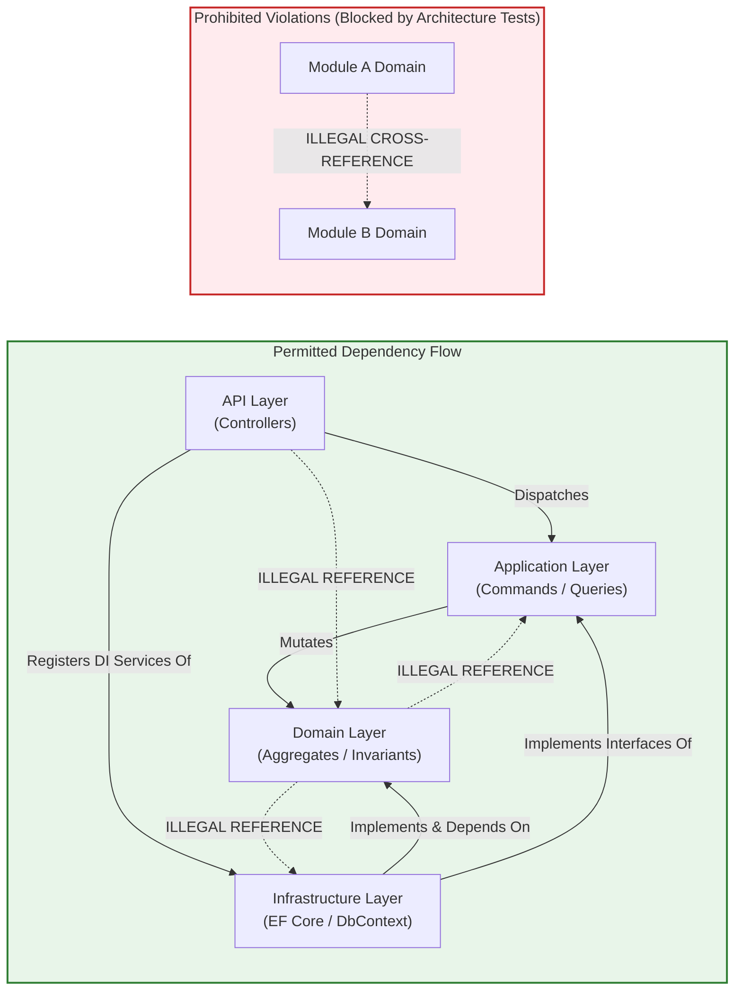
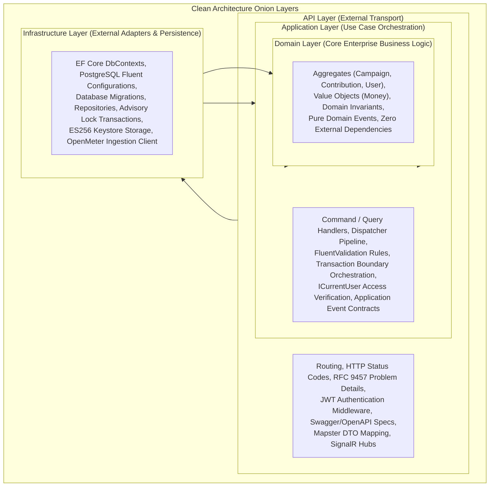
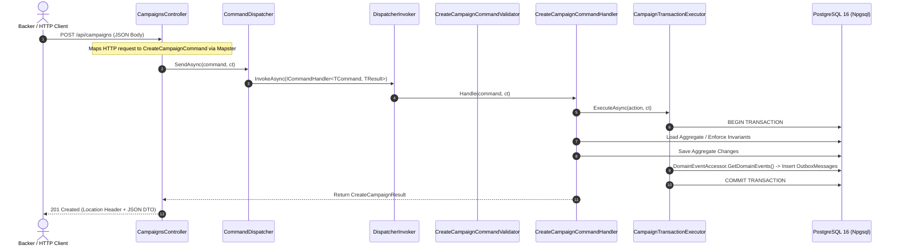
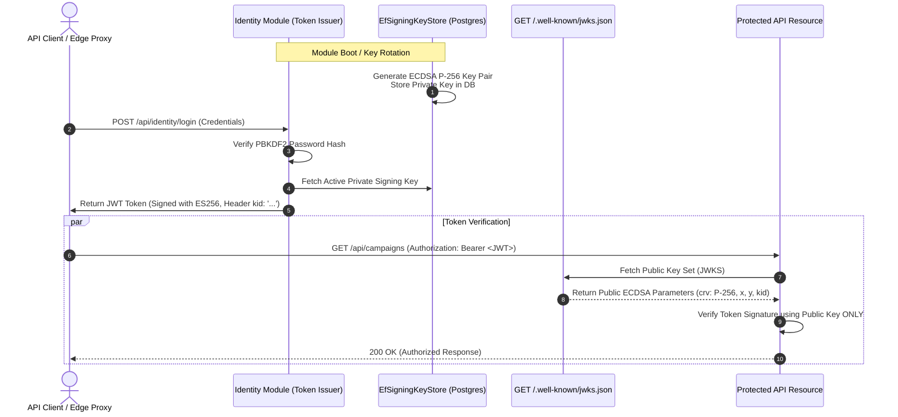
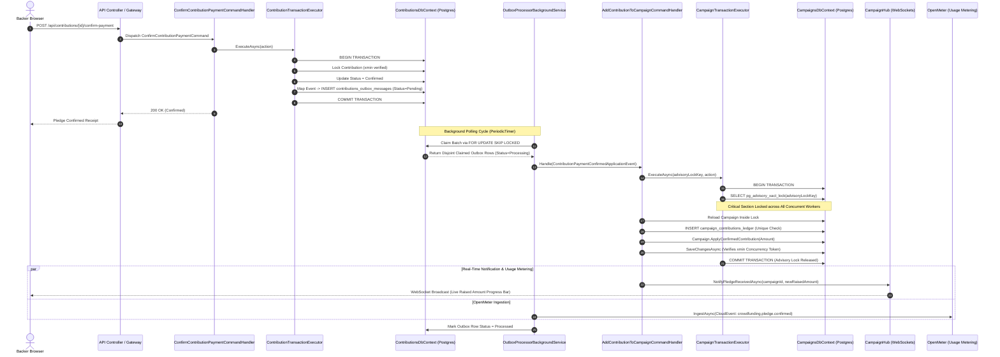

# CrowdFundingHub Architecture & Component Rationalization Guide

> **Document Classification:** Core Architectural Reference & Technology Selection Rationale  
> **Target System:** `CrowdFundingHub` Modular Monolith  
> **Target Framework:** .NET 10.0 (C# 14 / ASP.NET Core 10.0)  
> **Database Engine:** PostgreSQL 16+ (Npgsql 10.0)  
> **Primary References:** [`DEV_GUIDELINES.md`](file:///Users/maysamgamini/maysam-brain/Maysam's%20Brain/projects/projects-active/crowdfunding/DEV_GUIDELINES.md), [`outbox-architecture.md`](file:///Users/maysamgamini/maysam-brain/Maysam's%20Brain/projects/projects-active/crowdfunding/docs/outbox-architecture.md), [`improvement.md`](file:///Users/maysamgamini/maysam-brain/Maysam's%20Brain/projects/projects-active/crowdfunding/improvement.md)

---

## Table of Contents

1. [Executive Summary & System Topology](#1-executive-summary--system-topology)
2. [Architectural Style & Core Paradigms](#2-architectural-style--core-paradigms)
   - [2.1 Modular Monolith Architecture & Boundary Enforcement](#21-modular-monolith-architecture--boundary-enforcement)
   - [2.2 Clean Architecture & Layer Responsibilities](#22-clean-architecture--layer-responsibilities)
   - [2.3 CQRS & Dispatcher Pattern](#23-cqrs--dispatcher-pattern)
   - [2.4 Transactional Outbox Pattern & Event-Driven Choreography](#24-transactional-outbox-pattern--event-driven-choreography)
   - [2.5 PostgreSQL Concurrency Primitives & Financial Integrity](#25-postgresql-concurrency-primitives--financial-integrity)
3. [Component & Library Catalog](#3-component--library-catalog)
   - [3.1 .NET 10 & ASP.NET Core](#31-net-10--aspnet-core)
   - [3.2 Entity Framework Core 10 + Npgsql](#32-entity-framework-core-10--npgsql)
   - [3.3 Mapster](#33-mapster)
   - [3.4 FluentValidation](#34-fluentvalidation)
   - [3.5 Asymmetric ES256 ECDSA & Microsoft.IdentityModel](#35-asymmetric-es256-ecdsa--microsoftidentitymodel)
   - [3.6 Serilog Compact JSON & OpenTelemetry](#36-serilog-compact-json--opentelemetry)
   - [3.7 OpenMeter & CloudEvents v1.0](#37-openmeter--cloudevents-v10)
   - [3.8 Testcontainers.PostgreSql](#38-testcontainerspostgresql)
   - [3.9 NetArchTest](#39-netarchtest)
   - [3.10 Coverlet](#310-coverlet)
   - [3.11 ASP.NET Core SignalR](#311-aspnet-core-signalr)
4. [End-to-End Architectural Workflows & Data Flows](#4-end-to-end-architectural-workflows--data-flows)
   - [4.1 Concurrent Pledge Ingestion & Financial Settlement Flow](#41-concurrent-pledge-ingestion--financial-settlement-flow)
   - [4.2 Asymmetric ES256 Token Issuance & Edge Verification Flow](#42-asymmetric-es256-token-issuance--edge-verification-flow)
5. [Operational Guardrails & Cross-Cutting Infrastructure](#5-operational-guardrails--cross-cutting-infrastructure)
   - [5.1 Deterministic Migration Execution vs. Runtime Migration Hazards](#51-deterministic-migration-execution-vs-runtime-migration-hazards)
   - [5.2 Out-of-Band Administrative Seeding](#52-out-of-band-administrative-seeding)
   - [5.3 RFC 9457 Problem Details & Sanitized Error Pipeline](#53-rfc-9457-problem-details--sanitized-error-pipeline)
   - [5.4 Partitioned Rate Limiting](#54-partitioned-rate-limiting)
6. [Architectural Decision Records (ADR) Summary Matrix](#6-architectural-decision-records-adr-summary-matrix)

---

## 1. Executive Summary & System Topology

`CrowdFundingHub` is an enterprise-grade crowdfunding platform engineered for high-concurrency pledge processing, multi-tenant modular isolation, and auditable financial integrity. 

Rather than adopting a distributed microservices topology prematurely—which introduces network latency, distributed transaction orchestration overhead (Sagas, 2PC), and deployment complexity—the system is structured as a **Modular Monolith** adhering strictly to **Clean Architecture** and **Command Query Responsibility Segregation (CQRS)**.

### High-Level System Architecture Diagram

```mermaid
graph TB
    subgraph ClientTier["Client & Ingestion Tier"]
        WebClients["Web / Mobile Browsers"]
        EdgeProxy["API Gateway / Edge Proxy"]
    end

    subgraph APILayer["API Host (CrowdFunding.API)"]
        Controllers["ASP.NET Core Controllers<br/>(Thin Transport / Content Negotiation)"]
        JWKSEndpoint["JWKS Endpoint<br/>(/.well-known/jwks.json)"]
        SignalRHub["CampaignHub (SignalR)<br/>(Real-Time Backer & Funding Stream)"]
        OutboxWorker["OutboxProcessorBackgroundService<br/>(PeriodicTimer Polling)"]
        RateLimiter["Partitioned Rate Limiter"]
    end

    subgraph CoreBuildingBlocks["Shared Building Blocks"]
        BBApp["BuildingBlocks.Application<br/>(Dispatchers, Event Contracts, Metering Abstractions)"]
        BBDomain["BuildingBlocks.Domain<br/>(BaseEntity, AdvisoryLockKey, Money VO)"]
        BBInfra["BuildingBlocks.Infrastructure<br/>(OutboxClaimQuery, OpenMeterClient)"]
    end

    subgraph BoundedModules["Bounded Context Modules (Independent Monolith Modules)"]
        subgraph ModCampaigns["Campaigns Module"]
            CampApp["Application (Commands/Queries)"]
            CampDom["Domain (Campaign Aggregate)"]
            CampInfra["Infrastructure (CampaignsDbContext)"]
        end

        subgraph ModContrib["Contributions Module"]
            ContApp["Application (Make/Confirm Pledge)"]
            ContDom["Domain (Contribution Aggregate)"]
            ContInfra["Infrastructure (ContributionsDbContext)"]
        end

        subgraph ModIdent["Identity Module"]
            IdApp["Application (User Auth / Claims)"]
            IdDom["Domain (User Aggregate)"]
            IdInfra["Infrastructure (IdentityDbContext, ES256 Keystore)"]
        end

        subgraph ModMod["Moderation Module"]
            ModApp["Application (Review Workflows)"]
            ModDom["Domain (CampaignReview Aggregate)"]
            ModInfra["Infrastructure (ModerationDbContext)"]
        end

        subgraph ModNotif["Notifications Module"]
            NotifApp["Application (Event Consumers)"]
        end

        subgraph ModUpdates["CampaignUpdates Module"]
            UpdatesApp["Application (Creator Posts)"]
        end
    end

    subgraph DataTier["PostgreSQL 16 Storage (Physical Database)"]
        CampSchema["Campaigns Tables<br/>(campaigns, ledger, outbox)"]
        ContSchema["Contributions Tables<br/>(contributions, outbox)"]
        IdentSchema["Identity Tables<br/>(users, signing_keys)"]
        ModSchema["Moderation Tables<br/>(reviews, outbox)"]
        DeadLetter["Dead-Letter Table<br/>(dead_letter_events)"]
    end

    subgraph ExternalTier["External Cloud Services"]
        OpenMeterSvc["OpenMeter Cloud / Cluster<br/>(CloudEvents v1.0 Usage Ingestion)"]
    end

    WebClients -->|HTTPS REST| EdgeProxy
    WebClients -->|WSS WebSockets| SignalRHub
    EdgeProxy --> RateLimiter
    RateLimiter --> Controllers
    EdgeProxy -.->|Fetch Public Keys| JWKSEndpoint

    Controllers --> BBApp
    BBApp --> CampApp & ContApp & IdApp & ModApp

    CampApp --> CampDom & CampInfra
    ContApp --> ContDom & ContInfra
    IdApp --> IdDom & IdInfra
    ModApp --> ModDom & ModInfra

    CampInfra --> CampSchema
    ContInfra --> ContSchema
    IdInfra --> IdentSchema
    ModInfra --> ModSchema

    OutboxWorker -->|Claim Batches via SKIP LOCKED| CampSchema & ContSchema & ModSchema
    OutboxWorker -->|Publish Domain Events| ModNotif & UpdatesApp
    OutboxWorker -->|Dead-Letter Terminal Failures| DeadLetter
    OutboxWorker -->|Push Realtime Balance Updates| SignalRHub
    ContApp -.->|Confirmed Pledge Event| OpenMeterSvc
```



---

## 2. Architectural Style & Paradigms

### 2.1 Modular Monolith Architecture & Boundary Enforcement

The solution is divided into six distinct Bounded Contexts:
1. **[`Campaigns`](file:///Users/maysamgamini/maysam-brain/Maysam's%20Brain/projects/projects-active/crowdfunding/src/Modules/Campaigns)**: Owns campaign creation, editing, publishing, financial target definitions, and balance accumulation.
2. **[`Contributions`](file:///Users/maysamgamini/maysam-brain/Maysam's%20Brain/projects/projects-active/crowdfunding/src/Modules/Contributions)**: Owns backer pledge lifecycle, payment state transitions (`Pending`, `Confirmed`, `Failed`), and payment gateway callbacks.
3. **[`Identity`](file:///Users/maysamgamini/maysam-brain/Maysam's%20Brain/projects/projects-active/crowdfunding/src/Modules/Identity)**: Owns user credentials, PBKDF2 hashing, roles/permissions, ES256 asymmetric cryptographic keys, and token issuance.
4. **[`Moderation`](file:///Users/maysamgamini/maysam-brain/Maysam's%20Brain/projects/projects-active/crowdfunding/src/Modules/Moderation)**: Owns campaign audit, manual compliance review, and approval/rejection workflows.
5. **[`Notifications`](file:///Users/maysamgamini/maysam-brain/Maysam's%20Brain/projects/projects-active/crowdfunding/src/Modules/Notifications)**: Owns email, SMS, and backer notification dispatching upon domain event triggers.
6. **[`CampaignUpdates`](file:///Users/maysamgamini/maysam-brain/Maysam's%20Brain/projects/projects-active/crowdfunding/src/Modules/CampaignUpdates)**: Owns creator project updates, backer comments, and progress broadcasts.

#### Module Boundaries & Encapsulation Invariants
- **Database Context Isolation**: Each module maintains its own dedicated EF Core DbContext ([`CampaignsDbContext`](file:///Users/maysamgamini/maysam-brain/Maysam's%20Brain/projects/projects-active/crowdfunding/src/Modules/Campaigns/CrowdFunding.Modules.Campaigns.Infrastructure/Persistence/DbContexts/CampaignsDbContext.cs), [`ContributionsDbContext`](file:///Users/maysamgamini/maysam-brain/Maysam's%20Brain/projects/projects-active/crowdfunding/src/Modules/Contributions/CrowdFunding.Modules.Contributions.Infrastructure/Persistence/DbContexts/ContributionsDbContext.cs), [`IdentityDbContext`](file:///Users/maysamgamini/maysam-brain/Maysam's%20Brain/projects/projects-active/crowdfunding/src/Modules/Identity/CrowdFunding.Modules.Identity.Infrastructure/Persistence/DbContexts/IdentityDbContext.cs), [`ModerationDbContext`](file:///Users/maysamgamini/maysam-brain/Maysam's%20Brain/projects/projects-active/crowdfunding/src/Modules/Moderation/CrowdFunding.Modules.Moderation.Infrastructure/Persistence/DbContexts/ModerationDbContext.cs)). Cross-context joins or entity navigation properties crossing module boundaries are forbidden at compile-time and runtime.
- **Contract Decoupling**: Modules expose public contracts strictly via dedicated `.Contracts` assemblies (e.g., [`CrowdFunding.Modules.Campaigns.Contracts`](file:///Users/maysamgamini/maysam-brain/Maysam's%20Brain/projects/projects-active/crowdfunding/src/Modules/Campaigns/CrowdFunding.Modules.Campaigns.Contracts) or [`CrowdFunding.Modules.Contributions.Contracts`](file:///Users/maysamgamini/maysam-brain/Maysam's%20Brain/projects/projects-active/crowdfunding/src/Modules/Contributions/CrowdFunding.Modules.Contributions.Contracts)). Internal entity definitions (`Campaign`, `Contribution`) never escape their owning module.
- **Zero API-to-Domain Dependencies**: The [`CrowdFunding.API`](file:///Users/maysamgamini/maysam-brain/Maysam's%20Brain/projects/projects-active/crowdfunding/src/API/CrowdFunding.API) project does **NOT** reference any module's `.Domain` assembly. Controllers interact exclusively with Application command/query models and Mapster DTOs.
- **Automated NetArchTest Boundary Verification**: Dependency direction and encapsulation rules are checked continuously via automated architectural unit tests in [`CrowdFunding.ArchitectureTests`](file:///Users/maysamgamini/maysam-brain/Maysam's%20Brain/projects/projects-active/crowdfunding/tests/ArchitectureTests/CrowdFunding.ArchitectureTests).



---

### 2.2 Clean Architecture & Layer Responsibilities

The codebase enforces strict separation of concerns across four concentric architectural tiers:



#### Layer Responsibilities Breakdown

| Layer | Project Namespace | Responsibilities & Boundary Invariants | Key Types & Files |
| :--- | :--- | :--- | :--- |
| **API** | `CrowdFunding.API` | Translates HTTP requests to commands/queries; validates bearer tokens; enforces authorization policies; maps results to JSON contracts via Mapster; hosts WebSockets. | [`CampaignsController.cs`](file:///Users/maysamgamini/maysam-brain/Maysam's%20Brain/projects/projects-active/crowdfunding/src/API/CrowdFunding.API/Controllers/CampaignsController.cs)<br/>[`Program.cs`](file:///Users/maysamgamini/maysam-brain/Maysam's%20Brain/projects/projects-active/crowdfunding/src/API/CrowdFunding.API/Program.cs)<br/>[`CampaignHub.cs`](file:///Users/maysamgamini/maysam-brain/Maysam's%20Brain/projects/projects-active/crowdfunding/src/API/CrowdFunding.API/RealTime/CampaignHub.cs) |
| **Application** | `CrowdFunding.Modules.*.Application`<br/>`CrowdFunding.BuildingBlocks.Application` | Orchestrates use cases; enforces authorization via [`ICurrentUser`](file:///Users/maysamgamini/maysam-brain/Maysam's%20Brain/projects/projects-active/crowdfunding/src/BuildingBlocks/CrowdFunding.BuildingBlocks.Application/Security/ICurrentUser.cs); coordinates database transactions; dispatches domain events to Outbox. | [`CreateCampaignCommand.cs`](file:///Users/maysamgamini/maysam-brain/Maysam's%20Brain/projects/projects-active/crowdfunding/src/Modules/Campaigns/CrowdFunding.Modules.Campaigns.Application/Features/Campaigns/Commands/CreateCampaign/CreateCampaignCommand.cs)<br/>[`CommandDispatcher.cs`](file:///Users/maysamgamini/maysam-brain/Maysam's%20Brain/projects/projects-active/crowdfunding/src/BuildingBlocks/CrowdFunding.BuildingBlocks.Application/Messaging/CommandDispatcher.cs) |
| **Domain** | `CrowdFunding.Modules.*.Domain`<br/>`CrowdFunding.BuildingBlocks.Domain` | Pure domain logic. Enforces aggregate state transitions and business invariants; raises domain events; encapsulates value objects. Pure C# with zero infrastructure or framework dependencies. | [`Campaign.cs`](file:///Users/maysamgamini/maysam-brain/Maysam's%20Brain/projects/projects-active/crowdfunding/src/Modules/Campaigns/CrowdFunding.Modules.Campaigns.Domain/Aggregates/Campaign.cs)<br/>[`Contribution.cs`](file:///Users/maysamgamini/maysam-brain/Maysam's%20Brain/projects/projects-active/crowdfunding/src/Modules/Contributions/CrowdFunding.Modules.Contributions.Domain/Aggregates/Contribution.cs)<br/>[`Money.cs`](file:///Users/maysamgamini/maysam-brain/Maysam's%20Brain/projects/projects-active/crowdfunding/src/BuildingBlocks/CrowdFunding.BuildingBlocks.Domain/ValueObjects/Money.cs) |
| **Infrastructure** | `CrowdFunding.Modules.*.Infrastructure`<br/>`CrowdFunding.BuildingBlocks.Infrastructure` | Implements persistence via EF Core and Npgsql; executes PostgreSQL concurrency locks; manages signing keys; talks to OpenMeter API. | [`CampaignConfiguration.cs`](file:///Users/maysamgamini/maysam-brain/Maysam's%20Brain/projects/projects-active/crowdfunding/src/Modules/Campaigns/CrowdFunding.Modules.Campaigns.Infrastructure/Persistence/Configurations/CampaignConfiguration.cs)<br/>[`CampaignTransactionExecutor.cs`](file:///Users/maysamgamini/maysam-brain/Maysam's%20Brain/projects/projects-active/crowdfunding/src/Modules/Campaigns/CrowdFunding.Modules.Campaigns.Infrastructure/Transactions/CampaignTransactionExecutor.cs) |

---

### 2.3 CQRS & Dispatcher Pattern

The system rigorously separates state-mutating operations (**Commands**) from read-only projections (**Queries**).



#### Why CQRS with a Custom Dispatcher over MediatR?
1. **Zero External Dependency Overhead**: Heavyweight mediator packages introduce assembly scanning reflection overhead, external licensing risks, and pipeline complexity.
2. **Minimal Dynamic Dispatch Allocations**: As implemented in [`DispatcherInvoker.cs`](file:///Users/maysamgamini/maysam-brain/Maysam's%20Brain/projects/projects-active/crowdfunding/src/BuildingBlocks/CrowdFunding.BuildingBlocks.Application/Messaging/DispatcherInvoker.cs#L8-L46), the dispatch pipeline relies on cached reflection `MethodInfo` invocations directly bound to scoped Microsoft DI service lifetimes.
3. **Explicit Query Paths**: Query handlers avoid initializing change-tracking aggregate roots, instead executing optimized projections (`Select(...)` or read-only services) directly to response DTOs.

---

### 2.4 Transactional Outbox Pattern & Event-Driven Choreography

#### The Dual-Write Dilemma
In an event-driven system, when an aggregate changes state (e.g., a pledge is confirmed) and an integration event must be published, committing to the database and publishing to an event broker sequentially creates an unsolvable distributed failure:
- If the database commits but the network or broker fails before publishing, the event is lost forever.
- If the event is published first but the database rollback occurs, downstream systems process phantom mutations.

#### The Resolution: Atomic Outbox Insertion
`CrowdFundingHub` resolves this via the **Transactional Outbox Pattern**:
1. Within [`CampaignTransactionExecutor.cs`](file:///Users/maysamgamini/maysam-brain/Maysam's%20Brain/projects/projects-active/crowdfunding/src/Modules/Campaigns/CrowdFunding.Modules.Campaigns.Infrastructure/Transactions/CampaignTransactionExecutor.cs#L60-L75), domain events raised during the aggregate's business execution are intercepted via `DomainEventAccessor.GetDomainEvents(_dbContext)`.
2. Each domain event is transformed into an [`OutboxMessage`](file:///Users/maysamgamini/maysam-brain/Maysam's%20Brain/projects/projects-active/crowdfunding/src/BuildingBlocks/CrowdFunding.BuildingBlocks.Infrastructure/Persistence/OutboxMessage.cs) row containing:
   - Unique Message ID (`Guid`)
   - Fully qualified `EventType` and schema `Version`
   - Canonical UTF-8 JSON `Payload`
   - Initial status `Pending`
   - Creation timestamp `CreatedAtUtc` and scheduled execution time `ScheduledAtUtc`
3. The outbox rows are committed in the **exact same ACID database transaction** as the aggregate's state change. If the transaction rolls back, no outbox entry exists; if it commits, durability is absolute.

```mermaid
flowchart TD
    subgraph TxBoundary["Atomic Database Transaction Boundary"]
        Cmd[Handler Mutates Aggregate] --> SaveAgg[INSERT/UPDATE campaigns]
        Cmd --> GetEvents[DomainEventAccessor Extracts Events]
        GetEvents --> SaveOutbox[INSERT campaigns_outbox_messages<br/>(Status = Pending)]
        SaveAgg -.->|Same Transaction Commit| DB[(PostgreSQL 16 Engine)]
        SaveOutbox -.->|Same Transaction Commit| DB
    end

    subgraph BackgroundWorker["OutboxProcessorBackgroundService (PeriodicTimer)"]
        DB -->|Atomic Claim via FOR UPDATE SKIP LOCKED| ClaimBatch["Claim Batch<br/>(Status = Processing, LockedUntilUtc)"]
        ClaimBatch --> CheckType{EventType in Registry?}
        
        CheckType -->|No / Corrupted Payload| DeadLetter["Mark DeadLetter &<br/>INSERT dead_letter_events"]
        CheckType -->|Yes| PublishEvt["IEventPublisher.PublishAsync()"]
        
        PublishEvt -->|Success| Processed["Mark Processed<br/>(ProcessedAtUtc = now)"]
        PublishEvt -->|Failure & Attempts < 5| RetryPending["Increment Attempts<br/>Exponential Backoff Delay<br/>Status = Pending"]
        PublishEvt -->|Failure & Attempts >= 5| DeadLetter
    end

    PublishEvt --> SignalR["Broadcast Real-Time Pledges<br/>(CampaignHub)"]
    PublishEvt --> OpenMeter["Ingest Usage CloudEvents<br/>(OpenMeterClient)"]
    PublishEvt --> NotifModule["Notifications Consumer<br/>(Email / In-App Alerts)"]
```

#### Outbox Schema & Status Transitions

```
[Pending] ──────(Claim via SKIP LOCKED)─────► [Processing]
   ▲                                              │
   │                                              │
(Failure & Attempts < Max)              (Publish Success)
   │                                              │
   └───────(Exponential Backoff)                  ▼
                                            [Processed]
                                                  
(Failure & Attempts >= Max OR Unknown Type)
   │
   ▼
[DeadLetter] ───► Recorded in `dead_letter_events` table for operator review
```

---

### 2.5 PostgreSQL Concurrency Primitives & Financial Integrity

Crowdfunding platforms face violent concurrency spikes: popular campaigns can experience dozens of backers pledging within milliseconds. Without concurrency safeguards, applications suffer:
- **Lost Updates**: Two concurrent transactions read balance $1,000; Tx1 adds $50 and commits $1,050; Tx2 adds $25 and commits $1,025. The $50 from Tx1 is silently erased!
- **Double Credit on Redelivery**: An at-least-once outbox worker retries a confirmed pledge, applying it multiple times to the aggregate.
- **Time-of-Check to Time-of-Use (TOCTOU) Races**: A creator cancels a campaign at the exact microsecond a backer's payment confirmation arrives.

To eliminate financial corruption, `CrowdFundingHub` employs a layered defense of **three PostgreSQL concurrency primitives**:

```mermaid
graph TD
    subgraph RequestPipeline["Pledge Ingestion Pipeline"]
        Req["Pledge Confirmed Event Arrives"] --> LockKey["Derive 64-bit Advisory Key<br/>AdvisoryLockKey.FromGuid(campaignId)"]
        LockKey --> AdvisoryLock["Acquire Transaction-Scoped Advisory Lock<br/>SELECT pg_advisory_xact_lock(@key)"]
    end

    subgraph CriticalSection["Inside Serialized Critical Section"]
        AdvisoryLock --> Reload["Reload Campaign Inside Lock Boundary"]
        Reload --> CheckStatus{"Campaign Status == Published?"}
        CheckStatus -->|No (Cancelled/Draft)| Abort["Throw InvalidOperationException<br/>(Transaction Aborted, Zero Funds Accepted)"]
        CheckStatus -->|Yes| LedgerGuard["Insert into campaign_contributions_ledger<br/>Unique Constraint: (campaign_id, contribution_id)"]
        
        LedgerGuard -->|Duplicate Key Conflict| NoOp["Idempotent No-Op<br/>(Contribution already recorded)"]
        LedgerGuard -->|Unique Insert Succeeds| ApplyFunds["Aggregate.ApplyConfirmedContribution()<br/>RaisedAmount = RaisedAmount + Amount"]
        
        ApplyFunds --> EFSave["DbContext.SaveChangesAsync()"]
    end

    subgraph DBEngine["PostgreSQL Engine Concurrency Guard"]
        EFSave --> XminCheck["Optimistic Concurrency Check:<br/>WHERE id = @id AND xmin = @xmin"]
        XminCheck -->|Match| CommitTx["COMMIT Transaction<br/>(Advisory Lock Auto-Released)"]
        XminCheck -->|Mismatch (Concurrent Out-of-Band Writer)| ThrowConcurrency["Throw DbUpdateConcurrencyException"]
        ThrowConcurrency --> RetryLoop["Retry Handler with Exponential Backoff + Jitter<br/>(Max 5 Attempts)"]
    end
```

#### Detailed Primitive Mechanics

| Primitive | Mechanism | Technical Implementation | Failure Mode Prevented |
| :--- | :--- | :--- | :--- |
| **`pg_advisory_xact_lock`** | Transaction-scoped mutually exclusive lock on a 64-bit integer. | [`CampaignTransactionExecutor.cs`](file:///Users/maysamgamini/maysam-brain/Maysam's%20Brain/projects/projects-active/crowdfunding/src/Modules/Campaigns/CrowdFunding.Modules.Campaigns.Infrastructure/Transactions/CampaignTransactionExecutor.cs#L48-L58):<br/>`SELECT pg_advisory_xact_lock(@key)` | Serializes concurrent writers targeting the same campaign; closes the TOCTOU window between status checks and balance updates. |
| **`AdvisoryLockKey.FromGuid`** | 64-bit entropy XOR folding of a 128-bit UUID. | [`AdvisoryLockKey.cs`](file:///Users/maysamgamini/maysam-brain/Maysam's%20Brain/projects/projects-active/crowdfunding/src/BuildingBlocks/CrowdFunding.BuildingBlocks.Domain/Common/AdvisoryLockKey.cs#L14-L26):<br/>`high ^ low` | Eliminates 32-bit `Guid.GetHashCode()` collision hazards (which cause false lock contention across unrelated campaigns). |
| **PostgreSQL `xmin` System Column** | Built-in MVCC transaction ID acting as a row-version concurrency token. | [`CampaignConfiguration.cs`](file:///Users/maysamgamini/maysam-brain/Maysam's%20Brain/projects/projects-active/crowdfunding/src/Modules/Campaigns/CrowdFunding.Modules.Campaigns.Infrastructure/Persistence/Configurations/CampaignConfiguration.cs#L76-L78) & [`ContributionConfiguration.cs`](file:///Users/maysamgamini/maysam-brain/Maysam's%20Brain/projects/projects-active/crowdfunding/src/Modules/Contributions/CrowdFunding.Modules.Contributions.Infrastructure/Persistence/Configurations/ContributionConfiguration.cs#L64-L66):<br/>`builder.Property<uint>("xmin").IsRowVersion();` | Detects stale writes and out-of-band updates. EF Core issues `WHERE id = @p0 AND xmin = @p1`. |
| **`FOR UPDATE SKIP LOCKED`** | Non-blocking row-level lock acquisition for batch processing. | [`OutboxClaimQuery.cs`](file:///Users/maysamgamini/maysam-brain/Maysam's%20Brain/projects/projects-active/crowdfunding/src/BuildingBlocks/CrowdFunding.BuildingBlocks.Infrastructure/Persistence/OutboxClaimQuery.cs#L28-L45):<br/>`WITH claimable AS (SELECT ... FOR UPDATE SKIP LOCKED) UPDATE ... RETURNING *` | Allows multiple background worker replicas to poll the same outbox table concurrently, claiming disjoint batches with zero duplicate processing. |
| **Ledger Unique Constraint** | Append-only idempotency table with unique compound index. | `campaign_contributions_ledger`: `UNIQUE(campaign_id, contribution_id)` | Prevents duplicate balance inflation when at-least-once outbox deliveries or network retries re-execute. |

---

## 3. Component & Library Catalog

Every library integrated into `CrowdFundingHub` was selected following rigorous architectural analysis. Below is the comprehensive rationalization matrix:

### 3.1 .NET 10 & ASP.NET Core

- **Package/Runtime:** `Microsoft.NETCore.App 10.0`, `Microsoft.AspNetCore.App 10.0`
- **Location:** [`CrowdFunding.API.csproj`](file:///Users/maysamgamini/maysam-brain/Maysam's%20Brain/projects/projects-active/crowdfunding/src/API/CrowdFunding.API/CrowdFunding.API.csproj#L3-L7)

#### Problem It Solves
Provides a cloud-native, high-throughput asynchronous execution runtime and web host with native support for dependency injection, HTTP/2 & HTTP/3 transports, high-performance thread pooling, and memory-efficient cryptographic routines.

#### Why Chosen Over Alternatives
- **vs. .NET 8 / 9:** .NET 10 introduces cutting-edge Dynamic Profile-Guided Optimization (PGO), enhanced tiering compilations, reduced GC heap allocation overhead, and zero-allocation span-based string parsing.
- **vs. Node.js / TypeScript:** Node's single-threaded event loop degrades under intensive cryptographic operations (PBKDF2 key derivation, ES256 signature verification) without offloading to worker threads. .NET 10 leverages native thread pool scaling across multi-core CPUs with zero event loop lag.
- **vs. Go:** While Go offers low memory footprints, its ORM and enterprise architectural ecosystem is fragmented. It lacks an out-of-the-box equivalent to EF Core's change-tracking, migration engine, and expressive architectural testing frameworks.
- **vs. Java (Spring Boot):** JVM cold-start latency and base memory overhead (typically 400MB–800MB baseline RSS) severely hinder container autoscale responsiveness. ASP.NET Core boots in <80ms with a <75MB memory footprint.

---

### 3.2 Entity Framework Core 10 + Npgsql

- **Package/Runtime:** `Microsoft.EntityFrameworkCore 10.0.5`, `Npgsql.EntityFrameworkCore.PostgreSQL 10.0.1`
- **Location:** [`CrowdFunding.BuildingBlocks.Infrastructure.csproj`](file:///Users/maysamgamini/maysam-brain/Maysam's%20Brain/projects/projects-active/crowdfunding/src/BuildingBlocks/CrowdFunding.BuildingBlocks.Infrastructure/CrowdFunding.BuildingBlocks.Infrastructure.csproj#L9-L10)

#### Problem It Solves
Bridges object-oriented domain models (aggregates, entities, value objects) with PostgreSQL relational tables, managing schema migrations, change tracking, and SQL query translation.

#### Why Chosen Over Alternatives
- **vs. Dapper (Micro-ORM):** Dapper requires writing raw SQL strings for every entity property, provides no built-in schema migration pipeline, lacks unit-of-work transaction management, and cannot intercept domain events during `SaveChangesAsync`. EF Core 10 allows raw SQL where micro-optimization is required (e.g., [`OutboxClaimQuery`](file:///Users/maysamgamini/maysam-brain/Maysam's%20Brain/projects/projects-active/crowdfunding/src/BuildingBlocks/CrowdFunding.BuildingBlocks.Infrastructure/Persistence/OutboxClaimQuery.cs)) while handling complex aggregate persistence automatically.
- **vs. EF Core with SQL Server:** SQL Server is proprietary, expensive to license, and lacks PostgreSQL's lightweight native concurrency primitives. SQL Server `ROWVERSION` requires extra storage columns, lacks native `pg_advisory_xact_lock` transaction semantics, and its `READPAST` locking hint does not match PostgreSQL's clean `SKIP LOCKED` CTE syntax.
- **PostgreSQL-Specific Advantages:**
  - Native `xmin` system column support without consuming additional storage.
  - Zero-friction JSONB mapping for flexible metadata storage.
  - Native transaction-scoped advisory locks via `ExecuteSqlInterpolatedAsync`.

---

### 3.3 Mapster

- **Package/Runtime:** `Mapster 10.0.6`, `Mapster.DependencyInjection 10.0.6`
- **Location:** [`CrowdFunding.API.csproj`](file:///Users/maysamgamini/maysam-brain/Maysam's%20Brain/projects/projects-active/crowdfunding/src/API/CrowdFunding.API/CrowdFunding.API.csproj#L10-L11), [`CampaignsMappingConfig.cs`](file:///Users/maysamgamini/maysam-brain/Maysam's%20Brain/projects/projects-active/crowdfunding/src/API/CrowdFunding.API/Mapping/CampaignsMappingConfig.cs)

#### Problem It Solves
Automates transformation between external HTTP Request/Response DTO contracts and internal Application Commands, Queries, and Results without polluting domain models.

#### Why Chosen Over Alternatives
- **vs. AutoMapper:** AutoMapper relies heavily on runtime reflection and IL generation, generating measurable allocation overhead and latency during high-throughput requests. Furthermore, AutoMapper has undergone licensing changes and increased complexity. Mapster generates near-zero allocation, direct-assignment IL code that executes at speeds comparable to hand-written code (typically 3x–4x faster than AutoMapper).
- **vs. Manual Hand-Written Extension Methods:** Hand-written mapping (`req.ToCommand()`) causes massive code duplication, high maintenance burden across dozens of endpoints, and high risk of omitting newly introduced properties during refactoring. Mapster provides fluent configuration (`TypeAdapterConfig`) with compile-time validation capabilities.

---

### 3.4 FluentValidation

- **Package/Runtime:** `FluentValidation 11.x`
- **Location:** Applied across Application projects, e.g., [`CreateCampaignCommandValidator.cs`](file:///Users/maysamgamini/maysam-brain/Maysam's%20Brain/projects/projects-active/crowdfunding/src/Modules/Campaigns/CrowdFunding.Modules.Campaigns.Application/Features/Campaigns/Commands/CreateCampaign/CreateCampaignCommandValidator.cs)

#### Problem It Solves
Provides a fluent, strongly typed, declarative validation engine to reject malformed requests before they enter application handlers or trigger database transactions.

#### Why Chosen Over Alternatives
- **vs. System.ComponentModel.DataAnnotations (`[Required]`, `[StringLength]`):**
  - DataAnnotations force validation attributes directly onto DTO properties, coupling contracts to framework attributes.
  - Cannot handle cross-property rules (e.g., verifying `DeadlineUtc > DateTime.UtcNow`).
  - Cannot inject services or perform asynchronous validation checks.
  - Difficult to test in isolation without spinning up full MVC model state binders.
- **vs. Relying Solely on Domain Aggregate Exceptions:** If inputs are only checked in the Domain layer, invalid requests throw exceptions (`ArgumentException`, `InvalidOperationException`). Exceptions in .NET incur expensive stack-trace generation overhead. FluentValidation operates as an outer defensive shield, returning clean RFC 9457 HTTP 400 Problem Details before any domain logic executes.

---

### 3.5 Asymmetric ES256 ECDSA & Microsoft.IdentityModel

- **Package/Runtime:** `Microsoft.AspNetCore.Authentication.JwtBearer 10.0.5`, `System.IdentityModel.Tokens.Jwt`
- **Location:** [`Program.cs`](file:///Users/maysamgamini/maysam-brain/Maysam's%20Brain/projects/projects-active/crowdfunding/src/API/CrowdFunding.API/Program.cs#L110-L121), [`EfSigningKeyStore.cs`](file:///Users/maysamgamini/maysam-brain/Maysam's%20Brain/projects/projects-active/crowdfunding/src/Modules/Identity/CrowdFunding.Modules.Identity.Infrastructure/Services/EfSigningKeyStore.cs), [`JwksEndpoint.cs`](file:///Users/maysamgamini/maysam-brain/Maysam's%20Brain/projects/projects-active/crowdfunding/src/API/CrowdFunding.API/Security/JwksEndpoint.cs)

#### Problem It Solves
Provides cryptographically secure authentication token issuance and verification without sharing private signing keys across verification boundaries.



#### Why Chosen Over Alternatives
- **vs. Symmetric HMAC-SHA256 (`HS256`):** Symmetric tokens require the *exact same shared secret* to sign tokens and to verify them. If an API gateway, edge proxy, or downstream microservice needs to validate user identity, the secret key must be distributed to it. If any verifying node is compromised, attackers can forge arbitrary administrative tokens. With asymmetric **ES256 (ECDSA P-256)**, the private key is quarantined inside the Identity module database; verifiers require only the public JWKS exposed at [`/.well-known/jwks.json`](file:///Users/maysamgamini/maysam-brain/Maysam's%20Brain/projects/projects-active/crowdfunding/src/API/CrowdFunding.API/Security/JwksEndpoint.cs).
- **vs. RSA (`RS256`):** RSA keys require large key sizes (2048 to 4096 bits) to maintain modern security levels, bloating HTTP Authorization headers and consuming high CPU cycles during signature generation. ES256 uses a 256-bit elliptic curve key that offers equivalent security to RSA 3072-bit with a fraction of the computational and payload overhead.
- **vs. External Identity Providers (Auth0, Okta, Keycloak):** Avoids external network latency (100ms–300ms per token hop), vendor lock-in, and per-user SaaS subscription expenses, keeping authentication self-contained within the modular monolith.

---

### 3.6 Serilog Compact JSON & OpenTelemetry

- **Package/Runtime:** `Serilog.AspNetCore 9.0.0`, `Serilog.Formatting.Compact 3.0.0`, `Serilog.Enrichers.Environment 3.0.1`
- **Location:** [`LoggingConfiguration.cs`](file:///Users/maysamgamini/maysam-brain/Maysam's%20Brain/projects/projects-active/crowdfunding/src/API/CrowdFunding.API/Observability/LoggingConfiguration.cs), [`CorrelationIdMiddleware.cs`](file:///Users/maysamgamini/maysam-brain/Maysam's%20Brain/projects/projects-active/crowdfunding/src/API/CrowdFunding.API/Observability/CorrelationIdMiddleware.cs)

#### Problem It Solves
Provides structured, machine-parseable log telemetry and correlates log events across asynchronous execution boundaries, database queries, and background processes using W3C distributed trace standards.

#### Why Chosen Over Alternatives
- **vs. Default Microsoft Console Logger:** Default console logging prints unstructured, human-readable text blocks that cannot be reliably queried or indexed by log management platforms (Datadog, Elasticsearch, Grafana Loki, AWS CloudWatch). String formatting in the default logger also incurs GC memory allocations.
- **Compact JSON Format (CLEF):** Formats log events as compact single-line JSON (`{"@t":"...","@m":"...","@l":"..."}`), minimizing disk I/O and network bandwidth while guaranteeing 100% field extraction.
- **W3C Trace & Correlation ID Integration:** As implemented in [`CorrelationIdMiddleware.cs`](file:///Users/maysamgamini/maysam-brain/Maysam's%20Brain/projects/projects-active/crowdfunding/src/API/CrowdFunding.API/Observability/CorrelationIdMiddleware.cs#L23-L36), every incoming request extracts or generates a trace identifier (`Activity.Current?.TraceId`), embeds it in Serilog's `LogContext`, and returns it in the `X-Correlation-Id` HTTP response header.

---

### 3.7 OpenMeter & CloudEvents v1.0

- **Package/Runtime:** Custom Ingestion Client adhering to CNCF CloudEvents v1.0
- **Location:** [`CloudEvent.cs`](file:///Users/maysamgamini/maysam-brain/Maysam's%20Brain/projects/projects-active/crowdfunding/src/BuildingBlocks/CrowdFunding.BuildingBlocks.Application/Metering/CloudEvent.cs), [`OpenMeterClient.cs`](file:///Users/maysamgamini/maysam-brain/Maysam's%20Brain/projects/projects-active/crowdfunding/src/BuildingBlocks/CrowdFunding.BuildingBlocks.Infrastructure/Metering/OpenMeterClient.cs), [`PledgeConfirmedMeteringEventHandler.cs`](file:///Users/maysamgamini/maysam-brain/Maysam's%20Brain/projects/projects-active/crowdfunding/src/Modules/Contributions/CrowdFunding.Modules.Contributions.Application/Features/Metering/PledgeConfirmedMeteringEventHandler.cs)

#### Problem It Solves
Tracks usage, pledge transaction fees, creator platform levies, and backer engagement metrics in real time without bogging down the operational relational database.

#### Why Chosen Over Alternatives
- **vs. Custom SQL Ledger & Aggregate Counters:** Calculating platform fees and running aggregate analytics queries inside the operational PostgreSQL cluster causes disk I/O bottlenecks and lock contention against transactional pledging.
- **vs. Direct Synchronous Stripe Billing Calls:** Calling external billing APIs synchronously inside command handlers introduces 200ms–800ms of external HTTP latency, exposes the system to third-party downtime, and prevents batch reconciliation.
- **Why OpenMeter:** OpenMeter is a purpose-built, open-source metering engine powered by ClickHouse. It handles millions of event ingestions per second, provides real-time windowed aggregations, and natively integrates with Stripe.
- **Why CloudEvents v1.0:** Conforms to the Cloud Native Computing Foundation (CNCF) industry standard for event payloads, ensuring portable, vendor-neutral telemetry formatting.
- **Resilient Background Ingestion:** Ingestions are dispatched asynchronously via [`OpenMeterClient.cs`](file:///Users/maysamgamini/maysam-brain/Maysam's%20Brain/projects/projects-active/crowdfunding/src/BuildingBlocks/CrowdFunding.BuildingBlocks.Infrastructure/Metering/OpenMeterClient.cs#L27-L51) using `Microsoft.Extensions.Http.Resilience` (retries, timeouts, circuit breakers). Failures are logged and contained so that external metering hiccups never block core pledge processing.

---

### 3.8 Testcontainers.PostgreSql

- **Package/Runtime:** `Testcontainers.PostgreSql 4.1.0`
- **Location:** [`CrowdFunding.IntegrationTests.csproj`](file:///Users/maysamgamini/maysam-brain/Maysam's%20Brain/projects/projects-active/crowdfunding/tests/IntegrationTests/CrowdFunding.IntegrationTests/CrowdFunding.IntegrationTests.csproj#L15), [`CampaignsPostgresFixture.cs`](file:///Users/maysamgamini/maysam-brain/Maysam's%20Brain/projects/projects-active/crowdfunding/tests/IntegrationTests/CrowdFunding.IntegrationTests/CampaignsPostgresFixture.cs)

#### Problem It Solves
Executes real database integration tests against genuine, ephemeral PostgreSQL Docker containers spawned automatically during test initialization.

#### Why Chosen Over Alternatives
- **vs. EF Core InMemory Database Provider:** The InMemory provider is **not** a relational engine:
  - It does **not** enforce foreign key constraints or table unique indexes.
  - It does **not** support relational transactions (`BeginTransactionAsync` is a no-op).
  - It does **not** support PostgreSQL concurrency primitives (`xmin` rowversion tokens, `pg_advisory_xact_lock`, `FOR UPDATE SKIP LOCKED`).
  - It cannot execute raw SQL CTE queries like [`OutboxClaimQuery`](file:///Users/maysamgamini/maysam-brain/Maysam's%20Brain/projects/projects-active/crowdfunding/src/BuildingBlocks/CrowdFunding.BuildingBlocks.Infrastructure/Persistence/OutboxClaimQuery.cs). Tests passing on InMemory give zero confidence regarding real-world concurrency or data integrity.
- **vs. SQLite In-Memory:** SQLite lacks PostgreSQL's MVCC concurrency model, system columns (`xmin`), advisory locks, and JSONB capabilities.
- **vs. Shared Staging / Local Developer PostgreSQL Instance:** Shared databases introduce test pollution, race conditions between parallel CI runners, and dirty state. `Testcontainers.PostgreSql` spins up a clean, isolated `postgres:16-alpine` container per test collection and destroys it upon completion.

---

### 3.9 NetArchTest

- **Package/Runtime:** `NetArchTest.Rules`
- **Location:** [`CrowdFunding.ArchitectureTests`](file:///Users/maysamgamini/maysam-brain/Maysam's%20Brain/projects/projects-active/crowdfunding/tests/ArchitectureTests/CrowdFunding.ArchitectureTests)

#### Problem It Solves
Automates compilation and reflection-level enforcement of modular architecture boundaries, preventing architectural drift and layer pollution during pull requests.

#### Why Chosen Over Alternatives
- **vs. Manual Code Reviews:** Architectural decay occurs incrementally. Developers under pressure may accidentally add a direct project reference from the API controller to an internal domain entity or between two modules. Manual code reviews frequently miss these subtle boundary erosions.
- **vs. Custom Roslyn Analyzers:** Building custom Roslyn analyzers requires complex abstract syntax tree (AST) programming, dedicated packaging, and high maintenance overhead. NetArchTest allows architectural rules to be declared as standard, readable xUnit tests:
  ```csharp
  Types.InAssembly(typeof(CampaignsApplicationDependencyInjection).Assembly)
      .ShouldNot()
      .HaveDependencyOnAny("CrowdFunding.Modules.Contributions.Domain")
      .GetResult()
      .IsSuccessful.Should().BeTrue();
  ```

---

### 3.10 Coverlet

- **Package/Runtime:** `coverlet.collector 6.0.4`
- **Location:** [`CrowdFunding.ArchitectureTests.csproj`](file:///Users/maysamgamini/maysam-brain/Maysam's%20Brain/projects/projects-active/crowdfunding/tests/ArchitectureTests/CrowdFunding.ArchitectureTests/CrowdFunding.ArchitectureTests.csproj#L11), [`CrowdFunding.IntegrationTests.csproj`](file:///Users/maysamgamini/maysam-brain/Maysam's%20Brain/projects/projects-active/crowdfunding/tests/IntegrationTests/CrowdFunding.IntegrationTests/CrowdFunding.IntegrationTests.csproj#L11)

#### Problem It Solves
Instruments .NET assemblies during test execution to collect branch and line code coverage metrics across multi-platform environments.

#### Why Chosen Over Alternatives
- **vs. Visual Studio Code Coverage:** Visual Studio's native coverage tool is proprietary, tightly coupled to Windows, and fails on macOS/Linux development machines and standard GitHub Actions Linux runners.
- **vs. JetBrains dotCover:** dotCover requires commercial licenses and proprietary CLI agents. Coverlet is fully open-source, integrates natively into `dotnet test --collect:"XPlat Code Coverage"`, and outputs standard Cobertura XML consumed by SonarQube, Codecov, and CI gates.

---

### 3.11 ASP.NET Core SignalR

- **Package/Runtime:** Native ASP.NET Core SignalR Framework
- **Location:** [`Program.cs`](file:///Users/maysamgamini/maysam-brain/Maysam's%20Brain/projects/projects-active/crowdfunding/src/API/CrowdFunding.API/Program.cs#L64-L65), [`CampaignHub.cs`](file:///Users/maysamgamini/maysam-brain/Maysam's%20Brain/projects/projects-active/crowdfunding/src/API/CrowdFunding.API/RealTime/CampaignHub.cs), [`SignalRCampaignRealtimeNotifier.cs`](file:///Users/maysamgamini/maysam-brain/Maysam's%20Brain/projects/projects-active/crowdfunding/src/API/CrowdFunding.API/RealTime/SignalRCampaignRealtimeNotifier.cs)

#### Problem It Solves
Pushes real-time campaign funding progress updates, backer counters, and funding milestones directly to connected web clients over bi-directional channels.

#### Why Chosen Over Alternatives
- **vs. Raw WebSockets:** Building on raw WebSockets requires manually handling connection lifecycles, ping/pong heartbeats, reconnection buffering, group subscriptions, and transport fallbacks. SignalR provides high-level `Hub` abstractions and connection group management (`Clients.Group(campaignId)`) out of the box.
- **vs. Server-Sent Events (SSE):** SSE is strictly unidirectional (server-to-client only), lacks native binary message framing, and requires custom client-side connection recovery. SignalR provides automatic transport negotiation (WebSockets -> SSE -> Long Polling).
- **vs. Third-Party Hosted WebSockets (Pusher, Ably):** Third-party real-time providers add recurring monthly costs, payload size limitations, and network latency. SignalR runs within the host process and can scale horizontally across multiple container replicas using a standard Redis backplane.

---

## 4. End-to-End Architectural Workflows & Data Flows

### 4.1 Concurrent Pledge Ingestion & Financial Settlement Flow

The following sequence details what happens when a backer confirms a pledge under heavy concurrent traffic:



---

### 4.2 Asymmetric ES256 Token Issuance & Edge Verification Flow

The cryptographic lifecycle guaranteeing decoupled token verification:

```mermaid
flowchart TD
    subgraph BootPhase["Key Initialization (Identity Module Boot)"]
        Boot["App Startup / Key Rotation"] --> QueryKey{"Active ECDSA Key in DB?"}
        QueryKey -->|No| GenKey["ECDsa.Create(ECCurve.NamedCurves.nistP256)"]
        GenKey --> ExportPrivate["Export PKCS#8 Private Key (Base64)"]
        ExportPrivate --> SaveDB["INSERT identity_signing_keys<br/>(kid, private_key, created_at, is_active)"]
        QueryKey -->|Yes| LoadKey["Load Private ECDSA Key into Memory"]
    end

    subgraph AuthPhase["Authentication & Issuance"]
        LoginReq["POST /api/identity/login"] --> VerifyPBKDF2["Verify Hash with TimingSafeEquals"]
        VerifyPBKDF2 --> GenToken["Create JwtSecurityToken<br/>alg: ES256, kid: keyId, Claims: [sub, role, perm]"]
        GenToken --> SignToken["Sign with ECDsaSecurityKey (Private Half)"]
        SignToken --> ReturnToken["Return Access Token to Client"]
    end

    subgraph VerifyPhase["Decoupled Edge / API Verification"]
        ProtectedReq["Client Calls Protected API with Bearer Token"] --> ExtractKid["Extract 'kid' from Token Header"]
        ExtractKid --> Resolver["IssuerSigningKeyResolver"]
        Resolver --> FetchJWKS["GET /.well-known/jwks.json"]
        FetchJWKS --> MatchKey["Match Public ECDSA Key by kid"]
        MatchKey --> CryptoVerify{"Cryptographic Signature Valid?"}
        CryptoVerify -->|No| Deny["401 Unauthorized"]
        CryptoVerify -->|Yes| Allow["200 OK (Authorize Claims)"]
    end
```



---

## 5. Operational Guardrails & Cross-Cutting Infrastructure

### 5.1 Deterministic Migration Execution vs. Runtime Migration Hazards

In clustered production environments (e.g., Kubernetes, AWS ECS), running automated database migrations inside `Program.cs` during application startup (`app.Environment.IsDevelopment()` / `Database.Migrate()`) is a catastrophic anti-pattern:
- When multiple container replicas boot simultaneously, they execute concurrent DDL migrations, causing PostgreSQL schema table locks, migration table deadlocks, and corrupted migration histories.

#### The Remediation: Explicit CLI Migration Runner
As implemented in [`Program.cs`](file:///Users/maysamgamini/maysam-brain/Maysam's%20Brain/projects/projects-active/crowdfunding/src/API/CrowdFunding.API/Program.cs#L161-L169) and [`MigrationRunner.cs`](file:///Users/maysamgamini/maysam-brain/Maysam's%20Brain/projects/projects-active/crowdfunding/src/API/CrowdFunding.API/Migrations/MigrationRunner.cs):
```bash
dotnet run --project src/API/CrowdFunding.API -- migrate
```
In production deployments, this command is executed inside an isolated CI/CD deployment pipeline step or a single-run Kubernetes `Job` *before* the application container replicas are rolled out.

---

### 5.2 Out-of-Band Administrative Seeding

Public registration endpoints must **never** accept an `IsAdmin` flag or allow arbitrary role assignment. To guarantee secure bootstrap:
- Initial administrator accounts are provisioned exclusively via the out-of-band CLI seeder in [`AdminSeeder.cs`](file:///Users/maysamgamini/maysam-brain/Maysam's%20Brain/projects/projects-active/crowdfunding/src/API/CrowdFunding.API/Migrations/AdminSeeder.cs):
```bash
dotnet run --project src/API/CrowdFunding.API -- seed-admin admin@platform.com P@ssword123! "Super Administrator"
```
The seeder runs in an isolated CLI context, hashes credentials with PBKDF2 using 100,000 iterations, and assigns the `Administrator` role with system-wide permissions mapped via [`RolePermissionCatalog.cs`](file:///Users/maysamgamini/maysam-brain/Maysam's%20Brain/projects/projects-active/crowdfunding/src/Modules/Identity/CrowdFunding.Modules.Identity.Contracts/Authorization/RolePermissionCatalog.cs).

---

### 5.3 RFC 9457 Problem Details & Sanitized Error Pipeline

Uncaught exceptions must never leak raw database connection strings, SQL query text, or framework stack traces to external HTTP clients. 
- Integrated via [`GlobalExceptionHandler.cs`](file:///Users/maysamgamini/maysam-brain/Maysam's%20Brain/projects/projects-active/crowdfunding/src/API/CrowdFunding.API/Observability/GlobalExceptionHandler.cs):
  - Concurrency conflicts (`DbUpdateConcurrencyException`, `ConcurrencyConflictException`) map to **HTTP 409 Conflict**.
  - Validation failures map to **HTTP 400 Bad Request** with per-field error dictionaries.
  - Access violations (`ForbiddenAccessException`) map to **HTTP 403 Forbidden**.
  - Unhandled exceptions map to **HTTP 500 Internal Server Error**, returning a sanitized RFC 9457 JSON payload containing only the error type and the active correlation ID (`X-Correlation-Id`) for support tracking.

---

### 5.4 Partitioned Rate Limiting

To safeguard against distributed denial-of-service (DDoS) and brute-force credential stuffing:
- Configured in [`RateLimitingConfiguration.cs`](file:///Users/maysamgamini/maysam-brain/Maysam's%20Brain/projects/projects-active/crowdfunding/src/API/CrowdFunding.API/RateLimiting/RateLimitingConfiguration.cs) using ASP.NET Core's native Partitioned Rate Limiter:
  - **Auth Endpoints (`/api/identity/*`)**: Sliding window limit per client IP to mitigate password guessing attacks.
  - **Pledge Endpoints (`/api/contributions/*`)**: Partitioned by authenticated `UserId` or IP address to prevent algorithmic front-running and credit card testing fraud.

---

## 6. Architectural Decision Records (ADR) Summary Matrix

| Decision Area | Selected Technology / Architectural Pattern | Alternatives Evaluated | Deciding Factor / Trade-off Rationale | Primary References |
| :--- | :--- | :--- | :--- | :--- |
| **System Architecture** | Modular Monolith (6 Bounded Contexts) | Distributed Microservices; Monolithic Spaghetti | Eliminates distributed transaction failures and network hops while guaranteeing strict boundary isolation via NetArchTest. | [`DEV_GUIDELINES.md`](file:///Users/maysamgamini/maysam-brain/Maysam's%20Brain/projects/projects-active/crowdfunding/DEV_GUIDELINES.md)<br/>[`improvement.md`](file:///Users/maysamgamini/maysam-brain/Maysam's%20Brain/projects/projects-active/crowdfunding/improvement.md) |
| **Outbox Claiming** | PostgreSQL Native `FOR UPDATE SKIP LOCKED` | Debezium CDC + Kafka; RabbitMQ | Zero extra infrastructure; guarantees zero multi-worker race conditions. Revisit for Debezium when throughput exceeds 5,000 events/sec. | [`outbox-architecture.md`](file:///Users/maysamgamini/maysam-brain/Maysam's%20Brain/projects/projects-active/crowdfunding/docs/outbox-architecture.md)<br/>[`OutboxClaimQuery.cs`](file:///Users/maysamgamini/maysam-brain/Maysam's%20Brain/projects/projects-active/crowdfunding/src/BuildingBlocks/CrowdFunding.BuildingBlocks.Infrastructure/Persistence/OutboxClaimQuery.cs) |
| **Financial Concurrency** | `pg_advisory_xact_lock` + `xmin` + Unique Ledger | Pessimistic Table Locks; Optimistic Locking alone | Advisory locks serialize read-modify-write loops to prevent TOCTOU races; `xmin` catches out-of-band updates; ledger blocks duplicate replays. | [`CampaignTransactionExecutor.cs`](file:///Users/maysamgamini/maysam-brain/Maysam's%20Brain/projects/projects-active/crowdfunding/src/Modules/Campaigns/CrowdFunding.Modules.Campaigns.Infrastructure/Transactions/CampaignTransactionExecutor.cs)<br/>[`AdvisoryLockKey.cs`](file:///Users/maysamgamini/maysam-brain/Maysam's%20Brain/projects/projects-active/crowdfunding/src/BuildingBlocks/CrowdFunding.BuildingBlocks.Domain/Common/AdvisoryLockKey.cs) |
| **Integration Testing** | `Testcontainers.PostgreSql` | EF Core InMemory; SQLite In-Memory | Real PostgreSQL semantics required to execute and test `xmin`, `SKIP LOCKED`, advisory locks, and raw SQL CTE queries. | [`CampaignsPostgresFixture.cs`](file:///Users/maysamgamini/maysam-brain/Maysam's%20Brain/projects/projects-active/crowdfunding/tests/IntegrationTests/CrowdFunding.IntegrationTests/CampaignsPostgresFixture.cs)<br/>[`CampaignContributionConcurrencyTests.cs`](file:///Users/maysamgamini/maysam-brain/Maysam's%20Brain/projects/projects-active/crowdfunding/tests/IntegrationTests/CrowdFunding.IntegrationTests/CampaignContributionConcurrencyTests.cs) |
| **Token Cryptography** | Asymmetric ES256 ECDSA + JWKS | Symmetric HMAC-SHA256 (`HS256`); RSA 2048 | Enables edge verifiers and gateways to authenticate tokens using public JWKS without possessing the master signing secret. | [`JwksEndpoint.cs`](file:///Users/maysamgamini/maysam-brain/Maysam's%20Brain/projects/projects-active/crowdfunding/src/API/CrowdFunding.API/Security/JwksEndpoint.cs)<br/>[`EfSigningKeyStore.cs`](file:///Users/maysamgamini/maysam-brain/Maysam's%20Brain/projects/projects-active/crowdfunding/src/Modules/Identity/CrowdFunding.Modules.Identity.Infrastructure/Services/EfSigningKeyStore.cs) |
| **Object Mapping** | Mapster | AutoMapper; Manual Hand-Written Extensions | Direct IL generation delivers 3x–4x faster performance with minimal allocations compared to AutoMapper, eliminating manual boilerplate. | [`CampaignsMappingConfig.cs`](file:///Users/maysamgamini/maysam-brain/Maysam's%20Brain/projects/projects-active/crowdfunding/src/API/CrowdFunding.API/Mapping/CampaignsMappingConfig.cs) |
| **Validation Pipeline** | FluentValidation | DataAnnotations; Domain Invariants Only | Keeps DTOs clean; handles complex cross-property validation rules; fails fast with RFC 9457 errors before database transactions open. | [`CreateCampaignCommandValidator.cs`](file:///Users/maysamgamini/maysam-brain/Maysam's%20Brain/projects/projects-active/crowdfunding/src/Modules/Campaigns/CrowdFunding.Modules.Campaigns.Application/Features/Campaigns/Commands/CreateCampaign/CreateCampaignCommandValidator.cs) |
| **Real-Time Streaming** | ASP.NET Core SignalR | Raw WebSockets; Server-Sent Events; Pusher | High-level hub abstractions with automatic transport negotiation and connection groups without third-party SaaS dependency. | [`CampaignHub.cs`](file:///Users/maysamgamini/maysam-brain/Maysam's%20Brain/projects/projects-active/crowdfunding/src/API/CrowdFunding.API/RealTime/CampaignHub.cs) |
| **Platform Metering** | OpenMeter + CloudEvents v1.0 | Custom DB Counters; Direct Stripe API calls | Offloads millions of usage events to ClickHouse; avoids transactional DB contention; ensures CNCF interoperability. | [`OpenMeterClient.cs`](file:///Users/maysamgamini/maysam-brain/Maysam's%20Brain/projects/projects-active/crowdfunding/src/BuildingBlocks/CrowdFunding.BuildingBlocks.Infrastructure/Metering/OpenMeterClient.cs)<br/>[`CloudEvent.cs`](file:///Users/maysamgamini/maysam-brain/Maysam's%20Brain/projects/projects-active/crowdfunding/src/BuildingBlocks/CrowdFunding.BuildingBlocks.Application/Metering/CloudEvent.cs) |
| **Structured Logging** | Serilog + Compact JSON + OpenTelemetry | Default Console Logger; NLog | Emits standardized single-line CLEF JSON logs; embeds W3C Trace IDs for distributed observability and log correlation. | [`LoggingConfiguration.cs`](file:///Users/maysamgamini/maysam-brain/Maysam's%20Brain/projects/projects-active/crowdfunding/src/API/CrowdFunding.API/Observability/LoggingConfiguration.cs)<br/>[`CorrelationIdMiddleware.cs`](file:///Users/maysamgamini/maysam-brain/Maysam's%20Brain/projects/projects-active/crowdfunding/src/API/CrowdFunding.API/Observability/CorrelationIdMiddleware.cs) |
| **Architecture Guardrails** | NetArchTest | Manual PR Reviews; Custom Roslyn Analyzers | Compile-time and CI test automation of module boundaries, Clean Architecture layer direction, and encapsulation. | [`CampaignsModuleDependencyTests.cs`](file:///Users/maysamgamini/maysam-brain/Maysam's%20Brain/projects/projects-active/crowdfunding/tests/ArchitectureTests/CrowdFunding.ArchitectureTests/CampaignsModuleDependencyTests.cs) |
| **Code Coverage** | Coverlet (`coverlet.collector`) | Visual Studio Coverage; dotCover | Cross-platform, open-source code coverage engine integrated directly into `dotnet test` on Linux, macOS, and CI runners. | [`CrowdFunding.ArchitectureTests.csproj`](file:///Users/maysamgamini/maysam-brain/Maysam's%20Brain/projects/projects-active/crowdfunding/tests/ArchitectureTests/CrowdFunding.ArchitectureTests/CrowdFunding.ArchitectureTests.csproj) |
