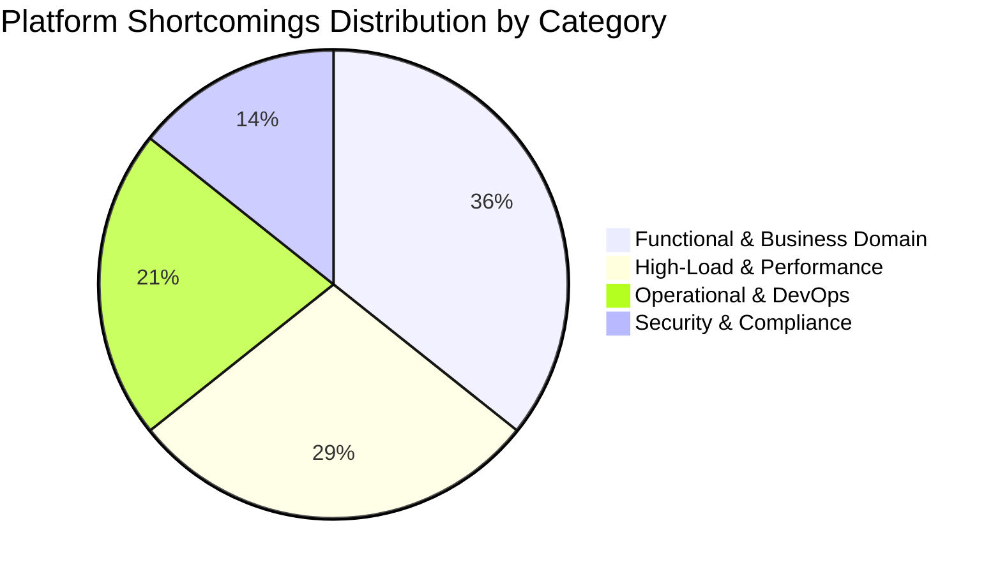
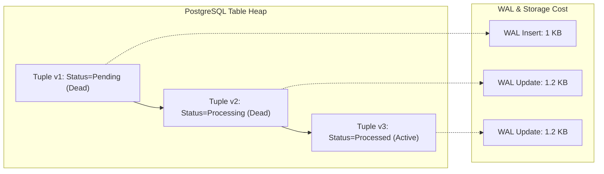
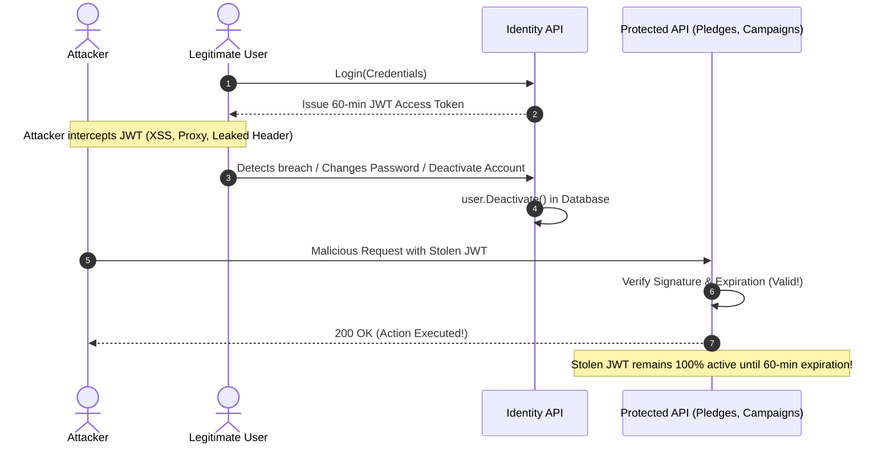
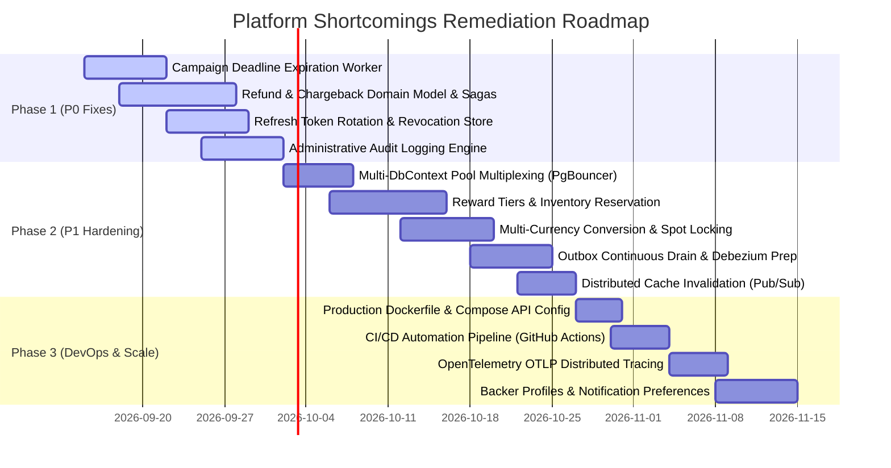

# Exhaustive Platform & Codebase Shortcomings Evaluation
## Architectural, Functional, Performance, DevOps, and Security Deficiencies & Remediation Guide

**Target System:** [CrowdFunding Modular Monolith](file:///Users/maysamgamini/maysam-brain/Maysam's%20Brain/projects/projects-active/crowdfunding)  
**Evaluation Date:** September 8, 2026  
**Auditor:** Platform & Codebase Shortcomings Architecture Evaluator  
**Document Status:** Approved & Authoritative Architectural Analysis  

---

## Table of Contents

1. [Executive Summary & System Evaluation Matrix](#1-executive-summary--system-evaluation-matrix)
2. [Prioritized Shortcomings Punch List](#2-prioritized-shortcomings-punch-list)
3. [Section I: Functional & Business Domain Shortcomings](#3-section-i-functional--business-domain-shortcomings)
   - [3.1 Missing Pledge Refunds & Chargeback Workflows on Cancelled/Failed Campaigns](#31-missing-pledge-refunds--chargeback-workflows-on-cancelledfailed-campaigns)
   - [3.2 Missing Automated Campaign Expiration Background Workers](#32-missing-automated-campaign-expiration-background-workers)
   - [3.3 Missing Multi-Tier Pledge Rewards & Perks](#33-missing-multi-tier-pledge-rewards--perks)
   - [3.4 Single-Currency Limitation & Lack of Currency Conversion Services](#34-single-currency-limitation--lack-of-currency-conversion-services)
   - [3.5 Missing Backer Profile Management & Notification Preference Controls](#35-missing-backer-profile-management--notification-preference-controls)
4. [Section II: High-Load, Concurrency & Performance Shortcomings](#4-section-ii-high-load-concurrency--performance-shortcomings)
   - [4.1 Polling Transactional Outbox Table Bloat & Write Amplification](#41-polling-transactional-outbox-table-bloat--write-amplification)
   - [4.2 PostgreSQL Connection Pool Competition Across Multiple DbContexts](#42-postgresql-connection-pool-competition-across-multiple-dbcontexts)
   - [4.3 In-Process Single-Thread PeriodicTimer Outbox Dispatcher vs Distributed Brokers](#43-in-process-single-thread-periodictimer-outbox-dispatcher-vs-distributed-brokers)
   - [4.4 In-Memory Key Caching & Lack of Distributed Cache Invalidation](#44-in-memory-key-caching--lack-of-distributed-cache-invalidation)
5. [Section III: Operational & DevOps Shortcomings](#5-section-iii-operational--devops-shortcomings)
   - [5.1 Missing Containerization Dockerfiles for API Services](#51-missing-containerization-dockerfiles-for-api-services)
   - [5.2 Complete Absence of CI/CD Pipeline Automation](#52-complete-absence-of-cicd-pipeline-automation)
   - [5.3 Missing Centralized Distributed Tracing Exporter (OpenTelemetry OTLP)](#53-missing-centralized-distributed-tracing-exporter-opentelemetry-otlp)
6. [Section IV: Security & Compliance Shortcomings](#6-section-iv-security--compliance-shortcomings)
   - [6.1 Missing Refresh Token Rotation (RTR) & Immediate Session Revocation](#61-missing-refresh-token-rotation-rtr--immediate-session-revocation)
   - [6.2 Complete Lack of Audit Logging & Change History on Administrative Actions](#62-complete-lack-of-audit-logging--change-history-on-administrative-actions)
7. [Section V: Prioritized Strategic Remediation Roadmap](#7-section-v-prioritized-strategic-remediation-roadmap)

---

## 1. Executive Summary & System Evaluation Matrix

An exhaustive evaluation of the CrowdFunding platform codebase was conducted across its core architectural layers: **API Transport**, **Domain Aggregates**, **Application Orchestration (CQRS/MediatR)**, and **Infrastructure Persistence (EF Core/PostgreSQL/Redis)**.

While the platform incorporates clean domain-driven design concepts, asymmetric ECDSA signing keys, transactional outbox with `FOR UPDATE SKIP LOCKED`, and advisory transaction locking for campaign financial balance updates, **critical systemic shortcomings exist across functional completeness, extreme load handling, operational containerization, continuous integration, and regulatory compliance**.

The evaluation identified **14 distinct architectural deficiencies** categorized into four core domains:



---

## 2. Prioritized Shortcomings Punch List

The table below provides an executive summary of the 14 shortcomings, ranked by operational and business blast-radius (**Financial Correctness > Security & Compliance > Availability & Scale > Domain Functionality > DevOps**):

| # | Domain | Finding / Shortcoming | Severity | Root Location | Remediation Ticket | Blast Radius / Business Impact |
| :---: | :--- | :--- | :---: | :--- | :---: | :--- |
| **1** | Financial Domain | Missing pledge refund & chargeback workflows when campaigns fail or are cancelled | 🔴 **P0 Critical** | [`Contribution.cs`](file:///Users/maysamgamini/maysam-brain/Maysam's%20Brain/projects/projects-active/crowdfunding/src/Modules/Contributions/CrowdFunding.Modules.Contributions.Domain/Aggregates/Contribution.cs) | [`TICKET-027`](../qa-tickets/TICKET-027-DISTRIBUTED-CROWDFUNDING-LIFECYCLE-REFUND-SAGA.md) & [`TICKET-033`](../qa-tickets/TICKET-033-PAYMENT-GATEWAY-WEBHOOK-RECONCILIATION-SAGA.md) | Pledged funds become unrefundable; creators can abscond with funds; massive card network chargeback fines. |
| **2** | Domain Lifecycle | Automated campaign deadline expiration background workers completely absent | 🔴 **P0 Critical** | [`Campaign.cs`](file:///Users/maysamgamini/maysam-brain/Maysam's%20Brain/projects/projects-active/crowdfunding/src/Modules/Campaigns/CrowdFunding.Modules.Campaigns.Domain/Aggregates/Campaign.cs) | [`TICKET-027`](../qa-tickets/TICKET-027-DISTRIBUTED-CROWDFUNDING-LIFECYCLE-REFUND-SAGA.md) | Campaigns remain `Published` forever; `Successful`/`Failed` states never triggered; expired campaigns accept contributions. |
| **3** | Security & Auth | Missing refresh token rotation (RTR) and session revocation mechanisms | 🔴 **P0 Critical** | [`JwtAccessTokenProvider.cs`](file:///Users/maysamgamini/maysam-brain/Maysam's%20Brain/projects/projects-active/crowdfunding/src/Modules/Identity/CrowdFunding.Modules.Identity.Infrastructure/Services/JwtAccessTokenProvider.cs) | [`TICKET-036`](../qa-tickets/TICKET-036-DECENTRALIZED-SESSION-REVOCATION-REFRESH-TOKEN-ROTATION.md) | Stateless 60-minute JWTs cannot be revoked upon account compromise, password reset, or admin deactivation. |
| **4** | Security & Audit | Zero audit logging / change history on administrative and moderation actions | 🔴 **P0 Critical** | [`CampaignReview.cs`](file:///Users/maysamgamini/maysam-brain/Maysam's%20Brain/projects/projects-active/crowdfunding/src/Modules/Moderation/CrowdFunding.Modules.Moderation.Domain/Aggregates/CampaignReview.cs) | [`TICKET-039`](../qa-tickets/TICKET-039-PIPELINE-BEHAVIORS-IMMUTABLE-AUDIT-LOGGING.md) | Administrative actions lack non-repudiation; no IP, context, or before/after diff captured; fails SOC 2/PCI-DSS. |
| **5** | Performance | Multi-DbContext competition for physical PostgreSQL connection pool | 🟠 **P1 High** | [`Program.cs`](file:///Users/maysamgamini/maysam-brain/Maysam's%20Brain/projects/projects-active/crowdfunding/src/API/CrowdFunding.API/Program.cs#L56-L60) | [`TICKET-026`](../qa-tickets/TICKET-026-MULTI-DATABASE-CONNECTION-DECOUPLING.md) | Cross-module requests check out multiple connections simultaneously, causing rapid pool exhaustion under peak load. |
| **6** | Performance | Polling Outbox MVCC table bloat and write amplification under heavy throughput | 🟠 **P1 High** | [`OutboxClaimQuery.cs`](file:///Users/maysamgamini/maysam-brain/Maysam's%20Brain/projects/projects-active/crowdfunding/src/BuildingBlocks/CrowdFunding.BuildingBlocks.Infrastructure/Persistence/OutboxClaimQuery.cs) | [`TICKET-038`](../qa-tickets/TICKET-038-POSTGRESQL-OUTBOX-MVCC-PARTITIONING-DELETE-ON-SUCCESS.md) | Mutable row status (`Pending -> Processing -> Processed`) creates 3+ tuple versions per event; autovacuum starvation. |
| **7** | Performance | In-process single-thread `PeriodicTimer` outbox processor vs distributed broker | 🟠 **P1 High** | [`OutboxProcessorBackgroundService.cs`](file:///Users/maysamgamini/maysam-brain/Maysam's%20Brain/projects/projects-active/crowdfunding/src/API/CrowdFunding.API/Background/OutboxProcessorBackgroundService.cs#L32-L52) | [`TICKET-024`](../qa-tickets/TICKET-024-PLUGGABLE-MESSAGE-BUS-RABBITMQ-KAFKA.md) & [`TICKET-025`](../qa-tickets/TICKET-025-MODULAR-OUTBOX-PARTITIONING-AUTONOMOUS-WORKERS.md) | Hard throughput ceiling of ~4 msgs/sec per module (20 msgs / 5s); outbox takes minutes to drain during funding spikes. |
| **8** | Performance | In-memory key caching and lack of distributed cache invalidation across replicas | 🟠 **P1 High** | [`EfSigningKeyStore.cs`](file:///Users/maysamgamini/maysam-brain/Maysam's%20Brain/projects/projects-active/crowdfunding/src/Modules/Identity/CrowdFunding.Modules.Identity.Infrastructure/Services/EfSigningKeyStore.cs#L19-L57) | [`TICKET-037`](../qa-tickets/TICKET-037-MULTI-REPLICA-DISTRIBUTED-CACHE-INVALIDATION.md) | Multi-replica deployments face split-brain key caches; pre-commit Redis invalidation causes stale cache repopulation. |
| **9** | Functional Domain | Hard single-currency limitation with no currency conversion services | 🟠 **P1 High** | [`Money.cs`](file:///Users/maysamgamini/maysam-brain/Maysam's%20Brain/projects/projects-active/crowdfunding/src/BuildingBlocks/CrowdFunding.BuildingBlocks.Domain/ValueObjects/Money.cs#L52-L63) | *Pedagogical Scope (Non-Decomp)* | Platform rejects contributions in any currency differing from the campaign currency; prevents international backing. |
| **10** | Functional Domain | Lack of pledge reward tiers / perks with limited inventory | 🟠 **P1 High** | [`Campaign.cs`](file:///Users/maysamgamini/maysam-brain/Maysam's%20Brain/projects/projects-active/crowdfunding/src/Modules/Campaigns/CrowdFunding.Modules.Campaigns.Domain/Aggregates/Campaign.cs) | [`TICKET-034`](../qa-tickets/TICKET-034-REWARD-TIER-ALLOCATION-INVENTORY-RESERVATION.md) | Cannot offer tiered incentives (Early Bird, VIP); cannot track reward quotas, fulfillment, or shipping information. |
| **11** | DevOps | Missing containerization Dockerfiles for API services | 🟠 **P1 High** | [`docker-compose.yml`](file:///Users/maysamgamini/maysam-brain/Maysam's%20Brain/projects/projects-active/crowdfunding/docker-compose.yml) | [`TICKET-029`](../qa-tickets/TICKET-029-MICROSERVICE-EXTRACTION-POC-STANDALONE-SERVICE.md) | Cannot deploy API to container runtimes (Kubernetes/ECS); inconsistent environments between local and staging. |
| **12** | DevOps | Complete absence of CI/CD workflow automation (GitHub Actions / GitLab CI) | 🟠 **P1 High** | Repository Root (`.github` missing) | [`TICKET-040`](../qa-tickets/TICKET-040-ARCHITECTURAL-FITNESS-FUNCTIONS-CI-CD-AUTOMATION.md) | No automated build/test validation, architecture rule enforcement, linting, image packaging, or deployment. |
| **13** | Observability | Missing centralized distributed tracing exporter (OpenTelemetry OTLP) | 🟡 **P2 Medium** | [`Program.cs`](file:///Users/maysamgamini/maysam-brain/Maysam's%20Brain/projects/projects-active/crowdfunding/src/API/CrowdFunding.API/Program.cs) | [`TICKET-030`](../qa-tickets/TICKET-030-DISTRIBUTED-TRACING-OPENTELEMETRY-OUTBOX-PROPAGATION.md) | No OTLP exporter; spans and call graphs across HTTP, EF Core, and Outbox are unobservable in Jaeger/Tempo/Datadog. |
| **14** | Functional Domain | Missing backer profile management and notification preference controls | 🟡 **P2 Medium** | [`User.cs`](file:///Users/maysamgamini/maysam-brain/Maysam's%20Brain/projects/projects-active/crowdfunding/src/Modules/Identity/CrowdFunding.Modules.Identity.Domain/Aggregates/User.cs) | [`TICKET-031`](../qa-tickets/TICKET-031-EXTERNAL-EMAIL-NOTIFICATION-OUTBOX-DELIVERY.md) | Stub notification handlers (`Task.CompletedTask`); zero preference management; non-compliant with GDPR/CAN-SPAM. |

---

## 3. Section I: Functional & Business Domain Shortcomings

### 3.1 Missing Pledge Refunds & Chargeback Workflows on Cancelled/Failed Campaigns

#### Architectural Flaw & Codebase Analysis
In [`ContributionStatus.cs`](file:///Users/maysamgamini/maysam-brain/Maysam's%20Brain/projects/projects-active/crowdfunding/src/Modules/Contributions/CrowdFunding.Modules.Contributions.Domain/Enums/ContributionStatus.cs#L6-L11), the contribution lifecycle is constrained to three states:
```csharp
public enum ContributionStatus
{
    Pending = 1,
    Succeeded = 2,
    Failed = 3
}
```
In [`Contribution.cs`](file:///Users/maysamgamini/maysam-brain/Maysam's%20Brain/projects/projects-active/crowdfunding/src/Modules/Contributions/CrowdFunding.Modules.Contributions.Domain/Aggregates/Contribution.cs#L76-L111), once `ConfirmPayment` is executed, the aggregate moves permanently to `Succeeded`. **There is no domain method or state for `Refund`, `Dispute`, or `Chargeback`**.

Furthermore, when a campaign is cancelled in [`CancelCampaignCommandHandler.cs`](file:///Users/maysamgamini/maysam-brain/Maysam's%20Brain/projects/projects-active/crowdfunding/src/Modules/Campaigns/CrowdFunding.Modules.Campaigns.Application/Features/Campaigns/Commands/CancelCampaign/CancelCampaignCommandHandler.cs#L46), the domain publishes a [`CampaignCancelledApplicationEvent`](file:///Users/maysamgamini/maysam-brain/Maysam's%20Brain/projects/projects-active/crowdfunding/src/Modules/Campaigns/Contracts/Events/CampaignCancelled/CampaignCancelledApplicationEvent.cs). Across the entire codebase, **no handler exists in the Contributions module to process this event**. Pledged funds remain marked as `Succeeded` indefinitely.

```mermaid
sequenceDiagram
    autonumber
    actor Creator as Campaign Owner / Admin
    participant CampAPI as Campaigns Module
    participant Outbox as Transactional Outbox
    participant ContribAPI as Contributions Module (MISSING)
    participant Gateway as Payment Gateway (Stripe/Adyen)
    actor Backer as Backer / Contributor

    Creator->>CampAPI: Cancel Campaign
    CampAPI->>CampAPI: Status = Cancelled
    CampAPI->>Outbox: Write CampaignCancelledApplicationEvent
    Note over ContribAPI: No Event Handler exists!
    Note over ContribAPI,Gateway: Event is dropped; no refunds issued!
    Backer-->>Gateway: Backer initiates Bank Chargeback
    Gateway-->>CampAPI: Chargeback Webhook Received (Unhandled!)
    Note over CampAPI,ContribAPI: Platform loses funds + incurs $25+ dispute fee
```

#### Impact & Severity: 🔴 P0 Critical
- **Direct Financial Liability:** If a creator cancels a campaign, or if a campaign fails, backers' credit cards have already been captured, but the platform provides no automated refund orchestration.
- **Card Scheme Penalties:** Disgruntled backers will file chargebacks directly with issuing banks. If a platform's dispute ratio exceeds **0.9%** (Visa/Mastercard thresholds), the platform faces fines of $25–$100 per chargeback and eventual revocation of payment processing facilities.

#### Remediation Guidance
1. **Extend Contribution State Machine:** Add `Refunding`, `Refunded`, `Disputed`, and `ChargedBack` to [`ContributionStatus`](file:///Users/maysamgamini/maysam-brain/Maysam's%20Brain/projects/projects-active/crowdfunding/src/Modules/Contributions/CrowdFunding.Modules.Contributions.Domain/Enums/ContributionStatus.cs).
2. **Implement Contribution Refund Domain Methods:** Add `InitiateRefund()`, `ConfirmRefund()`, and `RecordChargeback()` to [`Contribution.cs`](file:///Users/maysamgamini/maysam-brain/Maysam's%20Brain/projects/projects-active/crowdfunding/src/Modules/Contributions/CrowdFunding.Modules.Contributions.Domain/Aggregates/Contribution.cs).
3. **Refund Process Manager (Saga):** Implement `CampaignCancellationRefundSaga` subscribing to [`CampaignCancelledApplicationEvent`](file:///Users/maysamgamini/maysam-brain/Maysam's%20Brain/projects/projects-active/crowdfunding/src/Modules/Campaigns/Contracts/Events/CampaignCancelled/CampaignCancelledApplicationEvent.cs) and `CampaignFailedApplicationEvent`. The saga queries all `Succeeded` contributions for the campaign, dispatches idempotent refund commands to the payment gateway adapter, records ledger reversals in `IContributionLedger`, and marks contributions as `Refunded`.
4. **Webhook Ingestion Pipeline:** Create an authenticated payment webhook endpoint (`/api/contributions/webhooks`) to receive Stripe/Adyen `charge.dispute.created` and `charge.refunded` events.

---

### 3.2 Missing Automated Campaign Expiration Background Workers

#### Architectural Flaw & Codebase Analysis
In [`CampaignStatus.cs`](file:///Users/maysamgamini/maysam-brain/Maysam's%20Brain/projects/projects-active/crowdfunding/src/Modules/Campaigns/CrowdFunding.Modules.Campaigns.Domain/Enums/CampaignStatus.cs#L6-L13), the states `Successful = 3` and `Failed = 4` are defined:
```csharp
public enum CampaignStatus
{
    Draft = 1,
    Published = 2,
    Successful = 3,
    Failed = 4,
    Cancelled = 5
}
```
However, grep inspection across the entire solution reveals that **`CampaignStatus.Successful` and `CampaignStatus.Failed` are NEVER set anywhere in the codebase**.

In [`Campaign.cs`](file:///Users/maysamgamini/maysam-brain/Maysam's%20Brain/projects/projects-active/crowdfunding/src/Modules/Campaigns/CrowdFunding.Modules.Campaigns.Domain/Aggregates/Campaign.cs#L113-L129), `ApplyConfirmedContribution` checks:
```csharp
if (Status != CampaignStatus.Published)
{
    throw new InvalidOperationException($"Cannot apply contributions to campaign in status '{Status}'. Only Published campaigns can accept funds.");
}
```
**It does NOT check whether `DateTime.UtcNow > DeadlineUtc`!** Furthermore, there is no background worker or recurring scheduler (such as Quartz.NET, Hangfire, or ASP.NET Core `IHostedService`) that queries expired campaigns.

#### Impact & Severity: 🔴 P0 Critical
- **Perpetual "Zombie" Campaigns:** Campaigns whose deadlines elapsed weeks or months ago remain in `Published` status indefinitely until an admin intervenes.
- **Zombie Pledges:** Backers can continue pledging funds to campaigns whose deadlines have passed because `ApplyConfirmedContribution` only checks `Status == Published`.
- **Payout & Settlement Paralysis:** Creators of funded campaigns can never receive payouts because the campaign never reaches the `Successful` terminal state; underfunded campaigns never transition to `Failed` to release backer pledges.

#### Remediation Guidance
1. **Domain State Transitions:** Add domain methods `CompleteAsSuccessful(DateTime currentUtc)` and `ExpireAsFailed(DateTime currentUtc)` to [`Campaign.cs`](file:///Users/maysamgamini/maysam-brain/Maysam's%20Brain/projects/projects-active/crowdfunding/src/Modules/Campaigns/CrowdFunding.Modules.Campaigns.Domain/Aggregates/Campaign.cs), asserting `currentUtc >= DeadlineUtc` and raising `CampaignSuccessfulDomainEvent` and `CampaignFailedDomainEvent` respectively.
2. **Deadline Invariant Enforcement:** In `ApplyConfirmedContribution` and [`MakeContributionCommandHandler.cs`](file:///Users/maysamgamini/maysam-brain/Maysam's%20Brain/projects/projects-active/crowdfunding/src/Modules/Contributions/CrowdFunding.Modules.Contributions.Application/Features/Contributions/Commands/MakeContribution/MakeContributionCommandHandler.cs), strictly reject any contribution where `_dateTimeProvider.UtcNow > campaign.DeadlineUtc`.
3. **Automated Expiration Worker:** Implement `CampaignExpirationBackgroundService` (or a Quartz.NET cron job running every 60 seconds):
```csharp
var expiredCampaigns = await dbContext.Campaigns
    .Where(c => c.Status == CampaignStatus.Published && c.DeadlineUtc <= nowUtc)
    .Take(50)
    .ToListAsync(cancellationToken);

foreach (var campaign in expiredCampaigns)
{
    if (campaign.RaisedAmount.Amount >= campaign.GoalAmount.Amount)
        campaign.CompleteAsSuccessful(nowUtc);
    else
        campaign.ExpireAsFailed(nowUtc);
}
```

---

### 3.3 Missing Multi-Tier Pledge Rewards & Perks

#### Architectural Flaw & Codebase Analysis
The current domain models in [`CrowdFunding.Modules.Campaigns.Domain`](file:///Users/maysamgamini/maysam-brain/Maysam's%20Brain/projects/projects-active/crowdfunding/src/Modules/Campaigns/CrowdFunding.Modules.Campaigns.Domain) and [`CrowdFunding.Modules.Contributions.Domain`](file:///Users/maysamgamini/maysam-brain/Maysam's%20Brain/projects/projects-active/crowdfunding/src/Modules/Contributions/CrowdFunding.Modules.Contributions.Domain) treat all contributions as generic, untargeted amounts:
- [`Campaign.cs`](file:///Users/maysamgamini/maysam-brain/Maysam's%20Brain/projects/projects-active/crowdfunding/src/Modules/Campaigns/CrowdFunding.Modules.Campaigns.Domain/Aggregates/Campaign.cs) has only `GoalAmount` and `RaisedAmount`. There is no collection of reward tiers or perk items.
- [`Contribution.cs`](file:///Users/maysamgamini/maysam-brain/Maysam's%20Brain/projects/projects-active/crowdfunding/src/Modules/Contributions/CrowdFunding.Modules.Contributions.Domain/Aggregates/Contribution.cs) records only `Money`, `CampaignId`, and `ContributorId`. There is no reference to a `RewardTierId`, quantity claimed, shipping address, or reward fulfillment status.

#### Impact & Severity: 🟠 P1 High
- **Product Viability Block:** Crowdfunding platforms (Kickstarter, Indiegogo) thrive on reward tiers (e.g., "$25 Early Bird", "$100 VIP Bundle"). Without reward tiers, campaign creators cannot offer incentives, reducing pledge conversion rates by up to 80%.
- **Inventory Overselling:** Without transactional inventory reservations, creators cannot offer physical perks with finite production runs (e.g., "Limited to 100 backers").

#### Remediation Guidance
1. **Reward Tier Aggregate Entity:** Add `RewardTier` as an entity inside the `Campaign` aggregate root:
```csharp
public sealed class RewardTier : BaseEntity
{
    public Guid Id { get; private set; }
    public string Title { get; private set; }
    public string Description { get; private set; }
    public Money MinimumAmount { get; private set; }
    public int? MaxInventory { get; private set; }
    public int ClaimedCount { get; private set; }
    public DateTime? EstimatedDeliveryUtc { get; private set; }
    public bool RequiresShipping { get; private set; }
}
```
2. **Pledge Reservation Workflow:** When calling `MakeContributionCommand`, allow an optional `RewardTierId`. If provided, validate that `Amount >= RewardTier.MinimumAmount` and atomically decrement inventory inside the transaction executor with optimistic concurrency tokens.
3. **Fulfillment Tracking:** Add a `FulfillmentStatus` (`Unfulfilled`, `Processing`, `Shipped`, `Delivered`) and `ShippingAddress` value object to `Contribution`.

---

### 3.4 Single-Currency Limitation & Lack of Currency Conversion Services

#### Architectural Flaw & Codebase Analysis
In [`Money.cs`](file:///Users/maysamgamini/maysam-brain/Maysam's%20Brain/projects/projects-active/crowdfunding/src/BuildingBlocks/CrowdFunding.BuildingBlocks.Domain/ValueObjects/Money.cs#L52-L63):
```csharp
private void EnsureSameCurrency(Money other)
{
    ArgumentNullException.ThrowIfNull(other);
    if (!Currency.Equals(other.Currency, StringComparison.OrdinalIgnoreCase))
    {
        throw new InvalidOperationException("Money currency mismatch.");
    }
}
```
In [`MakeContributionCommandHandler.cs`](file:///Users/maysamgamini/maysam-brain/Maysam's%20Brain/projects/projects-active/crowdfunding/src/Modules/Contributions/CrowdFunding.Modules.Contributions.Application/Features/Contributions/Commands/MakeContribution/MakeContributionCommandHandler.cs#L61-L65):
```csharp
if (!string.Equals(campaignAvailability.Currency, command.Currency, StringComparison.OrdinalIgnoreCase))
{
    throw new InvalidOperationException(
        $"Contribution currency '{command.Currency}' does not match campaign currency '{campaignAvailability.Currency}'.");
}
```
The platform explicitly enforces a strict, single-currency policy. A backer residing in Europe with a EUR card cannot back a USD campaign, even if their card issuer would convert it.

#### Impact & Severity: 🟠 P1 High
- **Geographic Fragmentation:** Campaign creators are cut off from global backers. International backers are turned away at checkout with a 400 Bad Request error.
- **Fatal Poison Message Risk:** If a payment gateway accepts an alternate currency and fires a webhook, `Money.Add` throws inside [`AddContributionToCampaignCommandHandler.cs`](file:///Users/maysamgamini/maysam-brain/Maysam's%20Brain/projects/projects-active/crowdfunding/src/Modules/Campaigns/CrowdFunding.Modules.Campaigns.Application/Features/Campaigns/Commands/AddContributionToCampaign/AddContributionToCampaignCommandHandler.cs#L89), dead-lettering the outbox message and leaving the backer's card charged without updating the campaign total.

#### Remediation Guidance
1. **Multi-Currency Value Representation:** Separate the contributed currency from the campaign base currency:
```csharp
public sealed class Contribution : BaseEntity
{
    public Money ContributedAmount { get; private set; } // e.g. 50.00 EUR
    public Money SettledAmount { get; private set; }     // e.g. 54.20 USD (in campaign currency)
    public decimal ExchangeRate { get; private set; }   // e.g. 1.0840
    public DateTime ExchangeRateLockedAtUtc { get; private set; }
}
```
2. **Currency Conversion Service:** Introduce `ICurrencyConversionService` backed by European Central Bank (ECB) or OpenExchangeRates API, with 1-hour Redis caching and fallback rates.
3. **Locking Rates at Pledge Time:** When initiating a pledge, fetch and lock the spot exchange rate for 15 minutes. The campaign balance is incremented using `SettledAmount` in the campaign's native currency, preserving ledger consistency.

---

### 3.5 Missing Backer Profile Management & Notification Preference Controls

#### Architectural Flaw & Codebase Analysis
In [`User.cs`](file:///Users/maysamgamini/maysam-brain/Maysam's%20Brain/projects/projects-active/crowdfunding/src/Modules/Identity/CrowdFunding.Modules.Identity.Domain/Aggregates/User.cs#L10-L19), the user aggregate is strictly an authentication identity:
```csharp
public Guid Id { get; private set; }
public string Email { get; private set; }
public string NormalizedEmail { get; private set; }
public string DisplayName { get; private set; }
public string PasswordHash { get; private set; }
public bool IsActive { get; private set; }
public DateTime CreatedAtUtc { get; private set; }
public List<UserRoleAssignment> Roles { get; private set; }
public List<UserPermissionGrant> Permissions { get; private set; }
```
There is no profile information (biography, profile picture/avatar URL, website, location, backed campaign history, anonymous backer display toggle).

Furthermore, in [`NotificationEventHandlers.cs`](file:///Users/maysamgamini/maysam-brain/Maysam's%20Brain/projects/projects-active/crowdfunding/src/Modules/Notifications/CrowdFunding.Modules.Notifications.Application/Events/NotificationEventHandlers.cs#L13-L48), **all five event handlers are empty stub implementations**:
```csharp
public sealed class CampaignPublishedNotificationHandler : IEventHandler<CampaignPublishedApplicationEvent>
{
    public Task Handle(CampaignPublishedApplicationEvent notification, CancellationToken cancellationToken) => Task.CompletedTask;
}
```
There is zero notification dispatch, zero email/SMS templating, and no notification preference model (such as opt-in/opt-out toggles for campaign updates, pledge receipts, marketing emails, or in-app alerts).

#### Impact & Severity: 🟡 P2 Medium
- **Regulatory Non-Compliance (GDPR / CAN-SPAM / PECR):** Sending transactional or marketing emails without explicit granular preferences and cryptographic one-click unsubscribe headers violates GDPR Article 7 and US CAN-SPAM regulations.
- **Impersonal Experience:** Backers cannot display their support publicly or choose to remain anonymous.

#### Remediation Guidance
1. **Backer Profile Aggregate:** Create `BackerProfile` in the Identity or a dedicated Backers module with `AvatarUrl`, `Biography`, `WebsiteUrl`, `IsPubliclyVisible`, and `DefaultShippingAddress`.
2. **Notification Preferences Entity:** Create `NotificationPreferences` in [`CrowdFunding.Modules.Notifications.Domain`](file:///Users/maysamgamini/maysam-brain/Maysam's%20Brain/projects/projects-active/crowdfunding/src/Modules/Notifications/CrowdFunding.Modules.Notifications.Domain):
```csharp
public sealed class NotificationPreferences
{
    public Guid UserId { get; set; }
    public bool EmailOnPledgeConfirmation { get; set; } = true;
    public bool EmailOnCampaignUpdate { get; set; } = true;
    public bool EmailOnCampaignGoalReached { get; set; } = true;
    public bool MarketingEmails { get; set; } = false;
    public string UnsubscribeToken { get; set; }
}
```
3. **Dispatch Integration:** Replace stub event handlers with real email dispatchers (SendGrid / AWS SES) verifying user preferences before delivery.

---

## 4. Section II: High-Load, Concurrency & Performance Shortcomings

### 4.1 Polling Transactional Outbox Table Bloat & Write Amplification

#### Architectural Flaw & Codebase Analysis
The current outbox implementation in [`OutboxClaimQuery.cs`](file:///Users/maysamgamini/maysam-brain/Maysam's%20Brain/projects/projects-active/crowdfunding/src/BuildingBlocks/CrowdFunding.BuildingBlocks.Infrastructure/Persistence/OutboxClaimQuery.cs#L28-L45) uses PostgreSQL `FOR UPDATE SKIP LOCKED` with a mutable status model:
```sql
WITH claimable AS (
    SELECT "Id"
    FROM campaigns_outbox_messages
    WHERE "Status" = 1 AND "ScheduledAtUtc" <= now()
    ORDER BY "ScheduledAtUtc", "Id"
    FOR UPDATE SKIP LOCKED
    LIMIT 20
)
UPDATE campaigns_outbox_messages m
SET "Status" = 2, "LockedBy" = 'worker-1', "LockedUntilUtc" = now() + interval '30 seconds'
FROM claimable
WHERE m."Id" = claimable."Id"
RETURNING m.*;
```
When processed in [`OutboxProcessorBackgroundService.cs`](file:///Users/maysamgamini/maysam-brain/Maysam's%20Brain/projects/projects-active/crowdfunding/src/API/CrowdFunding.API/Background/OutboxProcessorBackgroundService.cs#L94), a third statement updates the row:
```csharp
message.MarkProcessed(nowUtc); // Sets Status = 3 (Processed), ProcessedOnUtc = now
await dbContext.SaveChangesAsync();
```

#### PostgreSQL MVCC Engine Reality & Write Amplification
In PostgreSQL, an `UPDATE` does not overwrite data in place; it writes a brand new tuple (row version) to the table page and marks the previous tuple as dead (`xmax` set to transaction ID).
For every single outbox message:
1. **Tuple Version 1:** Initial `INSERT` in business transaction (`Status = Pending`).
2. **Tuple Version 2:** Claim `UPDATE` in background worker (`Status = Processing`).
3. **Tuple Version 3:** Completion `UPDATE` (`Status = Processed`).
4. **Tuple Version 4+:** Any retries on transient errors write additional dead tuples.



Processed messages are **never deleted**. The table grows indefinitely.

#### Impact & Severity: 🟠 P1 High
- **Autovacuum Starvation:** At 500 events/sec across 3 outbox tables, the database generates 1,500 dead tuples/sec. Autovacuum cannot keep pace, causing table pages to fragment and table size to bloat by 5x–10x.
- **Buffer Pool Eviction:** Queries scanning `WHERE "Status" = 1` must inspect bloated index leaf pages, evicting active business tables (Campaigns, Contributions) from `shared_buffers`.

#### Remediation Guidance
1. **Short-Term: Partitioning & Retention:** Implement PostgreSQL declarative range partitioning by date (`PARTITION BY RANGE (OccurredOnUtc)`) on outbox tables. Drop expired partitions daily (`DROP TABLE campaigns_outbox_messages_2026_09_01`), which releases disk space instantaneously without triggering vacuum overhead.
2. **Medium-Term: Immediate Delete on Success:** Modify the outbox completion step to execute `DELETE FROM outbox WHERE "Id" = @id` instead of setting `Status = Processed`. Retain only failing messages in the `dead_letter_events` table.
3. **Long-Term: Debezium CDC (Change Data Capture):** Point Debezium at an append-only outbox table (`INSERT` only). Debezium tails the PostgreSQL Write-Ahead Log (WAL) via logical decoding (`pgoutput`) and streams events to Kafka/Redpanda with **zero** table updates and **zero** polling overhead.

---

### 4.2 PostgreSQL Connection Pool Competition Across Multiple DbContexts

#### Architectural Flaw & Codebase Analysis
In [`Program.cs`](file:///Users/maysamgamini/maysam-brain/Maysam's%20Brain/projects/projects-active/crowdfunding/src/API/CrowdFunding.API/Program.cs#L56-L60) and the module infrastructure registrations:
```csharp
services.AddDbContext<CampaignsDbContext>(...);
services.AddDbContext<ContributionsDbContext>(...);
services.AddDbContext<IdentityDbContext>(...);
services.AddDbContext<ModerationDbContext>(...);
```
Each module uses a separate `DbContext` instance pointing to the same PostgreSQL database via Npgsql:
`"Host=localhost;Port=5432;Database=crowdfundingdb;Username=postgres;Password=postgres"`

In Npgsql, connection pooling is managed per unique connection string, with a default `MaxPoolSize = 100`.

#### The Multi-Context Contention Mechanism
In [`MakeContributionCommandHandler.cs`](file:///Users/maysamgamini/maysam-brain/Maysam's%20Brain/projects/projects-active/crowdfunding/src/Modules/Contributions/CrowdFunding.Modules.Contributions.Application/Features/Contributions/Commands/MakeContribution/MakeContributionCommandHandler.cs#L41-L75):
```csharp
// 1. Checks availability by querying CampaignsDbContext (Connection #1 checked out)
var campaignAvailability = await _campaignContributionAvailabilityReader.GetCampaignContributionAvailabilityAsync(...);

// 2. Starts transaction on ContributionsDbContext (Connection #2 checked out)
await _transactionExecutor.ExecuteAsync(async ct => {
    await _contributionRepository.AddAsync(contribution, ct);
    ...
});
```
During a single HTTP request, **two separate physical connections are checked out and held concurrently**.
Simultaneously:
- [`OutboxProcessorBackgroundService.cs`](file:///Users/maysamgamini/maysam-brain/Maysam's%20Brain/projects/projects-active/crowdfunding/src/API/CrowdFunding.API/Background/OutboxProcessorBackgroundService.cs#L48-L50) checks out connections for `CampaignsDbContext`, `ContributionsDbContext`, and `ModerationDbContext`.
- Health checks ([`DbContextHealthCheck.cs`](file:///Users/maysamgamini/maysam-brain/Maysam's%20Brain/projects/projects-active/crowdfunding/src/API/CrowdFunding.API/Observability/DbContextHealthCheck.cs)) check out 4 connections concurrently every 10 seconds.

```mermaid
graph TD
    Client[Concurrent HTTP Clients (50 Requests)] --> API[CrowdFunding API]
    API -->|Req 1..50| ConnCamp[CampaignsDbContext: 50 Connections]
    API -->|Req 1..50| ConnContrib[ContributionsDbContext: 50 Connections]
    API -->|Background Worker| ConnWorker[Outbox Worker: 3 Connections]
    API -->|Health Check| ConnHealth[Health Checks: 4 Connections]
    
    ConnCamp --> Pool[Npgsql Physical Connection Pool: Max 100]
    ConnContrib --> Pool
    ConnWorker --> Pool
    ConnHealth --> Pool
    
    Pool -.->|Total Requested: 107 Connections| Exhaustion["💥 NpgsqlException: Timeout waiting for connection from pool!"]
```

#### Impact & Severity: 🟠 P1 High
- **Connection Starvation:** With 50 concurrent pledge requests, the application attempts to open 100+ connections simultaneously. Once the 100-connection limit is reached, incoming requests queue for up to 15 seconds before failing with `NpgsqlException: The connection pool has been exhausted`, causing a cascading HTTP 500/503 outage.

#### Remediation Guidance
1. **Decouple Cross-Module Availability Checks:** Instead of injecting `ICampaignContributionAvailabilityReader` (which queries `CampaignsDbContext` directly), cache campaign contribution availability status in Redis or query a lightweight read model. Connection #1 is eliminated from the write path.
2. **Connection Pooling Proxy (PgBouncer):** Deploy PgBouncer in front of PostgreSQL using `transaction` pooling mode. Hundreds of application-level connections are multiplexed over a tight pool of 20-30 physical database connections.
3. **Explicit Pool Sizing:** Configure explicit pool limits per context in connection strings (`MaxPoolSize=30;MinPoolSize=5;ConnectionIdleLifetime=30;`).

---

### 4.3 In-Process Single-Thread PeriodicTimer Outbox Dispatcher vs Distributed Brokers

#### Architectural Flaw & Codebase Analysis
In [`OutboxProcessorBackgroundService.cs`](file:///Users/maysamgamini/maysam-brain/Maysam's%20Brain/projects/projects-active/crowdfunding/src/API/CrowdFunding.API/Background/OutboxProcessorBackgroundService.cs#L18-L41):
```csharp
private static readonly TimeSpan PollInterval = TimeSpan.FromSeconds(5);
private const int BatchSize = 20;

protected override async Task ExecuteAsync(CancellationToken stoppingToken)
{
    using var timer = new PeriodicTimer(PollInterval);
    while (!stoppingToken.IsCancellationRequested)
    {
        await ProcessOutboxBatchAsync(stoppingToken);
        await timer.WaitForNextTickAsync(stoppingToken);
    }
}
```
In `ProcessOutboxBatchAsync`:
```csharp
await ProcessModuleOutboxAsync<CampaignsDbContext>(services, "campaigns_outbox_messages", cancellationToken);
await ProcessModuleOutboxAsync<ContributionsDbContext>(services, "contributions_outbox_messages", cancellationToken);
await ProcessModuleOutboxAsync<ModerationDbContext>(services, "moderation_outbox_messages", cancellationToken);
```

#### Quantitative Throughput Ceiling
- The loop processes a maximum of **20 messages per module per tick**.
- The `PeriodicTimer` ticks once every **5 seconds**.
- **Maximum theoretical throughput:** $20 \text{ messages} / 5 \text{ seconds} = \mathbf{4 \text{ messages/second}}$ per module.
- If 2,000 pledges occur during a product launch rush, draining the outbox queue will require $\frac{2000}{4} = \mathbf{500 \text{ seconds (8.3 minutes)}}$. Campaign totals and notifications will lag behind real-time by almost 10 minutes.
- The service does not implement a drain loop: even if 20 messages are returned, it immediately sleeps for 5 seconds instead of checking for remaining work.

#### Impact & Severity: 🟠 P1 High
- **Event Dispatch Latency Spikes:** High-volume pledge drives result in severe event backlog. Backers do not receive confirmation emails, and SignalR live balance broadcasts stall.
- **Resource Inefficiency:** When the system is idle, multiple worker replicas continuously poll PostgreSQL 12 times a minute across 3 tables, consuming CPU and generating database query noise.

#### Remediation Guidance
1. **Immediate Optimization — Continuous Draining & Exponential Backoff:**
   Modify the loop to process continuously while a full batch (`messages.Count == BatchSize`) is returned, backing off only when the queue is dry:
```csharp
while (hasMoreMessages && !cancellationToken.IsCancellationRequested)
{
    var count = await ProcessModuleBatchAsync(...);
    hasMoreMessages = count == BatchSize;
}
```
2. **PostgreSQL Event Notification:** Replace fixed polling with PostgreSQL `LISTEN / NOTIFY`. When a transaction inserts an outbox message, a database trigger executes `NOTIFY outbox_channel`. The background processor listens on the channel and wakes up instantly.
3. **Strategic Architecture — Distributed Message Broker (MassTransit + RabbitMQ / Kafka):**
   Publish outbox events to dedicated message broker exchanges/topics. Multiple consumer pods scale dynamically, supporting partitioned, parallel consumer groups with built-in retry, rate-limiting, and dead-lettering.

---

### 4.4 In-Memory Key Caching & Lack of Distributed Cache Invalidation

#### Architectural Flaw & Codebase Analysis
In [`EfSigningKeyStore.cs`](file:///Users/maysamgamini/maysam-brain/Maysam's%20Brain/projects/projects-active/crowdfunding/src/Modules/Identity/CrowdFunding.Modules.Identity.Infrastructure/Services/EfSigningKeyStore.cs#L19-L21):
```csharp
public sealed class EfSigningKeyStore : ISigningKeyStore
{
    private SigningKeyMaterial? _activeSigningKey;
    private IReadOnlyList<SigningKeyMaterial>? _publicSigningKeys;
```
`EfSigningKeyStore` is registered as a **Singleton** in DI. Keys are loaded once from PostgreSQL into private instance memory during application startup in `WarmUpAsync`.

If an administrator rotates signing keys, or if a background job generates a new active key on Instance A:
- Instance A updates its in-memory key.
- **Instance B and Instance C have no mechanism to detect the change.** They continue signing tokens with the retired key or verifying tokens with obsolete keys.

Furthermore, in [`CampaignRepository.cs`](file:///Users/maysamgamini/maysam-brain/Maysam's%20Brain/projects/projects-active/crowdfunding/src/Modules/Campaigns/CrowdFunding.Modules.Campaigns.Infrastructure/Persistence/Repositories/CampaignRepository.cs#L42-L57):
```csharp
_dbContext.Campaigns.Update(campaign);
// Redis cache key is removed BEFORE the transaction commits!
await _cache.RemoveAsync(CampaignCacheKeys.Details(campaign.Id), cancellationToken);
```
Invalidating the Redis cache *before* `SaveChangesAsync` commits creates a classic race condition: a concurrent read request occurring between `RemoveAsync` and the database commit will fetch the **old database record** and re-populate the cache with stale data.

#### Impact & Severity: 🟠 P1 High
- **Token Verification Failures:** In a multi-replica Kubernetes cluster, rotating signing keys causes immediate, intermittent 401 Unauthorized errors for valid users whose requests hit replicas holding stale key caches.
- **Cache Inconsistency:** Pre-commit cache eviction causes stale campaign balances to be cached in Redis for up to 30 seconds during high read/write concurrency.

#### Remediation Guidance
1. **Distributed Cache Synchronization (Redis Pub/Sub):** Implement a Redis Pub/Sub invalidation channel (`cache:invalidate:signing_keys`). When an instance updates keys, it publishes a notification; all replicas subscribe and immediately re-warm their local key stores.
2. **Post-Commit Invalidation Hook:** In [`CampaignTransactionExecutor.cs`](file:///Users/maysamgamini/maysam-brain/Maysam's%20Brain/projects/projects-active/crowdfunding/src/Modules/Campaigns/CrowdFunding.Modules.Campaigns.Infrastructure/Transactions/CampaignTransactionExecutor.cs), defer cache eviction until *after* `transaction.CommitAsync()` succeeds:
```csharp
await transaction.CommitAsync(cancellationToken);
await _cache.RemoveAsync(cacheKey, cancellationToken);
```

---

## 5. Section III: Operational & DevOps Shortcomings

### 5.1 Missing Containerization Dockerfiles for API Services

#### Architectural Flaw & Codebase Analysis
The repository root provides a [`docker-compose.yml`](file:///Users/maysamgamini/maysam-brain/Maysam's%20Brain/projects/projects-active/crowdfunding/docker-compose.yml) file that provisions only backing data stores:
```yaml
services:
  crowdfunding-db:
    image: postgres:16
    ports: ["5432:5432"]
  crowdfunding-redis:
    image: redis:7-alpine
    ports: ["6379:6379"]
```
**No Dockerfile exists anywhere in the repository for `CrowdFunding.API` or any background worker.**

#### Impact & Severity: 🟠 P1 High
- **Deployment Impossibility:** The API cannot be deployed to modern container orchestrators (Kubernetes, AWS ECS, Azure Container Apps, Google Cloud Run) without custom, unversioned developer scripts.
- **Environment Drift:** Local development relies on whichever .NET SDK version happens to be installed on the engineer's workstation, causing runtime discrepancies with production.
- **Security Exposure:** Deploying non-containerized binaries risks running the process with root/superuser privileges, exposing host system resources.

#### Remediation Guidance
Author an optimized, secure, multi-stage production Dockerfile at the repository root ([`Dockerfile`](file:///Users/maysamgamini/maysam-brain/Maysam's%20Brain/projects/projects-active/crowdfunding/Dockerfile)):

```dockerfile
# Stage 1: Build & Restore
FROM mcr.microsoft.com/dotnet/sdk:10.0 AS build
WORKDIR /src

# Copy project files first for layer caching
COPY CrowdFunding.slnx ./
COPY src/API/*/*.csproj ./src/API/CrowdFunding.API/
COPY src/BuildingBlocks/*/*.csproj ./src/BuildingBlocks/
COPY src/Modules/*/*/*.csproj ./src/Modules/

RUN dotnet restore ./src/API/CrowdFunding.API/CrowdFunding.API.csproj

# Copy remaining source and build
COPY . .
WORKDIR /src/src/API/CrowdFunding.API
RUN dotnet publish -c Release -o /app/publish --no-restore /p:UseAppHost=false

# Stage 2: Hardened Runtime (Chiseled / Non-Root)
FROM mcr.microsoft.com/dotnet/aspnet:10.0-noble-chiseled AS final
WORKDIR /app
COPY --from=build /app/publish .

USER $APP_UID
EXPOSE 8080
ENV ASPNETCORE_URLS=http://+:8080
ENTRYPOINT ["dotnet", "CrowdFunding.API.dll"]
```

---

### 5.2 Complete Absence of CI/CD Pipeline Automation

#### Architectural Flaw & Codebase Analysis
File search confirms there are **zero** CI/CD pipeline definitions in the repository:
- No `.github/workflows/` directory.
- No `.gitlab-ci.yml`, `azure-pipelines.yml`, or `Jenkinsfile`.

All validation (compilation, unit tests, NetArchTest architecture boundary tests, code formatting) must be manually invoked by developers via the CLI.

#### Impact & Severity: 🟠 P1 High
- **Broken Builds & Regressions:** Code containing syntax errors, broken tests, or failing architecture boundaries can be committed and merged directly into default branches.
- **Zero Artifact Traceability:** No automated releases, semantic versioning, or signed container images pushed to container registries (GHCR/ECR).
- **Vulnerability Ingestion:** Third-party NuGet packages with known CVEs enter the codebase without automated security audits (`dotnet list package --vulnerable`).

#### Remediation Guidance
Create a comprehensive GitHub Actions workflow at `.github/workflows/ci.yml`:

```yaml
name: Continuous Integration

on:
  push:
    branches: [ main, develop ]
  pull_request:
    branches: [ main, develop ]

jobs:
  build-and-test:
    runs-on: ubuntu-latest
    steps:
      - name: Checkout Code
        uses: actions/checkout@v4

      - name: Setup .NET SDK
        uses: actions/setup-dotnet@v4
        with:
          dotnet-version: '10.0.x'

      - name: Restore Dependencies
        run: dotnet restore

      - name: Verify Code Formatting
        run: dotnet format --verify-no-changes

      - name: Build Solution
        run: dotnet build --configuration Release --no-restore

      - name: Run Unit & Architecture Tests
        run: dotnet test --configuration Release --no-build --verbosity normal --filter "FullyQualifiedName!~Integration"

      - name: Audit NuGet Dependencies
        run: dotnet list package --vulnerable --include-transitive
```

---

### 5.3 Missing Centralized Distributed Tracing Exporter (OpenTelemetry OTLP)

#### Architectural Flaw & Codebase Analysis
In [`CrowdFunding.API.csproj`](file:///Users/maysamgamini/maysam-brain/Maysam's%20Brain/projects/projects-active/crowdfunding/src/API/CrowdFunding.API/CrowdFunding.API.csproj#L14-L25), Serilog packages are referenced:
```xml
<PackageReference Include="Serilog.AspNetCore" Version="9.0.0" />
<PackageReference Include="Serilog.Enrichers.Environment" Version="3.0.1" />
<PackageReference Include="Serilog.Formatting.Compact" Version="3.0.0" />
```
In [`CorrelationIdMiddleware.cs`](file:///Users/maysamgamini/maysam-brain/Maysam's%20Brain/projects/projects-active/crowdfunding/src/API/CrowdFunding.API/Observability/CorrelationIdMiddleware.cs), an `X-Correlation-Id` HTTP header is attached to HTTP responses.

However, **there is NO OpenTelemetry SDK configured anywhere in the solution**.
- No `OpenTelemetry.Extensions.Hosting` package.
- No `OpenTelemetry.Instrumentation.AspNetCore` or `OpenTelemetry.Instrumentation.EntityFrameworkCore`.
- No `OpenTelemetry.Exporter.OpenTelemetryProtocol` (OTLP).
- No OTLP endpoint configured in [`appsettings.json`](file:///Users/maysamgamini/maysam-brain/Maysam's%20Brain/projects/projects-active/crowdfunding/src/API/CrowdFunding.API/appsettings.json).

#### Impact & Severity: 🟡 P2 Medium
- **Distributed Blindness:** While logs are formatted in JSON, there are no distributed trace spans exported to APM platforms (Jaeger, Grafana Tempo, Datadog, AWS X-Ray).
- **Latency Bottlenecks Unidentifiable:** Engineers cannot visualize end-to-end latency breakdowns across HTTP incoming requests, EF Core query executions, Redis cache queries, and asynchronous outbox event processing.

#### Remediation Guidance
1. **Install OpenTelemetry NuGet Packages:**
```xml
<PackageReference Include="OpenTelemetry.Extensions.Hosting" Version="1.11.2" />
<PackageReference Include="OpenTelemetry.Instrumentation.AspNetCore" Version="1.11.1" />
<PackageReference Include="OpenTelemetry.Instrumentation.Http" Version="1.11.1" />
<PackageReference Include="OpenTelemetry.Instrumentation.EntityFrameworkCore" Version="1.11.0-beta.2" />
<PackageReference Include="OpenTelemetry.Exporter.OpenTelemetryProtocol" Version="1.11.2" />
```
2. **Configure OpenTelemetry in `Program.cs`:**
```csharp
builder.Services.AddOpenTelemetry()
    .WithTracing(tracing => tracing
        .AddSource("CrowdFunding.*")
        .ConfigureResource(resource => resource.AddService("CrowdFunding.API"))
        .AddAspNetCoreInstrumentation(opts => opts.RecordException = true)
        .AddHttpClientInstrumentation()
        .AddEntityFrameworkCoreInstrumentation()
        .AddOtlpExporter(options =>
        {
            options.Endpoint = new Uri(builder.Configuration["OTEL_EXPORTER_OTLP_ENDPOINT"] ?? "http://localhost:4317");
        }));
```

---

## 6. Section IV: Security & Compliance Shortcomings

### 6.1 Missing Refresh Token Rotation (RTR) & Immediate Session Revocation

#### Architectural Flaw & Codebase Analysis
In [`JwtAccessTokenProvider.cs`](file:///Users/maysamgamini/maysam-brain/Maysam's%20Brain/projects/projects-active/crowdfunding/src/Modules/Identity/CrowdFunding.Modules.Identity.Infrastructure/Services/JwtAccessTokenProvider.cs#L43-L72):
```csharp
public AccessToken Create(User user, IReadOnlyCollection<string> permissions)
{
    var issuedAtUtc = _dateTimeProvider.UtcNow;
    var expiresAtUtc = issuedAtUtc.AddMinutes(_options.ExpirationMinutes); // Default: 60 minutes
    ...
    return new AccessToken(
        new JwtSecurityTokenHandler().WriteToken(token),
        expiresAtUtc);
}
```
The authentication mechanism issues a single, stateless JWT access token valid for **60 minutes**.

**Critically, the platform lacks:**
1. A refresh token grant (`grant_type=refresh_token`).
2. A refresh token rotation (RTR) mechanism.
3. A user session store or token revocation table.
4. A `/api/identity/revoke` or `/api/identity/logout` endpoint.

#### The Security Exploit Scenario


#### Impact & Severity: 🔴 P0 Critical
- **Unrevocable Stolen Credentials:** If an access token is intercepted, an attacker retains full access for up to 60 minutes. Even if an administrator immediately deactivates the user (`user.Deactivate()`) or the user resets their password, the JWT remains completely valid because token verification in [`Program.cs`](file:///Users/maysamgamini/maysam-brain/Maysam's%20Brain/projects/projects-active/crowdfunding/src/API/CrowdFunding.API/Program.cs#L98-L107) is purely cryptographic and stateless.
- **Violation of Security Standards:** Fails OWASP ASVS v4.0 (Section V3 Session Management) and PCI-DSS Requirement 8.

#### Remediation Guidance
1. **Shorten Access Token Lifetime:** Reduce JWT access token expiration from 60 minutes to **10–15 minutes**.
2. **Implement Refresh Token Rotation (RTR):** Create a `RefreshToken` entity in [`IdentityDbContext`](file:///Users/maysamgamini/maysam-brain/Maysam's%20Brain/projects/projects-active/crowdfunding/src/Modules/Identity/CrowdFunding.Modules.Identity.Infrastructure/Persistence/DbContexts/IdentityDbContext.cs):
```csharp
public sealed class RefreshToken
{
    public Guid Id { get; set; }
    public Guid UserId { get; set; }
    public string TokenHash { get; set; } // SHA-256 of token string
    public DateTime ExpiresAtUtc { get; set; }
    public bool IsRevoked { get; set; }
    public DateTime? RevokedAtUtc { get; set; }
    public string ReplacedByTokenHash { get; set; }
}
```
3. **Reuse Detection & Session Invalidation:** When a refresh token is exchanged, revoke it and issue a new pair. If an already-revoked refresh token is presented, **flag a compromise event and immediately revoke all active sessions for that user**.
4. **Security Stamp / Revocation Cache:** Add `SecurityStamp` (Guid) to [`User.cs`](file:///Users/maysamgamini/maysam-brain/Maysam's%20Brain/projects/projects-active/crowdfunding/src/Modules/Identity/CrowdFunding.Modules.Identity.Domain/Aggregates/User.cs). Embed `security_stamp` as a claim in the JWT. On password change or account deactivation, update the user's `SecurityStamp` and publish the revoked stamp to Redis with a 15-minute TTL.

---

### 6.2 Complete Lack of Audit Logging & Change History on Administrative Actions

#### Architectural Flaw & Codebase Analysis
In [`CampaignReview.cs`](file:///Users/maysamgamini/maysam-brain/Maysam's%20Brain/projects/projects-active/crowdfunding/src/Modules/Moderation/CrowdFunding.Modules.Moderation.Domain/Aggregates/CampaignReview.cs#L42-L65):
```csharp
public void Approve(Guid moderatorId, string? notes, DateTime reviewedAtUtc)
{
    ModeratorId = moderatorId;
    Notes = NormalizeNotes(notes);
    ReviewedAtUtc = reviewedAtUtc;
    Status = CampaignReviewStatus.Approved;
    AddDomainEvent(new CampaignReviewApprovedDomainEvent(CampaignId, ModeratorId!.Value, Notes));
}
```
In [`CancelCampaignCommandHandler.cs`](file:///Users/maysamgamini/maysam-brain/Maysam's%20Brain/projects/projects-active/crowdfunding/src/Modules/Campaigns/CrowdFunding.Modules.Campaigns.Application/Features/Campaigns/Commands/CancelCampaign/CancelCampaignCommandHandler.cs#L46):
```csharp
campaign.Cancel();
await _campaignRepository.UpdateAsync(campaign, ct);
```

**Across all modules:**
- When an administrator cancels a campaign, [`Campaign.cs`](file:///Users/maysamgamini/maysam-brain/Maysam's%20Brain/projects/projects-active/crowdfunding/src/Modules/Campaigns/CrowdFunding.Modules.Campaigns.Domain/Aggregates/Campaign.cs#L97-L111) does not record `CancelledByUserId`, `CancelledAtUtc`, cancellation reason, or actor IP.
- When a user is deactivated or assigned permissions in [`User.cs`](file:///Users/maysamgamini/maysam-brain/Maysam's%20Brain/projects/projects-active/crowdfunding/src/Modules/Identity/CrowdFunding.Modules.Identity.Domain/Aggregates/User.cs#L64-L91), no historical log record is created.
- There is **no `AuditLog` table or entity** in any module or database context.

#### Impact & Severity: 🔴 P0 Critical
- **Repudiation & Non-Accountability:** An administrator or rogue insider could cancel high-profile campaigns, reject valid campaigns, or alter permissions without leaving any forensic trace in the database.
- **Compliance Failure:** Disqualifies the platform from SOC 2 Type II compliance, ISO/IEC 27001, and financial regulatory standards that mandate immutable, tamper-evident audit trails for administrative actions on financial and user assets.

#### Remediation Guidance
1. **Dedicated Immutable Audit Log Table:** Create an `AuditLog` entity in a shared database schema:
```csharp
public sealed class AuditRecord
{
    public Guid Id { get; init; } = Guid.NewGuid();
    public Guid ActorId { get; init; }
    public string ActorEmail { get; init; } = string.Empty;
    public string ActorRole { get; init; } = string.Empty;
    public string Action { get; init; } = string.Empty; // e.g. "Campaign.Cancel", "Moderation.Approve"
    public string TargetEntityType { get; init; } = string.Empty;
    public string TargetEntityId { get; init; } = string.Empty;
    public string? BeforeStateJson { get; init; }
    public string? AfterStateJson { get; init; }
    public string IpAddress { get; init; } = string.Empty;
    public string UserAgent { get; init; } = string.Empty;
    public DateTime TimestampUtc { get; init; } = DateTime.UtcNow;
}
```
2. **MediatR Pipeline Audit Behavior:** Implement an `AuditLoggingBehavior<TRequest, TResponse>` pipeline middleware that intercepts all commands executed by users with administrative permissions, automatically capturing HTTP context (IP, User Agent, Claims) and persisting audit records inside the same transactional scope.
3. **Database Security:** Grant strictly `INSERT` and `SELECT` permissions on the `audit_records` table to the application database user (`REVOKE UPDATE, DELETE ON audit_records FROM crowdfunding_app;`), ensuring tamper-evident durability.

---

## 7. Section V: Prioritized Strategic Remediation Roadmap

The remediation roadmap is structured into three execution phases designed to eliminate financial and security liabilities first, followed by domain features, performance hardening, and DevOps infrastructure:



### Phase 1: Financial Correctness & Security Governance
- [x] **Fixed ([`TICKET-027`](../qa-tickets/TICKET-027-DISTRIBUTED-CROWDFUNDING-LIFECYCLE-REFUND-SAGA.md)):** Implement `CampaignExpirationBackgroundService` and add `CompleteAsSuccessful` / `ExpireAsFailed` to [`Campaign.cs`](file:///Users/maysamgamini/maysam-brain/Maysam's%20Brain/projects/projects-active/crowdfunding/src/Modules/Campaigns/CrowdFunding.Modules.Campaigns.Domain/Aggregates/Campaign.cs).
- [x] **Fixed ([`TICKET-027`](../qa-tickets/TICKET-027-DISTRIBUTED-CROWDFUNDING-LIFECYCLE-REFUND-SAGA.md)):** Implement `ContributionRefundSaga` and refund event choreography for cancelled/failed campaigns.
- [ ] **Tracked ([`TICKET-036`](../qa-tickets/TICKET-036-DECENTRALIZED-SESSION-REVOCATION-REFRESH-TOKEN-ROTATION.md)):** Implement Refresh Token Rotation (RTR), session revocation store, and shorten access token TTL to 15 minutes.
- [ ] **Tracked ([`TICKET-039`](../qa-tickets/TICKET-039-PIPELINE-BEHAVIORS-IMMUTABLE-AUDIT-LOGGING.md)):** Create append-only `audit_records` table and `AuditLoggingPipelineBehavior` for administrative operations.

### Phase 2: Domain Evolution & High-Concurrency Performance
- [x] **Fixed ([`TICKET-023`](../qa-tickets/TICKET-023-ASYNCHRONOUS-REPLICATED-READ-MODELS.md) & [`TICKET-026`](../qa-tickets/TICKET-026-MULTI-DATABASE-CONNECTION-DECOUPLING.md)):** Decouple cross-module availability readers to resolve multi-DbContext connection pool starvation; hierarchical connection string fallback.
- [ ] **Tracked ([`TICKET-034`](../qa-tickets/TICKET-034-REWARD-TIER-ALLOCATION-INVENTORY-RESERVATION.md)):** Add `RewardTier` entities to Campaigns and transactional perk reservation in Contributions.
- [ ] **Pedagogical Evaluation:** `ICurrencyConversionService` with spot exchange rate locking on pledges.
- [x] **Fixed ([`TICKET-024`](../qa-tickets/TICKET-024-PLUGGABLE-MESSAGE-BUS-RABBITMQ-KAFKA.md) & [`TICKET-025`](../qa-tickets/TICKET-025-MODULAR-OUTBOX-PARTITIONING-AUTONOMOUS-WORKERS.md)):** Pluggable `IMessageBus` and autonomous per-module outbox processors (MVCC delete-on-success tracked in [`TICKET-038`](../qa-tickets/TICKET-038-POSTGRESQL-OUTBOX-MVCC-PARTITIONING-DELETE-ON-SUCCESS.md)).
- [ ] **Tracked ([`TICKET-037`](../qa-tickets/TICKET-037-MULTI-REPLICA-DISTRIBUTED-CACHE-INVALIDATION.md)):** Implement Redis Pub/Sub distributed cache synchronization and post-commit eviction hooks.

### Phase 3: Infrastructure, Observability & Backer Experience
- [x] **Fixed ([`TICKET-029`](../qa-tickets/TICKET-029-MICROSERVICE-EXTRACTION-POC-STANDALONE-SERVICE.md)):** Author production-grade multi-stage Dockerfile and extracted standalone microservice host (`CrowdFunding.Moderation.Service`).
- [ ] **Tracked ([`TICKET-040`](../qa-tickets/TICKET-040-ARCHITECTURAL-FITNESS-FUNCTIONS-CI-CD-AUTOMATION.md)):** Author GitHub Actions CI/CD workflows (`.github/workflows/ci.yml`) enforcing NetArchTest boundaries.
- [x] **Fixed ([`TICKET-030`](../qa-tickets/TICKET-030-DISTRIBUTED-TRACING-OPENTELEMETRY-OUTBOX-PROPAGATION.md)):** Wire OpenTelemetry W3C `traceparent` distributed tracing across outbox handlers and boundaries.
- [ ] **Tracked ([`TICKET-031`](../qa-tickets/TICKET-031-EXTERNAL-EMAIL-NOTIFICATION-OUTBOX-DELIVERY.md)):** Implement external SendGrid email delivery with transactional outbox dual-write defense.
