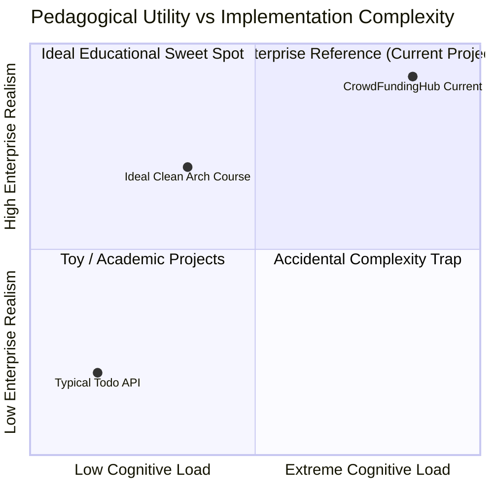
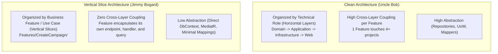
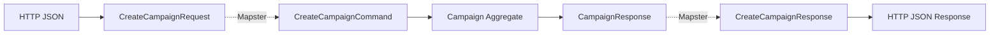
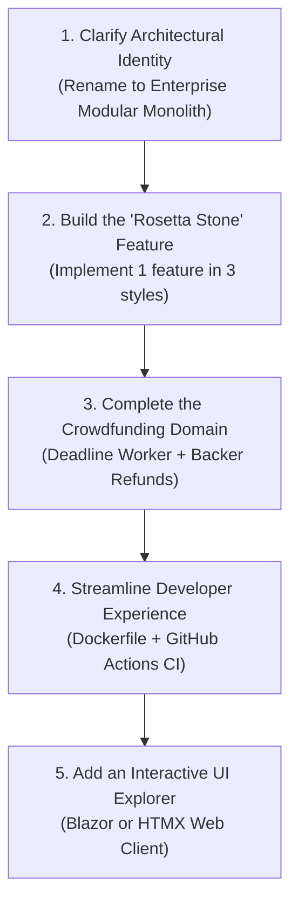

# Educational Evaluation: Modular Clean Architecture & Vertical Slice Fidelity

> **Document Type:** Pedagogical & Architectural Evaluation  
> **Target Audience:** Engineering Leads, Curriculum Designers, Students & Practitioners  
> **System Under Review:** `CrowdFundingHub` (.NET 10 / C# 14 / PostgreSQL 16)  
> **Stated Mission:** *"Create a vertical slice of monolithic clean architecture for educational purposes."*  
> **Evaluation Date:** September 8, 2026  

---

## Table of Contents

1. [Executive Summary & The Core Verdict](#1-executive-summary--the-core-verdict)
2. [The Architectural Identity Crisis](#2-the-architectural-identity-crisis)
   - [2.1 Clean Architecture vs. Vertical Slice Architecture (VSA)](#21-clean-architecture-vs-vertical-slice-architecture-vsa)
   - [2.2 What This Codebase Actually Is](#22-what-this-codebase-actually-is)
3. [Where Did We Go Too Far? (The Over-Engineering Audit)](#3-where-did-we-go-too-far-the-over-engineering-audit)
   - [3.1 Assembly & Project Sprawl (29 .csproj Files)](#31-assembly--project-sprawl-29-csproj-files)
   - [3.2 Enterprise Cryptographic Infrastructure (ES256 / JWKS)](#32-enterprise-cryptographic-infrastructure-es256--jwks)
   - [3.3 Low-Level Database Locking & Concurrency Primitives](#33-low-level-database-locking--concurrency-primitives)
   - [3.4 The Triple-Mapping Ceremony & DTO Inflation](#34-the-triple-mapping-ceremony--dto-inflation)
   - [3.5 External SaaS Vendor Coupling (OpenMeter CloudEvents)](#35-external-saas-vendor-coupling-openmeter-cloudevents)
4. [Where Didn't We Go Enough? (The Educational Blind Spots)](#4-where-didnt-we-go-enough-the-educational-blind-spots)
   - [4.1 The Unfinished Core Crowdfunding Lifecycle (Deadlines & Refunds)](#41-the-unfinished-core-crowdfunding-lifecycle-deadlines--refunds)
   - [4.2 Absence of Pure Vertical Slice Demonstrations](#42-absence-of-pure-vertical-slice-demonstrations)
   - [4.3 Lack of a Consumer / UI Experience](#43-lack-of-a-consumer--ui-experience)
   - [4.4 Missing Developer Ergonomics (Dockerfile & CI/CD Pipeline)](#44-missing-developer-ergonomics-dockerfile--cicd-pipeline)
   - [4.5 Lack of "Before vs. After" Architectural Contrast (The Pedagogical Rosetta Stone)](#45-lack-of-before-vs-after-architectural-contrast-the-pedagogical-rosetta-stone)
5. [Code Anatomy Comparison: The Request Journey](#5-code-anatomy-comparison-the-request-journey)
   - [5.1 Current Journey: 14 Files Across 5 Assemblies](#51-current-journey-14-files-across-5-assemblies)
   - [5.2 True Vertical Slice Journey: 1 File / 1 Folder](#52-true-vertical-slice-journey-1-file--1-folder)
6. [Pedagogical Rubric & Scorecard](#6-pedagogical-rubric--scorecard)
7. [Strategic Recommendations: How to Make This the Ultimate Educational Resource](#7-strategic-recommendations-how-to-make-this-the-ultimate-educational-resource)

---

## 1. Executive Summary & The Core Verdict

### The Verdict: **Exceptional Production-Grade Engineering Showcase; Sub-Optimal for Introductory Clean Architecture / VSA.**

If the objective is to show a **Senior/Staff Engineer** how to build an enterprise-hardened, multi-module ASP.NET Core system resilient to transaction deadlocks, outbox message starvation, and key rotation split-brains, this project is **a masterclass (Grade: A+)**.

However, if the purpose is to provide a **clear, digestible, educational reference for learners trying to understand Clean Architecture and Vertical Slice Architecture**, the project currently **goes too far in infrastructure mechanics and does not go far enough in core domain completeness (Grade: C+)**.



### Key Strengths as an Educational Resource
1. **Architectural Guardrails via Unit Testing:** Using [`NetArchTest`](file:///Users/maysamgamini/maysam-brain/Maysam's%20Brain/projects/projects-active/crowdfunding/tests/ArchitectureTests/CrowdFunding.ArchitectureTests/) to programmatically enforce that `Domain` has no dependencies and `API` never touches internal module domains is one of the best pedagogical lessons in modern .NET.
2. **Real Database Integration Testing:** Using [`Testcontainers.PostgreSql`](file:///Users/maysamgamini/maysam-brain/Maysam's%20Brain/projects/projects-active/crowdfunding/tests/IntegrationTests/CrowdFunding.IntegrationTests/) rather than the deceptive EF Core In-Memory provider teaches students that real database semantics (indexes, concurrency tokens, transactions) cannot be mocked.
3. **Transactional Outbox Demystification:** Provides a working, transparent implementation of the Transactional Outbox pattern with `FOR UPDATE SKIP LOCKED`, solving the classic dual-write distributed transaction fallacy.

### Key Weaknesses as an Educational Resource
1. **Conflation of Styles:** It claims to be "Vertical Slice", but is actually an Onion Clean Architecture fragmented across 29 assemblies.
2. **Infrastructure Drowning Domain:** The student spends 80% of their mental energy trying to understand cryptographic DER conversions, advisory lock bitwise math, and outbox claim queries, rather than core domain design.
3. **The "All-or-Nothing" Domain Is Broken:** Crowdfunding's primary domain rule (campaign expires -> target reached -> funds captured; target missed -> pledges refunded) is **unimplemented**. The domain stops halfway.

---

## 2. The Architectural Identity Crisis

The prompt states: *"the purpose of this project is to create a vertical slice of monolithic clean architecture"*.

In software architecture pedagogy, combining **Vertical Slice Architecture (VSA)** and **Clean Architecture (CA)** in the same breath creates an immediate pedagogical tension. They were invented to solve opposite problems.



### 2.1 Clean Architecture vs. Vertical Slice Architecture (VSA)

| Architectural Axis | Pure Clean Architecture (CA) | Pure Vertical Slice Architecture (VSA) | What CrowdFundingHub Does |
|---|---|---|---|
| **Primary Organizing Principle** | Concentric Technical Rings (Domain, App, Infra, API) | Distinct Business Use Cases (Feature Slices) | **Modular Monolith by Bounded Context**, with CA rings inside each module |
| **Number of Assemblies** | 4 to 6 projects per solution | 1 to 2 projects (Web API + optionally Core) | **29 Assemblies** |
| **Data Access Strategy** | `IRepository<T>` + `IUnitOfWork` abstractions | Direct `DbContext` or Dapper in the Feature Handler | Strict `IRepository<T>` + `ITransactionExecutor` |
| **Read Operations (Queries)** | Queries route through domain abstractions / read services | Queries execute raw SQL / projected EF `AsNoTracking()` straight to DTO | Read services (`CachedCampaignReadService`) with domain entities |
| **Co-location of Code** | Sliced horizontally; changes touch 4 projects | Everything for a feature lives in one directory or file | Folder slicing inside `Application`, but isolated from `Domain` and `Infrastructure` |

### 2.2 What This Codebase Actually Is
This codebase is **not** a Vertical Slice Architecture. It is an **Enterprise Modular Monolith implementing Concentric Clean Architecture inside each module**, featuring folder-based feature categorization in the `Application` layer.

Calling it a "vertical slice" will severely confuse students who read Jimmy Bogard's literature, because true VSA actively rejects the multi-project repository layers that this codebase enforces.

---

## 3. Where Did We Go Too Far? (The Over-Engineering Audit)

The following areas represent significant **accidental or advanced complexity** that distracts from the core goal of teaching Clean Architecture and feature design.

### 3.1 Assembly & Project Sprawl (29 .csproj Files)
The solution contains **29 distinct projects**:
- 6 Modules × 4 Projects (`Domain`, `Application`, `Infrastructure`, `Contracts`) = 24 projects
- BuildingBlocks (`Domain`, `Application`, `Infrastructure`) = 3 projects
- API Host (`CrowdFunding.API`) = 1 project
- Tests (`UnitTests`, `ArchitectureTests`, `IntegrationTests`) = 3 projects (Total: 31 files including solution)

#### Why It Goes Too Far:
1. **Compilation Overhead:** Every `dotnet build` executes MSBuild evaluation across 29 targets.
2. **Project Reference Friction:** When a student creates a new command, they must decide: *"Does this contract go in `Campaigns.Contracts` or `BuildingBlocks.Application`? Does the entity belong in `Campaigns.Domain` or `BuildingBlocks.Domain`?"*
3. **Overkill for In-Process Monolith:** In .NET 10, internal module encapsulation can be achieved cleanly with **1 project per module** using C# `internal` visibility and file-scoped namespaces, or even **1 single project** using modern C# namespace folder structures.

### 3.2 Enterprise Cryptographic Infrastructure (ES256 / JWKS)
In [`EfSigningKeyStore.cs`](file:///Users/maysamgamini/maysam-brain/Maysam's%20Brain/projects/projects-active/crowdfunding/src/Modules/Identity/CrowdFunding.Modules.Identity.Infrastructure/Services/EfSigningKeyStore.cs) and [`JwksEndpoint.cs`](file:///Users/maysamgamini/maysam-brain/Maysam's%20Brain/projects/projects-active/crowdfunding/src/API/CrowdFunding.API/Security/JwksEndpoint.cs):
- Custom Elliptic Curve Diffie-Hellman / ECDSA key pair generation (`ECDsa.Create(ECCurve.NamedCurves.nistP256)`).
- Private key storage in PostgreSQL with active key retirement states (`IsActive`, `ExpiresAtUtc`).
- Dynamic RFC 7517 JWKS JSON serialization emitting Base64URL-encoded curve points (`x`, `y`, `crv`, `kty`).

#### Why It Goes Too Far:
- **Pedagogical Distraction:** Teaching Clean Architecture has nothing to do with cryptographic mathematics or JWKS point encoding.
- **Cognitive Tax:** When a student tries to debug why their test user gets a 401 Unauthorized, they are debugging ECDSA key material loading instead of learning how JWT middleware binds claims to `ICurrentUser`.
- **Standard Practice:** A standard educational Clean Architecture project uses `Microsoft.AspNetCore.Authentication.JwtBearer` with a symmetric HMAC secret key (`builder.Configuration["Jwt:Secret"]`) or ASP.NET Core Identity.

### 3.3 Low-Level Database Locking & Concurrency Primitives
In [`AdvisoryLockKey.cs`](file:///Users/maysamgamini/maysam-brain/Maysam's%20Brain/projects/projects-active/crowdfunding/src/BuildingBlocks/CrowdFunding.BuildingBlocks.Domain/Common/AdvisoryLockKey.cs) and [`OutboxClaimQuery.cs`](file:///Users/maysamgamini/maysam-brain/Maysam's%20Brain/projects/projects-active/crowdfunding/src/BuildingBlocks/CrowdFunding.BuildingBlocks.Infrastructure/Persistence/OutboxClaimQuery.cs):
```csharp
// From AdvisoryLockKey.cs
var hash = MD5.HashData(Encoding.UTF8.GetBytes(resourceKey));
var high = BitConverter.ToInt64(hash, 0);
var low = BitConverter.ToInt64(hash, 8);
return high ^ low;
```
```sql
-- From OutboxClaimQuery.cs
SELECT id, event_type, payload_json, correlation_id
FROM {schema}.{table}
WHERE status = 'Pending'
ORDER BY occurred_at_utc ASC
LIMIT {batchSize}
FOR UPDATE SKIP LOCKED;
```

#### Why It Goes Too Far:
- While this is brilliant production engineering to prevent race conditions during pledge additions, it is **distracting systems programming**.
- The learner is forced to understand PostgreSQL tuple lock queues, MD5 bit folding, and raw SQL locking semantics when they should be focusing on aggregate boundaries and domain invariants.

### 3.4 The Triple-Mapping Ceremony & DTO Inflation
Tracing data for `CreateCampaign`:
1. `CreateCampaignRequest` (API Contract)
2. `Mapster` configuration mapping to `CreateCampaignCommand` (Application DTO)
3. `CreateCampaignCommandValidator` checking the command
4. `CreateCampaignCommandHandler` reading the command
5. `Campaign.Create(...)` aggregate constructor assigning properties
6. `CampaignResponse` mapping back
7. `CreateCampaignResponse` mapping to API response



#### Why It Goes Too Far:
- `CreateCampaignRequest` and `CreateCampaignCommand` have the exact same 6 fields (`Title`, `Story`, `Category`, `TargetAmount`, `Currency`, `DeadlineUtc`).
- Students perceive this as **"boilerplate for the sake of boilerplate"**, giving Clean Architecture an unfair reputation as verbose and inefficient.

### 3.5 External SaaS Vendor Coupling (OpenMeter CloudEvents)
In [`OpenMeterClient.cs`](file:///Users/maysamgamini/maysam-brain/Maysam's%20Brain/projects/projects-active/crowdfunding/src/BuildingBlocks/CrowdFunding.BuildingBlocks.Infrastructure/Metering/OpenMeterClient.cs):
- An HTTP client that sends CloudEvents v1.0 JSON payloads to an external metering SaaS (`openmeter.cloud`).

#### Why It Goes Too Far:
- An educational monolithic architecture should be completely self-contained. Introducing external billing/metering SaaS abstractions introduces external failure points and mental overhead irrelevant to clean architecture fundamentals.

---

## 4. Where Didn't We Go Enough? (The Educational Blind Spots)

While the project went to extreme lengths on infrastructure and security, **the core business domain of crowdfunding was left incomplete**.

### 4.1 The Unfinished Core Crowdfunding Lifecycle (Deadlines & Refunds)
The quintessential problem in crowdfunding (Kickstarter, Indiegogo) is the **All-or-Nothing Model**:
1. Creator defines a target ($10,000) and deadline (30 days).
2. Backers pledge contributions.
3. If deadline arrives and `RaisedAmount >= TargetAmount`: Campaign transitions to `Successful`; creator can withdraw funds.
4. If deadline arrives and `RaisedAmount < TargetAmount`: Campaign transitions to `Failed`; **all backers must be refunded**.
5. If creator cancels campaign: **all backers must be refunded**.

#### The Educational Gap:
- In the current codebase, **no background worker exists to check campaign deadlines**. A campaign stays in `Published` status forever unless manually cancelled.
- The `Contribution` aggregate only has states: `Pending`, `Succeeded`, `Failed`. **There is no `Refunded` state**.
- If a campaign is cancelled, no refund events are processed. The money sits in limbo.
- **Pedagogical Impact:** Students miss out on the most interesting domain logic in crowdfunding: aggregate state machine transitions, saga/choreography compensation workflows, and domain event reactions between Campaigns and Contributions!

### 4.2 Absence of Pure Vertical Slice Demonstrations
If the repository advertises "Vertical Slice Architecture", students will look for features where:
- The endpoint, command, validation, database query, and response are unified in a single file or cohesive directory without layers.
- Simple queries (e.g. `GET /api/Campaigns/{id}`) bypass domain aggregates and repositories entirely, projecting straight from EF Core to the DTO.
- Currently, **0% of the features are built this way**. Every single feature is forced through the 4-layer onion structure.

### 4.3 Lack of a Consumer / UI Experience
The repository has an API, Swagger, and tests, but **no interactive frontend**.
- **Pedagogical Value of a UI:** Students grasp Clean Architecture 10x faster when they can open a browser, enter an invalid title, and see the RFC 9457 `ValidationProblemDetails` rendered in a form, or open two browser windows and watch the SignalR hub update campaign funding progress live!
- A minimal Blazor WebAssembly, React, or lightweight Razor Pages/HTMX client would transform the educational impact of the project.

### 4.4 Missing Developer Ergonomics (Dockerfile & CI/CD Pipeline)
- **No API Dockerfile:** To run the project, a learner must have .NET 10 SDK installed locally. Running `docker compose up` only starts PostgreSQL and Redis, leaving the student wondering how to containerize the .NET host.
- **No `.github/workflows` CI:** For an educational repo, having a clean GitHub Actions workflow running `dotnet test` and `NetArchTest` provides students with a production template for their own CI/CD pipelines.

### 4.5 Lack of "Before vs. After" Architectural Contrast (The Pedagogical Rosetta Stone)
The single most effective educational technique in software engineering is **Contrast**:
- *"Here is how you would write this feature in a naive 200-line controller with inline SQL."*
- *"Here is how that same feature looks in layered Clean Architecture."*
- *"Here is how that same feature looks in pure Vertical Slice Architecture."*

Currently, the codebase presents only one rigid pattern, leaving students to wonder: *"What problem does this abstraction actually solve compared to simpler alternatives?"*

---

## 5. Code Anatomy Comparison: The Request Journey

To understand why a student feels overwhelmed, compare tracing `POST /api/Campaigns` in the current codebase versus a pure Vertical Slice.

### 5.1 Current Journey: 14 Files Across 5 Assemblies

```
[Client]
   │
   ▼ (1) src/API/CrowdFunding.API/Controllers/CampaignsController.cs
   │   └── Uses (2) Contracts/Campaigns/CreateCampaignRequest.cs
   │   └── Uses (3) Mapping/CampaignsMappingConfig.cs (Mapster)
   ▼
[BuildingBlocks.Application]
   │   └── Uses (4) Dispatchers/ICommandDispatcher.cs
   ▼
[Modules.Campaigns.Application]
   │   └── Dispatches (5) Commands/CreateCampaign/CreateCampaignCommand.cs
   │   └── Validates via (6) Commands/CreateCampaign/CreateCampaignCommandValidator.cs
   │   └── Executes (7) Commands/CreateCampaign/CreateCampaignCommandHandler.cs
   │   └── Invokes (8) Persistence/ICampaignRepository.cs
   ▼
[Modules.Campaigns.Domain]
   │   └── Instantiates (9) Aggregates/Campaign.cs
   │   └── Emits (10) Events/CampaignCreatedDomainEvent.cs
   ▼
[Modules.Campaigns.Infrastructure]
   │   └── Persists via (11) Persistence/Repositories/CampaignRepository.cs
   │   └── Maps via (12) Persistence/Configurations/CampaignConfiguration.cs
   │   └── Commits via (13) Persistence/DbContexts/CampaignsDbContext.cs
   ▼
[BuildingBlocks.Infrastructure]
   │   └── Writes Outbox (14) Persistence/OutboxMessage.cs
```
**Student Reaction:** *"I had to open 14 tabs and jump across 5 projects just to save a title and goal amount to a table."*

---

### 5.2 True Vertical Slice Journey: 1 File / 1 Folder

In true Vertical Slice Architecture (e.g. using FastEndpoints or MediatR feature slice):

```csharp
// src/Features/Campaigns/CreateCampaign.cs (Complete Slice)
namespace CrowdFunding.Features.Campaigns;

public static class CreateCampaign
{
    public record Request(string Title, string Story, string Category, decimal TargetAmount, string Currency, DateTime DeadlineUtc);
    public record Response(Guid Id, string Title, string Status);

    public class Validator : AbstractValidator<Request>
    {
        public Validator()
        {
            RuleFor(x => x.Title).NotEmpty().MaximumLength(200);
            RuleFor(x => x.Story).NotEmpty().MinimumLength(20).MaximumLength(5000);
            RuleFor(x => x.TargetAmount).GreaterThan(0);
        }
    }

    public class Endpoint : Endpoint<Request, Response>
    {
        private readonly AppDbContext _db;
        public Endpoint(AppDbContext db) => _db = db;

        public override void Configure()
        {
            Post("/api/campaigns");
            Policies("campaigns:create");
        }

        public override async Task HandleAsync(Request req, CancellationToken ct)
        {
            var campaign = new Campaign(req.Title, req.Story, req.Category, req.TargetAmount, req.Currency, req.DeadlineUtc);
            _db.Campaigns.Add(campaign);
            await _db.SaveChangesAsync(ct);

            await SendCreatedAtAsync<GetCampaignById.Endpoint>(
                new { id = campaign.Id }, 
                new Response(campaign.Id, campaign.Title, campaign.Status.ToString()), 
                cancellation: ct);
        }
    }
}
```
**Student Reaction:** *"Everything relevant to creating a campaign is right here. I don't need to jump between 5 projects or maintain 3 identical DTO classes."*

---

## 6. Pedagogical Rubric & Scorecard

Evaluation of `CrowdFundingHub` across key pedagogical dimensions (1 to 10 scale):

| Dimension | Score | Evaluation Analysis |
|---|:---:|---|
| **Architecture Discipline & Rule Enforcement** | **10 / 10** | Unmatched. NetArchTest guarantees zero illegal boundary leaks. |
| **Enterprise Production Realism** | **9.5 / 10** | Realistic concurrency control, outbox patterns, and database testing. |
| **Test Engineering Best Practices** | **9.5 / 10** | Testcontainers Postgres fixture, 156 passing tests across unit, arch, and integration. |
| **Documentation & Code Explanations** | **9.5 / 10** | 100% inline XML documentation, README in every folder, exhaustive architecture docs. |
| **Simplicity & Cognitive Accessibility** | **3 / 10** | Overwhelming for junior/intermediate learners. 29 projects cause intense navigation friction. |
| **Fidelity to "Vertical Slice Architecture"** | **2 / 10** | It is not VSA; it is layered Onion Clean Architecture organized by module. |
| **Business Domain Completeness** | **4 / 10** | Core crowdfunding lifecycle (deadline expiration, refunding backers) is missing. |
| **Developer Onboarding (Friction to Run)** | **5 / 10** | Requires manual SDK 10 setup; lacks API containerization and automated CI. |

---

## 7. Strategic Recommendations: How to Make This the Ultimate Educational Resource

To transform this repository from an *"over-engineered enterprise beast"* into a **world-class educational gold standard**, adopt the following 5 phased enhancements:



### Recommendation 1: Clarify Architectural Positioning in README
- **Action:** Update repository tagline and `README.md`.
- **Change:** Instead of claiming to be a *"Vertical Slice Clean Architecture"*, state clearly:
  > *"An Enterprise-Grade Modular Monolith demonstrating Clean Architecture, Domain-Driven Design (DDD), Transactional Outbox, and PostgreSQL Concurrency Primitives in .NET 10."*
- **Pedagogical Benefit:** Eliminates false expectations about Jimmy Bogard-style Vertical Slice Architecture and positions the repo accurately for what it excels at: **advanced enterprise architecture**.

### Recommendation 2: Introduce the "Pedagogical Rosetta Stone"
- **Action:** Create a dedicated educational module or sample branch: `src/Samples/RosettaStone/`.
- Implement **one single use case** (e.g. `PledgeToCampaign`) in **three parallel implementations**:
  1. `NaiveControllerSlice`: Direct EF Core in controller with raw validation (Traditional CRUD).
  2. `CleanArchitectureLayered`: Multi-layer Domain -> Application -> Infrastructure -> Controller (The current repo style).
  3. `PureVerticalSlice`: Single-file FastEndpoints / MediatR slice with direct query projection.
- **Pedagogical Benefit:** Provides an immediate "aha!" moment for learners, allowing them to compare trade-offs directly in code.

### Recommendation 3: Complete the Domain Lifecycle (Add Deadlines & Refunds)
- **Action:**
  1. Add a background worker `CampaignExpirationBackgroundService` that queries campaigns where `DeadlineUtc <= DateTime.UtcNow && Status == CampaignStatus.Active`.
  2. If `CurrentBalance >= TargetAmount`, dispatch `CompleteCampaignCommand` (Status: `Successful`).
  3. If `CurrentBalance < TargetAmount`, dispatch `FailCampaignCommand` (Status: `Failed`) and publish `CampaignFailedApplicationEvent`.
  4. In `Contributions`, handle `CampaignFailedApplicationEvent` and transition contributions to `Refunded`.
- **Pedagogical Benefit:** Teaches students real-world saga/choreography compensation workflows and aggregate state machines.

### Recommendation 4: Deliver Containerization & CI Automation
- **Action:**
  1. Add a multi-stage `Dockerfile` in `src/API/CrowdFunding.API/`.
  2. Update `docker-compose.yml` to include the `api` service alongside `postgres` and `redis`.
  3. Add `.github/workflows/ci.yml` running `dotnet build`, `dotnet test`, and upload coverage reports.
- **Pedagogical Benefit:** Enables zero-setup onboarding for students (clone -> `docker compose up` -> open browser).

### Recommendation 5: Provide an Interactive Client Playground
- **Action:** Build a minimal single-page app (Blazor WASM, React, or Razor/HTMX) in `src/Web/`.
- Allow the student to:
  - Register and get an ES256 token.
  - Create and publish a campaign.
  - Pledge money from two different tabs and observe the real-time SignalR progress bar and advisory lock behavior.
- **Pedagogical Benefit:** Connects abstract architectural concepts to visual, tangible user outcomes.

---

## 8. Summary Conclusion

`CrowdFundingHub` is **not "too much" for an enterprise reference**, but it is **"too much" for an introductory clean architecture tutorial**.

By explicitly clarifying its identity as an **Advanced Modular Monolith**, completing the all-or-nothing crowdfunding domain loop, and providing side-by-side architectural comparisons, this project can evolve from an impressive code repository into **the definitive, industry-standard learning platform for modern .NET architecture**.
