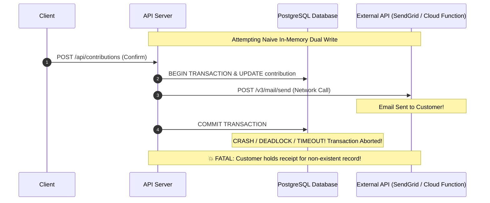
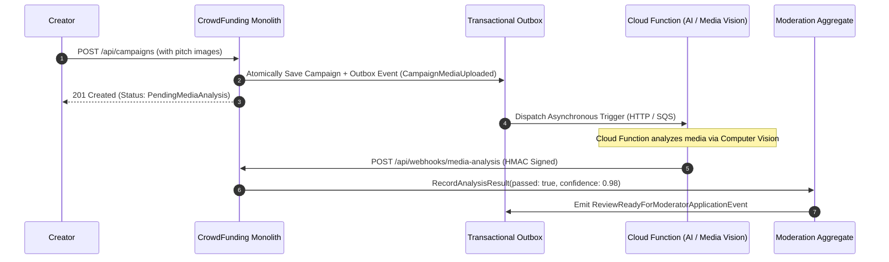

# Justifying the Outbox Pattern & Complex CRUD: Real-World External Integrations

> **Document Status:** Architectural Standard & Teaching Treatise  
> **Target Audience:** Principal Engineers, Enterprise Software Architects, Tech Leads  
> **Core Question:** *When is the Transactional Outbox pattern an absolute architectural necessity, and when is it over-engineering?*

---

## 1. The Core Architectural Dilemma

A common critique of Domain-Driven Design (DDD) and Clean Architecture in monolithic applications is **premature complexity**:
> *"Why are you writing events to an `outbox_messages` table and running a background worker with `FOR UPDATE SKIP LOCKED` just to save a record in the same PostgreSQL database that houses the other module?"*

When both caller and callee reside in the same physical database, an in-process transaction or direct database insert can accomplish the update with a fraction of the code and latency.

### The Invalidation of the Monolithic Assumption: External Side-Effects
The instant an application coordinates state transitions with **external systems that cannot participate in a PostgreSQL ACID transaction**, in-memory method calls and naive single-database transactions break down completely.

These external systems include:
1. **Transactional Email & SMS APIs** (SendGrid, AWS SES, Twilio).
2. **Serverless Cloud Functions / Serverless Workflows** (AWS Lambda, GCP Cloud Functions, Azure Functions) for asynchronous compute (e.g., AI moderation, video transcoding, malware scanning).
3. **Third-Party Payment Service Providers (PSPs)** (Stripe, Adyen, PayPal).
4. **Outbound Customer Webhooks** (Dispatching HMAC-signed events to creator third-party ERPs or platforms).
5. **Distributed Cloud Storage & Audit Data Warehouses** (Streaming immutable ledger events to AWS S3, GCP BigQuery, or Datadog).

---

## 2. The Dual-Write Hazard: Why In-Memory Integrations Mathematically Fail

Consider the naive implementation of sending a **Contribution Payment Receipt Email** or triggering a **Cloud Function** for malware analysis:

### Naive Anti-Pattern A: Calling the External API Before Committing the Database
```csharp
// ANTI-PATTERN: External call before DB commit
await _emailService.SendReceiptEmailAsync(backer.Email, contribution.Amount);
await _dbContext.SaveChangesAsync(); // <-- If this throws (DB deadlock, network crash, constraint violation)!
```
* **Failure Mode (Ghost Side-Effect):** The user receives a receipt email confirming their $1,000 pledge, but the database transaction was rolled back! The platform has no record of the contribution, creating customer support nightmares and audit reconciliation failures.

### Naive Anti-Pattern B: Calling the External API After Committing the Database
```csharp
// ANTI-PATTERN: External call after DB commit
await _dbContext.SaveChangesAsync();
await _emailService.SendReceiptEmailAsync(backer.Email, contribution.Amount); // <-- If this fails!
```
* **Failure Mode (Lost Side-Effect):** The database commit succeeds. The user was charged. But the web server dies, the email API drops the connection, or rate limits are hit. The email is lost forever with zero retry mechanism or durability.



---

## 3. Five Concrete Features That Unequivocally Justify the Outbox Pattern

To make `CrowdFundingHub` an indisputable reference for enterprise architects, the platform incorporates five production-grade features where the Outbox Pattern and rich DDD state machines are mathematically mandatory:

### Feature 1: Guaranteed Transactional Email Delivery (SendGrid / AWS SES)
* **The Business Need:** When a backer confirms a $500 contribution, or when a creator's campaign reaches its funding milestone, transactional emails must be delivered with guaranteed at-least-once reliability.
* **Why Outbox Is Mandatory:** Email APIs (SendGrid, Mailgun, AWS SES) are HTTP services prone to network jitter, timeouts, and throttling. Saving the `SendContributionReceiptNotification` command in the Outbox guarantees that the receipt is emitted atomically with the ledger balance update.
* **Resilience Mechanics:**
  - The background worker claims the outbox record using `FOR UPDATE SKIP LOCKED`.
  - The email client dispatches the email with idempotent client tokens (`X-Message-Id`).
  - Exponential backoff handles transient SMTP or HTTP 429 rate-limiting without blocking the user's HTTP request.

### Feature 2: Asynchronous Cloud Function Invocation (Media Safety & AI Moderation)
* **The Business Need:** When creators upload campaign story media (hero images, pitch videos, rich text), campaigns must undergo automated media safety and AI toxicity analysis before moderation approval.
* **Why Outbox Is Mandatory:** Running computer vision analysis, NSFW detection, or LLM copyright checks synchronously inside `POST /api/campaigns` adds 5–15 seconds of latency and risks HTTP gateway timeouts (Cloudflare / ALB 30s limits).
* **Architecture:**
  1. Creator submits campaign with image URLs.
  2. Transaction commits campaign in `PendingMediaAnalysis` state and writes `CampaignMediaUploadedApplicationEvent` to Outbox.
  3. Outbox worker invokes an **AWS Lambda or GCP Cloud Function** webhook.
  4. The Cloud Function executes asynchronously, processes the image, and calls back `POST /api/webhooks/media-analysis-result` with cryptographic HMAC validation.
  5. The callback transitions the review to `ReadyForHumanReview` or `AutoRejected`.



### Feature 3: Payment Gateway Intent & Webhook Reconciliation Saga (Stripe / Adyen)
* **The Business Need:** Modern payments do not complete in a single synchronous call. They involve Payment Intents, 3D Secure (3DS) biometric challenges, and asynchronous payment provider webhooks.
* **Why Outbox & Rich DDD Are Mandatory:**
  - Backer initiates pledge $\to$ `Contribution` aggregate created in `PendingPayment` state with a client secret.
  - User completes 3DS challenge on Stripe.
  - Stripe sends `payment_intent.succeeded` webhook to `POST /api/contributions/stripe-webhook`.
  - **The Race Hazard:** The webhook may arrive *before* the user's browser redirects back to the API!
  - **The Solution:** The `Contribution` aggregate enforces state machine invariants (`PendingPayment` $\to$ `Succeeded`). The webhook handler writes a `ProcessPaymentConfirmationCommand` to the outbox, ensuring idempotent ledger updates even if Stripe retries the webhook 5 times.

### Feature 4: Reward Perk Tier Allocation & Inventory Reservation (Rich DDD State Machine)
* **The Business Need:** A campaign offers "Early Bird" reward tiers (e.g. "Only 50 units available at $199").
* **Why Rich DDD & Optimistic Concurrency Are Mandatory:**
  - High concurrency: 500 backers attempt to claim 50 reward perks in the same second.
  - **Invariants:**
    1. Inventory count cannot be negative (`ClaimedCount <= Capacity`).
    2. A backer's reservation expires in 15 minutes if payment is not confirmed.
    3. If payment fails or expires, inventory must be atomically restored.
  - Requires PostgreSQL row versioning (`xmin` / concurrency tokens) and rich Domain Aggregates to reject over-subscription at the database engine level.

### Feature 5: Outbound Creator Webhook Engine with Cryptographic Signatures
* **The Business Need:** Third-party campaign creators (e.g. corporate fundraisers) configure webhook endpoints (`https://creator-crm.com/webhooks/donations`) to receive real-time updates when pledges are made.
* **Why Outbox Is Mandatory:**
  - Calling an untrusted external third-party URL inside a user-facing HTTP request thread exposes the monolith to **SSRF, denial-of-service, slow-loris connection hanging, and thread starvation**.
  - Writing the event to the outbox decouples the external call completely.
  - Dedicated outbox dispatchers sign the payload with `HMAC-SHA256` (`X-CrowdFunding-Signature`), handle DNS timeouts, and implement exponential retry backoff with dead-letter queueing.

---

## 4. Architectural Decision Matrix: When to Use the Outbox

To guide students and engineering teams, use this concrete rubric:

| Integration Type | Target Destination | Dual-Write Hazard? | Recommended Architectural Pattern | Justification |
| :--- | :--- | :---: | :--- | :--- |
| **Same Module Read/Write** | Same PostgreSQL Schema | ❌ No | **Direct EF Core / Dapper write** | Same ACID transaction. Zero indirection needed. |
| **Simple Cross-Module CRUD** | Same Database Instance | ❌ Minimal | **In-Transaction Call or Pragmatic CQRS** | Over-engineering to use an outbox if neither audit nor eventual consistency is required. |
| **External Email / SMS** | SendGrid / AWS SES / Twilio | 🔴 **CRITICAL** | **Mandatory Transactional Outbox** | Network failures cause lost receipts or ghost emails. |
| **Serverless Compute / AI** | AWS Lambda / GCP Cloud Function | 🔴 **CRITICAL** | **Mandatory Transactional Outbox** | Asynchronous long-running compute (5–30s) violates HTTP request SLAs. |
| **Payment Gateway Webhooks** | Stripe / Adyen / PayPal | 🔴 **CRITICAL** | **Transactional Outbox + Idempotency** | At-least-once webhook retries cause double-charging or balance corruption. |
| **External Webhooks / ERP** | Customer HTTP Endpoints | 🔴 **CRITICAL** | **Mandatory Transactional Outbox + DLQ** | External URLs may be slow, down, or malicious; must not block caller. |
| **Microservice Event Streaming** | Kafka / RabbitMQ | 🔴 **CRITICAL** | **Transactional Outbox or Debezium CDC** | Network partitions between DB and Message Broker cause state divergence. |

---

## 5. Summary for Architects

> **The Architectural Rule of Thumb:**  
> *If an operation's side effect can be rolled back by `dbTransaction.Rollback()`, keep it in the transaction. If the side effect reaches outside the database engine—across an HTTP socket, an SMTP connection, a cloud function, or a message broker—it MUST traverse a Transactional Outbox.*
