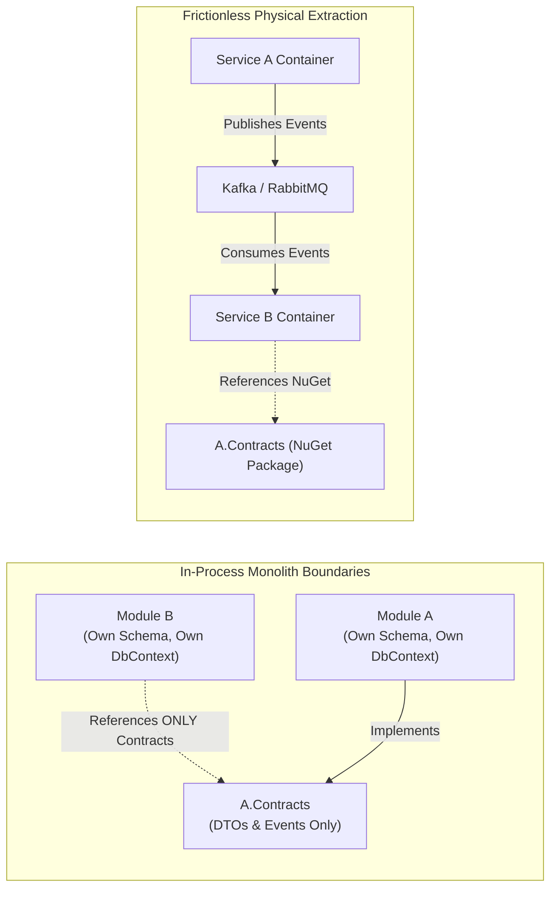
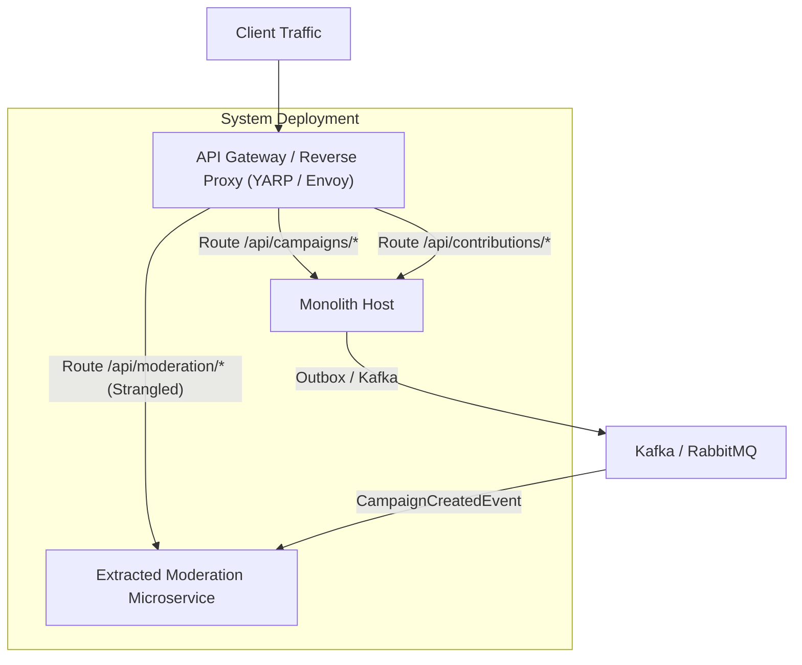

# The Blueprint: Designing Monoliths for Frictionless Microservices Decomposition

> **The Architectural Rule of Thumb:**  
> *"If you cannot build a clean, well-bounded Modular Monolith in a single process, you cannot build a successful Microservices system across a network. Distributed systems magnify every flaw in your boundary design by an order of magnitude."*

---

## 1. The Monolith-First Strategy (Why Monoliths Come First)

Decomposing a system into microservices too early introduces severe operational penalties:
- Distributed transactions (lack of ACID guarantees).
- Network latency and serialization overhead.
- Distributed tracing complexity and partial failure modes.
- Deployment choreography and version synchronization across teams.

The **Monolith-First Strategy** dictates that a system should be built as an **in-process Modular Monolith**, allowing the business domain and bounded contexts to stabilize rapidly. However, **the monolith must be engineered with the strict decoupling constraints of microservices**, so that when scale or team boundaries demand decomposition, services can be extracted with near-zero refactoring.



---

## 2. The 6 Non-Negotiable Architectural Prerequisites

To extract a microservice from a monolith without rewriting business logic, the monolithic architecture must adhere to **six core disciplines**:

### 1. Zero Direct Domain Coupling via Dedicated Contracts Assemblies
- **The Rule:** Module A (`Contributions`) must **never** reference the domain or infrastructure assemblies of Module B (`Campaigns`).
- **The Implementation:** Module B publishes a lightweight contract assembly (`CrowdFunding.Modules.Campaigns.Contracts.csproj`) containing **only**:
  - Request/Response DTO records.
  - Integration event records (`CampaignPublishedApplicationEvent`).
  - Read interfaces (`ICampaignContributionAvailabilityReader`).
- **Why It Matters for Microservices:** When extracting Module B into a microservice, `Campaigns.Contracts` is simply packed as a NuGet package (`dotnet pack`) and published to a private registry. Downstream consumers change their `<ProjectReference>` to a `<PackageReference>` with zero code edits!

### 2. Physical Database Schema Isolation (Schema-per-Module)
- **The Rule:** Each module must own a dedicated PostgreSQL schema (`identity`, `campaigns`, `contributions`, `moderation`).
- **The Implementation:** Each module has its own independent EF Core `DbContext` registered in its own infrastructure layer:
  ```csharp
  // In CampaignsDbContext
  modelBuilder.HasDefaultSchema("campaigns");
  ```
- **Why It Matters for Microservices:** In legacy monoliths, tables from different domains are lumped into `public`, and developers write cross-domain SQL joins. By isolating schemas:
  - Database migrations for Module A never collide with Module B.
  - Migrating to **Database-per-Service** is a physical operational task (`pg_dump` the `campaigns` schema and restore to a dedicated server), requiring **zero modifications to EF Core entity configurations**.

### 3. Absolute Elimination of Cross-Schema Database Foreign Keys
- **The Rule:** Foreign key constraints across module boundaries are strictly forbidden.
- **The Implementation:** In [`ContributionConfiguration.cs`](file:///Users/maysamgamini/maysam-brain/Maysam's%20Brain/projects/projects-active/crowdfunding/src/Modules/Contributions/CrowdFunding.Modules.Contributions.Infrastructure/Persistence/Configurations/ContributionConfiguration.cs):
  ```csharp
  // Stores primitive Guid scalar; NO foreign key to campaigns.campaigns table!
  builder.Property(x => x.CampaignId).IsRequired();
  builder.Property(x => x.ContributorId).IsRequired();
  ```
- **Why It Matters for Microservices:** A physical SQL foreign key constraint ties two tables to the same database engine. If `contributions` had a foreign key to `campaigns`, splitting PostgreSQL into two independent database servers would immediately fail.

### 4. Asynchronous Event-Driven Decoupling via the Transactional Outbox
- **The Rule:** Cross-module state changes must be propagated asynchronously via domain events, never through distributed transactions.
- **The Implementation:** When a payment confirms in `Contributions`, the event is saved to `contributions.contributions_outbox_messages` in the **same database transaction** as the entity mutation.
- **Why It Matters for Microservices:** Two-Phase Commit (2PC) does not scale and is unsupported across cloud databases. The outbox pattern guarantees **At-Least-Once Delivery** without dual-write race conditions. When extracted to microservices, the outbox table is tailed by Debezium to stream directly into Apache Kafka.

### 5. Asymmetric Cryptography (ES256 ECDSA + RFC 7517 JWKS Discovery)
- **The Rule:** Never use symmetric HMAC secrets (`HS256`) in an architecture intended for microservices.
- **The Implementation:** In [`JwksEndpoint.cs`](file:///Users/maysamgamini/maysam-brain/Maysam's%20Brain/projects/projects-active/crowdfunding/src/API/CrowdFunding.API/Security/JwksEndpoint.cs):
  - Identity issues JWTs signed with a private elliptic-curve key (NIST P-256 / ES256).
  - Public keys are published at standard `/.well-known/jwks.json`.
- **Why It Matters for Microservices:** If symmetric HMAC is used, extracting a service forces you to share the private secret string with every microservice. With ES256 and JWKS, extracted microservices download the public keys once, cache them, and **verify incoming user JWT tokens locally with zero network calls to the Identity service and zero knowledge of private keys**.

### 6. Automated Compile-Time Architecture Tests (`NetArchTest`)
- **The Rule:** Human code review cannot prevent architectural rot; boundary integrity must be automated in CI.
- **The Implementation:** In [`ModuleDependencyTests.cs`](file:///Users/maysamgamini/maysam-brain/Maysam's%20Brain/projects/projects-active/crowdfunding/tests/ArchitectureTests/CrowdFunding.ArchitectureTests/):
  ```csharp
  var result = Types.InAssembly(typeof(Campaign).Assembly)
      .ShouldNot()
      .HaveDependencyOnAny(
          "CrowdFunding.Modules.Contributions.Domain",
          "CrowdFunding.Modules.Identity.Domain",
          "CrowdFunding.Modules.Moderation.Domain")
      .GetResult();

  Assert.True(result.IsSuccessful);
  ```
- **Why It Matters for Microservices:** Guarantees that no developer accidentally introduces an illegal module dependency that would block service extraction later.

---

## 3. The Strangler Fig Extraction Pattern

When the time arrives to extract a module (e.g. `Moderation` or `Identity`), the architecture enables the **Strangler Fig Pattern** without system downtime:



1. **Step 1 (Standalone Host):** Create `CrowdFunding.Moderation.Service` referencing the existing `Moderation.Application` and `Moderation.Infrastructure` projects.
2. **Step 2 (Database Pointing):** Point `ModerationDbContext` to a dedicated PostgreSQL database container.
3. **Step 3 (Traffic Routing):** In the API Gateway (e.g., YARP), route `/api/moderation/*` to the new container. The monolith no longer handles moderation HTTP traffic.
4. **Step 4 (Async Ingestion):** The extracted moderation service consumes `CampaignCreated` events from the message broker instead of in-process dispatchers.
5. **Step 5 (Clean Up):** Remove `AddModerationInfrastructure` from the monolith's `Program.cs`.
