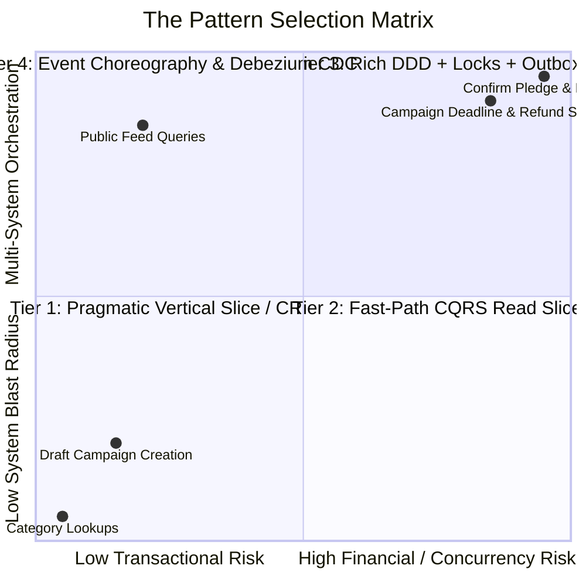
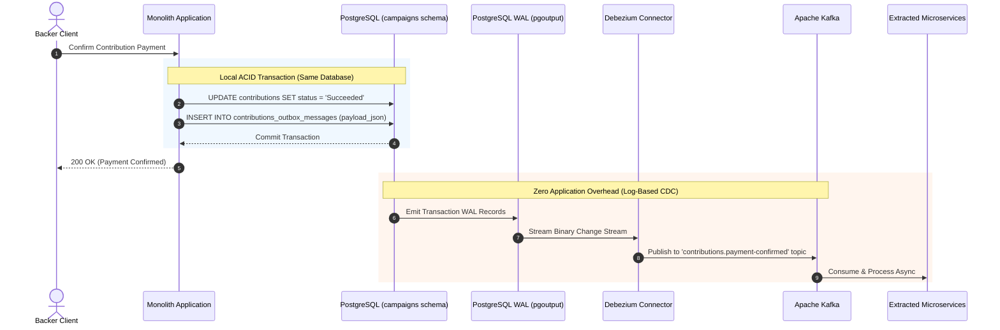

# Poly-Pattern Architecture: Pragmatism vs. Dogmatism in Enterprise Systems

> **Key Architectural Maxim:**  
> *"Symmetric architecture is an illusion. The mark of a Principal Architect is not the ability to enforce one pattern everywhere, but the wisdom to apply the simplest pattern that safely satisfies each feature's operational invariants."*

---

## 1. The Fallacy of Homogeneous Architecture

In software engineering pedagogy, courses often present a single architectural pattern—whether it is Clean Architecture, CQRS, or Domain-Driven Design (DDD)—and mandate that **every single feature in the system must strictly follow it**.

This dogmatic uniformity leads to catastrophic friction in real-world systems:
- A simple `POST /api/campaigns/categories` lookup requires 12 files, 3 DTO mappings, and an outbox queue.
- Developers spend 80% of their velocity maintaining empty abstractions for trivial CRUD logic.
- The engineering team becomes frustrated, declaring that *"Clean Architecture is slow and over-engineered"*, when in reality, **the misuse of the pattern was the failure.**

### The Reality of Modern Enterprise Systems
High-scale platforms (e.g., Shopify, Amazon, Stripe) are **intentionally heterogeneous**. They recognize that in any business application:
- **80% of the codebase** consists of low-risk, low-concurrency CRUD, lookups, and reporting queries.
- **20% of the codebase** represents the high-concurrency, mission-critical financial core where data corruption, lost updates, or double-spends would destroy the business.

Treating the 80% with the heavy ceremony of the 20% is **accidental complexity**.  
Treating the 20% with the naive simplicity of the 80% is **negligence**.

---

## 2. The 4-Tier Architectural Pattern Matrix

In a mature, decomposition-ready Modular Monolith, multiple established patterns live harmoniously side-by-side:



### Detailed Breakdown of the 4 Tiers

| Pattern Tier | Architectural Style | Core Technologies | When to Use (Business Scenarios) | Implementation Cost |
|---|---|---|---|:---:|
| **Tier 1: Pragmatic Vertical Slice** | Minimal API / Single-File Slice | Endpoint + FluentValidation + Direct `DbContext` | Creating a draft campaign, updating user profile, managing FAQs, administrative lookups. | 🟢 **Minimal (1 file)** |
| **Tier 2: Fast-Path CQRS Read Slice** | Direct Projection (Bypass Domain) | Dapper / EF Core `AsNoTracking()` + Redis Cache | Public campaign discovery feed, category listings, backer leaderboards, search filters. | 🟢 **Low (1-2 files)** |
| **Tier 3: Rich DDD Transactional Core** | Onion Clean Architecture + Aggregate Root | Domain Aggregates, Value Objects, `pg_advisory_xact_lock`, `xmin` tokens | Processing backer contributions, incrementing campaign funding balance, double-spend prevention. | 🟠 **High (10-12 files)** |
| **Tier 4: Event Choreography & CDC** | Transactional Outbox + Debezium / Kafka | Append-Only Outbox Table + PostgreSQL WAL CDC streaming | Payment confirmed $\rightarrow$ notify Campaigns, notify Notifications, notify Moderation, stream to analytics. | 🔴 **Advanced (Multi-Service)** |

---

## 3. Side-by-Side Code Contrast: Tier 1 vs. Tier 3

To teach students the difference between pragmatic simplicity and justified complexity, examine the exact same business entity under two different operations:

### Tier 1: Creating a Draft Campaign (Pragmatic Vertical Slice)
Creating a draft campaign has **zero concurrency competition**, **no money is moving**, and **no other service cares yet**. 

Using a 14-file pipeline here is architectural excess. A single-file Minimal API is the superior engineering choice:

```csharp
// src/Features/Campaigns/CreateDraftCampaignEndpoint.cs
namespace CrowdFunding.Features.Campaigns;

public static class CreateDraftCampaignEndpoint
{
    public record Request(string Title, string Story, string Category, decimal TargetAmount, string Currency, DateTime DeadlineUtc);
    public record Response(Guid Id, string Title, string Status);

    public class Validator : AbstractValidator<Request>
    {
        public Validator()
        {
            RuleFor(x => x.Title).NotEmpty().MaximumLength(200);
            RuleFor(x => x.Story).NotEmpty().MinimumLength(20).MaximumLength(5000);
            RuleFor(x => x.TargetAmount).GreaterThan(0);
            RuleFor(x => x.DeadlineUtc).GreaterThan(DateTime.UtcNow.AddDays(1));
        }
    }

    public static void Map(WebApplication app)
    {
        app.MapPost("/api/campaigns/drafts", async (
            Request req, 
            CampaignsDbContext db, 
            IValidator<Request> validator, 
            CancellationToken ct) =>
        {
            var validation = await validator.ValidateAsync(req, ct);
            if (!validation.IsValid) 
                return Results.ValidationProblem(validation.ToDictionary());

            var campaign = new Campaign(req.Title, req.Story, req.Category, req.TargetAmount, req.Currency, req.DeadlineUtc);
            db.Campaigns.Add(campaign);
            await db.SaveChangesAsync(ct);

            return Results.Created($"/api/campaigns/{campaign.Id}", new Response(campaign.Id, campaign.Title, campaign.Status.ToString()));
        })
        .RequireAuthorization("campaigns:create")
        .WithTags("Campaigns");
    }
}
```
- **Files Touched:** 1 file.
- **Cognitive Overhead:** Immediate comprehension.
- **Performance:** Direct EF Core pipeline without dispatcher overhead.

---

### Tier 3: Confirming a Contribution Payment (Rich DDD + Financial Invariants)
Conversely, when a backer's payment is confirmed by Stripe/Adyen:
1. Pledged funds must be credited to the campaign balance.
2. The campaign's raised amount cannot overflow or desync.
3. Concurrent payments to a viral campaign must be serialized to prevent lost updates.
4. An outbox event must be committed atomically to notify downstream services.

Here, **the 14-file pipeline is 100% justified**:

```csharp
// Inside Contributions Application & Domain
await _transactionExecutor.ExecuteAsync(async ct =>
{
    // 1. Acquire pessimistic PostgreSQL advisory lock on the campaign ID to serialize balance updates
    await dbContext.Database.ExecuteSqlRawAsync(
        "SELECT pg_advisory_xact_lock({0});", AdvisoryLockKey.FromResource(campaignId), ct);

    // 2. Load Aggregate Root & Enforce State Machine Invariants
    var contribution = await _contributionRepository.GetByIdAsync(contributionId, ct);
    contribution.ConfirmPayment(paymentReference, DateTime.UtcNow); // Mutates state to Succeeded

    // 3. Persist entity (optimistic concurrency token checked)
    await _contributionRepository.UpdateAsync(contribution, ct);

    // 4. Domain Event automatically captured and committed to Outbox table in the SAME transaction!
}, cancellationToken);
```
- **Files Touched:** Domain Aggregate, Repository, AdvisoryLockKey, OutboxMessage, Event Handler.
- **Why It's Justified:** Prevents financial loss, eliminates race conditions, and guarantees reliable downstream event delivery.

---

## 4. Debezium CDC vs. Polling Outbox: The Strategic Evolution

In an educational repository, the relationship between the **Transactional Outbox Table** and **Debezium Change Data Capture** must be clearly communicated:



### Why Debezium Changes the Educational Narrative
When students look at an `outbox_messages` table, their first question is: *"Why are we writing messages to a table instead of publishing directly to Kafka?"*

The answer is the **Dual-Write Problem**: If you save to the database and then call `await _kafkaProducer.ProduceAsync()`, the network can fail, the app can crash, or the database transaction can roll back after the message is sent.

By writing to the outbox table in the **same database transaction**:
1. In local development or early-stage monoliths, an **in-process poller** reads the table using `FOR UPDATE SKIP LOCKED`.
2. At scale, **Debezium** attaches to PostgreSQL's `pgoutput` logical replication slot, reading the exact same table directly from the Write-Ahead Log (WAL) and streaming to Kafka with **zero application query load and zero table updates**.

---

## 5. The Golden Rules of Poly-Pattern Monoliths

1. **Do not use a DDD Aggregate if there are no business invariants to protect.** An entity that only has getters and setters is an anemic data model—and that is completely fine for CRUD!
2. **Do not route queries through write repositories.** Queries should project directly from EF Core `AsNoTracking()` or Dapper to the response DTO.
3. **Only write events to the Outbox table if another bounded context or external microservice genuinely needs to react to them.**
4. **Enforce boundaries through namespaces and project references, not through layers of empty classes.**

---

## 6. This Isn't Hypothetical — Run It

The Tier 1 vs. Tier 3 contrast in Section 3 above is illustrative pseudocode. The real thing runs
in this repository: [`src/Samples/RosettaStone/`](../../src/Samples/RosettaStone/) implements
**the same business requirement — create a campaign with a title, story, and target amount —
three times**, as Tier 1 (Minimal API), Tier 2 (Pragmatic CQRS), and a pointer to the real Tier 3
(`POST /api/campaigns`), all mapped side by side under the `RosettaStone` Swagger tag when you
`dotnet run --project src/API/CrowdFunding.API`. Its `README.md` carries the honest,
`wc -l`-measured scorecard — files, lines, assemblies, and the two questions ("does another
module need to react reliably?", "can concurrent writes corrupt this row?") that decide which
tier a real feature belongs in, instead of dogma deciding it.
