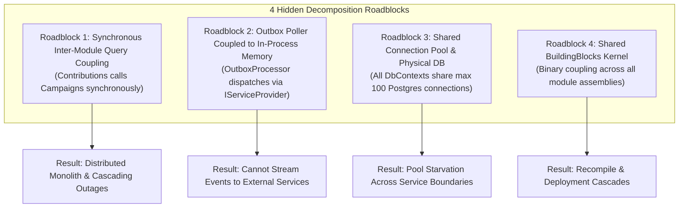
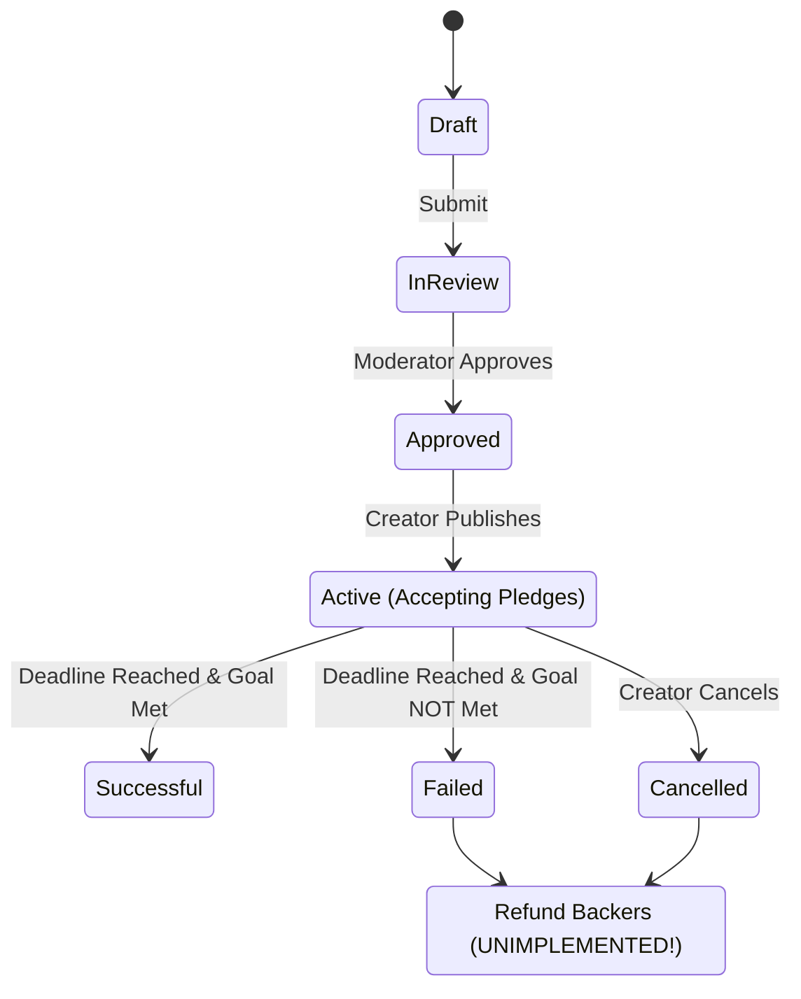

# The Under-Engineering Audit: Where We Didn't Go Far Enough

> **Curriculum Focus:** Hidden Architectural Traps & Incomplete Boundary Decoupling  
> **Key Lesson:** *"A monolith that feels clean in-process can still collapse into a fragile Distributed Monolith the moment you put a network between its modules."*

---

## 1. The 4 Hidden Microservice Decomposition Roadblocks

While `CrowdFundingHub` enforces excellent static boundary checks via `NetArchTest`, several **runtime patterns** currently lurking in the codebase would create severe friction during microservices extraction:



---

### Roadblock 1: Synchronous Inter-Module Query Coupling (The Cascading Failure Trap)

In [`MakeContributionCommandHandler.cs`](file:///Users/maysamgamini/maysam-brain/Maysam's%20Brain/projects/projects-active/crowdfunding/src/Modules/Contributions/CrowdFunding.Modules.Contributions.Application/Features/Contributions/Commands/MakeContribution/MakeContributionCommandHandler.cs#L42-L44):
```csharp
var campaignAvailability = await _campaignContributionAvailabilityReader
    .GetCampaignContributionAvailabilityAsync(
        new GetCampaignContributionAvailabilityQuery(command.CampaignId), 
        cancellationToken);
```

#### The Architectural Trap:
In the monolith, `_campaignContributionAvailabilityReader` executes an in-process query taking **0.2 milliseconds**.

When `Contributions` and `Campaigns` are separated into distinct microservices over a network:
1. This becomes a synchronous HTTP or gRPC call across the cluster.
2. If `Campaigns` suffers an outage, network partition, or deployment restart, `Contributions` **fails to accept pledges**.
3. Pledges are blocked by campaign read availability, violating autonomous service availability.

#### The Architectural Solution to Teach:
Replace synchronous RPC with **Asynchronous Replicated Read Models (Event-Carried State Transfer)**:
- The `Contributions` service subscribes to `CampaignPublishedApplicationEvent` and `CampaignCancelledApplicationEvent`.
- `Contributions` maintains a local, lightweight lookup table (`contributions.active_campaigns_cache`).
- When a contribution arrives, `Contributions` verifies campaign status against its **own local database**, achieving **100% autonomous uptime** even if the Campaigns service is down!

---

### Roadblock 2: Outbox Poller Coupled to In-Process Memory Dispatching

In [`OutboxProcessorBackgroundService.cs`](file:///Users/maysamgamini/maysam-brain/Maysam's%20Brain/projects/projects-active/crowdfunding/src/API/CrowdFunding.API/Background/OutboxProcessorBackgroundService.cs#L70):
```csharp
await _eventPublisher.PublishAsync(appEvent, stoppingToken);
```
The poller reads from PostgreSQL (`FOR UPDATE SKIP LOCKED`) and dispatches directly to `ServiceProviderEventPublisher`—which looks up handlers in the local DI container.

#### The Architectural Trap:
The outbox processor has no concept of an external message broker. Extracting a service requires rewriting the background service.

#### The Architectural Solution to Teach:
Introduce a pluggable **Message Bus Abstraction** (`IMessageBus`) or leverage MassTransit / Wolverine:
- In Monolith mode: Publishes to in-process memory.
- In Microservices mode: Publishes to RabbitMQ, Apache Kafka, or AWS SQS with a single configuration flag in `appsettings.json`.

---

### Roadblock 3: Shared PostgreSQL Host & Connection Pool Contention

All DbContexts (`CampaignsDbContext`, `ContributionsDbContext`, `IdentityDbContext`, `ModerationDbContext`) are registered in [`Program.cs`](file:///Users/maysamgamini/maysam-brain/Maysam's%20Brain/projects/projects-active/crowdfunding/src/API/CrowdFunding.API/Program.cs) using the exact same connection string.

#### The Architectural Trap:
Although schemas are isolated (`campaigns`, `contributions`, etc.), all modules share a single physical connection pool (default: 100 connections). A surge of pledges in `Contributions` will exhaust all available connections, starving authentication (`Identity`) and moderation queries.

#### The Architectural Solution to Teach:
Demonstrate independent connection string configurations per module, proving that each DbContext can point to a separate physical database container with zero code modifications:
```json
"ConnectionStrings": {
  "IdentityDb": "Host=identity-db;Database=identity;...",
  "CampaignsDb": "Host=campaigns-db;Database=campaigns;...",
  "ContributionsDb": "Host=contributions-db;Database=contributions;..."
}
```

---

### Roadblock 4: The Shared `BuildingBlocks` Kernel Trap

All modules reference `CrowdFunding.BuildingBlocks.Application.csproj`.

#### The Architectural Trap:
In microservices, sharing a monolithic "Common" or "BuildingBlocks" library causes **binary coupling**. When Team A changes a shared interface, Teams B, C, and D are forced to recompile, test, and synchronize deployments.

#### The Architectural Solution to Teach:
Teach the difference between:
- **Shared Utilities** (generic pagination, clock abstractions) $\rightarrow$ Distributed as versioned internal NuGet packages.
- **Domain Concepts** $\rightarrow$ Duplicated or independently modeled in each bounded context (Share Nothing Architecture).

---

## 2. Incomplete Crowdfunding Domain Lifecycle

The most significant functional blind spot in the codebase is the **unimplemented "All-or-Nothing" crowdfunding lifecycle**:



### The Missing Workflows:
1. **Automated Campaign Expiration Background Worker:**
   - There is no background service checking `DeadlineUtc <= DateTime.UtcNow`. Campaigns stay `Active` forever unless manually cancelled.
2. **Backer Refund State Machine:**
   - In `Contribution.cs`, the state machine only supports `Pending`, `Succeeded`, and `Failed`. **There is no `Refunded` state**.
   - If a campaign fails or is cancelled, backers are never refunded.

### Pedagogical Impact:
The single best real-world demonstration of **Sagas, Event Choreography, and Compensating Transactions** in a microservice system is the **Crowdfunding Refund Workflow**:
- `Campaigns` service emits `CampaignFailedEvent`.
- `Contributions` service consumes event, loads all confirmed pledges, mutates state to `RefundInitiated`, and dispatches commands to the payment gateway.
- Payment gateway webhook confirms refund $\rightarrow$ contribution transitions to `Refunded`.

Leaving this unimplemented deprives architects of seeing how distributed sagas handle eventual consistency in failure scenarios!
