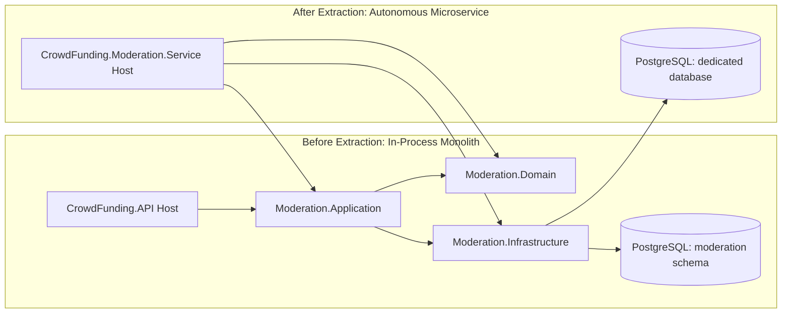

# Deconstruction Walkthrough: Extracting a Microservice in 5 Steps

> **Curriculum Runbook:** Live Extraction Exercise for Principal Engineers & Architects  
> **Objective:** Walk through the physical extraction of the `Moderation` module from the in-process Monolith into an autonomous, containerized microservice (`CrowdFunding.Moderation.Service`) with **zero lines of domain logic rewritten**.

---

## 1. The Starting State vs. Target State



---

## 2. Step 1: Scaffold the Standalone Web Service Host

Create the new web API project in `src/Services/`:
```bash
dotnet new web -n CrowdFunding.Moderation.Service -o src/Services/CrowdFunding.Moderation.Service
```

Add references to the existing module layers:
```xml
<!-- src/Services/CrowdFunding.Moderation.Service/CrowdFunding.Moderation.Service.csproj -->
<ItemGroup>
  <ProjectReference Include="..\..\Modules\Moderation\CrowdFunding.Modules.Moderation.Application\CrowdFunding.Modules.Moderation.Application.csproj" />
  <ProjectReference Include="..\..\Modules\Moderation\CrowdFunding.Modules.Moderation.Infrastructure\CrowdFunding.Modules.Moderation.Infrastructure.csproj" />
  <ProjectReference Include="..\..\Modules\Moderation\CrowdFunding.Modules.Moderation.Contracts\CrowdFunding.Modules.Moderation.Contracts.csproj" />
  <ProjectReference Include="..\..\BuildingBlocks\CrowdFunding.BuildingBlocks.Application\CrowdFunding.BuildingBlocks.Application.csproj" />
  <ProjectReference Include="..\..\BuildingBlocks\CrowdFunding.BuildingBlocks.Infrastructure\CrowdFunding.BuildingBlocks.Infrastructure.csproj" />
</ItemGroup>
```

---

## 3. Step 2: Configure Dependency Injection & JWT Verification

In `src/Services/CrowdFunding.Moderation.Service/Program.cs`:
Because the system uses **asymmetric ES256 tokens and JWKS**, the new Moderation service does **not** need access to the Identity database! It simply points its JWT Bearer middleware to the monolith's JWKS endpoint:

```csharp
var builder = WebApplication.CreateBuilder(args);

// 1. Register Module Core
builder.Services.AddModerationApplication();
builder.Services.AddModerationInfrastructure(builder.Configuration);

// 2. Configure Asymmetric JWT Authentication via JWKS Discovery
builder.Services.AddAuthentication("Bearer")
    .AddJwtBearer(options =>
    {
        options.Authority = builder.Configuration["Auth:Authority"]; // e.g. http://identity-service:8080
        options.MetadataAddress = $"{builder.Configuration["Auth:Authority"]}/.well-known/jwks.json";
        options.RequireHttpsMetadata = false;
        options.TokenValidationParameters = new TokenValidationParameters
        {
            ValidateIssuer = true,
            ValidIssuer = "CrowdFundingHub",
            ValidateAudience = false,
            ValidateLifetime = true
        };
    });

builder.Services.AddAuthorization();
builder.Services.AddControllers();

var app = builder.Build();

app.UseAuthentication();
app.UseAuthorization();
app.MapControllers();

app.Run();
```

---

## 4. Step 3: Physical Database Splitting (Database-per-Service)

Because the monolith used **schema-per-module** with **zero cross-schema foreign keys**, splitting the database is a pure operational task:

1. **Dump the moderation schema from the monolith database:**
   ```bash
   pg_dump -h localhost -U postgres -d crowdfundingdb --schema=moderation -F c -b -v -f moderation_schema.dump
   ```
2. **Restore into the dedicated Moderation database server:**
   ```bash
   pg_restore -h moderation-db -U postgres -d moderation_db -v moderation_schema.dump
   ```
3. **Update `appsettings.json` in the new Moderation Service:**
   ```json
   {
     "ConnectionStrings": {
       "ModerationDb": "Host=moderation-db;Port=5432;Database=moderation_db;Username=postgres;Password=postgres;"
     }
   }
   ```

---

## 5. Step 4: Switch Outbox from In-Process to Message Broker (Kafka / RabbitMQ)

In the monolith, `CampaignCreatedApplicationEvent` was polled in-process. In the microservices topology:
1. The **Monolith** (or Campaigns microservice) publishes `CampaignCreated` to a RabbitMQ exchange or Kafka topic `campaigns.events`.
2. The **Moderation Service** registers a MassTransit consumer:
   ```csharp
   public class CampaignCreatedConsumer : IConsumer<CampaignCreatedApplicationEvent>
   {
       private readonly ICommandDispatcher _dispatcher;
       public CampaignCreatedConsumer(ICommandDispatcher dispatcher) => _dispatcher = dispatcher;

       public async Task Consume(ConsumeContext<CampaignCreatedApplicationEvent> context)
       {
           await _dispatcher.DispatchAsync(
               new CreateCampaignReviewCommand(context.Message.CampaignId), 
               context.CancellationToken);
       }
   }
   ```

---

## 6. Step 5: Route Traffic via API Gateway (Strangler Fig)

In the edge reverse proxy (YARP in the API host or Envoy / Kong):
Route all traffic matching `/api/moderation/*` to the new independent container:

```json
// YARP Configuration in Gateway
"ReverseProxy": {
  "Routes": {
    "moderation-route": {
      "ClusterId": "moderation-cluster",
      "Match": {
        "Path": "/api/moderation/{**catch-all}"
      }
    }
  },
  "Clusters": {
    "moderation-cluster": {
      "Destinations": {
        "destination1": {
          "Address": "http://moderation-service:8080"
        }
      }
    }
  }
}
```

---

## 7. The Deconstruction Scorecard

```
┌─────────────────────────────────────────────────────────────────────────────┐
│ EXTRACTION METRICS:                                                         │
│ - Domain Logic Rewritten:                 0 lines                           │
│ - Aggregate Invariants Altered:           0 lines                           │
│ - Repository / Query SQL Altered:         0 lines                           │
│ - System Downtime Required:               0 seconds (Strangler Fig pattern) │
│ - Token Validation Rework:                0 (Leveraged Asymmetric JWKS)     │
└─────────────────────────────────────────────────────────────────────────────┘
```
**Conclusion:** The upfront architectural discipline of schema isolation, `.Contracts` boundaries, and asymmetric cryptography pays off completely at the moment of decomposition.
