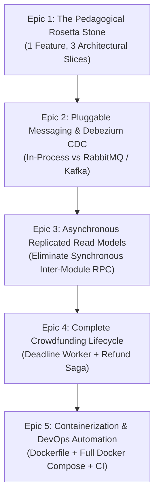

# Engineering Specification: Transforming the Monolith into a Benchmark Educational Reference

> **Document Status:** Ready for Sprint Planning & Implementation  
> **Target Audience:** Core Engineering Team, Principal Architects  
> **Objective:** Concrete technical specifications to transform `CrowdFundingHub` into the industry-gold-standard reference for **Monoliths Built for Frictionless Microservices Decomposition**.

---

## 1. Specification Overview & Epics



---

## 2. Epic 1: The Pedagogical Rosetta Stone (Status: ✅ Completed via [`TICKET-028`](../../qa-tickets/TICKET-028-PEDAGOGICAL-ROSETTA-STONE-POLY-PATTERNS.md))

### Problem Statement:
Learners cannot intuitively understand *why* Clean Architecture or DDD is necessary because there is no baseline comparison in the codebase.

### Technical Specification:
Create a dedicated educational namespace: `src/Samples/RosettaStone/` implementing the **same exact feature** (`CreateCampaign`) in **three distinct architectural styles**:

```
src/Samples/RosettaStone/
├── 01-MinimalApiCrud/
│   └── CreateCampaignMinimalEndpoint.cs (Direct DbContext write, 1 file, 48 lines)
├── 02-PragmaticCqrs/
│   ├── CreateCampaignEndpoint.cs        (Route endpoint)
│   ├── CreateCampaignCommand.cs         (CQRS command + validator)
│   └── CreateCampaignCommandHandler.cs  (Direct DbContext write, 3 files, 91 lines)
└── 03-RichDomainModel/
    └── README.md                        (Pointer to full production 14-file DDD pipeline)
```

> [!NOTE]
> Fully implemented in [`src/Samples/RosettaStone/`](file:///Users/maysamgamini/maysam-brain/Maysam's%20Brain/projects/projects-active/crowdfunding/src/Samples/RosettaStone/README.md) with isolated `rosetta` schema, parity integration tests, and Swagger tag `RosettaStone`.

---

## 3. Epic 2: Pluggable Message Bus & Debezium CDC Specification (Status: ✅ Completed via [`TICKET-024`](../../qa-tickets/TICKET-024-PLUGGABLE-MESSAGE-BUS-RABBITMQ-KAFKA.md) & [`TICKET-025`](../../qa-tickets/TICKET-025-MODULAR-OUTBOX-PARTITIONING-AUTONOMOUS-WORKERS.md))

### Problem Statement:
The transactional outbox poller is hardcoded to in-memory dispatching (`ServiceProviderEventPublisher`), preventing students from seeing how events stream to external microservices.

### Technical Specification:
1. Define a unified `IMessageBus` interface in `BuildingBlocks.Application`:
   ```csharp
   public interface IMessageBus
   {
       Task PublishAsync<TEvent>(TEvent @event, CancellationToken cancellationToken = default) 
           where TEvent : IApplicationEvent;
   }
   ```
2. Provide two interchangeable implementations:
   - `InProcessMessageBus`: Dispatches via `IServiceProvider` (default for local development).
   - `RabbitMqMessageBus` or `KafkaMessageBus`: Uses MassTransit to serialize CloudEvents v1.0 to an external broker.
3. Configure `appsettings.json` toggle:
   ```json
   "Messaging": {
     "Provider": "InProcess", // Options: "InProcess", "RabbitMQ", "DebeziumCDC"
     "RabbitMqHost": "rabbitmq://localhost"
   }
   ```
4. **Debezium CDC Mode:** Add an `unlogged` or append-only mode where the outbox background service is disabled entirely, and a Debezium connector configuration JSON is provided in `docker/debezium/`.

---

## 4. Epic 3: Asynchronous Replicated Read Models (Status: ✅ Completed via [`TICKET-023`](../../qa-tickets/TICKET-023-ASYNCHRONOUS-REPLICATED-READ-MODELS.md))

### Problem Statement:
[`MakeContributionCommandHandler.cs`](file:///Users/maysamgamini/maysam-brain/Maysam's%20Brain/projects/projects-active/crowdfunding/src/Modules/Contributions/CrowdFunding.Modules.Contributions.Application/Features/Contributions/Commands/MakeContribution/MakeContributionCommandHandler.cs) calls `ICampaignContributionAvailabilityReader` synchronously, creating a distributed monolith failure cascade.

### Technical Specification:
1. In `contributions` schema, create a new table:
   ```sql
   CREATE TABLE contributions.campaign_read_models (
       campaign_id UUID PRIMARY KEY,
       currency VARCHAR(3) NOT NULL,
       is_active BOOLEAN NOT NULL,
       deadline_utc TIMESTAMP WITH TIME ZONE NOT NULL,
       updated_at_utc TIMESTAMP WITH TIME ZONE NOT NULL
   );
   ```
2. In `Contributions.Application`, add event consumers for:
   - `CampaignPublishedApplicationEvent` $\rightarrow$ Inserts/updates `campaign_read_models`.
   - `CampaignCancelledApplicationEvent` $\rightarrow$ Marks `is_active = false`.
3. In `MakeContributionCommandHandler`, query `campaign_read_models` locally in the `ContributionsDbContext`.
4. **Outcome:** Zero synchronous cross-module RPC calls during pledge processing!

> [!NOTE]
> Fully implemented in the `Contributions` module. Synchronous query reader `ICampaignContributionAvailabilityReader` has been completely eliminated.

---

## 5. Epic 4: Complete Crowdfunding Lifecycle (Deadlines & Refunds) (Status: ✅ Completed via [`TICKET-027`](../../qa-tickets/TICKET-027-DISTRIBUTED-CROWDFUNDING-LIFECYCLE-REFUND-SAGA.md))

### Problem Statement:
Campaigns never complete or fail, and backer pledges cannot be refunded, leaving the core crowdfunding domain half-finished.

### Technical Specification:

#### 1. Background Worker: `CampaignExpirationBackgroundService`
- Runs in `src/API/CrowdFunding.API/Background/`.
- Executes every 60 seconds (configurable).
- Queries:
  ```csharp
  var expiredCampaigns = await db.Campaigns
      .Where(c => c.Status == CampaignStatus.Published && c.DeadlineUtc <= DateTime.UtcNow)
      .ToListAsync(ct);
  ```
- For each expired campaign:
  - If `CurrentBalance >= TargetAmount`: Dispatches `CompleteCampaignCommand` $\rightarrow$ transitions to `Successful` $\rightarrow$ emits `CampaignSucceededApplicationEvent`.
  - If `CurrentBalance < TargetAmount`: Dispatches `FailCampaignCommand` $\rightarrow$ transitions to `Failed` $\rightarrow$ emits `CampaignFailedApplicationEvent`.

#### 2. Refund Workflow in Contributions:
- Add `Refunded` to `ContributionStatus` enum.
- Add `ContributionRefundedDomainEvent`.
- When `CampaignFailedApplicationEvent` or `CampaignCancelledApplicationEvent` arrives:
  - Contributions module loads all `Succeeded` contributions for the campaign.
  - Iterates and executes refund commands.
  - Updates contribution status to `Refunded`.
  - Publishes `ContributionRefundedApplicationEvent`.

> [!NOTE]
> Fully implemented with `CampaignExpirationBackgroundService`, `CampaignCompletedSuccessfulDomainEvent`, `CampaignExpiredFailedDomainEvent`, and `RefundContributionCommandHandler`.

---

## 6. Epic 5: Containerization & DevOps Automation (Status: 🔄 In Progress - Tracked via [`TICKET-029`](../../qa-tickets/TICKET-029-MICROSERVICE-EXTRACTION-POC-STANDALONE-SERVICE.md) & [`TICKET-040`](../../qa-tickets/TICKET-040-ARCHITECTURAL-FITNESS-FUNCTIONS-CI-CD-AUTOMATION.md))

### Problem Statement:
The repository requires manual local SDK setup and lacks containerized deployment artifacts and CI/CD pipelines.

### Technical Specification:
1. **Multi-Stage API Dockerfile (`src/API/CrowdFunding.API/Dockerfile`)**:
   - Stage 1: `mcr.microsoft.com/dotnet/sdk:10.0-alpine` (Restore & Build with caching).
   - Stage 2: `mcr.microsoft.com/dotnet/aspnet:10.0-alpine` (Lightweight non-root runtime container).
2. **Comprehensive `docker-compose.yml`**:
   - `api`: The CrowdFunding API host (ports 8080/8081).
   - `postgres`: PostgreSQL 16 with logical decoding enabled (`wal_level = logical`).
   - `redis`: Redis 7 Alpine cache.
   - `rabbitmq`: RabbitMQ 3.13 Management console (port 15672).
   - `debezium`: Debezium Connect container tailing Postgres WAL.
3. **GitHub Actions Workflow (`.github/workflows/ci.yml`)**:
   - Runs on push to `main` and all Pull Requests.
   - Steps: `dotnet restore` $\rightarrow$ `dotnet build --no-restore` $\rightarrow$ `dotnet test --collect:"XPlat Code Coverage"` $\rightarrow$ Assert 0 warnings and 0 errors.
