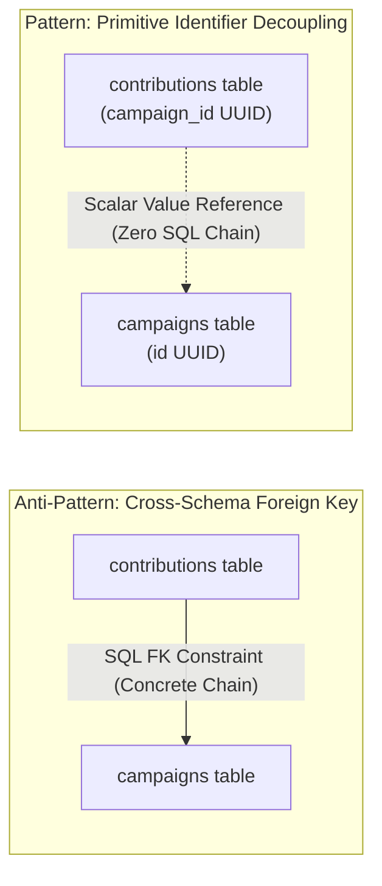
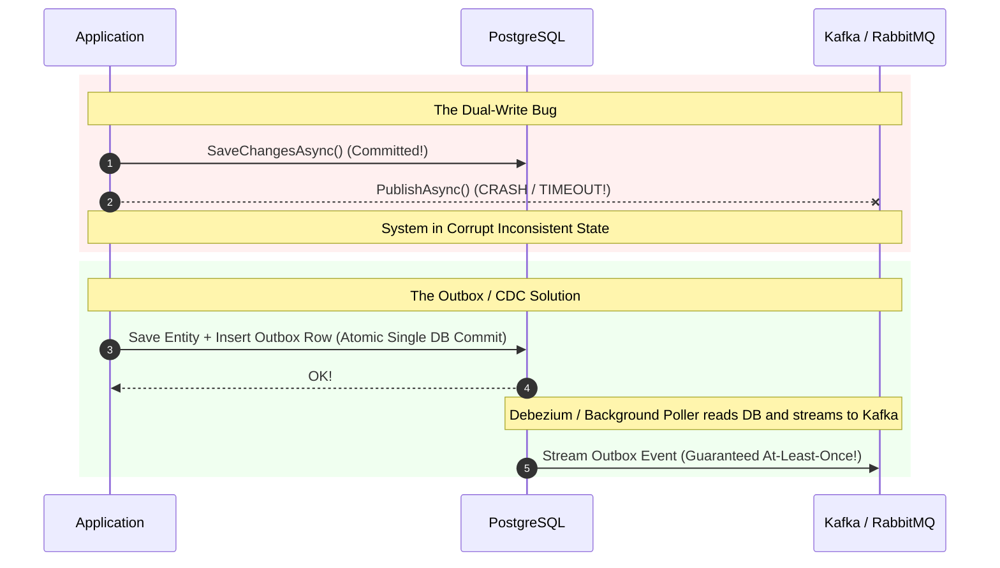
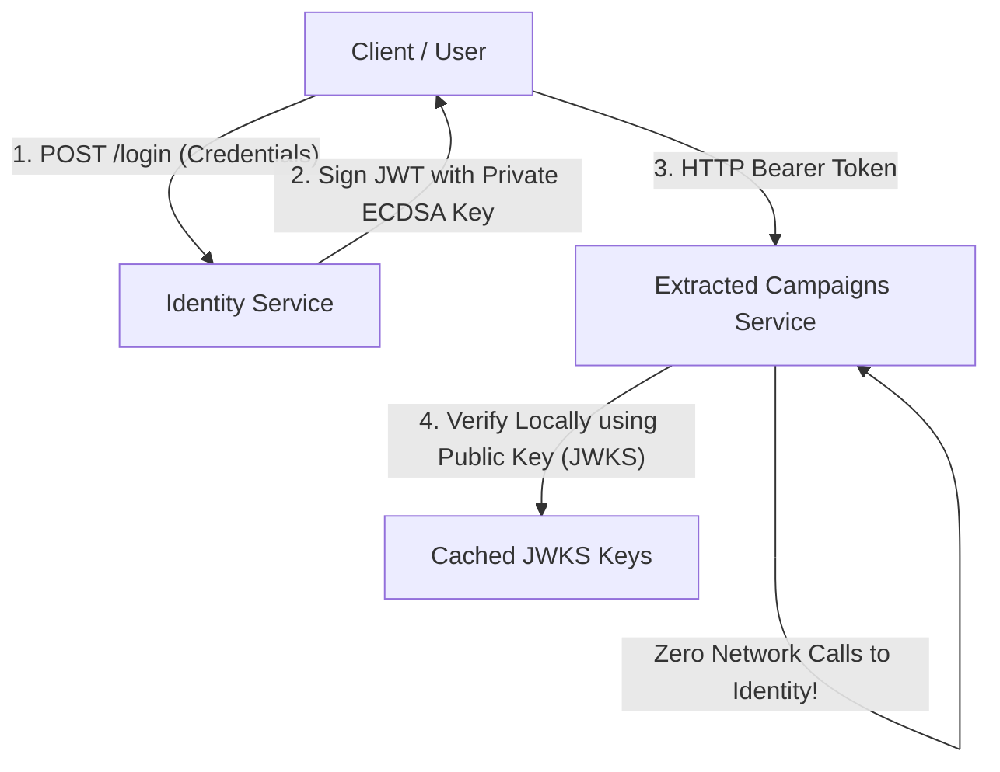

# Architect's Gold Notes: Core Mental Models for Students & Tech Leads

> **Curriculum Artifact:** High-Impact Mental Models, Architectural Maxims, and Diagrammatic Thinking  
> **Target Audience:** Students, Tech Leads, Principal Architects  

---

## 1. "Coupling Is the Enemy, Not the Monolith"

Many engineering teams believe that decomposing an application into microservices will magically solve their architectural problems.

**The Golden Law:**  
> *"If you take a tangled monolith and distribute it across network boundaries, you do not get microservices. You get a Distributed Monolith—which combines all the complexity of distributed systems with all the brittleness of tight coupling."*

```
     Tangled In-Process Monolith
                 │
      [Split across network without fixing boundaries]
                 ▼
     Fragile Distributed Monolith
     (Cascading timeouts, partial failures, distributed deadlocks)
```

The goal of architecture is **low coupling and high cohesion**. You can achieve low coupling inside a single executable.

---

## 2. "Database Foreign Keys Are Concrete Chains"

When engineers design relational databases in a monolith, their instinct is to link everything with SQL foreign keys:
`contributions.campaign_id` $\rightarrow$ `campaigns.campaigns.id`.



**Why This Is a Golden Rule:**
A SQL foreign key constraint requires both tables to live in the **same database engine**. It permanently locks your data models together.
- In a decomposition-ready architecture, **never write a cross-boundary foreign key**. Store the target entity's ID as a primitive scalar (`Guid CampaignId`).
- Let domain logic and application events enforce consistency across boundaries.

---

## 3. "The Dual-Write Fallacy & The Outbox/CDC Shield"

Every software engineer eventually tries to write this code:
```csharp
// THE DUAL-WRITE DISASTER
await dbContext.SaveChangesAsync(); // Step 1: Write to Database
await kafkaProducer.PublishAsync(event); // Step 2: Publish to Broker
```

### Why This Fails in Production:
1. **Network Crash:** Step 1 commits, but the network to Kafka drops. The database changed, but the rest of the world never hears about it.
2. **App Crash:** The machine loses power between Step 1 and Step 2.
3. **Database Rollback:** Step 2 fires, but Step 1 rolls back due to a transaction conflict. The event was published for an action that never happened!



**The Golden Law:**  
> *"You cannot achieve atomic consistency across two independent storage systems without Two-Phase Commit (which you do not want) or the Transactional Outbox Pattern / Change Data Capture (which you do want)."*

---

## 4. "Symmetric Architecture Is an Illusion (The 80/20 Rule)"

Never force an entire codebase into a single rigid mold.

```
┌─────────────────────────────────────────────────────────────────────────────┐
│ THE 80/20 RULE OF ENTERPRISE ARCHITECTURE:                                  │
│                                                                             │
│ [80% Low-Risk CRUD & Queries]            [20% High-Risk Transactional Core] │
│ - Draft creation, user bio, lookups      - Pledges, ledger balances, refunds│
│ - Pattern: Minimal API / Fast Slices     - Pattern: Rich DDD + Locks + CDC  │
│ - Focus: Velocity & Low Indirection      - Focus: Financial Invariants      │
└─────────────────────────────────────────────────────────────────────────────┘
```

A Principal Architect knows that **forcing a 14-file DDD pipeline onto a lookup table is just as incompetent as using raw inline SQL for a high-concurrency ledger balance update.**

---

## 5. "Asymmetric Cryptography: Sign Centrally, Verify Locally"

In microservices and modular monoliths, authentication must scale horizontally without bottlenecking on the identity database:



**The Golden Law:**  
> *"With symmetric keys (HS256), every service must hold the master secret. With asymmetric keys (ES256), the private key never leaves the Identity service. All other services verify tokens offline using public keys from `/.well-known/jwks.json`."*

---

## 6. "Event-Carried State Transfer vs. Synchronous RPC"

When Service B needs data from Service A:

| Approach | Mechanics | Coupling Level | Availability Impact |
|---|---|:---:|---|
| **Synchronous RPC (HTTP/gRPC)** | Service B calls `GET /api/serviceA/{id}` on every incoming request. | 🔴 **High (Temporal Coupling)** | If Service A is down, **Service B goes down too**. |
| **Event-Carried State Transfer** | Service A publishes `EntityUpdatedEvent`. Service B consumes it and maintains a local cache. | 🟢 **Zero (Autonomous)** | Service B handles requests locally with **100% uptime**, even if Service A is completely offline. |

---

## 7. The 10 Commandments of Decomposition-Ready Architecture

1. **Thou shalt not reference another module's domain assembly.**
2. **Thou shalt communicate across module boundaries exclusively through contract DTOs and integration events.**
3. **Thou shalt isolate database tables into schemas per module.**
4. **Thou shalt never declare a SQL foreign key across schema boundaries.**
5. **Thou shalt never dual-write to a database and a message broker in the same operation.**
6. **Thou shalt sign tokens with asymmetric cryptography and publish public keys via JWKS.**
7. **Thou shalt not route queries through write repositories; project directly from data to DTO.**
8. **Thou shalt right-size each vertical slice: keep simple CRUD simple, and save heavy DDD for mission-critical aggregates.**
9. **Thou shalt automate boundary enforcement in CI via architecture unit tests (`NetArchTest`).**
10. **Thou shalt design systems so that extracting a microservice requires zero lines of business logic rewritten.**
