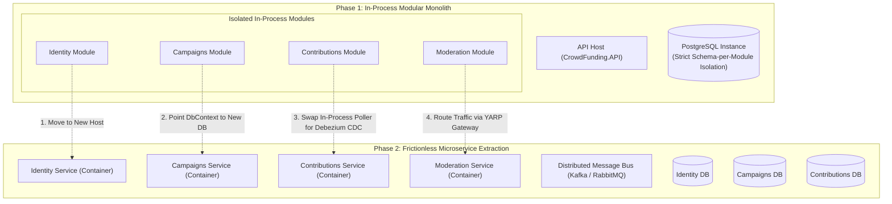

# The Architect's Guide: Designing Modular Monoliths for Frictionless Microservices Decomposition

> **Curriculum Level:** Principal Engineer, Software Architect, Tech Lead  
> **Reference Implementation:** `CrowdFundingHub` (.NET 10 / C# 14 / PostgreSQL 16)  
> **Core Thesis:** *Build a Monolith first, but design it with the strict modular discipline, data boundaries, and cryptographic decoupling required to slice off microservices without rewriting business logic.*

---

## 1. Executive Summary & Curriculum Vision

Most microservices migrations fail not because distributed systems are inherently flawed, but because **the monolith was never architected for decomposition**. When organizations attempt to break apart a typical legacy monolith, they encounter:
1. **Shared Database Tables & Cross-Schema SQL Joins**: Tangling domain models so tightly that separating databases causes massive operational regressions.
2. **Synchronous In-Process Coupling**: Hundreds of hidden, synchronous in-memory calls that turn into cascading HTTP timeouts and distributed deadlocks when converted to network hops.
3. **Dual-Write Inconsistencies**: Naive in-memory events (`IMediator.Publish`) that fail to guarantee atomicity between local database writes and distributed message brokers.
4. **Symmetric Secret Sprawl**: Symmetric HMAC JWT tokens requiring every extracted service to share the same master encryption key.

This educational curriculum and reference codebase provide the **definitive, production-tested blueprint** for designing an in-process **Modular Monolith** that is physically prepared for microservices decomposition from Day 1.



---

## 2. Curriculum Directory & Specification Index

This directory is organized into four thematic areas serving both as **teaching materials for architects** and as a **concrete engineering development specification**:

### [01. Architecture Paradigms](./01-architecture-paradigms/)
- **[`poly-pattern-architecture.md`](./01-architecture-paradigms/poly-pattern-architecture.md)**:  
  *Architectural Pragmatism vs. Dogmatism.* Why homogeneous architecture is an anti-pattern. Demonstrates how to balance 4 distinct architectural patterns in the same application (Simple CRUD Minimal APIs, Fast-Path CQRS Read Slices, Rich DDD Financial Aggregates, and Debezium CDC Event Choreography).
- **[`monolith-to-microservices-blueprint.md`](./01-architecture-paradigms/monolith-to-microservices-blueprint.md)**:  
  The 6 non-negotiable architectural prerequisites for zero-rewrite microservice extraction: Contract Assemblies, Schema Isolation, Zero Cross-Schema Foreign Keys, Transactional Outbox, Asymmetric JWKS Edge Verification, and NetArchTest Guardrails.

### [02. Gap Analysis & Architectural Trade-offs](./02-gap-analysis-and-tradeoffs/)
- **[`over-engineering-audit.md`](./02-gap-analysis-and-tradeoffs/over-engineering-audit.md)**:  
  *Where Did We Go Too Far?* An unsparing critique of accidental complexity: 29 projects, the "14-file pipeline" for simple inserts, triple-mapping ceremony, and hand-rolled cryptographic key stores.
- **[`under-engineering-audit.md`](./02-gap-analysis-and-tradeoffs/under-engineering-audit.md)**:  
  *Where Didn't We Go Far Enough?* The hidden microservice decomposition roadblocks: synchronous cross-module query coupling (`ICampaignContributionAvailabilityReader`), in-memory outbox poller coupling, physical database connection pool contention, and incomplete crowdfunding lifecycle rules (missing refunds and expiration workers).

### [03. Engineering Specifications & Roadmap](./03-engineering-spec-and-roadmap/)
- **[`transformation-spec.md`](./03-engineering-spec-and-roadmap/transformation-spec.md)**:  
  Concrete, sprint-ready engineering specification to evolve this codebase into the ultimate educational benchmark (Rosetta Stone comparative slices, pluggable `IMessageBus`, replicated read models, and containerization).
- **[`deconstruction-walkthrough.md`](./03-engineering-spec-and-roadmap/deconstruction-walkthrough.md)**:  
  Step-by-step engineering runbook showing how to extract the `Moderation` module into a standalone Dockerized microservice with zero lines of business logic rewritten.

### [04. Architect's Gold Notes](./04-architect-gold-notes/)
- **[`key-mental-models-for-students.md`](./04-architect-gold-notes/key-mental-models-for-students.md)**:  
  High-impact mental models, diagrams, and timeless maxims worth teaching to principal engineers and students (e.g., *"Coupling is the enemy, not the monolith"*, *"Database foreign keys are concrete chains"*, *"Event-Carried State Transfer vs. Synchronous RPC"*).

---

## 3. The 3 Core Tenets of the Curriculum

```
┌─────────────────────────────────────────────────────────────────────────────┐
│ 1. PRAGMATISM OVER DOGMATISM (POLY-PATTERN ARCHITECTURE)                   │
│    Do not treat every endpoint as a complex DDD aggregate. Right-size each  │
│    slice according to its transactional risk, concurrency, and blast radius.│
├─────────────────────────────────────────────────────────────────────────────┤
│ 2. PHYSICAL BOUNDARIES BEFORE PHYSICAL PROCESSES                            │
│    Enforce module boundaries in-process using isolated database schemas,    │
│    contract assemblies, and NetArchTest before paying the network tax of   │
│    distributed microservices.                                               │
├─────────────────────────────────────────────────────────────────────────────┤
│ 3. ASYNCHRONOUS EVENT-CARRIED STATE OVER SYNCHRONOUS RPC                    │
│    Avoid cross-service synchronous queries. Replicate read models via        │
│    events to ensure each service remains 100% autonomously available.       │
└─────────────────────────────────────────────────────────────────────────────┘
```
