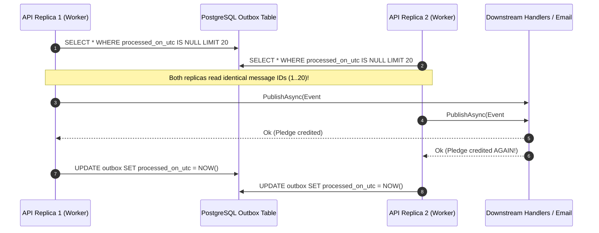
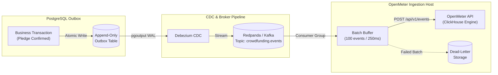
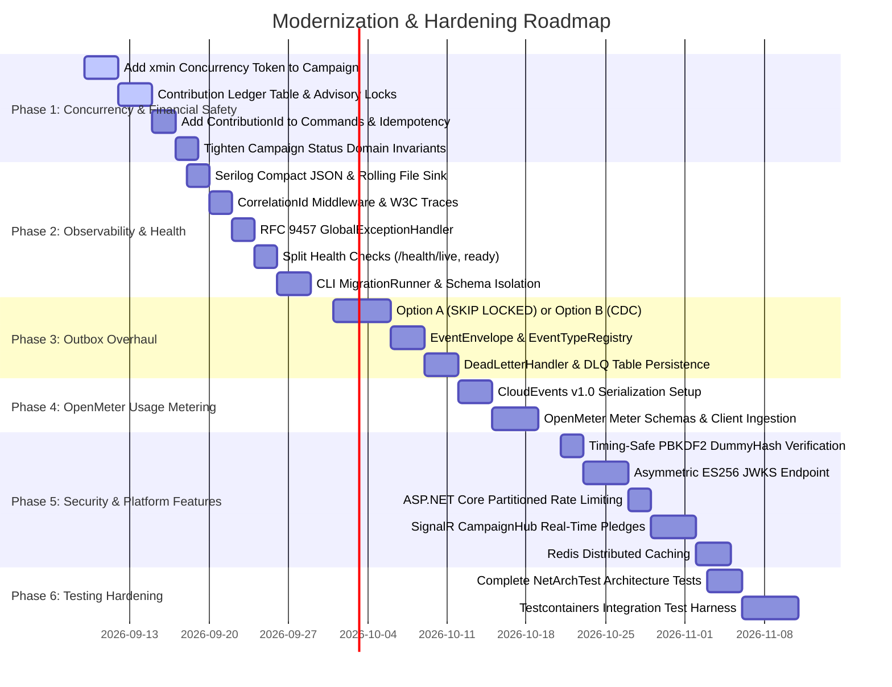

# Architectural Audit, System Evolution & Production Hardening Guide
## Upgrading `crowdfundinghub-main` to Enterprise-Scale, Resilient, and Metered Standards

**Document Target:** [`apps/crowdfundinghub-main`](file:///Users/maysamgamini/maysam-brain/Maysam's%20Brain/projects/projects-active/swe-prep/apps/crowdfundinghub-main)  
**Reference Benchmark:** [`apps/backend`](file:///Users/maysamgamini/maysam-brain/Maysam's%20Brain/projects/projects-active/swe-prep/apps/backend) (`hiTechies` Modular Monolith)  
**Status:** Comprehensive Architectural Audit & Remediation Blueprint  
**Authors:** Antigravity Specialized Architecture Team (Event & Concurrency Architect, Observability & Metering Architect, Domain & Security Architect)  

---

## Table of Contents

0. [Quick Reference: Prioritized Punch List](#0-quick-reference-prioritized-punch-list)
1. [Executive Summary & Comparative System Matrix](#1-executive-summary--comparative-system-matrix)
2. [Deep-Dive Shortcomings in `crowdfundinghub-main`](#2-deep-dive-shortcomings-in-crowdfundinghub-main)
   - [2.1 Outbox Processing, Poison Messages & Head-of-Line Blocking](#21-outbox-processing-poison-messages--head-of-line-blocking)
   - [2.2 Multi-Instance Concurrency & Scaling Vulnerabilities](#22-multi-instance-concurrency--scaling-vulnerabilities)
   - [2.3 Serialization Fragility & Silent Event Dropping](#23-serialization-fragility--silent-event-dropping)
   - [2.4 Critical Financial Concurrency & Race Conditions](#24-critical-financial-concurrency--race-conditions)
   - [2.5 Complete Observability, Logging & Tracing Deficiencies](#25-complete-observability-logging--tracing-deficiencies)
   - [2.6 Error Handling Security Hazards & RFC Non-Compliance](#26-error-handling-security-hazards--rfc-non-compliance)
   - [2.7 Database Migration Hazards in Production Clusters](#27-database-migration-hazards-in-production-clusters)
   - [2.8 Security Vulnerabilities: Timing Attacks & Key Distribution](#28-security-vulnerabilities-timing-attacks--key-distribution)
   - [2.9 Architecture Boundary Gaps & Test Suite Deficiencies](#29-architecture-boundary-gaps--test-suite-deficiencies)
3. [Architectural Resolutions & Reference Implementations](#3-architectural-resolutions--reference-implementations)
   - [3.1 Append-Only Outbox & Debezium Change Data Capture (CDC)](#31-append-only-outbox--debezium-change-data-capture-cdc)
   - [3.2 Stable Schema Envelopes & Durable Dead-Letter Handling](#32-stable-schema-envelopes--durable-dead-letter-handling)
   - [3.3 High-Performance PostgreSQL-Native Alternative (Option A: `SKIP LOCKED`)](#33-high-performance-postgresql-native-alternative-option-a-skip-locked)
   - [3.4 Concurrency Hardening: Optimistic Locking, Advisory Locks & Ledger Pattern](#34-concurrency-hardening-optimistic-locking-advisory-locks--ledger-pattern)
   - [3.5 Modern Observability Architecture (Serilog JSON, W3C Traces, OpenTelemetry)](#35-modern-observability-architecture-serilog-json-w3c-traces-opentelemetry)
   - [3.6 RFC 9457 Problem Details & Sanitized Error Pipeline](#36-rfc-9457-problem-details--sanitized-error-pipeline)
   - [3.7 Hardened Container Operations & CLI Migration Runner](#37-hardened-container-operations--cli-migration-runner)
   - [3.8 Security Modernization: Asymmetric JWKS, Timing-Safe PBKDF2 & Rate Limiting](#38-security-modernization-asymmetric-jwks-timing-safe-pbkdf2--rate-limiting)
4. [Scalable Metering Architecture with OpenMeter](#4-scalable-metering-architecture-with-openmeter)
   - [4.1 Why OpenMeter for Crowdfunding](#41-why-openmeter-for-crowdfunding)
   - [4.2 CloudEvents v1.0 Specifications & Schemas](#42-cloudevents-v10-specifications--schemas)
   - [4.3 OpenMeter Meter Definitions](#43-openmeter-meter-definitions)
   - [4.4 Ingestion Pipeline & Outbox Integration](#44-ingestion-pipeline--outbox-integration)
5. [Advanced Platform Features to Adopt from `apps/backend`](#5-advanced-platform-features-to-adopt-from-appsbackend)
   - [5.1 Real-Time Campaign Funding & Backer Streams (SignalR)](#51-real-time-campaign-funding--backer-streams-signalr)
   - [5.2 Distributed Caching with Redis & Tagged Invalidation](#52-distributed-caching-with-redis--tagged-invalidation)
   - [5.3 OAuth 2.0 / OIDC Federated Authentication](#53-oauth-20--oidc-federated-authentication)
   - [5.4 Resilient Outbound HTTP Communication (Polly v8)](#54-resilient-outbound-http-communication-polly-v8)
6. [Comprehensive Testing Strategy Overhaul](#6-comprehensive-testing-strategy-overhaul)
   - [6.1 Full NetArchTest Modular Architecture Enforcement](#61-full-netarchtest-modular-architecture-enforcement)
   - [6.2 Testcontainers-Backed Integration Testing Suite](#62-testcontainers-backed-integration-testing-suite)
7. [Step-by-Step Implementation Roadmap](#7-step-by-step-implementation-roadmap)
   - [Conclusion](#conclusion)

---

## 0. Quick Reference: Prioritized Punch List

> Verified against the current source tree on 2026-09-08 (see per-item verification notes throughout §2). Ranked by blast-radius: **financial correctness > security > reliability > observability > testing**. Each row links to the full write-up and, where one exists, the corresponding fix in §3.

| # | Severity | Finding | Full write-up | Resolved by |
| :---: | :--- | :--- | :--- | :--- |
| 1 | 🔴 P0 Financial | Lost updates on `Campaign.RaisedAmount` — no concurrency token, concurrent pledges silently overwrite each other | [§2.4 Defect A](#24-critical-financial-concurrency--race-conditions) | [§3.4 #1 `xmin` token](#34-concurrency-hardening-optimistic-locking-advisory-locks--ledger-pattern) |
| 2 | 🔴 P0 Financial | Double-pledge inflation — `AddContributionToCampaignCommand` has no `ContributionId`, so redelivery double-credits | [§2.4 Defect B](#24-critical-financial-concurrency--race-conditions) | [§3.4 #2 ledger unique constraint](#34-concurrency-hardening-optimistic-locking-advisory-locks--ledger-pattern) |
| 3 | 🔴 P0 Financial | TOCTOU on campaign cancellation — availability checked before the transaction, and `ApplyConfirmedContribution` only blocks `Draft`, not `Cancelled` | [§2.4 Defect C](#24-critical-financial-concurrency--race-conditions) | [§3.4 #3 advisory lock](#34-concurrency-hardening-optimistic-locking-advisory-locks--ledger-pattern) + [§3.4 #4 tightened invariant](#34-concurrency-hardening-optimistic-locking-advisory-locks--ledger-pattern) |
| 4 | 🔴 P0 Reliability | Outbox head-of-line blocking — one poison message (`break;`, no max-retry cutoff) permanently freezes a module's entire outbox queue | [§2.1](#21-outbox-processing-poison-messages--head-of-line-blocking) | [§3.1](#31-append-only-outbox--debezium-change-data-capture-cdc) or [§3.3 `SKIP LOCKED`](#33-high-performance-postgresql-native-alternative-option-a-skip-locked) + [§3.2 dead-letter handler](#32-stable-schema-envelopes--durable-dead-letter-handling) |
| 5 | 🔴 P0 Reliability | Multi-instance duplicate dispatch — outbox polling has no row claiming (`FOR UPDATE SKIP LOCKED`), so 2+ replicas process the same batch | [§2.2](#22-multi-instance-concurrency--scaling-vulnerabilities) | [§3.3 Step 2 atomic claim](#33-high-performance-postgresql-native-alternative-option-a-skip-locked) or [§3.1 CDC](#31-append-only-outbox--debezium-change-data-capture-cdc) |
| 6 | 🔴 P0 Reliability | Silent event drop — `CampaignTransactionExecutor.MapApplicationEvent`'s `_ => null` branch drops any domain event a developer forgets to map, with no log or error | [§2.3](#23-serialization-fragility--silent-event-dropping) | [§3.2 `EventTypeRegistry` / dead-letter](#32-stable-schema-envelopes--durable-dead-letter-handling) |
| 7 | 🔴 P0 Reliability | Fragile CLR reflection deserialization — `Type.GetType(AssemblyQualifiedName, throwOnError: true)` breaks on any rename/refactor/version bump, permanently poisoning that message | [§2.3](#23-serialization-fragility--silent-event-dropping) | [§3.2 `EventEnvelope`](#32-stable-schema-envelopes--durable-dead-letter-handling) |
| 8 | 🔴 P0 Security | 500 errors leak `exception.Message` verbatim (SQL/connection internals) to untrusted callers, in a non-standard `{ StatusCode, Message }` shape | [§2.6](#26-error-handling-security-hazards--rfc-non-compliance) | [§3.6 RFC 9457 `IExceptionHandler`](#36-rfc-9457-problem-details--sanitized-error-pipeline) |
| 9 | 🔴 P0 Security | Login timing attack / email enumeration — PBKDF2 is skipped entirely when `user is null`, and the "inactive account" error confirms the account exists | [§2.8 Timing Attack](#28-security-vulnerabilities-timing-attacks--key-distribution) | [§3.8 #1 constant-time login](#38-security-modernization-asymmetric-jwks-timing-safe-pbkdf2--rate-limiting) |
| 10 | 🟠 P1 Security | Symmetric HMAC JWT signing key (`Jwt:SigningKey`) must be shared with every verifier (gateways, proxies), so any compromised verifier can forge tokens | [§2.8 Symmetric JWT](#28-security-vulnerabilities-timing-attacks--key-distribution) | [§3.8 #2 asymmetric ES256 JWKS](#38-security-modernization-asymmetric-jwks-timing-safe-pbkdf2--rate-limiting) |
| 11 | 🟠 P1 Security | No rate limiting anywhere — login, registration, and contribution endpoints are open to brute-force/credential-stuffing/card-testing | [§2.8 Rate Limiting](#28-security-vulnerabilities-timing-attacks--key-distribution) | [§3.8 #3 partitioned rate limiting](#38-security-modernization-asymmetric-jwks-timing-safe-pbkdf2--rate-limiting) |
| 12 | 🟠 P1 Reliability | Migrations only auto-run under `IsDevelopment()`; no CI/CD or container-init migration path, and all DbContexts share the unqualified `public.__EFMigrationsHistory` table | [§2.7](#27-database-migration-hazards-in-production-clusters) | [§3.7 #1–2 CLI `MigrationRunner` + schema-isolated history tables](#37-hardened-container-operations--cli-migration-runner) |
| 13 | 🟠 P1 Reliability | No `/health/live` or `/health/ready` endpoints — load balancers can route to unready pods | [§2.7](#27-database-migration-hazards-in-production-clusters) | [§3.7 #3 split health probes](#37-hardened-container-operations--cli-migration-runner) |
| 14 | 🟡 P1 Observability | Near-zero structured logging (`ILogger` used in exactly one class), no correlation IDs, no OpenTelemetry tracing/metrics | [§2.5](#25-complete-observability-logging--tracing-deficiencies) | [§3.5 Serilog + correlation middleware + OTel](#35-modern-observability-architecture-serilog-json-w3c-traces-opentelemetry) |
| 15 | 🟡 P2 Testing | Integration test suite is a 10-line placeholder stub; zero real database/transaction/outbox tests | [§2.9 #3](#29-architecture-boundary-gaps--test-suite-deficiencies) | [§6.2 Testcontainers suite](#62-testcontainers-backed-integration-testing-suite) |
| 16 | 🟡 P2 Testing | Architecture-boundary tests missing for the `Notifications` and `CampaignUpdates` modules; cross-module isolation for those two is unverified | [§2.9 #1–2](#29-architecture-boundary-gaps--test-suite-deficiencies) | [§6.1 NetArchTest coverage for all 6 modules](#61-full-netarchtest-modular-architecture-enforcement) |
| 17 | ⚪ P2 Revenue | No usage/billing metering for platform fees, page views, or API consumption | [§1 matrix row](#1-executive-summary--comparative-system-matrix) | [§4 OpenMeter architecture](#4-scalable-metering-architecture-with-openmeter) |

---

## 1. Executive Summary & Comparative System Matrix

A comprehensive architectural audit was conducted comparing [`apps/crowdfundinghub-main`](file:///Users/maysamgamini/maysam-brain/Maysam's%20Brain/projects/projects-active/swe-prep/apps/crowdfundinghub-main) (the original modular monolith starter template) against [`apps/backend`](file:///Users/maysamgamini/maysam-brain/Maysam's%20Brain/projects/projects-active/swe-prep/apps/backend) (`hiTechies`, an evolved enterprise-grade implementation).

While `crowdfundinghub-main` demonstrates clean domain-driven concepts (CQRS pattern via MediatR, aggregate roots, domain events, and transaction executors), **it remains in an early, pre-production state burdened by fatal operational, concurrency, and reliability bottlenecks**. Crucially, the architectural improvements built into `apps/backend` (such as append-only outbox messaging, CDC event streaming, asymmetric cryptographic authentication, structured JSON telemetry, and hardened test harnesses) **have not yet been backported** to `crowdfundinghub-main`.

The table below outlines the core architectural dimensions and highlights the critical gaps:

| Architectural Dimension | `apps/crowdfundinghub-main` (Current State) | `apps/backend` (Reference State) | Maturity Gap / Production Risk |
| :--- | :--- | :--- | :--- |
| **Outbox Persistence Model** | Read-Modify-Write mutable table (`ProcessedOnUtc`, `Attempts`, `Error`). | Strictly Append-Only (`Id`, `EventType`, `Version`, `Payload`, `SourceModule`). | 🔴 **Critical Defect**: Mutating rows produces PostgreSQL MVCC table bloat, dead tuples, and write lock contention. |
| **Outbox Dispatch & Scaling** | In-process timer polling (`PeriodicTimer`, 5s interval) across modules on a single thread. | Debezium CDC (`wal_level=logical`, `pgoutput`) streaming to Redpanda/Kafka topics. | 🔴 **Critical Defect**: Cannot scale horizontally. Multiple instances race on polling, resulting in duplicate publishing. |
| **Poison Message Handling** | `catch { MarkFailed(); break; }` without max-retry cutoff. | `DeadLetterHandler` routes unresolved events to `DeadLetterEvent` table and increments metrics. | 🔴 **Fatal Bottleneck**: Single bad event permanently halts all outbox delivery for the entire module (Head-of-Line blocking). |
| **Serialization Safety** | Stores and resolves CLR `Type.GetType(AssemblyQualifiedName)`. | Decoupled `EventEnvelope` (`EventType`, `Version`) resolved via `EventTypeRegistry`. | 🔴 **High Vulnerability**: Class renames, namespace changes, or runtime version bumps break existing persisted events. |
| **Domain Event Mapping** | Switch expression in transaction executors terminates in `_ => null` silent drop. | Fail-safe routing; unmapped events are either routed to dead-letter handler or raise audited warnings. | 🔴 **Data Loss Hazard**: New domain events added without explicit mappings are silently discarded without logging or errors. |
| **Campaign Goal & Pledge Concurrency** | Unprotected read-modify-write in EF Core. No concurrency token (`xmin`/rowversion). | PostgreSQL `pg_advisory_xact_lock` + append-only ledger entries (`EfEconomyStore`). | 🔴 **Financial Data Corruption**: Rapid concurrent pledges cause lost updates, permanently losing funds from `RaisedAmount`. |
| **Double-Pledge Protection** | `AddContributionToCampaignCommand` omits `ContributionId`. Blind balance addition. | Built-in idempotency: `IdempotentConsumer` (`ProcessedEvent`) and unique index on `SourceEventId`. | 🔴 **Financial Data Corruption**: At-least-once message redelivery results in double-crediting campaign totals. |
| **Structured Logging & Tracing** | Zero structured logging. Only 1 file (`GlobalExceptionMiddleware`) references `ILogger`. No correlation IDs. | Serilog Compact JSON sink (`logs/hitechies-.json`), `CorrelationIdMiddleware`, W3C trace propagation. | 🔴 **Operational Blindness**: Financial pledges, background jobs, and payment states execute in near-complete silence. |
| **HTTP Error Specification** | Legacy middleware returning proprietary `{ StatusCode, Message }`. Leaks SQL syntax on 500. | ASP.NET Core `IExceptionHandler` returning RFC 9457 `ProblemDetails` with sanitized 500 and `traceId`. | 🔴 **Security Hazard**: Leaks internal database table names and connection parameters to untrusted clients. |
| **Database Migrations** | `ApplyMigrationsAsync()` hardcoded to `IsDevelopment()`. Colliding `public.__EFMigrationsHistory`. | CLI runner `dotnet run -- migrate` + schema-isolated `__EFMigrationsHistory` + divergence check (`42P07`). | 🔴 **Deployment Failure**: No automated migration runner for CI/CD or staging/production container init jobs. |
| **Container Health Checks** | Completely absent. No `/health`, `/health/live`, or `/health/ready` endpoints. | Health probes checking PostgreSQL and Broker with sanitized error responses. | 🔴 **Orchestration Risk**: Load balancers route traffic to unready containers or pods with severed database connections. |
| **Authentication & Signing** | Shared symmetric HMAC-SHA256 key (`Jwt:SigningKey`) stored in `appsettings.json`. | Dynamic Asymmetric ES256 ECDSA key pair (`ISigningKeyStore`, JWKS at `/.well-known/jwks.json`, cache refresher). | 🔴 **Security Gap**: Cannot decouple token verification to API gateways or edge proxies without sharing the master secret. |
| **Timing-Attack Resistance** | `LoginUserCommandHandler` short-circuits on `user is null` prior to running PBKDF2. | Constant-time execution: executes PBKDF2 against `Pbkdf2PasswordHasher.DummyHash` when user not found. | 🔴 **Security Gap**: Attackers can enumerate registered user email addresses via sub-millisecond response time variance. |
| **Rate Limiting & Abuse Prevention** | Absent across all API endpoints. | Partitioned rate limiting (`System.Threading.RateLimiting`) for auth, transactions, and public APIs. | 🔴 **Abuse Vulnerability**: Vulnerable to credential stuffing, payment card testing, and scraping DoS. |
| **Usage Metering & Billing** | Absent. No event metering for platform success fees, views, or API calls. | Event-driven architecture ready for OpenMeter CloudEvents v1.0 ingestion. | 🟡 **Revenue Bottleneck**: No mechanism to meter transaction processing fees, campaign page views, or API consumption. |
| **Integration Test Coverage** | 10-line placeholder stub (`UnitTest1.cs`). Zero executable database tests. | 93+ integration tests executing against real PostgreSQL via `Testcontainers.PostgreSql`. | 🔴 **Quality Defect**: No automated regression defense for migrations, database queries, or transaction boundaries. |

---

## 2. Deep-Dive Shortcomings in `crowdfundinghub-main`

### 2.1 Outbox Processing, Poison Messages & Head-of-Line Blocking

In [`OutboxProcessorBackgroundService.cs`](file:///Users/maysamgamini/maysam-brain/Maysam's%20Brain/projects/projects-active/swe-prep/apps/crowdfundinghub-main/src/API/CrowdFunding.API/Background/OutboxProcessorBackgroundService.cs#L50-L75), outbox message dispatch is implemented as follows:

```csharp
var messages = await dbContext.Set<OutboxMessage>()
    .Where(x => x.ProcessedOnUtc == null)
    .OrderBy(x => x.OccurredOnUtc)
    .ThenBy(x => x.Id)
    .Take(20)
    .ToListAsync(cancellationToken);

foreach (var message in messages)
{
    try
    {
        var applicationEvent = message.Deserialize();
        await eventPublisher.PublishAsync(applicationEvent, cancellationToken);
        message.MarkProcessed(DateTime.UtcNow);
    }
    catch (Exception exception)
    {
        message.MarkFailed(exception.Message);
        break; // <--- CRITICAL ARCHITECTURAL FLAW: Head-of-Line Blocking
    }
}

if (messages.Count > 0)
{
    await dbContext.SaveChangesAsync(cancellationToken);
}
```

#### The Fatal Failure Mechanism:
1. **Unbounded Deterministic Poison Messages:** When an exception occurs (such as an unknown event type, invalid JSON, or an unhandled exception in an event handler), `message.MarkFailed(exception.Message)` increments `Attempts` and records `Error`. It then immediately calls `break;`.
2. **Missing Retry Cutoff Filter:** Notice that the query filter is strictly `.Where(x => x.ProcessedOnUtc == null)`. It does **not** filter by `Attempts < 5`. Because `ProcessedOnUtc` remains `null`, the failing message remains uncommitted.
3. **Queue Freeze:** On the very next timer tick (5 seconds later), the background service re-runs the exact same query. Because it orders by `OccurredOnUtc` and `Id`, the **poison message is retrieved first again**.
4. **Permanent Stall:** The poison message throws immediately and triggers `break;`. **All subsequent outbox messages for that module are permanently blocked.** The queue is frozen indefinitely with zero operational alerting.

Resolved by → [§3.1 Append-Only Outbox & Debezium CDC](#31-append-only-outbox--debezium-change-data-capture-cdc) or [§3.3 `SKIP LOCKED` alternative](#33-high-performance-postgresql-native-alternative-option-a-skip-locked), combined with [§3.2's `DeadLetterHandler`](#32-stable-schema-envelopes--durable-dead-letter-handling) to remove poison messages from the queue instead of blocking it.

---

### 2.2 Multi-Instance Concurrency & Scaling Vulnerabilities

When running `crowdfundinghub-main` in a horizontally scaled environment (e.g., Kubernetes cluster with $\ge 2$ replicas, or multi-instance Azure App Service / AWS ECS):

1. **Unprotected Query Race Conditions:** The query `SELECT ... WHERE processed_on_utc IS NULL ORDER BY occurred_on_utc, id LIMIT 20` uses no row claiming or locking semantics (such as `FOR UPDATE SKIP LOCKED`).
2. **Duplicate Dispatches:** Instance 1 and Instance 2 query the database concurrently and fetch the exact same batch of 20 uncommitted messages.
3. **Redundant Side-Effects:** Both instances invoke `eventPublisher.PublishAsync()` for every message. Downstream handlers (such as sending confirmation emails, crediting balances, or notifying third parties) execute twice concurrently.
4. **Database Write Conflicts:** Both instances attempt to call `SaveChangesAsync()`. One commits and marks the rows processed; the other either overwrites or conflicts, but the duplicate side-effects have already been triggered.



Resolved by → [§3.3 Step 2, atomic `FOR UPDATE SKIP LOCKED` claiming query](#33-high-performance-postgresql-native-alternative-option-a-skip-locked), or by removing in-process polling entirely via [§3.1 Debezium CDC](#31-append-only-outbox--debezium-change-data-capture-cdc).

---

### 2.3 Serialization Fragility & Silent Event Dropping

#### Fragile Reflection Deserialization (`OutboxMessage.cs`):
[`OutboxMessage.cs`](file:///Users/maysamgamini/maysam-brain/Maysam's%20Brain/projects/projects-active/swe-prep/apps/crowdfundinghub-main/src/BuildingBlocks/CrowdFunding.BuildingBlocks.Infrastructure/Persistence/OutboxMessage.cs#L37-L51) stores the event type using .NET's CLR `AssemblyQualifiedName`:

```csharp
var eventType = applicationEvent.GetType().AssemblyQualifiedName;
// Deserialization:
var runtimeType = Type.GetType(EventType, throwOnError: true);
```

* **The Problem:** An assembly-qualified name embeds the fully qualified class name, namespace, assembly name, assembly version, culture, and public key token.
* **Failure Mode:** Renaming an event class, refactoring folder structures, bumping an assembly version from `1.0.0.0` to `1.1.0.0`, or moving an event to a shared contracts library causes `Type.GetType(..., throwOnError: true)` to throw `TypeLoadException`.
* **Impact:** Any historical or in-flight outbox message instantly turns into a permanent poison message, freezing outbox delivery as detailed in §2.1.

#### Silent Dropping of Domain Events (`CampaignTransactionExecutor.cs`):
In [`CampaignTransactionExecutor.cs`](file:///Users/maysamgamini/maysam-brain/Maysam's%20Brain/projects/projects-active/swe-prep/apps/crowdfundinghub-main/src/Modules/Campaigns/CrowdFunding.Modules.Campaigns.Infrastructure/Transactions/CampaignTransactionExecutor.cs#L74-L89):

```csharp
private static OutboxMessage? MapApplicationEvent(BaseEvent domainEvent)
{
    return domainEvent switch
    {
        CampaignCreatedDomainEvent @event => OutboxMessage.Create(...),
        CampaignPublishedDomainEvent @event => OutboxMessage.Create(...),
        CampaignCancelledDomainEvent @event => OutboxMessage.Create(...),
        _ => null // <--- SILENT EVENT DROP
    };
}
```

The executor filters out nulls (`Where(message => message is not null)`). If a developer creates a new domain event (e.g., `CampaignGoalReachedDomainEvent`, `CampaignRefundTriggeredDomainEvent`, or `ContributionRefundedDomainEvent`) but forgets to add a branch to this switch statement:
* **The event is silently dropped.**
* No exception is thrown, no compiler error is produced, and no warning is logged. Subsequent dependent processes (such as email alerts, ledger reconciliation, and analytics) never execute.

Both defects above are resolved by → [§3.2 `EventEnvelope` + `EventTypeRegistry` + `DeadLetterHandler`](#32-stable-schema-envelopes--durable-dead-letter-handling), which replaces reflection-based typing with a stable `(EventType, Version)` registry and routes unmapped/unresolvable events to a durable dead-letter table instead of silently dropping or throwing on them.

---

### 2.4 Critical Financial Concurrency & Race Conditions

Crowdfunding platforms frequently experience severe traffic spikes (e.g., viral campaigns, celebrity backing drives, and final-countdown hours). `crowdfundinghub-main` contains three high-impact financial concurrency flaws:

#### Defect A: Lost Updates on Campaign Raised Amount
When payment is confirmed for a contribution, [`AddContributionToCampaignCommandHandler`](file:///Users/maysamgamini/maysam-brain/Maysam's%20Brain/projects/projects-active/swe-prep/apps/crowdfundinghub-main/src/Modules/Campaigns/CrowdFunding.Modules.Campaigns.Application/Features/Campaigns/Commands/AddContributionToCampaign/AddContributionToCampaignCommandHandler.cs#L29-L42) is executed:

```csharp
var campaign = await _campaignRepository.GetByIdAsync(command.CampaignId, cancellationToken);
await _transactionExecutor.ExecuteAsync(async ct =>
{
    campaign.ApplyConfirmedContribution(new Money(command.Amount, command.Currency));
    await _campaignRepository.UpdateAsync(campaign, ct);
    return 0;
}, cancellationToken);
```

In [`CampaignConfiguration.cs`](file:///Users/maysamgamini/maysam-brain/Maysam's%20Brain/projects/projects-active/swe-prep/apps/crowdfundinghub-main/src/Modules/Campaigns/CrowdFunding.Modules.Campaigns.Infrastructure/Persistence/Configurations/CampaignConfiguration.cs#L60-L70), `RaisedAmount` has **no concurrency token**:

```csharp
builder.OwnsOne(x => x.RaisedAmount, money =>
{
    money.Property(x => x.Amount).HasColumnName("raised_amount").HasPrecision(18, 2).IsRequired();
    money.Property(x => x.Currency).HasColumnName("raised_currency").HasMaxLength(3).IsRequired();
});
```

* **The Race Condition:**
  1. Campaign $C$ has raised `$10,000`. Two backers submit pledges of `$50` and `$100` at the exact same millisecond.
  2. Thread 1 reads `RaisedAmount = $10,000`. Thread 2 reads `RaisedAmount = $10,000`.
  3. Thread 1 computes `$10,050` and issues `UPDATE campaigns SET raised_amount = 10050 WHERE id = C;`.
  4. Thread 2 computes `$10,100` and issues `UPDATE campaigns SET raised_amount = 10100 WHERE id = C;`.
  5. **Result:** Thread 2 overwrites Thread 1. The campaign balance shows `$10,100` instead of `$10,150`. **The $50 pledge is permanently lost from the campaign balance**, causing an irreversible accounting discrepancy between confirmed contributions and aggregate campaign totals.

Resolved by → [§3.4 #1 PostgreSQL `xmin` optimistic concurrency token](#34-concurrency-hardening-optimistic-locking-advisory-locks--ledger-pattern).

#### Defect B: Double-Pledge Inflation Under At-Least-Once Delivery
In `crowdfundinghub-main`, `AddContributionToCampaignCommand` is defined as:

```csharp
public sealed record AddContributionToCampaignCommand(Guid CampaignId, decimal Amount, string Currency);
```

* **The Problem:** **`ContributionId` is omitted from the command entirely!**
* **Failure Mode:** If an outbox message is redelivered (due to a transient network timeout, process restart before commit, or dual-instance polling), `AddContributionToCampaignCommandHandler` cannot check whether this specific contribution has already been counted.
* **Impact:** It executes `campaign.ApplyConfirmedContribution(...)` a second time, inflating `RaisedAmount` with phantom funds.

Resolved by → [§3.4 #2 append-only contribution ledger with a `UNIQUE` constraint on `contribution_id`](#34-concurrency-hardening-optimistic-locking-advisory-locks--ledger-pattern).

#### Defect C: Time-of-Check to Time-of-Use (TOCTOU) on Campaign Cancellation
In [`ConfirmContributionPaymentCommandHandler.cs`](file:///Users/maysamgamini/maysam-brain/Maysam's%20Brain/projects/projects-active/swe-prep/apps/crowdfundinghub-main/src/Modules/Contributions/CrowdFunding.Modules.Contributions.Application/Features/Contributions/Commands/ConfirmContributionPayment/ConfirmContributionPaymentCommandHandler.cs#L46-L58):

```csharp
var campaignAvailability = await _campaignContributionAvailabilityReader.GetCampaignContributionAvailabilityAsync(
    new GetCampaignContributionAvailabilityQuery(command.CampaignId), cancellationToken);

if (!string.Equals(campaignAvailability.Status, "Published", StringComparison.OrdinalIgnoreCase))
{
    throw new InvalidOperationException("Contribution payments can only be confirmed while the campaign is published.");
}
```

* **The Vulnerability:** The availability status check occurs in-memory *before* the payment transaction begins.
* **The Race:** If a campaign creator or moderator cancels the campaign concurrently (`CancelCampaignCommandHandler`):
  1. Thread 1 checks status: `"Published"`.
  2. Thread 2 cancels campaign: status becomes `"Cancelled"` and commits.
  3. Thread 1 confirms contribution payment and publishes the event.
  4. In [`Campaign.cs`](file:///Users/maysamgamini/maysam-brain/Maysam's%20Brain/projects/projects-active/swe-prep/apps/crowdfundinghub-main/src/Modules/Campaigns/CrowdFunding.Modules.Campaigns.Domain/Aggregates/Campaign.cs#L110-L113), `ApplyConfirmedContribution` checks:
     ```csharp
     if (Status == CampaignStatus.Draft)
     {
         throw new InvalidOperationException("Draft campaigns cannot receive confirmed contributions.");
     }
     ```
  5. Because `Status == CampaignStatus.Cancelled` is **not blocked**, payments are confirmed and credited to a cancelled campaign!

  *(Verification note: `ConfirmContributionPaymentCommandHandler` itself only confirms the `Contribution` aggregate — it does not call `Campaign.ApplyConfirmedContribution` directly. That call happens downstream, via the outbox-published `ContributionPaymentConfirmedApplicationEvent` being handled by `ContributionPaymentConfirmedApplicationEventHandler.cs` in the Campaigns module, which dispatches the `AddContributionToCampaignCommand` audited in Defect A/B above. Confirmed present in source; the race window described is real, just spans this cross-module event hop rather than a single method call.)*

Resolved by → [§3.4 #3 `pg_advisory_xact_lock`](#34-concurrency-hardening-optimistic-locking-advisory-locks--ledger-pattern) to serialize balance mutations per campaign, and [§3.4 #4](#34-concurrency-hardening-optimistic-locking-advisory-locks--ledger-pattern), which tightens `ApplyConfirmedContribution` to require `Status == Published` (rejecting `Cancelled`, not just `Draft`).

---

### 2.5 Complete Observability, Logging & Tracing Deficiencies

1. **Near-Zero Logging Across All Modules:** In the entire repository, `ILogger` is injected into only one class: [`GlobalExceptionMiddleware.cs`](file:///Users/maysamgamini/maysam-brain/Maysam's%20Brain/projects/projects-active/swe-prep/apps/crowdfundinghub-main/src/API/CrowdFunding.API/Middleware/GlobalExceptionMiddleware.cs). Financial transactions, contribution lifecycle changes, authentication attempts, and campaign status transitions emit zero logs.
2. **Silent Background Failures:** In [`OutboxProcessorBackgroundService.cs`](file:///Users/maysamgamini/maysam-brain/Maysam's%20Brain/projects/projects-active/swe-prep/apps/crowdfundinghub-main/src/API/CrowdFunding.API/Background/OutboxProcessorBackgroundService.cs), message deserialization and dispatch exceptions are caught and written to the database column `Error`, but **no error log is emitted and no metric is incremented**.
3. **No Correlation IDs or Distributed Tracing:** Requests execute without a Correlation ID or W3C `traceparent` header. When an error occurs downstream during outbox processing, operators cannot trace it back to the original user request that triggered it.
4. **No OpenTelemetry Instrumentation:** There is no integration with OpenTelemetry. Tracing of incoming HTTP requests, outgoing HTTP calls, and Entity Framework database queries is completely missing.

Resolved by → [§3.5 Serilog Compact JSON + `CorrelationIdMiddleware` + OpenTelemetry tracing/metrics](#35-modern-observability-architecture-serilog-json-w3c-traces-opentelemetry).

---

### 2.6 Error Handling Security Hazards & RFC Non-Compliance

In [`GlobalExceptionMiddleware.cs`](file:///Users/maysamgamini/maysam-brain/Maysam's%20Brain/projects/projects-active/swe-prep/apps/crowdfundinghub-main/src/API/CrowdFunding.API/Middleware/GlobalExceptionMiddleware.cs#L30-L50):

```csharp
var response = new ErrorResponse(context.Response.StatusCode, exception.Message);
await context.Response.WriteAsync(JsonSerializer.Serialize(response));
```

1. **Sensitive Information Disclosure:** For any unhandled 500 error (e.g., database timeout, Npgsql connection failure, PostgreSQL unique constraint violation), `exception.Message` is returned directly to the HTTP caller. This leaks database schema names, table structures, connection strings, and server internals to untrusted users.
2. **Proprietary Response Schema:** Emits `{ "StatusCode": 500, "Message": "..." }` instead of the industry standard **RFC 9457 Problem Details for HTTP APIs** (`application/problem+json`).
3. **Legacy Middleware Pattern:** Uses legacy manual response writing rather than ASP.NET Core 8's native `IExceptionHandler` abstraction.

Resolved by → [§3.6 RFC 9457 `ProblemDetails` via `IExceptionHandler`](#36-rfc-9457-problem-details--sanitized-error-pipeline).

---

### 2.7 Database Migration Hazards in Production Clusters

In [`Program.cs` lines 117-122](file:///Users/maysamgamini/maysam-brain/Maysam's%20Brain/projects/projects-active/swe-prep/apps/crowdfundinghub-main/src/API/CrowdFunding.API/Program.cs#L117-L122):

```csharp
if (app.Environment.IsDevelopment())
{
    await app.ApplyMigrationsAsync();
    app.UseSwagger();
    app.UseSwaggerUI();
}
```

1. **No Staging / Production Execution Mechanism:** Migrations only execute when `app.Environment.IsDevelopment()` is true. There is no CLI mechanism (`dotnet run -- migrate`) to run migrations during deployment pipelines or container init-jobs.
2. **Multi-Replica Deadlocks:** If `ApplyMigrationsAsync()` is enabled in production across multiple container replicas, multiple Kestrel instances boot concurrently and attempt simultaneous DDL operations on PostgreSQL, risking migration table corruption or lock timeouts.
3. **Migration History Table Collisions:** All four module DbContexts (`CampaignsDbContext`, `ContributionsDbContext`, `IdentityDbContext`, `ModerationDbContext`) use the default `public.__EFMigrationsHistory` table without schema qualification. Migration version entries collide and risk breaking schema tracking.

*(Verified: `Program.cs` gates `ApplyMigrationsAsync()` strictly behind `app.Environment.IsDevelopment()` — confirmed at the current line location. No health-check registration (`AddHealthChecks`/`MapHealthChecks`) or rate-limiter registration exists anywhere in `Program.cs` — confirmed absent by full-file search.)*

Resolved by → [§3.7 #1–2 CLI `MigrationRunner` + schema-isolated `__EFMigrationsHistory` tables](#37-hardened-container-operations--cli-migration-runner) and [§3.7 #3 split `/health/live` & `/health/ready` probes](#37-hardened-container-operations--cli-migration-runner).

---

### 2.8 Security Vulnerabilities: Timing Attacks & Key Distribution

#### Timing Attack & Email Enumeration in Login
In [`LoginUserCommandHandler.cs`](file:///Users/maysamgamini/maysam-brain/Maysam's%20Brain/projects/projects-active/swe-prep/apps/crowdfundinghub-main/src/Modules/Identity/CrowdFunding.Modules.Identity.Application/Features/Users/Commands/LoginUser/LoginUserCommandHandler.cs#L31-L42):

```csharp
var user = await _userRepository.GetByNormalizedEmailAsync(normalizedEmail, cancellationToken);

if (user is null || !_passwordHasher.VerifyPassword(user.PasswordHash, command.Password))
{
    throw new UnauthorizedAccessException("Invalid email or password.");
}

if (!user.IsActive)
{
    throw new InvalidOperationException("The user account is inactive.");
}
```

* **Timing Vulnerability:** If the user is not found, the handler returns in `< 1ms`. If the user exists, PBKDF2 executes 100,000 iterations taking `50ms - 150ms`. An attacker can measure response latency to enumerate valid email addresses.
* **Account Status Leak:** Throwing `"The user account is inactive."` reveals that the account exists and is currently disabled.

Resolved by → [§3.8 #1 constant-time login using `DummyHash`](#38-security-modernization-asymmetric-jwks-timing-safe-pbkdf2--rate-limiting).

#### Symmetric JWT Secret Key Exposure
In [`JwtAccessTokenProvider.cs`](file:///Users/maysamgamini/maysam-brain/Maysam's%20Brain/projects/projects-active/swe-prep/apps/crowdfundinghub-main/src/Modules/Identity/CrowdFunding.Modules.Identity.Infrastructure/Services/JwtAccessTokenProvider.cs#L47-L48):
* Relies on a single symmetric HMAC-SHA256 secret (`Jwt:SigningKey`).
* Any external verifier (such as an API Gateway, Envoy proxy, or secondary microservice) must be given the private signing secret to validate tokens. If any verifier is compromised, an attacker can forge arbitrary admin tokens.
* *(Verified: `JwtAccessTokenProvider.cs` reads `Jwt:SigningKey` and constructs a `SymmetricSecurityKey` from it — confirmed in source, no asymmetric key material present.)*

Resolved by → [§3.8 #2 asymmetric ES256 JWKS endpoint](#38-security-modernization-asymmetric-jwks-timing-safe-pbkdf2--rate-limiting).

#### Complete Absence of Rate Limiting
* No rate limiting is configured in [`Program.cs`](file:///Users/maysamgamini/maysam-brain/Maysam's%20Brain/projects/projects-active/swe-prep/apps/crowdfundinghub-main/src/API/CrowdFunding.API/Program.cs) — confirmed by full-file search; no `AddRateLimiter` call exists anywhere in the codebase.
* Endpoints like `/api/identity/users/login`, `/api/identity/users/register`, and `/api/contributions` are exposed to brute-force credential attacks, Sybil account creation, and card testing fraud.

Resolved by → [§3.8 #3 partitioned `System.Threading.RateLimiting` policies](#38-security-modernization-asymmetric-jwks-timing-safe-pbkdf2--rate-limiting).

---

### 2.9 Architecture Boundary Gaps & Test Suite Deficiencies

1. **"Ghost" Modules — Wired But Behaviorally No-Op:** *(corrected 2026-09-08: the original claim that these projects are "empty" is not quite accurate — verified against source.)* `CrowdFunding.Modules.Notifications` and `CrowdFunding.Modules.CampaignUpdates` are not empty project shells; each has an `Application` layer with real `IEventHandler<T>` classes (`NotificationEventHandlers.cs`, `CampaignActivityEventHandlers.cs`) subscribed to `CampaignPublished`, `CampaignCancelled`, `ContributionPaymentConfirmed`, `CampaignReviewApproved`, and `CampaignReviewRejected` application events. However, every handler body is a no-op — literally `=> Task.CompletedTask` — so the audit's underlying conclusion still holds in substance: **neither module contains a domain aggregate, entity, repository, or any actual business rule.** They exist to demonstrate the event-subscription wiring pattern, not to deliver notification or campaign-update functionality yet.
2. **Missing Architecture Tests:** In [`CrowdFunding.ArchitectureTests`](file:///Users/maysamgamini/maysam-brain/Maysam's%20Brain/projects/projects-active/swe-prep/apps/crowdfundinghub-main/tests/ArchitectureTests/CrowdFunding.ArchitectureTests), tests exist only for `Campaigns` (`CampaignsModuleDependencyTests.cs`), `Contributions` (`ContributionsModuleDependencyTests.cs`), `Identity` (`IdentityModuleDependencyTests.cs`), and `Moderation` (`ModerationModuleDependencyTests.cs`) — confirmed present on disk. `Notifications` and `CampaignUpdates` are untested, and cross-module boundary isolation is not validated for those two. Resolved by → [§6.1](#61-full-netarchtest-modular-architecture-enforcement).
3. **Empty Integration Test Suite:** In [`CrowdFunding.IntegrationTests`](file:///Users/maysamgamini/maysam-brain/Maysam's%20Brain/projects/projects-active/swe-prep/apps/crowdfundinghub-main/tests/IntegrationTests/CrowdFunding.IntegrationTests), the test file [`UnitTest1.cs`](file:///Users/maysamgamini/maysam-brain/Maysam's%20Brain/projects/projects-active/swe-prep/apps/crowdfundinghub-main/tests/IntegrationTests/CrowdFunding.IntegrationTests/UnitTest1.cs) is a 10-line placeholder stub:
   ```csharp
   public class UnitTest1
   {
       [Fact]
       public void Test1() { }
   }
   ```
   There are **zero integration tests** asserting database persistence, transaction boundary enforcement, or outbox publishing against a real database. Resolved by → [§6.2](#62-testcontainers-backed-integration-testing-suite).

---

## 3. Architectural Resolutions & Reference Implementations

This section presents concrete, production-ready architectures adapted directly from [`apps/backend`](file:///Users/maysamgamini/maysam-brain/Maysam's%20Brain/projects/projects-active/swe-prep/apps/backend).

```
┌─────────────────────────────────────────────────────────────────────────────────────────────────┐
│                                    TARGET ARCHITECTURAL BLUEPRINT                               │
│                                                                                                 │
│  [HTTP Request / Webhook]                                                                       │
│          │                                                                                      │
│          ▼                                                                                      │
│  ┌─────────────────────────┐     Atomic DB Tx      ┌─────────────────────────────────────────┐  │
│  │ Campaign Aggregate      │◄─────────────────────►│ OutboxMessage (Strictly Append-Only)    │  │
│  │ (xmin Concurrency Token)│                       │ Id, EventType, Version, Payload, Module │  │
│  └─────────────────────────┘                       └────────────────────┬────────────────────┘  │
│                                                                         │                       │
│                                                          PostgreSQL WAL (pgoutput)              │
│                                                                         │                       │
│                                                                         ▼                       │
│                                                            ┌────────────────────────┐           │
│                                                            │ Debezium CDC Connector │           │
│                                                            └────────────┬───────────┘           │
│                                                                         │ EventRouter           │
│                                                                         ▼                       │
│                                                            ┌────────────────────────┐           │
│                                                            │ Redpanda / Kafka       │           │
│                                                            │ Partitioned Topics     │           │
│                                                            └────────────┬───────────┘           │
│                                                                         │ Consumer Groups       │
│                                 ┌───────────────────────────────────────┴───────────────┐       │
│                                 ▼                                                       ▼       │
│                   ┌───────────────────────────┐                           ┌───────────────────┐ │
│                   │ BrokerConsumerHost        │                           │ OpenMeter Worker  │ │
│                   │ (Per-Topic Consumer Loop) │                           │ (Usage Metering)  │ │
│                   └─────────────┬─────────────┘                           └─────────┬─────────┘ │
│                                 │                                                   │           │
│                                 ▼                                                   ▼           │
│                   ┌───────────────────────────┐                           ┌───────────────────┐ │
│                   │ EventTypeRegistry         │                           │ OpenMeter Cloud-  │ │
│                   │ (Type, Version)           │                           │ Events v1.0 API   │ │
│                   └─────────────┬─────────────┘                           └───────────────────┘ │
│                     Valid │     │ Unrecognized                                                  │
│                           ▼     └─────────────────────► ┌───────────────────┐                   │
│                   ┌───────────────────────────┐         │ DeadLetterHandler │                   │
│                   │ IdempotentConsumer        │         │ (DeadLetterEvent) │                   │
│                   │ (ProcessedEvent Table)    │         └───────────────────┘                   │
│                   └─────────────┬─────────────┘                                                 │
│                                 │ First Execution                                               │
│                                 ▼                                                               │
│                   ┌───────────────────────────┐                                                 │
│                   │ Domain Handler Execution  │                                                 │
│                   │ (Advisory Locks + Ledger) │                                                 │
│                   └───────────────────────────┘                                                 │
└─────────────────────────────────────────────────────────────────────────────────────────────────┘
```

---

### 3.1 Append-Only Outbox & Debezium Change Data Capture (CDC)

To eliminate table bloat, write amplification, and in-process polling locks, refactor [`OutboxMessage.cs`](file:///Users/maysamgamini/maysam-brain/Maysam's%20Brain/projects/projects-active/swe-prep/apps/crowdfundinghub-main/src/BuildingBlocks/CrowdFunding.BuildingBlocks.Infrastructure/Persistence/OutboxMessage.cs) to match [`apps/backend`](file:///Users/maysamgamini/maysam-brain/Maysam's%20Brain/projects/projects-active/swe-prep/apps/backend/src/BuildingBlocks/HiTechies.BuildingBlocks.Infrastructure/Persistence/OutboxMessage.cs):

```csharp
namespace CrowdFunding.BuildingBlocks.Infrastructure.Persistence;

public sealed class OutboxMessage
{
    public Guid Id { get; private set; }
    public string EventType { get; private set; } = string.Empty;
    public int Version { get; private set; }
    public DateTimeOffset OccurredAt { get; private set; }
    public string Payload { get; private set; } = string.Empty;
    public string SourceModule { get; private set; } = string.Empty;

    private OutboxMessage() { }

    public OutboxMessage(Guid id, string eventType, int version, DateTimeOffset occurredAt, string payload, string sourceModule)
    {
        Id = id;
        EventType = eventType;
        Version = version;
        OccurredAt = occurredAt;
        Payload = payload;
        SourceModule = sourceModule;
    }
}
```

* **Key Advantages:**
  1. **Strictly Immutable:** No `ProcessedOnUtc`, `Attempts`, or `Error` columns. Rows are inserted once and never updated, completely eliminating dead-tuple generation in PostgreSQL.
  2. **Debezium CDC Streaming:** The PostgreSQL database is configured with `wal_level=logical`. Debezium streams committed outbox inserts directly to Kafka/Redpanda using the `pgoutput` plugin.
  3. **Zero Polling Load:** Eliminates all `PeriodicTimer` queries against the operational database.

---

### 3.2 Stable Schema Envelopes & Durable Dead-Letter Handling

Replace raw reflection deserialization with structured envelopes and an event type registry (matching `apps/backend`):

#### 1. Event Envelope Definition:
```csharp
namespace CrowdFunding.BuildingBlocks.Application.Events;

public sealed record EventEnvelope(
    Guid EventId,
    string EventType,
    int Version,
    DateTimeOffset OccurredAt,
    JsonElement Payload,
    string SourceModule);
```

#### 2. Event Type Registry (`EventTypeRegistry.cs`):
```csharp
namespace CrowdFunding.BuildingBlocks.Application.Events;

public sealed class EventTypeRegistry
{
    private readonly Dictionary<(string EventType, int Version), Func<JsonElement, object>> _deserializers = new();

    public void Register<TEvent>(string eventType, int version, Func<JsonElement, TEvent> deserializer)
        where TEvent : notnull
    {
        _deserializers[(eventType, version)] = json => deserializer(json);
    }

    public bool TryResolve(EventEnvelope envelope, out object? domainEvent)
    {
        if (_deserializers.TryGetValue((envelope.EventType, envelope.Version), out var deserializer))
        {
            domainEvent = deserializer(envelope.Payload);
            return true;
        }

        domainEvent = null;
        return false;
    }
}
```

#### 3. Durable Dead-Letter Handler (`DeadLetterHandler.cs`):
```csharp
namespace CrowdFunding.BuildingBlocks.Infrastructure.Events;

public sealed class DeadLetterHandler
{
    private readonly IServiceScopeFactory _scopeFactory;
    private readonly ILogger<DeadLetterHandler> _logger;

    public DeadLetterHandler(IServiceScopeFactory scopeFactory, ILogger<DeadLetterHandler> logger)
    {
        _scopeFactory = scopeFactory;
        _logger = logger;
    }

    public async Task HandleUnrecognizedAsync(EventEnvelope envelope, string reason, CancellationToken ct)
    {
        _logger.LogWarning(
            "Routing unrecognized outbox event to Dead-Letter queue: {EventId} Type={EventType} Version={Version}. Reason: {Reason}",
            envelope.EventId, envelope.EventType, envelope.Version, reason);

        using var scope = _scopeFactory.CreateScope();
        var dbContext = scope.ServiceProvider.GetRequiredService<DeadLetterDbContext>();

        var deadLetterRecord = new DeadLetterEvent(
            Id: Guid.NewGuid(),
            SourceEventId: envelope.EventId,
            EventType: envelope.EventType,
            Version: envelope.Version,
            SourceModule: envelope.SourceModule,
            Payload: envelope.Payload.GetRawText(),
            FailureReason: reason,
            RecordedAtUtc: DateTime.UtcNow);

        dbContext.DeadLetterEvents.Add(deadLetterRecord);
        await dbContext.SaveChangesAsync(ct);
    }
}
```

* **Outcome:** When an unknown event type or malformed JSON arrives, it is logged and persisted to `dead_letter_events`. The consumer commits the broker offset and continues. **Head-of-Line blocking is completely eliminated.**

---

### 3.3 High-Performance PostgreSQL-Native Alternative (Option A: `SKIP LOCKED`)

For deployments that do not wish to maintain an external Kafka/Redpanda cluster and Debezium Connect infrastructure, `crowdfundinghub-main` can upgrade its in-database outbox to be fully multi-instance safe and poison-message resilient using PostgreSQL `FOR UPDATE SKIP LOCKED`:

#### Step 1: Upgraded Outbox Schema & Partial Index
```sql
CREATE TYPE outbox_status AS ENUM ('Pending', 'Processing', 'Processed', 'DeadLetter');

ALTER TABLE campaigns_outbox_messages 
    ADD COLUMN status outbox_status NOT NULL DEFAULT 'Pending',
    ADD COLUMN scheduled_at_utc TIMESTAMPTZ NOT NULL DEFAULT NOW(),
    ADD COLUMN locked_until_utc TIMESTAMPTZ NULL,
    ADD COLUMN locked_by VARCHAR(100) NULL,
    ADD COLUMN version INT NOT NULL DEFAULT 1;

-- Partial index for ultra-fast polling without scanning historical rows:
CREATE INDEX idx_campaigns_outbox_pending 
ON campaigns_outbox_messages (scheduled_at_utc, id) 
WHERE status = 'Pending';
```

#### Step 2: Atomic Batch Claiming Query
```csharp
public async Task<IReadOnlyList<OutboxMessage>> ClaimBatchAsync(
    string workerId, 
    int batchSize, 
    TimeSpan lockDuration, 
    CancellationToken ct)
{
    var rawSql = """
        WITH claimable AS (
            SELECT id
            FROM campaigns_outbox_messages
            WHERE status = 'Pending' 
              AND scheduled_at_utc <= NOW()
              AND attempts < 5
            ORDER BY scheduled_at_utc, id
            FOR UPDATE SKIP LOCKED
            LIMIT @p0
        )
        UPDATE campaigns_outbox_messages m
        SET status = 'Processing',
            locked_by = @p1,
            locked_until_utc = NOW() + (@p2 || ' milliseconds')::interval,
            attempts = attempts + 1
        FROM claimable
        WHERE m.id = claimable.id
        RETURNING m.*;
        """;

    return await _dbContext.OutboxMessages
        .FromSqlRaw(rawSql, batchSize, workerId, (int)lockDuration.TotalMilliseconds)
        .ToListAsync(ct);
}
```

---

### 3.4 Concurrency Hardening: Optimistic Locking, Advisory Locks & Ledger Pattern

To permanently prevent lost updates and double-pledge inflation:

#### 1. PostgreSQL `xmin` Optimistic Concurrency on `Campaign`:
In [`CampaignConfiguration.cs`](file:///Users/maysamgamini/maysam-brain/Maysam's%20Brain/projects/projects-active/swe-prep/apps/crowdfundinghub-main/src/Modules/Campaigns/CrowdFunding.Modules.Campaigns.Infrastructure/Persistence/Configurations/CampaignConfiguration.cs):

```csharp
// Configure PostgreSQL xmin system column as concurrency token
builder.Property<uint>("xmin")
    .HasColumnType("xid")
    .ValueGeneratedOnAddOrUpdate()
    .IsConcurrencyToken();
```

When concurrent updates occur, EF Core issues `WHERE id = @p0 AND xmin = @p1`. If another transaction committed first, PostgreSQL rejects the update and EF Core throws `DbUpdateConcurrencyException`. The command handler catches this and retries using exponential backoff with jitter.

#### 2. Append-Only Contribution Ledger (`ContributionLedgerEntry`):
Instead of directly mutating a single aggregate balance column, introduce an append-only ledger pattern:

```sql
CREATE TABLE campaign_contributions_ledger (
    id UUID PRIMARY KEY,
    campaign_id UUID NOT NULL REFERENCES campaigns(id),
    contribution_id UUID NOT NULL,
    amount NUMERIC(18, 2) NOT NULL,
    currency VARCHAR(3) NOT NULL,
    recorded_at_utc TIMESTAMPTZ NOT NULL DEFAULT NOW(),
    CONSTRAINT uq_campaign_contributions_ledger_contribution_id UNIQUE (contribution_id)
);
```

* **Idempotency Guarantee:** The unique constraint on `contribution_id` guarantees that even if a payment confirmed event is delivered multiple times, duplicate inserts fail cleanly with a unique constraint violation (`23505`), which the handler catches as an idempotent no-op.

#### 3. PostgreSQL Transactional Advisory Locking:
In `ConfirmContributionPaymentCommandHandler`:

```csharp
await using var tx = await _dbContext.Database.BeginTransactionAsync(ct);

// Derive 64-bit lock key deterministically from the CampaignId GUID
long lockKey = unchecked((long)campaignId.GetHashCode());
await _dbContext.Database.ExecuteSqlRawAsync("SELECT pg_advisory_xact_lock({0})", lockKey);

// Inside this critical section, concurrent balance modifications on this campaign are serialized
await ApplyConfirmedContributionInternalAsync(campaignId, contributionId, amount, ct);

await tx.CommitAsync(ct);
```

#### 4. Tighten Aggregate Status Invariants:
In [`Campaign.cs`](file:///Users/maysamgamini/maysam-brain/Maysam's%20Brain/projects/projects-active/swe-prep/apps/crowdfundinghub-main/src/Modules/Campaigns/CrowdFunding.Modules.Campaigns.Domain/Aggregates/Campaign.cs#L110):

```csharp
public void ApplyConfirmedContribution(Money contribution)
{
    if (Status != CampaignStatus.Published)
    {
        throw new InvalidOperationException($"Cannot apply contributions to campaign in status '{Status}'. Only Published campaigns can accept funds.");
    }

    RaisedAmount = RaisedAmount.Add(contribution);
}
```

---

### 3.5 Modern Observability Architecture (Serilog JSON, W3C Traces, OpenTelemetry)

#### 1. Serilog Compact JSON Configuration (`LoggingConfiguration.cs`):
```csharp
public static class LoggingConfiguration
{
    public static ConfigureHostBuilder UseCrowdFundingSerilog(this ConfigureHostBuilder host)
    {
        host.UseSerilog((context, services, configuration) =>
        {
            configuration
                .ReadFrom.Configuration(context.Configuration)
                .ReadFrom.Services(services)
                .Enrich.FromLogContext()
                .Enrich.WithMachineName()
                .Enrich.WithEnvironmentName()
                .WriteTo.Console(new CompactJsonFormatter())
                .WriteTo.File(
                    new CompactJsonFormatter(),
                    path: "logs/crowdfunding-.json",
                    rollingInterval: RollingInterval.Day,
                    retainedFileCountLimit: 14);
        });

        return host;
    }
}
```

#### 2. W3C Trace & Correlation ID Middleware (`CorrelationIdMiddleware.cs`):
```csharp
public sealed class CorrelationIdMiddleware
{
    private const string CorrelationHeader = "X-Correlation-Id";
    private readonly RequestDelegate _next;

    public CorrelationIdMiddleware(RequestDelegate next) => _next = next;

    public async Task InvokeAsync(HttpContext context)
    {
        var correlationId = Activity.Current?.TraceId.ToHexString()
            ?? (context.Request.Headers.TryGetValue(CorrelationHeader, out var val) ? val.ToString() : null)
            ?? Guid.NewGuid().ToString("N");

        context.Response.Headers[CorrelationHeader] = correlationId;

        using (LogContext.PushProperty("CorrelationId", correlationId))
        {
            await _next(context);
        }
    }
}
```

#### 3. OpenTelemetry Distributed Tracing & Metrics:
```csharp
public static IServiceCollection AddCrowdFundingOpenTelemetry(this IServiceCollection services, IConfiguration configuration)
{
    var otlpEndpoint = configuration["OpenTelemetry:OtlpEndpoint"] ?? "http://localhost:4317";

    services.AddOpenTelemetry()
        .WithTracing(tracing => tracing
            .AddSource("CrowdFunding.*")
            .SetResourceBuilder(ResourceBuilder.CreateDefault().AddService("CrowdFunding.API"))
            .AddAspNetCoreInstrumentation(opts => opts.RecordException = true)
            .AddHttpClientInstrumentation()
            .AddNpgsql()
            .AddOtlpExporter(opts => opts.Endpoint = new Uri(otlpEndpoint)))
        .WithMetrics(metrics => metrics
            .AddMeter("CrowdFunding.*")
            .AddAspNetCoreInstrumentation()
            .AddHttpClientInstrumentation()
            .AddRuntimeInstrumentation()
            .AddOtlpExporter(opts => opts.Endpoint = new Uri(otlpEndpoint)));

    return services;
}
```

---

### 3.6 RFC 9457 Problem Details & Sanitized Error Pipeline

Replace `GlobalExceptionMiddleware` with ASP.NET Core 8's native `IExceptionHandler`:

```csharp
public sealed class GlobalExceptionHandler : IExceptionHandler
{
    private readonly ILogger<GlobalExceptionHandler> _logger;

    public GlobalExceptionHandler(ILogger<GlobalExceptionHandler> logger) => _logger = logger;

    public async ValueTask<bool> TryHandleAsync(HttpContext httpContext, Exception exception, CancellationToken ct)
    {
        var correlationId = Activity.Current?.TraceId.ToHexString() ?? httpContext.TraceIdentifier;

        _logger.LogError(exception, "Unhandled exception occurred. TraceId: {TraceId}", correlationId);

        var (statusCode, title, detail) = exception switch
        {
            BadHttpRequestException => (StatusCodes.Status400BadRequest, "Bad Request", exception.Message),
            KeyNotFoundException => (StatusCodes.Status404NotFound, "Not Found", exception.Message),
            UnauthorizedAccessException => (StatusCodes.Status401Unauthorized, "Unauthorized", "Authentication required or invalid credentials."),
            InvalidOperationException => (StatusCodes.Status409Conflict, "Conflict", exception.Message),
            _ => (StatusCodes.Status500InternalServerError, "Internal Server Error", "An unexpected error occurred. Please contact support quoting the TraceId.")
        };

        var problemDetails = new ProblemDetails
        {
            Status = statusCode,
            Title = title,
            Detail = detail,
            Instance = httpContext.Request.Path
        };
        problemDetails.Extensions["traceId"] = correlationId;

        httpContext.Response.StatusCode = statusCode;
        httpContext.Response.ContentType = "application/problem+json";
        await httpContext.Response.WriteAsJsonAsync(problemDetails, ct);

        return true;
    }
}
```

---

### 3.7 Hardened Container Operations & CLI Migration Runner

#### 1. CLI Migration Runner (`MigrationRunner.cs`):
```csharp
public static class MigrationRunner
{
    public static async Task RunAsync(IServiceProvider services, CancellationToken ct = default)
    {
        await using var scope = services.CreateAsyncScope();
        var logger = scope.ServiceProvider.GetRequiredService<ILoggerFactory>().CreateLogger("MigrationRunner");

        var contexts = new DbContext[]
        {
            scope.ServiceProvider.GetRequiredService<CampaignsDbContext>(),
            scope.ServiceProvider.GetRequiredService<ContributionsDbContext>(),
            scope.ServiceProvider.GetRequiredService<IdentityDbContext>(),
            scope.ServiceProvider.GetRequiredService<ModerationDbContext>()
        };

        foreach (var context in contexts)
        {
            var name = context.GetType().Name;
            logger.LogInformation("Applying migrations for {DbContext}...", name);

            try
            {
                await context.Database.MigrateAsync(ct);
                logger.LogInformation("Migrations applied successfully for {DbContext}.", name);
            }
            catch (PostgresException ex) when (ex.SqlState == "42P07")
            {
                logger.LogError(ex, "Schema divergence detected for {DbContext}. Table already exists.", name);
                throw new InvalidOperationException($"Database migration failed due to schema divergence in {name}.", ex);
            }
        }
    }
}
```

In `Program.cs`:
```csharp
if (args.Contains("migrate"))
{
    await MigrationRunner.RunAsync(app.Services);
    return;
}
```

#### 2. Isolated Migration History Tables per Module Schema:
```csharp
// Inside CampaignsInfrastructureDependencyInjection:
options.UseNpgsql(connectionString, npgsql =>
{
    npgsql.MigrationsHistoryTable("__EFMigrationsHistory", "campaigns");
});
```

#### 3. Split Container Health Probes (`/health/live` & `/health/ready`):
```csharp
builder.Services.AddHealthChecks()
    .AddNpgsql(connectionString, name: "postgres", tags: new[] { "ready" });

app.MapHealthChecks("/health/live", new HealthCheckOptions
{
    Predicate = _ => false, // Fast liveness check
    ResponseWriter = HealthCheckResponseWriter.WriteResponseAsync
});

app.MapHealthChecks("/health/ready", new HealthCheckOptions
{
    Predicate = check => check.Tags.Contains("ready"), // Readiness check
    ResponseWriter = HealthCheckResponseWriter.WriteResponseAsync
});
```

---

### 3.8 Security Modernization: Asymmetric JWKS, Timing-Safe PBKDF2 & Rate Limiting

#### 1. Timing-Attack Safe Login (`LoginUserCommandHandler.cs`):
```csharp
public async Task<Guid> Handle(LoginUserCommand command, CancellationToken cancellationToken)
{
    var normalizedEmail = User.NormalizeEmailAddress(command.Email);
    var user = await _userRepository.GetByNormalizedEmailAsync(normalizedEmail, cancellationToken);

    // Constant-time execution: Always execute PBKDF2 against either the real hash or dummy hash
    var hashToVerify = user?.PasswordHash ?? _passwordHasher.DummyHash;
    var passwordValid = _passwordHasher.VerifyPassword(hashToVerify, command.Password);

    if (user is null || !passwordValid || !user.IsActive)
    {
        throw new UnauthorizedAccessException("Invalid email or password.");
    }

    return user.Id;
}
```

#### 2. Asymmetric ES256 JWKS Endpoint:
Expose public keys at `/.well-known/jwks.json` using ECDSA P-256 keys generated dynamically and stored in PostgreSQL:
* Verifiers (API Gateways, downstream microservices) only need the public JWKS to validate tokens.
* The private signing key never leaves the Identity module boundary.

#### 3. Endpoint Rate Limiting:
```csharp
builder.Services.AddRateLimiter(options =>
{
    options.RejectionStatusCode = StatusCodes.Status429TooManyRequests;

    // Strict policy for authentication endpoints (10 requests/minute per IP)
    options.AddPolicy("auth-strict", ctx => RateLimitPartition.GetFixedWindowLimiter(
        partitionKey: ctx.Connection.RemoteIpAddress?.ToString() ?? "anonymous",
        factory: _ => new FixedWindowRateLimiterOptions { PermitLimit = 10, Window = TimeSpan.FromMinutes(1) }));

    // Strict policy for payment confirmations (20 requests/minute per authenticated user)
    options.AddPolicy("payment-strict", ctx => RateLimitPartition.GetFixedWindowLimiter(
        partitionKey: ctx.User.FindFirst(ClaimTypes.NameIdentifier)?.Value ?? ctx.Connection.RemoteIpAddress?.ToString() ?? "anonymous",
        factory: _ => new FixedWindowRateLimiterOptions { PermitLimit = 20, Window = TimeSpan.FromMinutes(1) }));
});
```

---

## 4. Scalable Metering Architecture with OpenMeter

### 4.1 Why OpenMeter for Crowdfunding

Crowdfunding platforms require real-time, high-volume, audit-proof usage and financial event tracking for:
1. **Platform Success Fees:** Charging campaign creators a 5% platform fee on all confirmed pledges.
2. **Payment Processing Gateway Fees:** Metering payment fees (e.g., $0.30 + 2.9%) per transaction for merchant reconciliation.
3. **High-Traffic Media Bandwidth:** Metering campaign page views, video streaming bandwidth, and CDN usage for viral campaigns.
4. **Developer & Partner API Consumption:** Enforcing metered rate quotas for third-party pledge widgets and analytics scrapers.
5. **Creator Webhook Dispatches:** Metering webhook delivery counts for campaign backers and external CRM integrations.

---

### 4.2 CloudEvents v1.0 Specifications & Schemas

All crowdfunding metering events must be projected into **CloudEvents v1.0 JSON format** with deterministic idempotency keys:

#### Event 1: `crowdfunding.pledge.confirmed`
```json
{
  "specversion": "1.0",
  "id": "pledge_evt_a1b2c3d4-e5f6-7890-abcd-ef1234567890",
  "source": "/modules/contributions",
  "type": "crowdfunding.pledge.confirmed",
  "subject": "creator_98765432-abcd-ef01-2345-67890abcdef0",
  "time": "2026-09-08T12:00:00Z",
  "datacontenttype": "application/json",
  "data": {
    "contribution_id": "a1b2c3d4-e5f6-7890-abcd-ef1234567890",
    "campaign_id": "c1d2e3f4-0123-4567-89ab-cdef01234567",
    "backer_id": "b1c2d3e4-5678-90ab-cdef-1234567890ab",
    "gross_amount_cents": 10000,
    "platform_fee_cents": 500,
    "processing_fee_cents": 320,
    "net_amount_cents": 9180,
    "currency": "USD",
    "tier_id": "t1u2v3w4-5678-90ab-cdef-1234567890cd"
  }
}
```

#### Event 2: `crowdfunding.campaign.viewed`
```json
{
  "specversion": "1.0",
  "id": "view_evt_550e8400-e29b-41d4-a716-446655440000",
  "source": "/edge/cdn-gateway",
  "type": "crowdfunding.campaign.viewed",
  "subject": "campaign_c1d2e3f4-0123-4567-89ab-cdef01234567",
  "time": "2026-09-08T12:00:01Z",
  "datacontenttype": "application/json",
  "data": {
    "campaign_id": "c1d2e3f4-0123-4567-89ab-cdef01234567",
    "creator_id": "creator_98765432-abcd-ef01-2345-67890abcdef0",
    "page_view_count": 1,
    "bandwidth_bytes": 154200,
    "country_code": "US"
  }
}
```

#### Event 3: `crowdfunding.api.request`
```json
{
  "specversion": "1.0",
  "id": "api_evt_6ba7b810-9dad-11d1-80b4-00c04fd430c8",
  "source": "/api/gateway",
  "type": "crowdfunding.api.request",
  "subject": "org_partner_enterprise_alpha",
  "time": "2026-09-08T12:00:02Z",
  "datacontenttype": "application/json",
  "data": {
    "endpoint": "/api/v1/campaigns/active",
    "method": "GET",
    "units": 1,
    "response_time_ms": 42
  }
}
```

---

### 4.3 OpenMeter Meter Definitions

Configure OpenMeter YAML definitions for crowdfunding aggregation:

```yaml
meters:
  # 1. Gross Volume Meter (SUM aggregation)
  - slug: pledge_gross_volume_cents
    description: "Total gross pledged funds in cents per creator"
    aggregation: SUM
    eventType: crowdfunding.pledge.confirmed
    valueProperty: $.gross_amount_cents
    groupBy:
      currency: $.currency
      campaign_id: $.campaign_id

  # 2. Platform Revenue Meter (SUM aggregation)
  - slug: pledge_platform_fee_cents
    description: "Total platform success fees accrued in cents"
    aggregation: SUM
    eventType: crowdfunding.pledge.confirmed
    valueProperty: $.platform_fee_cents
    groupBy:
      currency: $.currency

  # 3. Transaction Count Meter (COUNT aggregation)
  - slug: pledge_transaction_count
    description: "Count of confirmed contribution transactions"
    aggregation: COUNT
    eventType: crowdfunding.pledge.confirmed
    groupBy:
      currency: $.currency

  # 4. Campaign View Volume (SUM aggregation)
  - slug: campaign_page_views
    description: "Total page views metered for campaign bandwidth billing"
    aggregation: SUM
    eventType: crowdfunding.campaign.viewed
    valueProperty: $.page_view_count

  # 5. Developer API Consumption (SUM aggregation)
  - slug: api_request_units
    description: "API quota consumption units per API key / subject"
    aggregation: SUM
    eventType: crowdfunding.api.request
    valueProperty: $.units
```

---

### 4.4 Ingestion Pipeline & Outbox Integration

To ensure zero event loss and high throughput:



* **Batching & Resiliency:** The consumer host batches up to 100 CloudEvents or flushes every 250ms, submitting them via `POST /api/v1/events` with Polly exponential backoff retries.
* **Exact-Once Guarantee:** CloudEvent `id` is mapped deterministically to `pledge_evt_{ContributionId}`. OpenMeter's deduplication engine automatically detects duplicate event IDs within its ingestion window, guaranteeing that retried events are never counted twice.

---

## 5. Advanced Platform Features to Adopt from `apps/backend`

### 5.1 Real-Time Campaign Funding & Backer Streams (SignalR)

In modern crowdfunding, real-time feedback is critical for backer engagement:
* **The Pattern:** Adapt `apps/backend`'s SignalR infrastructure (`CoachingHub.cs`).
* **Implementation:** Create `CampaignHub` exposing real-time channels:
  - Backers join group `campaign_{CampaignId}` on page load.
  - When `ContributionPaymentConfirmedApplicationEvent` is processed, `CampaignHub` broadcasts `PledgeReceived(PledgeUpdateDto)` to the group.
  - Live progress bars, current raised totals, backer counters, and milestone celebration animations update instantly across all connected browsers without polling.

---

### 5.2 Distributed Caching with Redis & Tagged Invalidation

High-traffic crowdfunding campaigns cause massive read spikes:
* **The Pattern:** Implement `IDistributedCache` abstraction with tagged cache keys (e.g., `campaigns:active:page_1`, `campaigns:{id}:details`).
* **Cache Invalidation:** When a campaign update or confirmed pledge commits, publish a cache invalidation signal via Redis Pub/Sub, evicting the specific campaign cache tag without clearing unrelated cache entries.

---

### 5.3 OAuth 2.0 / OIDC Federated Authentication

Adopt social identity providers from `apps/backend`:
* **The Solution:** Implement Google, Apple, and GitHub OAuth 2.0 flows.
* **Security Rules:** On token exchange, automatically link verified emails to existing user accounts, verify issuer signatures against Google/Apple public JWKS endpoints, and emit standard ES256 session tokens.

---

### 5.4 Resilient Outbound HTTP Communication (Polly v8)

Replace direct `HttpClient` instantiation with typed, resilient clients:
* Register clients using `AddStandardResilienceHandler()` (introduced in .NET 8), configuring circuit breakers, rate limiters, and timeout policies for payment gateways (Stripe/PayPal), email delivery services, and OpenMeter ingestion endpoints.

---

## 6. Comprehensive Testing Strategy Overhaul

### 6.1 Full NetArchTest Modular Architecture Enforcement

Upgrade [`CrowdFunding.ArchitectureTests`](file:///Users/maysamgamini/maysam-brain/Maysam's%20Brain/projects/projects-active/swe-prep/apps/crowdfundinghub-main/tests/ArchitectureTests/CrowdFunding.ArchitectureTests) to include comprehensive cross-module boundary tests:

```csharp
[Fact]
public void CampaignsModule_ShouldNotReference_OtherModuleInternals()
{
    var result = Types.InAssembly(typeof(CampaignsApplicationDependencyInjection).Assembly)
        .ShouldNot()
        .HaveDependencyOnAny(
            "CrowdFunding.Modules.Contributions.Domain",
            "CrowdFunding.Modules.Contributions.Infrastructure",
            "CrowdFunding.Modules.Identity.Domain",
            "CrowdFunding.Modules.Identity.Infrastructure",
            "CrowdFunding.Modules.Moderation.Domain",
            "CrowdFunding.Modules.Moderation.Infrastructure")
        .GetResult();

    result.IsSuccessful.Should().BeTrue();
}
```

Add architecture test classes for all 6 modules: `CampaignsArchitectureTests`, `ContributionsArchitectureTests`, `IdentityArchitectureTests`, `ModerationArchitectureTests`, `NotificationsArchitectureTests`, and `CampaignUpdatesArchitectureTests`.

---

### 6.2 Testcontainers-Backed Integration Testing Suite

Replace the placeholder [`UnitTest1.cs`](file:///Users/maysamgamini/maysam-brain/Maysam's%20Brain/projects/projects-active/swe-prep/apps/crowdfundinghub-main/tests/IntegrationTests/CrowdFunding.IntegrationTests/UnitTest1.cs) with a complete integration test framework using `Testcontainers.PostgreSql`:

#### 1. Custom Web Application Factory (`CrowdFundingWebAppFactory.cs`):
```csharp
public sealed class CrowdFundingWebAppFactory : WebApplicationFactory<Program>, IAsyncLifetime
{
    private readonly PostgreSqlContainer _dbContainer = new PostgreSqlBuilder()
        .WithImage("postgres:16-alpine")
        .WithDatabase("crowdfunding_test")
        .WithUsername("postgres")
        .WithPassword("postgres")
        .Build();

    public async Task InitializeAsync()
    {
        await _dbContainer.StartAsync();
    }

    protected override void ConfigureWebHost(IWebHostBuilder builder)
    {
        builder.ConfigureTestServices(services =>
        {
            // Replace database connection string with Testcontainer connection string
            services.RemoveAll<DbContextOptions<CampaignsDbContext>>();
            services.AddDbContext<CampaignsDbContext>(options =>
                options.UseNpgsql(_dbContainer.GetConnectionString()));
        });
    }

    public new async Task DisposeAsync()
    {
        await _dbContainer.DisposeAsync();
    }
}
```

#### 2. End-to-End Concurrency & Idempotency Integration Test:
```csharp
[Fact]
public async Task ConcurrentPledges_ShouldNotLoseUpdates()
{
    // Arrange: Create and publish campaign
    var client = _factory.CreateClient();
    var campaignId = await CreatePublishedCampaignAsync(client);

    // Act: Fire 20 concurrent $10 pledges
    var tasks = Enumerable.Range(0, 20).Select(_ =>
        client.PostAsJsonAsync($"/api/contributions", new MakeContributionRequest(campaignId, 10m, "USD")));

    await Task.WhenAll(tasks);

    // Assert: Total raised must equal exactly $200.00
    var campaign = await GetCampaignAsync(client, campaignId);
    campaign.RaisedAmount.Amount.Should().Be(200.00m);
}
```

---

## 7. Step-by-Step Implementation Roadmap



| Phase | Milestone | Priority | Effort Estimate | Key Deliverables |
| :--- | :--- | :---: | :---: | :--- |
| **Phase 1** | **Financial Concurrency & Integrity** | **P0 (Critical)** | 1.5 Sprints | `xmin` concurrency token; `campaign_contributions_ledger` unique constraint; `pg_advisory_xact_lock`; `ContributionId` in commands. |
| **Phase 2** | **Observability, Health & Operations** | **P0 (Critical)** | 1.5 Sprints | Serilog JSON; `CorrelationIdMiddleware`; RFC 9457 `IExceptionHandler`; `/health/live` & `/health/ready`; CLI `MigrationRunner`. |
| **Phase 3** | **Outbox Messaging Modernization** | **P0 (Critical)** | 2 Sprints | Append-only outbox table or `SKIP LOCKED` worker; `EventEnvelope` & `EventTypeRegistry`; `DeadLetterHandler` with persistent DLQ table. |
| **Phase 4** | **OpenMeter Metering Integration** | **P1 (High)** | 1.5 Sprints | CloudEvents v1.0 schemas; OpenMeter meters (gross volume, fees, views, API units); resilient batch ingestion pipeline. |
| **Phase 5** | **Security Hardening & Advanced Features**| **P1 (High)** | 2 Sprints | Constant-time PBKDF2 `DummyHash`; ES256 asymmetric JWKS; partitioned rate limiting; SignalR `CampaignHub`; Redis caching. |
| **Phase 6** | **Testing & Architecture Enforcement** | **P1 (High)** | 1.5 Sprints | NetArchTest rules for all 6 modules; `Testcontainers.PostgreSql` integration test suite covering concurrent pledging. |

---

## Conclusion

By adopting the architectural patterns established in `apps/backend`, `apps/crowdfundinghub-main` will transition from an educational prototype into an **enterprise-grade, horizontally scalable, financially resilient crowdfunding engine**. Implementing PostgreSQL `xmin` concurrency checks, append-only ledgers, structured Serilog telemetry, resilient dead-letter outbox processing, and CloudEvents-based OpenMeter metering guarantees complete operational visibility, auditability, and zero financial data loss under extreme high-traffic pledge spikes.
