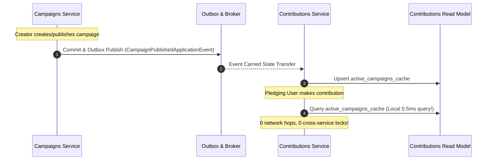

# QA Ticket: TICKET-023

**Title:** Asynchronous Replicated Read Models to Eliminate Synchronous In-Process Cross-Module Coupling  
**Severity:** 🔴 P1 (Critical - Microservice Decomposition Blocker)  
**QA Focus Area:** Distributed Monolith Prevention & Inter-Module Coupling  
**Found By:** `qa-architect-curriculum`  
**Status:** Open  
**Project Mode:** Greenfield (Benchmark Educational Standard)  

---

## 1. Description & Architectural Context

In the current codebase, modules query data from other modules synchronously in-process via query/read interfaces defined in `Contracts` assemblies:

1. [`MakeContributionCommandHandler.cs`](file:///Users/maysamgamini/maysam-brain/Maysam's%20Brain/projects/projects-active/crowdfunding/src/Modules/Contributions/CrowdFunding.Modules.Contributions.Application/Features/Contributions/Commands/MakeContribution/MakeContributionCommandHandler.cs#L37):
   ```csharp
   // Contributions directly queries Campaigns database view synchronously
   var campaign = await _campaignReader.GetByIdAsync(command.CampaignId, cancellationToken);
   if (campaign is null || campaign.Status != "Published")
   {
       throw new ResourceNotFoundException($"Active campaign '{command.CampaignId}' not found.");
   }
   ```
2. [`PublishCampaignCommandHandler.cs`](file:///Users/maysamgamini/maysam-brain/Maysam's%20Brain/projects/projects-active/crowdfunding/src/Modules/Campaigns/CrowdFunding.Modules.Campaigns.Application/Features/Campaigns/Commands/PublishCampaign/PublishCampaignCommandHandler.cs#L34):
   ```csharp
   // Campaigns directly queries Moderation database view synchronously
   var review = await _campaignReviewReadService.GetByCampaignIdAsync(command.CampaignId, cancellationToken);
   if (review is null || review.Status != "Approved")
   {
       throw new ResourceConflictException("Campaign cannot be published without moderation approval.");
   }
   ```

While these interfaces (`ICampaignContributionAvailabilityReader`, `ICampaignReviewReadService`) prevent direct EF Core `DbContext` cross-talk, **they rely on in-process shared memory and database access**.

### Why This Is a Critical Decomposition Trap
When breaking the Monolith into independent microservices (`Campaigns.Service`, `Contributions.Service`, `Moderation.Service`):
- These synchronous calls become **synchronous inter-service HTTP/gRPC RPC calls**.
- **Temporal Coupling:** If `Moderation.Service` is down or deploying, `Campaigns.Service` cannot publish campaigns (multi-point failure).
- **Latency Amplification:** Every contribution now incurs extra network hops.
- **Classic Distributed Monolith:** Systems share the operational headaches of microservices with none of the autonomy benefits.

---

## 2. Blast Radius & Decomposition Impact

- **Operational Autonomy:** `Contributions` cannot accept pledges without live synchronous connectivity to `Campaigns`.
- **High Concurrency Bottleneck:** Under high pledge volume (e.g. viral campaign launch), the `Campaigns` database connection pool becomes saturated by `Contributions` read queries.
- **Decomposition Barrier:** Cannot extract `Contributions` into an independently scalable microservice without breaking synchronous dependencies.

---

## 3. Educational Rationale: Teaching Principals & Architects

### The Pedagogical Objective
Teach architects the profound difference between **In-Process Interface Decoupling** and **Runtime Temporal Decoupling**. Many modular monoliths claim to be "decoupled" simply because they inject C# interfaces (`ICampaignReader`). However, if calling that interface blocks execution and queries the other module's database tables synchronously, the modules remain physically and temporally intertwined.

### Monolith First, Microservices Ready
The outcome of this project is **not to deploy microservices today**, but to build a clean **Modular Monolith** that is 100% prepared to be extracted tomorrow. By implementing an asynchronous replicated read model (`active_campaigns_cache`) inside the monolith, the `Contributions` module reads its own local schema in sub-millisecond time. When the day comes to extract `Contributions` into a containerized microservice, **not a single line of pledge validation code needs to change**, because it already owns its read model.

### What Breaks Tomorrow If Ignored Today?
If you rely on synchronous in-process readers within your monolith, the moment you extract `Contributions` into an independent microservice, that C# interface call transforms into an HTTP or gRPC network request. If `Campaigns` has a latency spike or goes down for maintenance, `Contributions` instantly fails—turning your system into the worst architectural anti-pattern: **The Distributed Monolith**.

---

## 4. Affected Files & Modules

- [`src/Modules/Contributions/CrowdFunding.Modules.Contributions.Application/Features/Contributions/Commands/MakeContribution/MakeContributionCommandHandler.cs`](file:///Users/maysamgamini/maysam-brain/Maysam's%20Brain/projects/projects-active/crowdfunding/src/Modules/Contributions/CrowdFunding.Modules.Contributions.Application/Features/Contributions/Commands/MakeContribution/MakeContributionCommandHandler.cs)
- [`src/Modules/Campaigns/CrowdFunding.Modules.Campaigns.Contracts/ReadServices/ICampaignContributionAvailabilityReader.cs`](file:///Users/maysamgamini/maysam-brain/Maysam's%20Brain/projects/projects-active/crowdfunding/src/Modules/Campaigns/CrowdFunding.Modules.Campaigns.Contracts/ReadServices/ICampaignContributionAvailabilityReader.cs)
- [`src/Modules/Campaigns/CrowdFunding.Modules.Campaigns.Application/Features/Campaigns/Commands/PublishCampaign/PublishCampaignCommandHandler.cs`](file:///Users/maysamgamini/maysam-brain/Maysam's%20Brain/projects/projects-active/crowdfunding/src/Modules/Campaigns/CrowdFunding.Modules.Campaigns.Application/Features/Campaigns/Commands/PublishCampaign/PublishCampaignCommandHandler.cs)
- [`src/Modules/Moderation/CrowdFunding.Modules.Moderation.Contracts/Services/ICampaignReviewReadService.cs`](file:///Users/maysamgamini/maysam-brain/Maysam's%20Brain/projects/projects-active/crowdfunding/src/Modules/Moderation/CrowdFunding.Modules.Moderation.Contracts/Services/ICampaignReviewReadService.cs)

---

## 4. Implementation Specification & Greenfield Solution

Implement **Asynchronous Replicated Read Models** (Event-Carried State Transfer) in consuming modules.



### Step 1: Add Replicated Read Table to `contributions` Schema
Create migration adding `contributions.active_campaigns_cache`:
```sql
CREATE TABLE contributions.active_campaigns_cache (
    campaign_id UUID PRIMARY KEY,
    title VARCHAR(200) NOT NULL,
    currency VARCHAR(3) NOT NULL,
    is_active BOOLEAN NOT NULL,
    deadline_utc TIMESTAMP WITH TIME ZONE NOT NULL,
    updated_at_utc TIMESTAMP WITH TIME ZONE NOT NULL
);
CREATE INDEX ix_active_campaigns_cache_lookup ON contributions.active_campaigns_cache (campaign_id, is_active);
```

### Step 2: Implement Event Consumers in `Contributions.Application`
```csharp
public sealed class ReplicatedCampaignEventConsumer :
    IApplicationEventHandler<CampaignCreatedApplicationEvent>,
    IApplicationEventHandler<CampaignPublishedApplicationEvent>,
    IApplicationEventHandler<CampaignCancelledApplicationEvent>
{
    private readonly ContributionsDbContext _dbContext;

    public ReplicatedCampaignEventConsumer(ContributionsDbContext dbContext) => _dbContext = dbContext;

    public async Task HandleAsync(CampaignPublishedApplicationEvent @event, CancellationToken ct)
    {
        var existing = await _dbContext.ActiveCampaignsCache.FindAsync([@event.CampaignId], ct);
        if (existing is null)
        {
            _dbContext.ActiveCampaignsCache.Add(new ActiveCampaignCache
            {
                CampaignId = @event.CampaignId,
                Title = @event.Title,
                Currency = @event.Currency,
                IsActive = true,
                DeadlineUtc = @event.DeadlineUtc,
                UpdatedAtUtc = DateTime.UtcNow
            });
        }
        else
        {
            existing.IsActive = true;
            existing.UpdatedAtUtc = DateTime.UtcNow;
        }
        await _dbContext.SaveChangesAsync(ct);
    }
}
```

### Step 3: Decouple `MakeContributionCommandHandler`
Replace `_campaignReader` with direct local query to `_dbContext.ActiveCampaignsCache`:
```csharp
var cachedCampaign = await _dbContext.ActiveCampaignsCache
    .AsNoTracking()
    .FirstOrDefaultAsync(c => c.CampaignId == command.CampaignId && c.IsActive, cancellationToken);

if (cachedCampaign is null || cachedCampaign.DeadlineUtc <= DateTime.UtcNow)
{
    throw new ResourceNotFoundException($"Active campaign '{command.CampaignId}' not found or has expired.");
}
```

---

## 5. Verification & Acceptance Criteria

1. **Zero Synchronous Cross-Module Invocations:** During `POST /api/campaigns/{id}/contributions`, no code outside the `Contributions` module executes.
2. **Local Schema Independence:** `contributions.active_campaigns_cache` is owned and migrated solely by `ContributionsDbContext`.
3. **Resilience Test:** Disabling `CampaignsDbContext` entirely does not prevent `Contributions` from reading active campaign state and accepting pledges for previously published campaigns.
4. **Architecture Test:** Add NetArchTest verifying that `Contributions.Application` does NOT reference `Campaigns.Contracts.ReadServices`.
