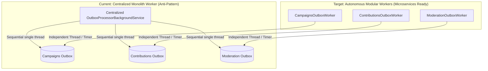

# QA Ticket: TICKET-025

**Title:** Modular Outbox Partitioning: Replace Monolithic Centralized Worker with Per-Module Background Processors  
**Severity:** 🟠 P1 (High - Architectural Coupling & Concurrency Starvation)  
**QA Focus Area:** Concurrency, Modular Monolith Autonomy & Outbox Resilience  
**Found By:** `qa-architect-curriculum`  
**Status:** Open  
**Project Mode:** Greenfield (Benchmark Educational Standard)  

---

## 1. Description & Architectural Context

In [`src/API/CrowdFunding.API/Background/OutboxProcessorBackgroundService.cs`](file:///Users/maysamgamini/maysam-brain/Maysam's%20Brain/projects/projects-active/crowdfunding/src/API/CrowdFunding.API/Background/OutboxProcessorBackgroundService.cs#L52-L60), a single centralized background service processes outbox messages across all bounded contexts:

```csharp
public async Task ProcessOutboxBatchAsync(CancellationToken cancellationToken)
{
    await using var scope = _serviceProvider.CreateAsyncScope();
    var services = scope.ServiceProvider;

    // Hardcoded sequential coupling across all three module DbContexts
    await ProcessModuleOutboxAsync<CampaignsDbContext>(services, "campaigns_outbox_messages", cancellationToken);
    await ProcessModuleOutboxAsync<ContributionsDbContext>(services, "contributions_outbox_messages", cancellationToken);
    await ProcessModuleOutboxAsync<ModerationDbContext>(services, "moderation_outbox_messages", cancellationToken);
}
```

### Why This Violates Architectural Autonomy
1. **API Host Coupling:** The API presentation layer directly knows about every internal module `DbContext` to drive their background outboxes.
2. **Sequential Starvation:** Outbox tables are drained sequentially on a single thread. If `contributions_outbox_messages` experiences a traffic spike (e.g., 5,000 pledges/minute during a viral launch), `campaigns_outbox_messages` and `moderation_outbox_messages` suffer starvation and processing delay.
3. **Decomposition Antipattern:** When extracting `Moderation` or `Contributions` into an autonomous microservice, the monolithic `OutboxProcessorBackgroundService` must be edited, recompiled, and redeployed to remove the extracted module's processing loop.

---

## 2. Blast Radius & Decomposition Impact

- **Microservice Extraction Friction:** A module cannot be lifted and shifted as a self-contained unit because its background asynchronous processing engine resides in the monolithic API host.
- **Blast Radius Propagation:** An unhandled crash or dead-lock during outbox processing in `Contributions` halts the outbox loop for `Campaigns` and `Moderation`.

---

## 3. Educational Rationale: Teaching Principals & Architects

### The Pedagogical Objective
Teach the principle of **Autonomous Vertical Slices extending through Background Processing**. In a clean modular architecture, a module is not just a collection of domain entities and controllers; it is a self-sustaining bounded context that must own its asynchronous background processing lifecycle.

### Monolith First, Microservices Ready
The goal is to maintain a **single deployable Modular Monolith**, but ensure that each module registers its own hosted service (`services.AddHostedService<CampaignsOutboxBackgroundService>()`) within its own infrastructure assembly. In the monolith, these workers run concurrently on independent thread pools inside the same web process. When the business decides to break out `Contributions` into an autonomous microservice, the module already contains its own fully functional background outbox engine; **zero outbox processing code needs to be extracted from the API host**.

### What Breaks Tomorrow If Ignored Today?
If you build a centralized outbox processor in the monolith host, extracting a module requires surgery on the monolith's core background services, creates deployment synchronization risks, and risks race conditions where the old monolith worker and the new microservice worker attempt to drain the same outbox simultaneously.

---

## 4. Affected Files & Modules

- [`src/API/CrowdFunding.API/Background/OutboxProcessorBackgroundService.cs`](file:///Users/maysamgamini/maysam-brain/Maysam's%20Brain/projects/projects-active/crowdfunding/src/API/CrowdFunding.API/Background/OutboxProcessorBackgroundService.cs)
- [`src/BuildingBlocks/CrowdFunding.BuildingBlocks.Infrastructure/Outbox/`](file:///Users/maysamgamini/maysam-brain/Maysam's%20Brain/projects/projects-active/crowdfunding/src/BuildingBlocks/CrowdFunding.BuildingBlocks.Infrastructure/)
- Module Infrastructure registrations: `CampaignsModuleRegistration.cs`, `ContributionsModuleRegistration.cs`, `ModerationModuleRegistration.cs`

---

## 4. Implementation Specification & Greenfield Solution

Transform outbox processing from a centralized coordinator into **autonomous, per-module hosted services**.



### Step 1: Create Generic `ModuleOutboxProcessor<TDbContext>` in `BuildingBlocks.Infrastructure`
```csharp
namespace CrowdFunding.BuildingBlocks.Infrastructure.Outbox;

public abstract class ModuleOutboxProcessor<TDbContext> : BackgroundService
    where TDbContext : DbContext
{
    private readonly IServiceProvider _serviceProvider;
    private readonly string _tableName;
    private readonly TimeSpan _interval;

    protected ModuleOutboxProcessor(IServiceProvider serviceProvider, string tableName, TimeSpan interval)
    {
        _serviceProvider = serviceProvider;
        _tableName = tableName;
        _interval = interval;
    }

    protected override async Task ExecuteAsync(CancellationToken stoppingToken)
    {
        using var timer = new PeriodicTimer(_interval);
        while (!stoppingToken.IsCancellationRequested)
        {
            await ProcessBatchAsync(stoppingToken);
            await timer.WaitForNextTickAsync(stoppingToken);
        }
    }

    public async Task ProcessBatchAsync(CancellationToken ct)
    {
        await using var scope = _serviceProvider.CreateAsyncScope();
        var db = scope.ServiceProvider.GetRequiredService<TDbContext>();
        var bus = scope.ServiceProvider.GetRequiredService<IMessageBus>();

        // Execute Claim & Publish using PostgreSQL FOR UPDATE SKIP LOCKED
        // Isolated completely to this module's context
    }
}
```

### Step 2: Implement Concrete Module Workers Inside Module Infrastructure
- `CampaignsModule.Infrastructure`: `CampaignsOutboxBackgroundService : ModuleOutboxProcessor<CampaignsDbContext>`
- `ContributionsModule.Infrastructure`: `ContributionsOutboxBackgroundService : ModuleOutboxProcessor<ContributionsDbContext>`
- `ModerationModule.Infrastructure`: `ModerationOutboxBackgroundService : ModuleOutboxProcessor<ModerationDbContext>`

### Step 3: Register in Module DI Extensions
In `AddCampaignsInfrastructure(this IServiceCollection services, IConfiguration config)`:
```csharp
services.AddHostedService<CampaignsOutboxBackgroundService>();
```
Now, when `Campaigns` is compiled into a standalone microservice executable (`CrowdFunding.Campaigns.Service`), its background outbox engine starts automatically with zero dependencies on external orchestrators.

---

## 5. Verification & Acceptance Criteria

1. **Independent Execution Threads:** Each module's outbox runs on its own independent `PeriodicTimer` and lifecycle.
2. **Zero Centralized References:** Remove `CrowdFunding.API/Background/OutboxProcessorBackgroundService.cs`. The API project contains 0 references to module outbox tables or background workers.
3. **Failure Isolation:** Simulating a continuous error or long processing delay in `Contributions` outbox does NOT delay or degrade `Campaigns` or `Moderation` event publishing.
4. **Integration Test Support:** Expose an `IOutboxDispatcher` marker interface on each worker allowing integration test fixtures to invoke `await factory.ProcessOutboxMessagesAsync<CampaignsDbContext>()` independently.
