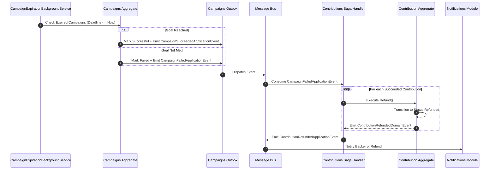

# QA Ticket: TICKET-027

**Title:** Distributed Crowdfunding Lifecycle: Deadline Expiration Background Worker & Event-Driven Refund Compensation Saga  
**Severity:** 🔴 P1 (Critical - Core Domain Incompleteness & Missing Distributed Saga Pattern)  
**QA Focus Area:** Domain Completeness, Asynchronous Choreography & Financial Compensation Sagas  
**Found By:** `qa-architect-curriculum`  
**Status:** Open  
**Project Mode:** Greenfield (Benchmark Educational Standard)  

---

## 1. Description & Architectural Context

In the current codebase, the crowdfunding lifecycle ends prematurely:
1. Campaigns transition to `Published`, but **never transition to `Successful` or `Failed`** based on deadline and funding goal.
2. If a campaign expires without reaching its goal, or if a creator cancels a campaign via `POST /api/campaigns/{id}/cancel`, **pledged funds remain permanently locked in `ContributionStatus.Succeeded`**.
3. There is no automated background scheduler to evaluate campaigns whose `DeadlineUtc <= DateTime.UtcNow`.

### Why This Is the Canonical Architectural Teaching Case
A primary reason to study Monolith-to-Microservices architecture is learning **how to handle multi-module business workflows without distributed 2PC (Two-Phase Commit) transactions**:
- `Campaigns` owns the aggregate state (`Published` $\to$ `Failed`).
- `Contributions` owns the financial ledger entries and payment gateway interactions.
- When `Campaigns` fails a campaign, it **must not** open a direct database transaction into `Contributions` to update rows.
- Instead, it must publish `CampaignFailedApplicationEvent` via the Transactional Outbox.
- `Contributions` consumes the event asynchronously and executes a **Compensating Action** (the Refund Saga).

Without this workflow implemented, the codebase fails to demonstrate the very problem that event choreography and outboxes are designed to solve.

---

## 2. Blast Radius & Decomposition Impact

- **Core Domain Defect:** Campaigns can run indefinitely beyond their deadlines without reaching resolution.
- **Financial Risk:** In a real crowdfunding platform, failing to refund backers on canceled or failed campaigns is a severe compliance violation.
- **Architectural Omission:** Principal engineers and architects cannot see an end-to-end example of **Saga Choreography with Compensating Transactions**.

---

## 3. Educational Rationale: Teaching Principals & Architects

### The Pedagogical Objective
Teach the mechanics of **Event-Driven Choreographed Sagas with Compensating Actions** (handling distributed business transactions without Two-Phase Commit / 2PC).

### Monolith First, Microservices Ready
The outcome of this project is a **Modular Monolith, NOT deployed microservices**. However, if you build a monolith where cancelling a campaign opens a single SQL transaction that modifies both `campaigns.campaigns` and `contributions.contributions`, you have introduced a physical database foreign-key transaction coupling. By enforcing the boundary inside the monolith—where `Campaigns` updates only its own aggregate and emits `CampaignCancelledApplicationEvent` into its outbox, and `Contributions` reacts asynchronously to refund backers—the Monolith operates with **100% microservice-ready transaction boundaries**.

### What Breaks Tomorrow If Ignored Today?
If you rely on a single multi-module database transaction in your monolith, when you later separate `Campaigns` and `Contributions` into distinct services or databases, your cancellation and refund logic instantly shatters. You would be forced to redesign your financial transaction model from scratch under production deadlines.

---

## 4. Affected Files & Modules

- [`src/Modules/Campaigns/CrowdFunding.Modules.Campaigns.Domain/Aggregates/Campaign.cs`](file:///Users/maysamgamini/maysam-brain/Maysam's%20Brain/projects/projects-active/crowdfunding/src/Modules/Campaigns/CrowdFunding.Modules.Campaigns.Domain/Aggregates/Campaign.cs)
- [`src/Modules/Campaigns/CrowdFunding.Modules.Campaigns.Contracts/Events/`](file:///Users/maysamgamini/maysam-brain/Maysam's%20Brain/projects/projects-active/crowdfunding/src/Modules/Campaigns/CrowdFunding.Modules.Campaigns.Contracts/Events/)
- [`src/Modules/Contributions/CrowdFunding.Modules.Contributions.Domain/Aggregates/Contribution.cs`](file:///Users/maysamgamini/maysam-brain/Maysam's%20Brain/projects/projects-active/crowdfunding/src/Modules/Contributions/CrowdFunding.Modules.Contributions.Domain/Aggregates/Contribution.cs)
- [`src/Modules/Contributions/CrowdFunding.Modules.Contributions.Application/Features/Contributions/`](file:///Users/maysamgamini/maysam-brain/Maysam's%20Brain/projects/projects-active/crowdfunding/src/Modules/Contributions/CrowdFunding.Modules.Contributions.Application/Features/Contributions/)

---

## 4. Implementation Specification & Greenfield Solution



### Step 1: Extend Domain Enums & Aggregate Methods

#### In `Campaigns.Domain`:
- Add states to `CampaignStatus`: `Successful = 3`, `Failed = 4`.
- Add domain methods:
  ```csharp
  public void CompleteSuccessfully(DateTime now)
  {
      if (Status != CampaignStatus.Published) throw new InvalidOperationException(...);
      if (CurrentBalance.Amount < TargetAmount.Amount) throw new InvalidOperationException("Goal not reached.");
      Status = CampaignStatus.Successful;
      AddDomainEvent(new CampaignSucceededDomainEvent(Id, CurrentBalance.Amount, now));
  }

  public void MarkFailed(DateTime now)
  {
      if (Status != CampaignStatus.Published) throw new InvalidOperationException(...);
      if (CurrentBalance.Amount >= TargetAmount.Amount) throw new InvalidOperationException("Goal was reached.");
      Status = CampaignStatus.Failed;
      AddDomainEvent(new CampaignFailedDomainEvent(Id, CurrentBalance.Amount, TargetAmount.Amount, now));
  }
  ```

#### In `Contributions.Domain`:
- Add `Refunded = 3` to `ContributionStatus`.
- Add `Refund(DateTime now)` to `Contribution` aggregate:
  ```csharp
  public void Refund(DateTime now)
  {
      if (Status != ContributionStatus.Succeeded)
      {
          throw new InvalidOperationException($"Cannot refund contribution with status '{Status}'.");
      }
      Status = ContributionStatus.Refunded;
      UpdatedAtUtc = now;
      AddDomainEvent(new ContributionRefundedDomainEvent(Id, CampaignId, ContributorId, Amount.Amount, Amount.Currency, now));
  }
  ```

### Step 2: Implement Expiration Background Worker
Add `CampaignExpirationBackgroundService` in `Campaigns.Infrastructure`:
```csharp
public sealed class CampaignExpirationBackgroundService : BackgroundService
{
    private readonly IServiceProvider _serviceProvider;
    private static readonly TimeSpan Interval = TimeSpan.FromMinutes(1);

    // Queries published campaigns where DeadlineUtc <= UtcNow
    // Dispatches CompleteCampaignCommand or FailCampaignCommand
}
```

### Step 3: Implement Saga Compensation Consumer in `Contributions.Application`
```csharp
public sealed class CampaignTerminationRefundHandler :
    IApplicationEventHandler<CampaignFailedApplicationEvent>,
    IApplicationEventHandler<CampaignCancelledApplicationEvent>
{
    private readonly IContributionRepository _contributionRepository;
    private readonly ITransactionExecutor _transactionExecutor;
    private readonly IDateTimeProvider _dateTimeProvider;

    public async Task HandleAsync(CampaignFailedApplicationEvent @event, CancellationToken ct)
    {
        await ProcessRefundsForCampaignAsync(@event.CampaignId, ct);
    }

    public async Task HandleAsync(CampaignCancelledApplicationEvent @event, CancellationToken ct)
    {
        await ProcessRefundsForCampaignAsync(@event.CampaignId, ct);
    }

    private async Task ProcessRefundsForCampaignAsync(Guid campaignId, CancellationToken ct)
    {
        var contributions = await _contributionRepository.GetSucceededByCampaignIdAsync(campaignId, ct);
        foreach (var contribution in contributions)
        {
            await _transactionExecutor.ExecuteAsync(async () =>
            {
                contribution.Refund(_dateTimeProvider.UtcNow);
                await _contributionRepository.UpdateAsync(contribution, ct);
            }, ct);
        }
    }
}
```

---

## 5. Verification & Acceptance Criteria

1. **Automated Expiration Verification:** Unit and integration tests verify that a published campaign with a past deadline transitions to `Successful` if funded and `Failed` if under-funded.
2. **End-to-End Refund Saga Test:** Create integration test where a campaign with 3 contributions is cancelled:
   - Verify outbox propagates `CampaignCancelledApplicationEvent`.
   - Verify all 3 contributions transition to `ContributionStatus.Refunded`.
   - Verify outbox emits 3 `ContributionRefundedApplicationEvent`s.
3. **Idempotency:** Re-delivering `CampaignCancelledApplicationEvent` does not produce double-refunds or throw exceptions.
