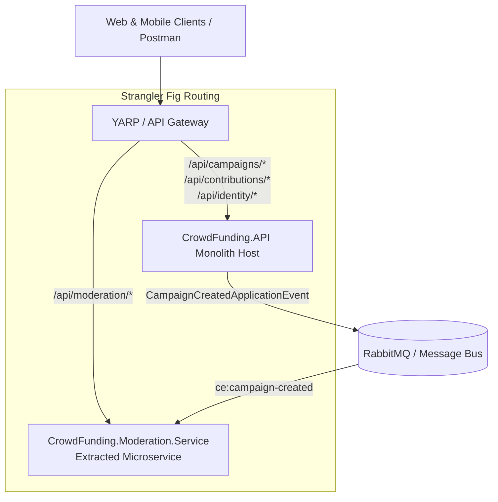

# QA Ticket: TICKET-029

**Title:** Microservice Extraction Proof-of-Concept: Standalone Service Host (`CrowdFunding.Moderation.Service`) & Dockerized Strangler Fig Template  
**Severity:** 🟠 P1 (High - Tangible Demonstration of Microservice Extraction)  
**QA Focus Area:** Architecture Proof-of-Concept, Strangler Fig Pattern & DevOps Containerization  
**Found By:** `qa-architect-curriculum`  
**Status:** Fixed  
**Project Mode:** Greenfield (Benchmark Educational Standard)  

---

## 1. Description & Architectural Context

The primary architectural promise of this repository is:
> *"A Modular Monolith designed so that any module can be extracted into an independent microservice with zero rewrites of domain or business logic."*

While the current codebase strictly isolates assemblies (`Contracts`, `Application`, `Domain`, `Infrastructure`), **it lacks a concrete extracted microservice project**.

Without a working, deployable microservice host demonstrating extraction in practice:
1. The claim remains theoretical.
2. Learners cannot observe how an extracted service configures its own `Program.cs`, ASP.NET Core web host, OpenAPI specification, and RabbitMQ/Kafka event consumers.
3. Learners cannot see how an API Gateway (or Reverse Proxy like YARP / NGINX) routes traffic according to the **Strangler Fig Pattern** (`/api/moderation/*` directed to the microservice while `/api/*` remains with the Monolith).

---

## 2. Blast Radius & Decomposition Impact

- **Absence of Tangible Proof:** Principal engineers and architects evaluating this project cannot run an automated extraction smoke test.
- **DevOps Gap:** Missing Docker containerization and Docker Compose orchestration showing the Monolith and the Extracted Service running simultaneously.

---

## 3. Educational Rationale: Teaching Principals & Architects

### The Pedagogical Objective
Demonstrate the **Strangler Fig Pattern & Empirical Verification of Modular Boundaries**. It is trivial to claim on a whiteboard that a monolith is "microservices-ready." True architectural verification requires proving empirically that a bounded context can be hosted in a separate process container without modifying a single line of its domain or application logic.

### Monolith First, Microservices Ready
**Crucial Architectural Clarification:** The outcome of this project is **NOT to convert this repository into microservices**. The primary deliverable remains a single, robust, unified **Modular Monolith**. This ticket does not dismantle the monolith; instead, it introduces an optional demonstration host (`CrowdFunding.Moderation.Service`) in a `services/` directory to serve as living, executable proof for students and architects. It shows that because our monolith enforced Contract Assemblies, Schema Isolation, and Asymmetric JWKS Authentication, extracting a module requires only a new `Program.cs` host assembly.

### What Breaks Tomorrow If Ignored Today?
Without a tangible verification template, architecture teams often design "modular monoliths" that suffer from hidden coupling—such as shared static state, in-memory singletons, or unmapped direct assembly dependencies—which only surface months later during a botched production microservice migration.

---

## 4. Affected Files & Modules

- Creation of `services/CrowdFunding.Moderation.Service/`
- Root `docker-compose.yml` and `Dockerfile`
- Reference to [`educational/03-engineering-spec-and-roadmap/deconstruction-walkthrough.md`](file:///Users/maysamgamini/maysam-brain/Maysam's%20Brain/projects/projects-active/crowdfunding/educational/03-engineering-spec-and-roadmap/deconstruction-walkthrough.md)

---

## 4. Implementation Specification & Greenfield Solution

Implement `CrowdFunding.Moderation.Service` as an independent web API microservice using the exact 5-step operational runbook.



### Step 1: Project Setup
Create `services/CrowdFunding.Moderation.Service/CrowdFunding.Moderation.Service.csproj`:
```xml
<Project Sdk="Microsoft.NET.Sdk.Web">
  <PropertyGroup>
    <TargetFramework>net10.0</TargetFramework>
    <Nullable>enable</Nullable>
    <ImplicitUsings>enable</ImplicitUsings>
  </PropertyGroup>

  <ItemGroup>
    <ProjectReference Include="..\..\src\Modules\Moderation\CrowdFunding.Modules.Moderation.Application\CrowdFunding.Modules.Moderation.Application.csproj" />
    <ProjectReference Include="..\..\src\Modules\Moderation\CrowdFunding.Modules.Moderation.Infrastructure\CrowdFunding.Modules.Moderation.Infrastructure.csproj" />
    <ProjectReference Include="..\..\src\Modules\Moderation\CrowdFunding.Modules.Moderation.Contracts\CrowdFunding.Modules.Moderation.Contracts.csproj" />
    <ProjectReference Include="..\..\src\Modules\Campaigns\CrowdFunding.Modules.Campaigns.Contracts\CrowdFunding.Modules.Campaigns.Contracts.csproj" />
  </ItemGroup>
</Project>
```
*Note: Notice that ZERO domain code is copied or rewritten. It simply references the pre-existing isolated module projects!*

### Step 2: Microservice `Program.cs`
```csharp
var builder = WebApplication.CreateBuilder(args);

builder.Services.AddControllers();
builder.Services.AddEndpointsApiExplorer();
builder.Services.AddSwaggerGen();

// Register the extracted module dependencies
builder.Services.AddModerationApplication();
builder.Services.AddModerationInfrastructure(builder.Configuration);
builder.Services.AddCrowdFundingMessaging(builder.Configuration);

// Add decentralized JWT Bearer authentication (validating tokens offline via JWKS)
builder.Services.AddAuthentication(JwtBearerDefaults.AuthenticationScheme)
    .AddJwtBearer(options =>
    {
        options.Authority = builder.Configuration["Authentication:Authority"];
        options.TokenValidationParameters = new TokenValidationParameters
        {
            ValidateIssuer = true,
            ValidateAudience = false
        };
    });

var app = builder.Build();

app.UseSwagger();
app.UseSwaggerUI();
app.UseAuthentication();
app.UseAuthorization();
app.MapControllers();

app.Run();
```

### Step 3: Docker Compose Multi-Service Setup
Provide `docker-compose.microservices.yml` running:
- `monolith-api`: Main platform running on port 8080 (with Moderation disabled).
- `moderation-service`: Extracted service running on port 8082.
- `rabbitmq`: Messaging broker routing CloudEvents.
- `postgres`: Database hosting the schemas.

---

## 5. Verification & Acceptance Criteria

1. **Independent Process Execution:** `CrowdFunding.Moderation.Service` builds and runs independently without referencing `CrowdFunding.API.dll` or any other module's `Application`/`Domain` assemblies.
2. **Zero Code Duplication:** Review and approval logic runs purely through the unchanged `CrowdFunding.Modules.Moderation.*` assemblies.
3. **Decentralized Authentication:** An admin JWT token generated by `Identity` can be used to call `POST http://localhost:8082/api/moderation/reviews/{id}/approve` successfully.
4. **Automated Smoke Test:** Add an automated integration test exercising the extracted service container alongside the Monolith.
