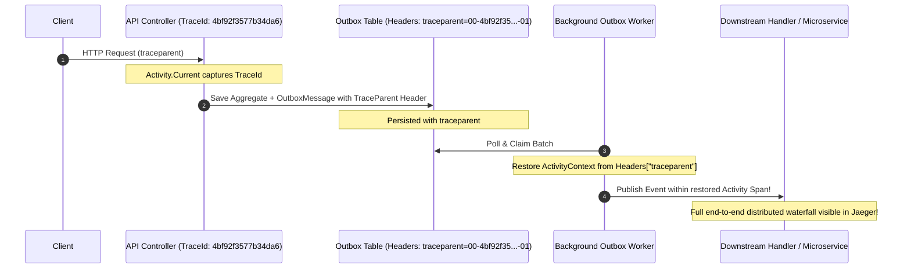

# QA Ticket: TICKET-030

**Title:** Distributed Tracing: OpenTelemetry W3C `traceparent` & Correlation Context Propagation Across Outbox Boundaries  
**Severity:** 🟡 P2 (Medium - Enterprise Observability & Distributed Systems Diagnostics)  
**QA Focus Area:** Distributed Tracing, OpenTelemetry & Cross-Boundary Observability  
**Found By:** `qa-architect-curriculum`  
**Status:** Open  
**Project Mode:** Greenfield (Benchmark Educational Standard)  

---

## 1. Description & Architectural Context

When a client initiates an HTTP request (such as `POST /api/campaigns/{id}/contributions`), ASP.NET Core initializes an OpenTelemetry / .NET `Activity` with a unique W3C `TraceId` and `SpanId`.

When that request saves an outbox event, [`OutboxMessage.cs`](file:///Users/maysamgamini/maysam-brain/Maysam's%20Brain/projects/projects-active/crowdfunding/src/BuildingBlocks/CrowdFunding.BuildingBlocks.Infrastructure/Persistence/OutboxMessage.cs#L19-L29) serializes only the domain payload:
```csharp
private OutboxMessage(Guid id, string eventType, int version, string payload, DateTime occurredOnUtc)
```
There is no `Headers` column or correlation metadata stored in the outbox table schema.

### Why This Is an Observability Failure in Microservices
When the background outbox worker polls and claims the message:
1. The background loop executes in a separate thread/task context where `Activity.Current` is null or a new synthetic timer trace.
2. The event handler or external message bus publish creates a **brand-new unrelated Trace ID**.
3. **Trace Broken:** In Jaeger, Zipkin, or OpenTelemetry dashboards, the causal link between the user's HTTP request and the downstream event handling (e.g. SignalR notifications, ledger updates, emails) is completely severed.
4. Developers and SREs cannot trace a transaction end-to-end across service boundaries.

---

## 2. Blast Radius & Decomposition Impact

- **Loss of Distributed Causality:** Cannot perform distributed latency profiling or root-cause analysis when an outbox message fails or encounters deadlocks in another module.
- **Audit & Compliance Impairment:** Cannot correlate background financial ledger entries with the initiating HTTP user session.

---

## 3. Affected Files & Modules

- [`src/BuildingBlocks/CrowdFunding.BuildingBlocks.Infrastructure/Persistence/OutboxMessage.cs`](file:///Users/maysamgamini/maysam-brain/Maysam's%20Brain/projects/projects-active/crowdfunding/src/BuildingBlocks/CrowdFunding.BuildingBlocks.Infrastructure/Persistence/OutboxMessage.cs)
- [`src/API/CrowdFunding.API/Background/OutboxProcessorBackgroundService.cs`](file:///Users/maysamgamini/maysam-brain/Maysam's%20Brain/projects/projects-active/crowdfunding/src/API/CrowdFunding.API/Background/OutboxProcessorBackgroundService.cs)
- All module Outbox table configurations and migrations (`campaigns_outbox_messages`, `contributions_outbox_messages`, `moderation_outbox_messages`).

---

## 4. Implementation Specification & Greenfield Solution

Implement **W3C Distributed Trace Context Propagation** via JSON headers in `OutboxMessage`.



### Step 1: Add `Headers` Property to `OutboxMessage`
```csharp
public sealed class OutboxMessage
{
    // ...
    public string Headers { get; private set; } = "{}";

    public static OutboxMessage Create(object applicationEvent, DateTime occurredOnUtc)
    {
        var headers = new Dictionary<string, string>();

        // Capture ambient OpenTelemetry Activity
        var currentActivity = Activity.Current;
        if (currentActivity is not null)
        {
            headers["traceparent"] = currentActivity.Id ?? string.Empty;
            if (currentActivity.TraceStateString is not null)
            {
                headers["tracestate"] = currentActivity.TraceStateString;
            }
        }

        return new OutboxMessage(...)
        {
            Headers = JsonSerializer.Serialize(headers, SerializerOptions)
        };
    }
}
```

### Step 2: Database Migration
Add `headers text NOT NULL DEFAULT '{}'` column to:
- `campaigns.campaigns_outbox_messages`
- `contributions.contributions_outbox_messages`
- `moderation.moderation_outbox_messages`

### Step 3: Restore `ActivityContext` in Outbox Worker
Before dispatching to `IEventPublisher` or `IMessageBus`:
```csharp
var headers = JsonSerializer.Deserialize<Dictionary<string, string>>(message.Headers) ?? [];
ActivitySource source = new("CrowdFunding.Outbox");

ActivityContext parentContext = default;
if (headers.TryGetValue("traceparent", out var traceparent) && !string.IsNullOrWhiteSpace(traceparent))
{
    ActivityContext.TryParse(traceparent, headers.GetValueOrDefault("tracestate"), out parentContext);
}

using var activity = source.StartActivity(
    $"Outbox.Process {message.EventType}",
    ActivityKind.Consumer,
    parentContext);

await bus.PublishAsync(applicationEvent, cancellationToken);
```

---

## 5. Verification & Acceptance Criteria

1. **W3C Standard Compliance:** Emitted outbox messages preserve valid `traceparent` headers matching the initiating HTTP request span.
2. **Span Parent-Child Hierarchy:** In OpenTelemetry traces, the outbox dispatch and event handler activities appear as direct child spans of the HTTP request span.
3. **Fallback Resilience:** When an event is queued outside an HTTP request context (e.g. CLI seeder or background cron), the outbox processor starts a new root trace cleanly without throwing null reference exceptions.
4. **Integration Test:** Add an integration test using `ActivityListener` verifying that publishing an event via the outbox retains the exact same `TraceId` from the initiating HTTP call.
