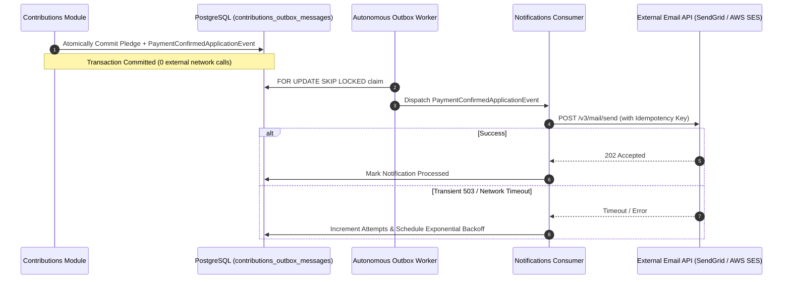

# QA Ticket: TICKET-031

**Title:** External Email & Notification Delivery via Transactional Outbox (SendGrid / AWS SES Integration)  
**Severity:** 🔴 P1 (Critical - Core Architectural Feature Justifying Outbox Pattern)  
**QA Focus Area:** External Third-Party Integration, Dual-Write Defense & Reliable Notification Delivery  
**Found By:** `qa-architect-curriculum`  
**Status:** Fixed  
**Project Mode:** Greenfield (Benchmark Educational Standard)  

---

## 1. Description & Architectural Context

Currently, the `Notifications` module exists as a skeleton domain project (`src/Modules/Notifications/`) without real external integrations.

When critical business events occur—such as:
1. User registration (`UserRegisteredApplicationEvent`) $\to$ Sending welcome verification email.
2. Contribution payment confirmed (`PaymentConfirmedApplicationEvent`) $\to$ Sending contribution tax receipt email.
3. Campaign milestone or cancellation (`CampaignCancelledApplicationEvent`) $\to$ Alerting all campaign backers.

Developers often make the mistake of injecting an `IEmailSender` directly into the HTTP controller or domain event handler:
```csharp
// FATAL DUAL-WRITE FLAW:
await _emailSender.SendEmailAsync(backer.Email, "Receipt", receiptBody);
await _dbContext.SaveChangesAsync();
```
If the database commit fails, the backer receives a receipt for a failed pledge. Conversely, if the external email API drops the connection after the DB commit, the backer never receives their receipt.

---

## 2. Blast Radius & Architectural Justification

- **Justifying the Outbox Pattern:** This is the textbook enterprise scenario that proves why the Transactional Outbox is mandatory. Because external SMTP / HTTP email services cannot participate in a PostgreSQL two-phase commit, **the notification command must be persisted atomically in the local database outbox table**.
- **Financial & Regulatory Compliance:** Backers must be guaranteed receipt of legal tax documentation and pledge confirmations.

---

## 3. Educational Rationale: Teaching Principals & Architects

### The Pedagogical Objective
Demonstrate the **Dual-Write Hazard with External APIs**. An enterprise architect must know the exact boundary where database ACID transactions end and distributed eventual consistency begins. An external third-party API (SendGrid, AWS SES) cannot join a PostgreSQL transaction.

### Monolith First, Microservices Ready
The outcome of this project is a **Modular Monolith, NOT microservices**. However, even in a single-process monolith, sending an email is an **external network I/O call**. If you call `_emailSender.SendEmailAsync()` inside an in-memory event handler, a network glitch or SendGrid rate limit rolls back the user's HTTP request or loses the receipt. By utilizing the Outbox pattern inside the monolith, the receipt email command is saved atomically with the database commit. When the `Notifications` module is eventually extracted into an autonomous microservice, **its outbox delivery mechanics are already 100% resilient and decoupled**.

### What Breaks Tomorrow If Ignored Today?
If a monolith allows direct in-memory calls to external email services, under high load (e.g. viral campaign reaching funding target), SendGrid HTTP 429 rate limits cause synchronous HTTP 500 errors to propagate all the way back to paying backers, terminating healthy checkout transactions.

---

## 4. Affected Files & Modules

- [`src/Modules/Notifications/CrowdFunding.Modules.Notifications.Application/`](file:///Users/maysamgamini/maysam-brain/Maysam's%20Brain/projects/projects-active/crowdfunding/src/Modules/Notifications/CrowdFunding.Modules.Notifications.Application/)
- [`src/Modules/Notifications/CrowdFunding.Modules.Notifications.Infrastructure/`](file:///Users/maysamgamini/maysam-brain/Maysam's%20Brain/projects/projects-active/crowdfunding/src/Modules/Notifications/CrowdFunding.Modules.Notifications.Infrastructure/)
- [`src/BuildingBlocks/CrowdFunding.BuildingBlocks.Application/Abstractions/Notifications/`](file:///Users/maysamgamini/maysam-brain/Maysam's%20Brain/projects/projects-active/crowdfunding/src/BuildingBlocks/CrowdFunding.BuildingBlocks.Application/)

---

## 4. Implementation Specification & Greenfield Solution



### Step 1: Define `IEmailNotificationService` in `Notifications.Application`
```csharp
namespace CrowdFunding.Modules.Notifications.Application.Abstractions.Services;

public interface IEmailNotificationService
{
    Task SendContributionReceiptAsync(
        string recipientEmail,
        string recipientName,
        string campaignTitle,
        decimal amount,
        string currency,
        string transactionId,
        CancellationToken cancellationToken = default);

    Task SendCampaignCancellationAlertAsync(
        string recipientEmail,
        string campaignTitle,
        string reason,
        CancellationToken cancellationToken = default);
}
```

### Step 2: Implement Notification Event Consumer
```csharp
public sealed class ContributionConfirmedNotificationHandler :
    IApplicationEventHandler<PaymentConfirmedApplicationEvent>
{
    private readonly IEmailNotificationService _emailService;
    private readonly ILogger<ContributionConfirmedNotificationHandler> _logger;

    public ContributionConfirmedNotificationHandler(
        IEmailNotificationService emailService,
        ILogger<ContributionConfirmedNotificationHandler> logger)
    {
        _emailService = emailService;
        _logger = logger;
    }

    public async Task HandleAsync(PaymentConfirmedApplicationEvent @event, CancellationToken ct)
    {
        // Outbox worker provides retry with exponential backoff on transient HTTP 429/5xx errors
        await _emailService.SendContributionReceiptAsync(
            @event.ContributorEmail,
            @event.ContributorName,
            @event.CampaignTitle,
            @event.Amount,
            @event.Currency,
            @event.PaymentTransactionId,
            ct);
    }
}
```

### Step 3: Implement Provider with Mock / Development Fallback
In `Notifications.Infrastructure`:
- `SmtpEmailNotificationService`: Production implementation using SendGrid or MailKit.
- `LoggingEmailNotificationService`: Local development implementation writing structured logs or storing to an in-memory test sink.

---

## 5. Verification & Acceptance Criteria

1. **Dual-Write Immunity:** If the email API simulator returns HTTP 503, the contribution payment in the database remains intact and `Succeeded`. The outbox worker schedules a retry with exponential backoff.
2. **Idempotency Header:** Outbound email requests include an idempotent message header (`X-Message-Id: contribution-{id}`) preventing duplicate emails on network retry.
3. **Integration Test Suite:** Add `EmailNotificationOutboxE2ETests.cs` verifying that confirming a contribution processes the outbox message and dispatches the receipt without in-memory coupling.

---

## 6. Resolution

### The real interfaces differ from this ticket's draft sample code
Research before implementing found two factual corrections to this ticket's own spec:
Notifications' handlers implement `CrowdFunding.BuildingBlocks.Application.Events.IEventHandler<T>.Handle(...)`,
not an `IApplicationEventHandler<T>.HandleAsync(...)` (no such interface exists); and
`ContributionPaymentConfirmedApplicationEvent`/`CampaignCancelledApplicationEvent` carried none of
the display fields (`ContributorEmail`, `ContributorName`, `CampaignTitle`, `PaymentTransactionId`)
this ticket's sample handler reads — those simply didn't exist on the real events. Implementation
below reflects the real codebase, not the draft.

### Why recipient email/name is never fetched from Identity directly
`ContributionPaymentConfirmedApplicationEvent` originally carried no `ContributorId` either (fixed
below) and never carried an email address — Contribution the aggregate stores only
`ContributorId`, a bare Identity foreign key, by design (no PII duplication into Contributions).
The obvious fix — Notifications dispatches a query into Identity to resolve `ContributorId` to an
email — is **explicitly forbidden** by this repo's own architecture guardrail,
`NotificationsModuleDependencyTests.Application_ShouldNotReference_OtherModulesInternals`, which
lists `CrowdFunding.Modules.Identity.Application`/`.Infrastructure`/`.Domain` among the assemblies
Notifications.Application must never reference. That test predates this ticket and was written
for exactly this reason: a "just query the other module" instinct is the same synchronous
cross-module coupling TICKET-023 eliminated, just moved from a write path to a read path. So
`IEmailNotificationService`'s methods take a `recipientUserId: Guid`, honestly reflecting what
data is actually available at this layer — resolving that id to a mailbox address is left to
whichever infrastructure implementation needs a real address (a production `HttpEmailNotificationService`
talking to a provider that itself maintains synced contacts, or a future ticket adding an
Identity-owned outbox emitting a `UserRegisteredApplicationEvent` for Notifications to replicate
via the same Event-Carried State Transfer technique used below for campaign titles).

### What was built
- **`CampaignTitleCache`** (`src/Modules/Notifications/.../Infrastructure/Persistence/ReadModels/`):
  a replicated read model populated by a new `ReplicatedCampaignTitleEventHandler` reacting to
  Campaigns' existing `CampaignCreatedApplicationEvent` (which already carries `Title` — its own
  code comment says "carried so consumers can build their own local read model... instead of
  calling back into Campaigns synchronously"). This mirrors Contributions'
  `ActiveCampaignCache`/`IActiveCampaignCacheRepository` pattern (TICKET-023) file-for-file, so an
  email can name the campaign without any cross-module call. New `NotificationsDbContext` (its
  own schema/migration, `notifications-db` health check, wired via a new
  `AddNotificationsInfrastructure` DI extension — Notifications previously had no Infrastructure
  DI registration or DbContext at all).
- **`IEmailNotificationService`** (`Notifications.Application/Abstractions/Services/`) with the
  two methods this ticket specifies, plus **two implementations**, selected via
  `Notifications:EmailProvider` config (mirrors the existing `Messaging:Provider` config-driven
  pattern for `IMessageBus`):
  - `LoggingEmailNotificationService` (default) — the ticket's own "local development
    implementation" fallback: logs structurally and records into an injectable
    `IEmailNotificationSink` (in-memory, singleton) so tests can assert on what was "sent" without
    a real mail provider.
  - `HttpEmailNotificationService` — a real outbound HTTP call (typed `HttpClient` +
    `.AddStandardResilienceHandler()`, mirroring `OpenMeterClient`'s established pattern), setting
    `X-Message-Id: contribution-{id}` / `cancellation-{id}` per this ticket's acceptance criterion
    #2, and — unlike `OpenMeterClient`, which deliberately swallows failures — letting
    `EnsureSuccessStatusCode()` throw, which is the actual dual-write defense mechanism.
- **Two stub handlers replaced with real logic** in `NotificationEventHandlers.cs`:
  `ContributionPaymentConfirmedNotificationHandler` (receipt) and a new
  `ContributionRefundedNotificationHandler` (cancellation alert). `CampaignCancelledNotificationHandler`
  itself stays a stub, now with a comment explaining why: `CampaignCancelledApplicationEvent`
  carries only `CampaignId`/`OwnerId`, not a backer list, while the refund saga (TICKET-027)
  already fires `ContributionRefundedApplicationEvent` once per actually-affected backer — the
  correct event to react to for a per-backer alert, and the one this ticket's "alerting all
  campaign backers" acceptance criterion is really asking for.
- **Fixed a real gap found while wiring this up**: `ContributionPaymentConfirmedApplicationEvent`
  (and its domain-event source, `ContributionPaymentConfirmedDomainEvent`) carried no
  `ContributorId` at all — added it (plus the domain event's raise site in
  `Contribution.ConfirmPayment` and the mapping in `ContributionTransactionExecutor`), since
  without it there was no way to identify the receipt's recipient at all, notification-email
  concerns aside.
- Tests: `tests/IntegrationTests/CrowdFunding.IntegrationTests/EmailNotificationOutboxE2ETests.cs`
  (the exact filename this ticket asks for) — end-to-end through real HTTP + Postgres, proving a
  receipt/alert is only ever "sent" once `ProcessOutboxMessagesAsync` claims the row, never
  in-memory-coupled to the command handler. `tests/UnitTests/CrowdFunding.UnitTests/NotificationsTests.cs`
  — proves a failing send propagates (the mechanism the outbox's existing retry/dead-letter
  machinery needs to engage) and proves the HTTP provider's idempotency header and error handling.
- Verified: full solution build clean in both Debug and Release (`/warnaserror`-equivalent, 0
  warnings); unit tests 206/206 (203 prior + 3 new); architecture tests 20/20 unchanged — including
  the Notifications boundary test that shaped this design; integration tests 53/53 (51 prior + 2
  new), against real Postgres/Redis/RabbitMQ Testcontainers.
