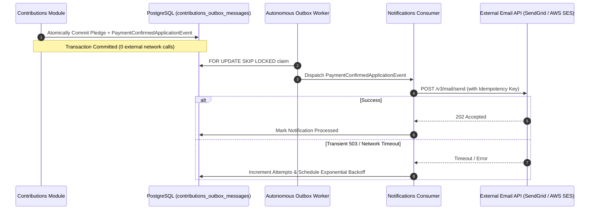

# QA Ticket: TICKET-031

**Title:** External Email & Notification Delivery via Transactional Outbox (SendGrid / AWS SES Integration)  
**Severity:** 🔴 P1 (Critical - Core Architectural Feature Justifying Outbox Pattern)  
**QA Focus Area:** External Third-Party Integration, Dual-Write Defense & Reliable Notification Delivery  
**Found By:** `qa-architect-curriculum`  
**Status:** Open  
**Project Mode:** Greenfield (Benchmark Educational Standard)  

---

## 1. Description & Architectural Context

Currently, the `Notifications` module exists as a skeleton domain project (`src/Modules/Notifications/`) without real external integrations.

When critical business events occur—such as:
1. User registration (`UserRegisteredApplicationEvent`) $\to$ Sending welcome verification email.
2. Contribution payment confirmed (`PaymentConfirmedApplicationEvent`) $\to$ Sending contribution tax receipt email.
3. Campaign milestone or cancellation (`CampaignCancelledApplicationEvent`) $\to$ Alerting all campaign backers.

Developers often make the mistake of injecting an `IEmailSender` directly into the HTTP controller or domain event handler:
```csharp
// FATAL DUAL-WRITE FLAW:
await _emailSender.SendEmailAsync(backer.Email, "Receipt", receiptBody);
await _dbContext.SaveChangesAsync();
```
If the database commit fails, the backer receives a receipt for a failed pledge. Conversely, if the external email API drops the connection after the DB commit, the backer never receives their receipt.

---

## 2. Blast Radius & Architectural Justification

- **Justifying the Outbox Pattern:** This is the textbook enterprise scenario that proves why the Transactional Outbox is mandatory. Because external SMTP / HTTP email services cannot participate in a PostgreSQL two-phase commit, **the notification command must be persisted atomically in the local database outbox table**.
- **Financial & Regulatory Compliance:** Backers must be guaranteed receipt of legal tax documentation and pledge confirmations.

---

## 3. Affected Files & Modules

- [`src/Modules/Notifications/CrowdFunding.Modules.Notifications.Application/`](file:///Users/maysamgamini/maysam-brain/Maysam's%20Brain/projects/projects-active/crowdfunding/src/Modules/Notifications/CrowdFunding.Modules.Notifications.Application/)
- [`src/Modules/Notifications/CrowdFunding.Modules.Notifications.Infrastructure/`](file:///Users/maysamgamini/maysam-brain/Maysam's%20Brain/projects/projects-active/crowdfunding/src/Modules/Notifications/CrowdFunding.Modules.Notifications.Infrastructure/)
- [`src/BuildingBlocks/CrowdFunding.BuildingBlocks.Application/Abstractions/Notifications/`](file:///Users/maysamgamini/maysam-brain/Maysam's%20Brain/projects/projects-active/crowdfunding/src/BuildingBlocks/CrowdFunding.BuildingBlocks.Application/)

---

## 4. Implementation Specification & Greenfield Solution



### Step 1: Define `IEmailNotificationService` in `Notifications.Application`
```csharp
namespace CrowdFunding.Modules.Notifications.Application.Abstractions.Services;

public interface IEmailNotificationService
{
    Task SendContributionReceiptAsync(
        string recipientEmail,
        string recipientName,
        string campaignTitle,
        decimal amount,
        string currency,
        string transactionId,
        CancellationToken cancellationToken = default);

    Task SendCampaignCancellationAlertAsync(
        string recipientEmail,
        string campaignTitle,
        string reason,
        CancellationToken cancellationToken = default);
}
```

### Step 2: Implement Notification Event Consumer
```csharp
public sealed class ContributionConfirmedNotificationHandler :
    IApplicationEventHandler<PaymentConfirmedApplicationEvent>
{
    private readonly IEmailNotificationService _emailService;
    private readonly ILogger<ContributionConfirmedNotificationHandler> _logger;

    public ContributionConfirmedNotificationHandler(
        IEmailNotificationService emailService,
        ILogger<ContributionConfirmedNotificationHandler> logger)
    {
        _emailService = emailService;
        _logger = logger;
    }

    public async Task HandleAsync(PaymentConfirmedApplicationEvent @event, CancellationToken ct)
    {
        // Outbox worker provides retry with exponential backoff on transient HTTP 429/5xx errors
        await _emailService.SendContributionReceiptAsync(
            @event.ContributorEmail,
            @event.ContributorName,
            @event.CampaignTitle,
            @event.Amount,
            @event.Currency,
            @event.PaymentTransactionId,
            ct);
    }
}
```

### Step 3: Implement Provider with Mock / Development Fallback
In `Notifications.Infrastructure`:
- `SmtpEmailNotificationService`: Production implementation using SendGrid or MailKit.
- `LoggingEmailNotificationService`: Local development implementation writing structured logs or storing to an in-memory test sink.

---

## 5. Verification & Acceptance Criteria

1. **Dual-Write Immunity:** If the email API simulator returns HTTP 503, the contribution payment in the database remains intact and `Succeeded`. The outbox worker schedules a retry with exponential backoff.
2. **Idempotency Header:** Outbound email requests include an idempotent message header (`X-Message-Id: contribution-{id}`) preventing duplicate emails on network retry.
3. **Integration Test Suite:** Add `EmailNotificationOutboxE2ETests.cs` verifying that confirming a contribution processes the outbox message and dispatches the receipt without in-memory coupling.
