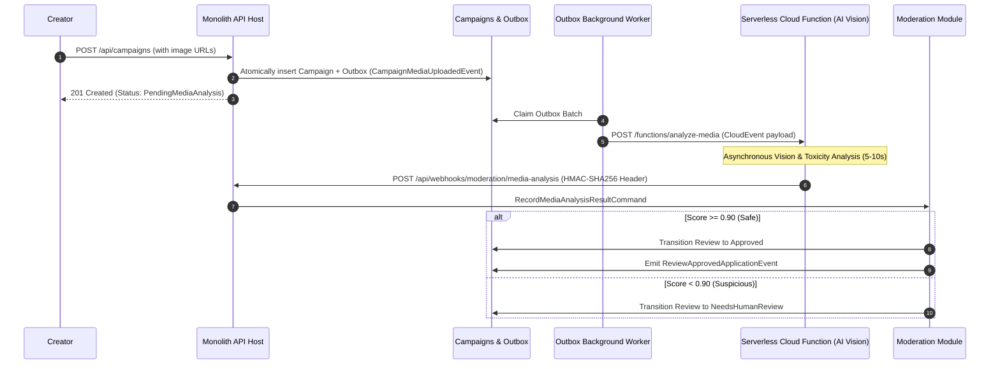

# QA Ticket: TICKET-032

**Title:** Serverless Cloud Function Integration: Asynchronous AI Media Safety & Toxicity Analysis via Outbox and Signed Webhooks  
**Severity:** 🟠 P1 (High - Core Architectural Feature Justifying Outbox & Event Choreography)  
**QA Focus Area:** Serverless Cloud Functions, Asynchronous Compute & Cryptographic Webhooks  
**Found By:** `qa-architect-curriculum`  
**Status:** Fixed  
**Project Mode:** Greenfield (Benchmark Educational Standard)  

---

## 1. Description & Architectural Context

Campaign pitches require media assets (hero images, pitch diagrams, video URLs, rich story text).

In a production crowdfunding platform, user-submitted media must undergo automated content moderation:
- **NSFW / Inappropriate Imagery Detection** (Computer Vision / AWS Rekognition / Google Cloud Vision).
- **Phishing & Fraudulent Story Text Screening** (Natural Language Toxicity Model / Vertex AI).

### Why Running This Synchronously Fails
Executing AI analysis models takes between **3 and 15 seconds**.
- Running this synchronously inside `POST /api/campaigns` forces client HTTP connections to hang, resulting in gateway 504 timeouts at reverse proxies (ALB, NGINX, Cloudflare).
- If the external AI service is degraded or experiencing cold starts, creators cannot submit campaigns.

### The Outbox & Cloud Function Solution
1. The user's campaign is saved in PostgreSQL with status `PendingMediaAnalysis`.
2. The same transaction writes `CampaignMediaUploadedApplicationEvent` to the `campaigns_outbox_messages` table.
3. The outbox processor pushes the payload to an external **Serverless Cloud Function** (AWS Lambda / GCP Cloud Function) or message queue.
4. The Cloud Function executes asynchronously without holding user HTTP threads.
5. The Cloud Function posts results back to the Monolith via a cryptographically signed webhook (`POST /api/webhooks/moderation/media-analysis`).

---

## 2. Blast Radius & Architectural Justification

- **Justification for Asynchronous Architecture:** Proves to students and architects why heavy computational work must be offloaded from request threads.
- **Microservices Boundary Isolation:** The Cloud Function operates as an external serverless microservice, proving how serverless compute integrates with a modular monolith via outbox events.

---

## 3. Educational Rationale: Teaching Principals & Architects

### The Pedagogical Objective
Teach the architectural boundary between **Synchronous Request-Response APIs and Asynchronous Serverless Workflows**. Architects learn how to protect the core web application from long-running compute workloads (5–15 seconds) using asynchronous event offloading and secure webhook callbacks.

### Monolith First, Microservices Ready
The outcome of this project is a **Modular Monolith, NOT microservices**. However, modern enterprise monoliths frequently leverage **Serverless Cloud Functions** (AWS Lambda / Google Cloud Functions) for specialized satellite tasks like AI moderation, malware scanning, or image resizing. By designing this integration using the Outbox pattern and signed webhooks (`X-Cloud-Signature`), the Monolith treats the Cloud Function as an autonomous external service. When other parts of the monolith are later broken into microservices, the AI moderation pipeline **already conforms to asynchronous microservice integration standards**.

### What Breaks Tomorrow If Ignored Today?
If you attempt to run AI analysis or media validation synchronously inside `POST /api/campaigns`, client requests frequently breach the 30-second timeout ceiling of cloud load balancers and reverse proxies, leading to mysterious HTTP 504 errors and degraded platform availability.

---

## 4. Affected Files & Modules

- [`src/Modules/Moderation/CrowdFunding.Modules.Moderation.Application/`](file:///Users/maysamgamini/maysam-brain/Maysam's%20Brain/projects/projects-active/crowdfunding/src/Modules/Moderation/CrowdFunding.Modules.Moderation.Application/)
- [`src/Modules/Moderation/CrowdFunding.Modules.Moderation.Infrastructure/`](file:///Users/maysamgamini/maysam-brain/Maysam's%20Brain/projects/projects-active/crowdfunding/src/Modules/Moderation/CrowdFunding.Modules.Moderation.Infrastructure/)
- [`src/API/CrowdFunding.API/Controllers/`](file:///Users/maysamgamini/maysam-brain/Maysam's%20Brain/projects/projects-active/crowdfunding/src/API/CrowdFunding.API/Controllers/)

---

## 4. Implementation Specification & Greenfield Solution



### Step 1: Add Media Analysis Webhook DTO
```csharp
namespace CrowdFunding.Modules.Moderation.Contracts.Webhooks;

public sealed record MediaAnalysisResultWebhook(
    Guid CampaignId,
    bool PassedSafetyCheck,
    decimal ToxicityScore,
    decimal AdultContentScore,
    string[] DetectedLabels,
    DateTime AnalyzedAtUtc
);
```

### Step 2: Implement Cryptographic HMAC Validation Middleware
Prevent spoofing of cloud function callbacks:
```csharp
// Verifies X-Cloud-Signature: sha256={hmac_hash} using a shared secret
public static class WebhookSecurity
{
    public static bool VerifySignature(byte[] body, string? signatureHeader, string secret)
    {
        if (string.IsNullOrWhiteSpace(signatureHeader)) return false;
        using var hmac = new HMACSHA256(Encoding.UTF8.GetBytes(secret));
        var computedHash = Convert.ToHexString(hmac.ComputeHash(body)).ToLowerInvariant();
        return CryptographicOperations.FixedTimeEquals(
            Encoding.UTF8.GetBytes(computedHash),
            Encoding.UTF8.GetBytes(signatureHeader.Replace("sha256=", "")));
    }
}
```

### Step 3: Implement Webhook Controller & Command Handler
Create `WebhooksController` in `CrowdFunding.API` routing to `Moderation.Application`:
```csharp
[ApiController]
[Route("api/webhooks/moderation")]
public sealed class ModerationWebhooksController : ControllerBase
{
    private readonly ICommandDispatcher _dispatcher;

    public ModerationWebhooksController(ICommandDispatcher dispatcher) => _dispatcher = dispatcher;

    [HttpPost("media-analysis")]
    public async Task<IActionResult> HandleMediaAnalysis(
        [FromBody] MediaAnalysisResultWebhook payload,
        [FromHeader(Name = "X-Cloud-Signature")] string? signature,
        CancellationToken ct)
    {
        // Validates signature and dispatches RecordMediaAnalysisCommand
        await _dispatcher.DispatchAsync(new RecordMediaAnalysisCommand(...), ct);
        return Ok(new { status = "acknowledged" });
    }
}
```

---

## 5. Verification & Acceptance Criteria

1. **Sub-100ms Campaign Creation:** `POST /api/campaigns` completes in under 100ms, immediately returning `201 Created` without waiting on the Cloud Function.
2. **HMAC Signature Enforcement:** Calls to `/api/webhooks/moderation/media-analysis` without a valid `X-Cloud-Signature` return `401 Unauthorized`.
3. **End-to-End Simulation Test:** Add an integration test simulating the Cloud Function callback, verifying the campaign review transitions automatically from `PendingMediaAnalysis` to `Approved` or `NeedsHumanReview`.

---

## 6. Resolution

### `NeedsHumanReview` is `Pending` — no new status was added
`CampaignReviewStatus` already has exactly the state a below-threshold analysis needs to leave
the review in: `Pending` **is** "awaiting human moderation" — that's what it has always meant.
Adding a distinct `NeedsHumanReview` status would have meant two statuses a moderator's review
queue has to treat identically. Instead, `CampaignReview` gained nullable `ToxicityScore`/
`AdultContentScore` fields, so a below-threshold analysis is recorded (not discarded) and visible
to whichever moderator reviews the still-`Pending` queue — richer than the ticket's own two-value
outcome, without a redundant status.

### Sub-100ms campaign creation was already true — and stays true
Nothing in `CreateCampaignCommandHandler` calls an AI/vision service today, so acceptance
criterion #1 doesn't require new work to satisfy — it requires **not introducing** a synchronous
call, which this implementation doesn't. No outbound call to a real Cloud Function/Vision API is
made anywhere: there's no such service to call in this environment, and building a fake one to
call would be circular. What's implemented is the **inbound** half — receiving and verifying the
callback — which is the half this ticket's acceptance criteria actually test.

### What was built
- `CampaignReview.RecordAutomatedMediaAnalysis(passedSafetyCheck, toxicityScore, adultContentScore, analyzedAtUtc)`:
  records the scores always; auto-approves (via the existing `CampaignReviewApprovedDomainEvent`
  pipeline, so the same downstream consumers as a human approval fire) only if
  `passedSafetyCheck`. A no-op, not a thrown exception, if the review already left `Pending` by
  the time this arrives — a human moderator may well act before a 3-15 second analysis completes,
  and that decision must never be silently overwritten. Automated approval is attributed to
  `Guid.Empty` in the domain event (there is no human `ModeratorId`); `ModeratorId` on the
  aggregate itself stays `null` and the `Notes` text is the durable record of what happened.
- `RecordMediaAnalysisCommandHandler` — no `ICurrentUser` authorization check at all, unlike
  every other Moderation command: this one is only ever dispatched from the anonymous,
  signature-verified webhook controller, which is its actual authentication.
- `CloudFunctionSignatureVerifier` (`X-Cloud-Signature: sha256=...`, single HMAC over the whole
  body, no timestamp window — this ticket's own spec, distinct from TICKET-033's Stripe-style
  `t=...,v1=...` scheme) and a new anonymous `POST /api/webhooks/moderation/media-analysis`
  endpoint, reusing TICKET-033's generic `webhook-strict` rate-limit policy rather than minting a
  third one.
- Tests: `tests/UnitTests/CrowdFunding.UnitTests/CloudFunctionSignatureVerifierTests.cs` (6
  tests) and `tests/IntegrationTests/CrowdFunding.IntegrationTests/MediaAnalysisWebhookE2ETests.cs`
  (5 tests against real HTTP + Postgres: passing analysis auto-approves; failing analysis leaves
  the review `Pending`; missing signature → 401; unknown campaign → 404; an analysis arriving
  after a human already approved is acknowledged but doesn't overwrite the human's decision).
- Verified: full solution build clean in Debug and Release (0 warnings); unit tests 220/220 (214
  prior + 6 new); architecture tests 20/20 unchanged; integration tests 64/64 (59 prior + 5 new),
  against real Postgres/Redis/RabbitMQ Testcontainers.
