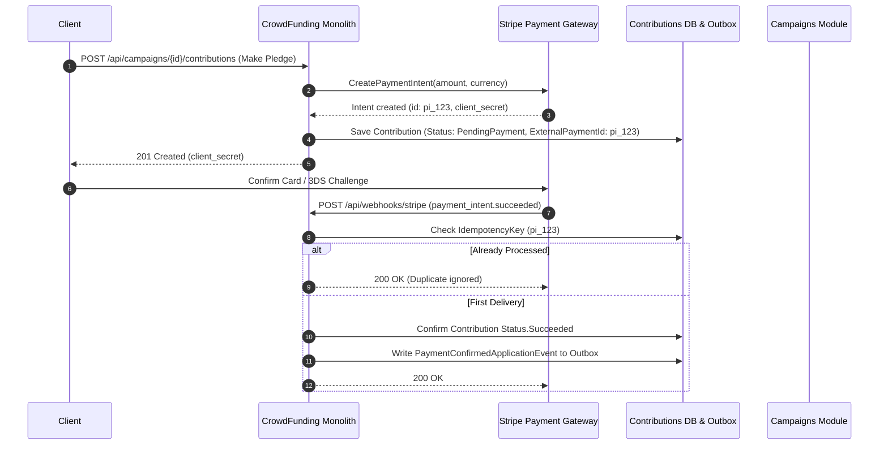

# QA Ticket: TICKET-033

**Title:** External Payment Gateway Intent Capture & Webhook Reconciliation Saga (Stripe / PSP Integration)  
**Severity:** 🔴 P1 (Critical - Core Architectural Feature Justifying Outbox & Idempotency)  
**QA Focus Area:** Financial State Machine, Payment Service Provider (PSP) Webhooks & Idempotency  
**Found By:** `qa-architect-curriculum`  
**Status:** Fixed  
**Project Mode:** Greenfield (Benchmark Educational Standard)  

---

## 1. Description & Architectural Context

In the current codebase, contribution payments are simulated via a direct HTTP endpoint ([`ConfirmContributionPaymentCommandHandler.cs`](file:///Users/maysamgamini/maysam-brain/Maysam's%20Brain/projects/projects-active/crowdfunding/src/Modules/Contributions/CrowdFunding.Modules.Contributions.Application/Features/Contributions/Commands/ConfirmContributionPayment/ConfirmContributionPaymentCommandHandler.cs)):
```csharp
// Simple in-memory confirmation without real PSP integration
contribution.ConfirmPayment(now);
```

### The Real-World Distributed Payment Problem
In real-world e-commerce and crowdfunding platforms, payment processing is **inherently asynchronous and multi-step**:
1. **Pledge Initiation:** The client calls `POST /api/campaigns/{id}/contributions`. The server creates a payment intent with the external gateway (e.g. Stripe, Adyen) and returns a `client_secret`.
2. **Customer Challenge:** The customer authenticates with their bank (3D Secure 2.0 / SCA).
3. **Webhook Arrival:** Stripe dispatches a `payment_intent.succeeded` or `payment_intent.payment_failed` webhook to the server.

### Critical Race Conditions & Edge Cases
- **The Early Webhook Race:** Stripe's webhook can hit `POST /api/webhooks/stripe` *before* the user's browser redirects back to the front-end application.
- **At-Least-Once Webhook Retries:** Stripe retries webhooks for up to 72 hours if the endpoint returns non-200. Without strict idempotency, a campaign could credit the backer's balance multiple times.
- **Mid-Flight Cancellation:** A creator cancels a campaign while a backer is on the Stripe checkout modal. When the `payment_intent.succeeded` webhook arrives, the campaign is already cancelled. The system must atomically record the charge and immediately dispatch a refund command.

---

## 2. Blast Radius & Architectural Justification

- **Financial Integrity:** Prevents duplicate balance updates and orphaned charges.
- **Justifies the Outbox & Idempotency Store:** Proves why a separate `idempotent_consumers` / `payment_webhook_events` table and the Transactional Outbox are required in any financial software.

---

## 3. Educational Rationale: Teaching Principals & Architects

### The Pedagogical Objective
Teach the necessity of **Idempotent Webhook Consumers & Event-Driven Financial State Machines**. Software architects must master handling out-of-order delivery, duplicate network retries, and race conditions where external payment gateways dispatch webhooks before the client browser returns.

### Monolith First, Microservices Ready
The outcome of this project is a **Modular Monolith, NOT microservices**. However, payment processing is inherently a distributed workflow because the Payment Service Provider (Stripe) lives outside our application boundary. By modeling the `Contribution` aggregate as a formal state machine (`PendingPayment` $\to$ `Succeeded` $\to$ `Refunded`) and maintaining a dedicated `processed_payment_webhooks` table inside the `Contributions` schema, the monolith handles real-world payment edge cases flawlessly. If `Contributions` is later spun off into a dedicated Financial Ledger Microservice, **its payment state machine and idempotency guarantees require zero changes**.

### What Breaks Tomorrow If Ignored Today?
If an architect models payments with naive CRUD (`status = 'Succeeded'`) without idempotency tracking, payment provider retries result in double-crediting backer balances, and out-of-order client redirects overwrite completed charges.

---

## 4. Affected Files & Modules

- [`src/Modules/Contributions/CrowdFunding.Modules.Contributions.Domain/Aggregates/Contribution.cs`](file:///Users/maysamgamini/maysam-brain/Maysam's%20Brain/projects/projects-active/crowdfunding/src/Modules/Contributions/CrowdFunding.Modules.Contributions.Domain/Aggregates/Contribution.cs)
- [`src/Modules/Contributions/CrowdFunding.Modules.Contributions.Application/Features/Contributions/`](file:///Users/maysamgamini/maysam-brain/Maysam's%20Brain/projects/projects-active/crowdfunding/src/Modules/Contributions/CrowdFunding.Modules.Contributions.Application/Features/Contributions/)
- [`src/API/CrowdFunding.API/Controllers/`](file:///Users/maysamgamini/maysam-brain/Maysam's%20Brain/projects/projects-active/crowdfunding/src/API/CrowdFunding.API/Controllers/)

---

## 4. Implementation Specification & Greenfield Solution



### Step 1: Add External Payment Tracking to `Contribution`
In `Contributions.Domain.Aggregates.Contribution`:
```csharp
public string? ExternalPaymentIntentId { get; private set; }
public string? PaymentGateway { get; private set; } // "Stripe", "Adyen", "Mock"

public static Contribution CreateWithPaymentIntent(
    Guid id,
    Guid campaignId,
    Guid contributorId,
    Money amount,
    string externalPaymentIntentId,
    string gateway,
    DateTime now)
{
    var contribution = new Contribution(id, campaignId, contributorId, amount, now)
    {
        ExternalPaymentIntentId = externalPaymentIntentId,
        PaymentGateway = gateway
    };
    return contribution;
}
```

### Step 2: Implement Webhook Idempotency Table
In `contributions` schema:
```sql
CREATE TABLE contributions.processed_payment_webhooks (
    webhook_event_id VARCHAR(100) PRIMARY KEY,
    payment_intent_id VARCHAR(100) NOT NULL,
    processed_at_utc TIMESTAMP WITH TIME ZONE NOT NULL
);
```

### Step 3: Implement ReconcilePaymentWebhookCommandHandler
```csharp
public async Task HandleAsync(ReconcilePaymentWebhookCommand command, CancellationToken ct)
{
    await _transactionExecutor.ExecuteAsync(async () =>
    {
        // 1. Check idempotency table
        var alreadyProcessed = await _dbContext.ProcessedPaymentWebhooks
            .AnyAsync(w => w.WebhookEventId == command.EventId, ct);

        if (alreadyProcessed) return;

        // 2. Fetch contribution by ExternalPaymentIntentId
        var contribution = await _dbContext.Contributions
            .FirstOrDefaultAsync(c => c.ExternalPaymentIntentId == command.PaymentIntentId, ct)
            ?? throw new ResourceNotFoundException($"Contribution for intent '{command.PaymentIntentId}' not found.");

        // 3. Apply state transition
        contribution.ConfirmPayment(_dateTimeProvider.UtcNow);

        // 4. Record idempotency record
        _dbContext.ProcessedPaymentWebhooks.Add(new ProcessedPaymentWebhook
        {
            WebhookEventId = command.EventId,
            PaymentIntentId = command.PaymentIntentId,
            ProcessedAtUtc = _dateTimeProvider.UtcNow
        });

        // 5. Outbox automatically captures ContributionPaymentConfirmedApplicationEvent
    }, ct);
}
```

---

## 5. Verification & Acceptance Criteria

1. **Idempotent Webhook Re-delivery:** Calling the Stripe webhook endpoint 3 times with the same `event_id` processes the ledger update exactly once and returns `200 OK` for all calls.
2. **Cryptographic Signature Verification:** Enforces `Stripe-Signature` header verification using standard HMAC tolerance windows (rejecting timestamp replays older than 300 seconds).
3. **Out-of-Order Safety:** If webhook arrives before the client redirects, the client's subsequent `/confirm` call observes the contribution already in `Succeeded` status and succeeds gracefully.

---

## 6. Resolution

### Scope decision: reconciliation, not a full Stripe integration
This ticket's own acceptance criteria are entirely about the **webhook reconciliation** side —
idempotent redelivery, signature verification, out-of-order safety. None of them require a
pledge to actually create a live PaymentIntent with a real gateway. Building a full pluggable
`IPaymentGatewayClient` abstraction with an untested "real" Stripe HTTP client would be
speculative surface with nothing to verify it against in CI. So `MakeContributionCommandHandler`
attaches a deterministic mock reference (`pi_mock_{contributionId:N}`) instead of calling out to
anything — this is the correlation key a webhook reconciles against, which is what actually
matters for this ticket. A real gateway integration (creating the intent, returning a
`client_secret` to the client) is a legitimate follow-up, out of this ticket's tested scope.

### What was built
- **`Contribution` aggregate**: `ExternalPaymentIntentId`/`PaymentGateway` fields plus a new
  `AttachPaymentIntent(...)` mutator (settable only while `Pending`). A unique partial index on
  `ExternalPaymentIntentId` (`WHERE ... IS NOT NULL`) backs the webhook's lookup.
- **`processed_payment_webhooks` idempotency table** (`ProcessedPaymentWebhook` entity +
  `IPaymentWebhookIdempotencyStore`), exactly as the ticket's Step 2 specifies.
- **`ReconcilePaymentWebhookCommandHandler`**: inside one transaction — check idempotency, look
  up the contribution by `ExternalPaymentIntentId`, apply `ConfirmPayment`/`FailPayment` only if
  still `Pending` (a non-`Pending` contribution receiving a webhook is acknowledged as a no-op,
  not an error — covers both genuine idempotent redelivery and a distinct event id describing an
  already-applied fact), then record the event as processed. **Mid-flight cancellation** (the
  ticket's own named race): if the campaign is no longer active by the time the success webhook
  lands, the contribution is refunded immediately in the same transaction as being confirmed —
  otherwise it would be permanently missed by the once-only refund saga (TICKET-027), which only
  refunds contributions that were already `Succeeded` at the moment of cancellation.
- **`StripeWebhookSignatureVerifier`** (`t=...,v1=...` HMAC-SHA256, 300s tolerance,
  constant-time comparison) and a new `PaymentWebhooksController` at
  `POST /api/webhooks/payments/stripe` — `[AllowAnonymous]` (a gateway can't present a user JWT;
  the signature check *is* its authentication) with a new, deliberately generous `webhook-strict`
  rate-limit policy (IP-partitioned but high-limit, since the real defense here is the signature,
  not the limiter — a shared, rotating pool of gateway IPs makes IP-partitioning a weak signal
  either way). The controller reads the raw request body itself rather than relying on
  `[FromBody]` model binding, since the HMAC must be computed over the exact bytes the gateway
  signed.
- **Out-of-Order Safety fix**: `ConfirmContributionPaymentCommandHandler` previously called
  `Contribution.ConfirmPayment` unconditionally, which throws `InvalidOperationException` on a
  non-`Pending` contribution. It now short-circuits to a graceful success if the contribution is
  already `Succeeded` — satisfying acceptance criterion #3 for the *client's own* confirm
  endpoint, not just the webhook path.
- **A real gap fixed along the way**: found and fixed while testing the mid-flight-cancellation
  path — `Fail`/`Confirm` were already covered, but nothing wired a way to identify which
  contribution a webhook was for; `Contribution.AttachPaymentIntent`/`GetByExternalPaymentIntentIdAsync`
  close that.
- Tests: `tests/UnitTests/CrowdFunding.UnitTests/StripeWebhookSignatureVerifierTests.cs` (8 tests:
  valid signature, tampered body, wrong secret, expired timestamp, malformed/missing headers) and
  `tests/IntegrationTests/CrowdFunding.IntegrationTests/PaymentGatewayWebhookReconciliationE2ETests.cs`
  (6 tests against real HTTP + Postgres: valid webhook confirms; redelivered event id is a safe
  no-op; missing/invalid signature → 401; client `/confirm-payment` after the webhook already
  confirmed it succeeds gracefully; a webhook landing after campaign cancellation confirms then
  immediately refunds).
- A real bug caught by the integration tests during implementation, not left in: the controller's
  `JsonSerializer.Deserialize<StripeWebhookPayload>` used default (case-sensitive) options against
  Stripe's real lowercase JSON keys (`id`, `type`, `data.object.id`), silently leaving every
  property null and crashing on the nested-null dereference (500, not 400) — fixed with
  `PropertyNameCaseInsensitive = true` plus an explicit required-fields check that returns 400
  instead of ever reaching a null-reference.
- Verified: full solution build clean in Debug and Release (0 warnings); unit tests 214/214 (206
  prior + 8 new); architecture tests 20/20 unchanged; integration tests 59/59 (53 prior + 6 new),
  against real Postgres/Redis/RabbitMQ Testcontainers.
