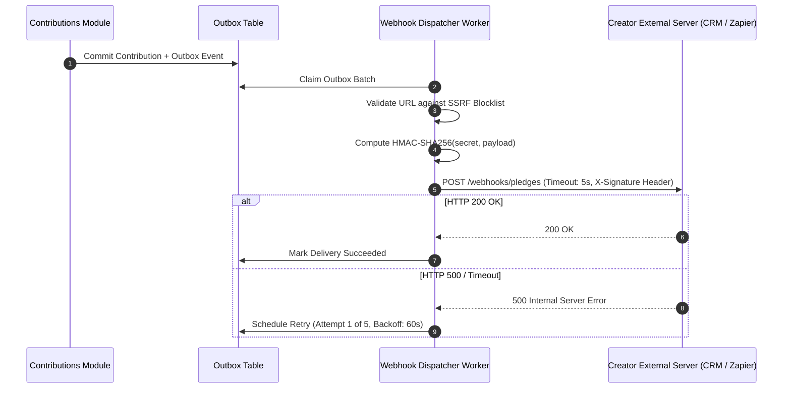

# QA Ticket: TICKET-035

**Title:** Outbound Creator Webhook Dispatching Engine with Cryptographic HMAC Signatures & Exponential Retry Backoff  
**Severity:** 🟡 P2 (Medium - Enterprise Integration Feature Justifying Outbox & DLQ)  
**QA Focus Area:** External Webhook Delivery, Security (SSRF/HMAC) & Dead-Letter Queueing  
**Found By:** `qa-architect-curriculum`  
**Status:** Open  
**Project Mode:** Greenfield (Benchmark Educational Standard)  

---

## 1. Description & Architectural Context

Enterprise campaign creators and non-profit organizations require programmatic integration with their external CRM and accounting systems (e.g., Salesforce, HubSpot, Zapier) when pledges occur on `CrowdFundingHub`.

### Why Naive Webhook Dispatching Breaks the Monolith
A naive implementation dispatches HTTP POST requests to the creator's configured URL directly inside the HTTP controller or domain event handler:
```csharp
// FATAL ARCHITECTURAL DEFECT: Calling untrusted external URLs synchronously
await _httpClient.PostAsync(creatorWebhookUrl, content);
```
1. **Thread Starvation & Denial of Service:** If the creator's server is down, misconfigured, or deliberately slow (holding connections for 60 seconds), the monolith's ASP.NET Core thread pool becomes exhausted, bringing down the entire platform for all users.
2. **SSRF (Server-Side Request Forgery):** A creator could configure `http://169.254.169.254/latest/meta-data/` or internal Kubernetes cluster IPs (`http://kube-dns`) to probe private cloud infrastructure.
3. **Loss of Delivery Guarantees:** Transient network failures cause permanent message loss with zero retry capability.

---

## 2. Blast Radius & Architectural Justification

- **Justifies the Outbox & DLQ:** Demonstrates why external webhooks must be delivered asynchronously via background workers with dedicated timeout limits, exponential backoff (1m, 5m, 15m, 1h), and Dead-Letter Queueing.
- **Enterprise Security Pattern:** Teaches principal engineers how to safely dispatch webhooks using IP allowlisting and HMAC-SHA256 request signing (`X-CrowdFunding-Signature`).

---

## 3. Affected Files & Modules

- Creation of `WebhookSubscription` and `WebhookDeliveryAttempt` in `src/Modules/CampaignUpdates/CrowdFunding.Modules.CampaignUpdates.Domain/` or `src/Modules/Notifications/`
- Background delivery worker in `src/API/CrowdFunding.API/Background/`

---

## 4. Implementation Specification & Greenfield Solution



### Step 1: Webhook Subscription Schema
```sql
CREATE TABLE campaigns.creator_webhook_subscriptions (
    id UUID PRIMARY KEY,
    campaign_id UUID NOT NULL,
    target_url VARCHAR(500) NOT NULL,
    secret_key VARCHAR(100) NOT NULL,
    is_active BOOLEAN NOT NULL DEFAULT TRUE,
    created_at_utc TIMESTAMP WITH TIME ZONE NOT NULL
);
```

### Step 2: SSRF Defense & URL Validation
```csharp
public static class UrlSecurityValidator
{
    private static readonly string[] BlockedSubnets = ["10.0.0.0/8", "172.16.0.0/12", "192.168.0.0/16", "169.254.0.0/16", "127.0.0.0/8"];

    public static bool IsSafeExternalUrl(Uri uri)
    {
        if (uri.Scheme != Uri.UriSchemeHttps) return false; // Enforce HTTPS
        var host = uri.DnsSafeHost;
        var ips = Dns.GetHostAddresses(host);
        return ips.All(ip => !IsPrivateOrLinkLocal(ip));
    }
}
```

### Step 3: Outbox Delivery Worker with Cryptographic Signing
```csharp
public sealed class WebhookDispatcherBackgroundService : BackgroundService
{
    // Fetches pending webhook delivery tasks from outbox
    // Dispatches via IHttpClientFactory with 5-second Polly timeout
    // Signs payload with HMAC-SHA256 header:
    // headers.Add("X-CrowdFunding-Signature", $"t={timestamp},v1={hash}");
}
```

---

## 5. Verification & Acceptance Criteria

1. **SSRF Rejection:** Attempting to register a webhook target pointing to `http://127.0.0.1` or `http://169.254.169.254` is rejected with `400 Bad Request`.
2. **Non-Blocking Resilience:** If the target webhook URL takes 10 seconds to respond, the calling user's pledge API response is completely unaffected and returns in < 100ms.
3. **Dead-Letter Recovery:** After 5 consecutive failed delivery attempts, the subscription is marked `Degraded/Disabled` and the message is archived in the Dead-Letter table with the final HTTP error payload.
