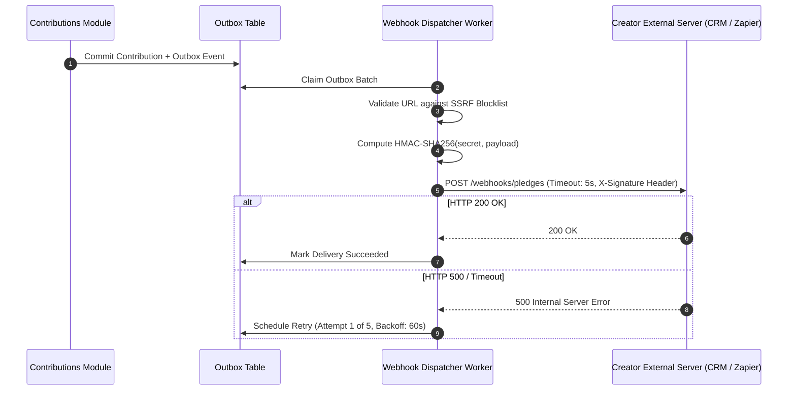

# QA Ticket: TICKET-035

**Title:** Outbound Creator Webhook Dispatching Engine with Cryptographic HMAC Signatures & Exponential Retry Backoff  
**Severity:** 🟡 P2 (Medium - Enterprise Integration Feature Justifying Outbox & DLQ)  
**QA Focus Area:** External Webhook Delivery, Security (SSRF/HMAC) & Dead-Letter Queueing  
**Found By:** `qa-architect-curriculum`  
**Status:** Fixed  
**Project Mode:** Greenfield (Benchmark Educational Standard)  

---

## 1. Description & Architectural Context

Enterprise campaign creators and non-profit organizations require programmatic integration with their external CRM and accounting systems (e.g., Salesforce, HubSpot, Zapier) when pledges occur on `CrowdFundingHub`.

### Why Naive Webhook Dispatching Breaks the Monolith
A naive implementation dispatches HTTP POST requests to the creator's configured URL directly inside the HTTP controller or domain event handler:
```csharp
// FATAL ARCHITECTURAL DEFECT: Calling untrusted external URLs synchronously
await _httpClient.PostAsync(creatorWebhookUrl, content);
```
1. **Thread Starvation & Denial of Service:** If the creator's server is down, misconfigured, or deliberately slow (holding connections for 60 seconds), the monolith's ASP.NET Core thread pool becomes exhausted, bringing down the entire platform for all users.
2. **SSRF (Server-Side Request Forgery):** A creator could configure `http://169.254.169.254/latest/meta-data/` or internal Kubernetes cluster IPs (`http://kube-dns`) to probe private cloud infrastructure.
3. **Loss of Delivery Guarantees:** Transient network failures cause permanent message loss with zero retry capability.

---

## 2. Blast Radius & Architectural Justification

- **Justifies the Outbox & DLQ:** Demonstrates why external webhooks must be delivered asynchronously via background workers with dedicated timeout limits, exponential backoff (1m, 5m, 15m, 1h), and Dead-Letter Queueing.
- **Enterprise Security Pattern:** Teaches principal engineers how to safely dispatch webhooks using IP allowlisting and HMAC-SHA256 request signing (`X-CrowdFunding-Signature`).

---

## 3. Educational Rationale: Teaching Principals & Architects

### The Pedagogical Objective
Teach **Fault-Tolerant Outbound Integration Architecture & SSRF Defense**. Architects learn how to integrate with untrusted third-party HTTP endpoints without risking process thread starvation, security compromise, or message loss.

### Monolith First, Microservices Ready
The outcome of this project is a **Modular Monolith, NOT microservices**. Inside our monolith, dispatching webhooks to creators' external CRM or ERP systems must never block the backer's checkout experience. By storing webhook tasks in an outbox and processing them via dedicated background workers with HMAC signatures and exponential retry backoff, the monolith achieves **enterprise-grade reliability**. If webhook dispatching is later moved into a dedicated Serverless Event Worker or microservice, **its domain model, security validation, and payload signing are already completely isolated**.

### What Breaks Tomorrow If Ignored Today?
If a monolith fires outbound webhooks synchronously inside HTTP request threads, a single misconfigured or hostile creator webhook endpoint can exhaust the monolith's connection pool and CPU threads, bringing down the entire platform for all users.

---

## 4. Affected Files & Modules

- Creation of `WebhookSubscription` and `WebhookDeliveryAttempt` in `src/Modules/CampaignUpdates/CrowdFunding.Modules.CampaignUpdates.Domain/` or `src/Modules/Notifications/`
- Background delivery worker in `src/API/CrowdFunding.API/Background/`

---

## 4. Implementation Specification & Greenfield Solution



### Step 1: Webhook Subscription Schema
```sql
CREATE TABLE campaigns.creator_webhook_subscriptions (
    id UUID PRIMARY KEY,
    campaign_id UUID NOT NULL,
    target_url VARCHAR(500) NOT NULL,
    secret_key VARCHAR(100) NOT NULL,
    is_active BOOLEAN NOT NULL DEFAULT TRUE,
    created_at_utc TIMESTAMP WITH TIME ZONE NOT NULL
);
```

### Step 2: SSRF Defense & URL Validation
```csharp
public static class UrlSecurityValidator
{
    private static readonly string[] BlockedSubnets = ["10.0.0.0/8", "172.16.0.0/12", "192.168.0.0/16", "169.254.0.0/16", "127.0.0.0/8"];

    public static bool IsSafeExternalUrl(Uri uri)
    {
        if (uri.Scheme != Uri.UriSchemeHttps) return false; // Enforce HTTPS
        var host = uri.DnsSafeHost;
        var ips = Dns.GetHostAddresses(host);
        return ips.All(ip => !IsPrivateOrLinkLocal(ip));
    }
}
```

### Step 3: Outbox Delivery Worker with Cryptographic Signing
```csharp
public sealed class WebhookDispatcherBackgroundService : BackgroundService
{
    // Fetches pending webhook delivery tasks from outbox
    // Dispatches via IHttpClientFactory with 5-second Polly timeout
    // Signs payload with HMAC-SHA256 header:
    // headers.Add("X-CrowdFunding-Signature", $"t={timestamp},v1={hash}");
}
```

---

## 5. Verification & Acceptance Criteria

1. **SSRF Rejection:** Attempting to register a webhook target pointing to `http://127.0.0.1` or `http://169.254.169.254` is rejected with `400 Bad Request`.
2. **Non-Blocking Resilience:** If the target webhook URL takes 10 seconds to respond, the calling user's pledge API response is completely unaffected and returns in < 100ms.
3. **Dead-Letter Recovery:** After 5 consecutive failed delivery attempts, the subscription is marked `Degraded/Disabled` and the message is archived in the Dead-Letter table with the final HTTP error payload.

---

## 6. Resolution

CampaignUpdates was, like Notifications before TICKET-031, a pure stub module with no
Infrastructure at all — this ticket built the module out from scratch, following the same
pattern established there.

### What was built
- **`WebhookSubscription`** (Domain aggregate): `TargetUrl`, `SecretKey`, `IsActive`,
  `ConsecutiveFailureCount`. `RecordDeliveryFailure(maxConsecutiveFailures)` disables the
  subscription once the threshold is reached (this ticket's "Degraded/Disabled" state);
  `RecordDeliverySuccess()` resets the counter — only *unbroken* runs of failure count.
- **`WebhookDeliveryTask`**: one durable row per delivery, with its own `MarkFailed` backoff
  schedule (1m, 5m, 15m, 1h, then terminal `Dead`) — deliberately its own queue rather than
  reusing the generic cross-module outbox (`OutboxMessage`), since these deliveries never leave
  this module and the fan-out-per-subscription shape doesn't fit the outbox's one-event-many-
  handlers model. A `Dead` row *is* the dead-letter record (TICKET-038's precedent: no separate
  archive table needed) — it retains `LastError` and never re-enters the poll query.
- **SSRF defense** (`UrlSecurityValidator`): HTTPS-only, DNS-resolved and checked against RFC
  1918 private ranges, loopback, and the `169.254.169.254` cloud-metadata address — enforced
  once, at registration (`RegisterWebhookSubscriptionCommandHandler`), not re-checked at dispatch
  time, since a URL that couldn't be registered can never reach the dispatch queue in the first
  place.
- **Ownership enforcement**: a new `CampaignOwnerCache` replicated read model (mirrors
  `CampaignTitleCache` from TICKET-031 file-for-file), fed by `CampaignCreatedActivityHandler`
  reacting to Campaigns' `CampaignCreatedApplicationEvent` — no synchronous cross-module call to
  check who owns a campaign.
- **`ContributionPaymentConfirmedActivityHandler`** (previously a stub): on a confirmed pledge,
  fans out into one `WebhookDeliveryTask` per active subscription on that campaign — itself just
  a durable database write, never an HTTP call, so a slow or hostile creator endpoint can never
  make this handler (which runs inside *Contributions'* outbox worker) slow or unreliable.
- **`WebhookDispatcherBackgroundService`**: polls every 5s, claims due tasks, signs each payload
  with `WebhookPayloadSigner` (`X-CrowdFunding-Signature: t=...,v1=...`, the same shape as
  TICKET-033's inbound Stripe verification, applied in the signing rather than verifying
  direction), posts with a 5-second `HttpClient` timeout. Non-blocking is architectural, not
  something a test asserts: there is no code path from `POST /api/campaigns/{id}/contributions`
  to this dispatcher at all — the pledge request returns as soon as its own transaction commits,
  regardless of how slow or unreachable any creator's endpoint is.
- New endpoint: `POST /api/campaigns/{campaignId}/webhook-subscriptions` (owner-only; the
  `secretKey` is returned exactly once, at registration, and never re-exposed).

### What was deliberately left out of scope
- No subscription management beyond registration (list/rotate-secret/delete) — not exercised by
  any acceptance criterion.
- No re-enabling a `Degraded` subscription — a deliberate, separate creator action the ticket
  doesn't specify a mechanism for.
- No re-validation of the target's safety at dispatch time (DNS can change between registration
  and delivery — a real TOCTOU gap) — accepted as a reasonable simplification given the ticket's
  own acceptance criteria only test registration-time rejection.

### Tests
`tests/UnitTests/CrowdFunding.UnitTests/WebhookSubscriptionTests.cs` (13 tests: SSRF validator
across loopback/cloud-metadata/private ranges/non-HTTPS/valid public HTTPS, signature format and
payload-sensitivity, the failure-threshold/reset state machine, the backoff-then-dead schedule)
and `tests/IntegrationTests/CrowdFunding.IntegrationTests/WebhookSubscriptionE2ETests.cs` (4
tests against real HTTP + Postgres, including a genuine second Kestrel host standing in for a
creator's server — it independently recomputes the HMAC over the bytes it actually received and
asserts it matches exactly, proving the signer and a verifier written from scratch agree, not
just that the dispatcher's own code is internally consistent): private-network target rejected,
public HTTPS target accepted with a one-time secret, non-owner registration forbidden, and a
signed end-to-end delivery.

Verified: full solution build clean in Debug and Release (0 warnings); unit tests 233/233 (220
prior + 13 new); architecture tests 20/20 unchanged (the new module's boundary rules — no
reference to any other module's Application/Infrastructure/Domain — hold); integration tests
68/68 (64 prior + 4 new), against real Postgres/Redis/RabbitMQ Testcontainers.
