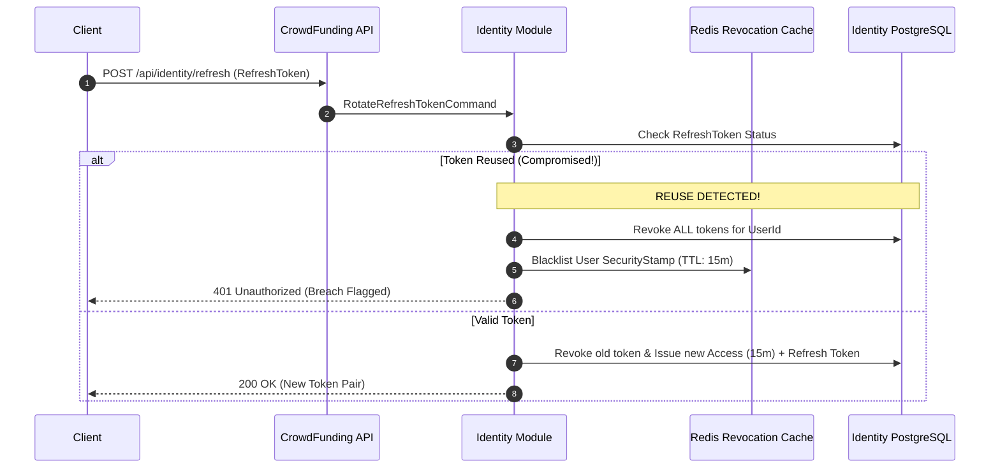

# QA Ticket: TICKET-036

**Title:** Decentralized Session Revocation & Refresh Token Rotation (RTR) under Asymmetric JWKS  
**Severity:** 🔴 P1 (Critical - Distributed Security & Stateless Token Revocation)  
**QA Focus Area:** Security, Decentralized Authentication & Session Lifecycle  
**Found By:** `qa-platform-shortcomings`  
**Status:** Open  
**Project Mode:** Greenfield (Benchmark Educational Standard)  

---

## 1. Description & Architectural Context

In the current codebase ([`JwtAccessTokenProvider.cs`](file:///Users/maysamgamini/maysam-brain/Maysam's%20Brain/projects/projects-active/crowdfunding/src/Modules/Identity/CrowdFunding.Modules.Identity.Infrastructure/Services/JwtAccessTokenProvider.cs#L43-L72)), the authentication system issues stateless JWT access tokens signed with asymmetric ECDSA keys (ES256) valid for **60 minutes**:
```csharp
var expiresAtUtc = issuedAtUtc.AddMinutes(_options.ExpirationMinutes); // Default: 60 minutes
```

Consuming modules and future microservices validate tokens statelessly offline using public JWKS exposed at `/.well-known/jwks.json` without making database queries.

### The Stateless Token Revocation Dilemma
Because validation is purely cryptographic and stateless:
1. **Unrevocable Credentials:** If an access token is intercepted or leaked, an attacker retains full access for up to 60 minutes.
2. **Ignored Account Deactivation:** If an administrator deactivates a rogue user ([`user.Deactivate()`](file:///Users/maysamgamini/maysam-brain/Maysam's%20Brain/projects/projects-active/crowdfunding/src/Modules/Identity/CrowdFunding.Modules.Identity.Domain/Aggregates/User.cs#L93)) or if a user changes their password, **all existing active access tokens remain 100% valid** until natural expiration.
3. **Missing Token Lifecycle:** The platform lacks a refresh token grant (`grant_type=refresh_token`), refresh token rotation (RTR), a revocation store, and a `/api/identity/logout` endpoint.

---

## 2. Blast Radius & Security Impact

- **OWASP ASVS & PCI-DSS Non-Compliance:** Violates OWASP ASVS v4.0 (Section V3 Session Management) and PCI-DSS Requirement 8, which mandate immediate session termination upon administrative suspension or credential change.
- **Account Takeover Window:** Breached credentials cannot be invalidated without rotating master signing keys (which logs out all users globally).

---

## 3. Educational Rationale: Teaching Principals & Architects

### The Pedagogical Objective
Teach architects how to solve the **Stateless Token Revocation Dilemma in Decentralized Architectures**. Software architects frequently embrace asymmetric JWKS verification to eliminate database bottlenecks on every API call. However, they must learn how to handle immediate revocation and compromised session termination without introducing a centralized database call on every single request.

### Monolith First, Microservices Ready
The outcome of this project is a **Modular Monolith, NOT microservices**. Inside our monolith, authentication is decoupled: `Identity` issues tokens, while `Campaigns`, `Contributions`, and `Moderation` validate tokens using public JWKS. By implementing:
1. **Short-lived Access Tokens (10–15 minutes)**,
2. **Refresh Token Rotation (RTR)** with automatic reuse detection, and
3. A **Distributed Revocation Blacklist (Redis / Security Stamp)**,
the monolith demonstrates enterprise-grade security. When modules are extracted into microservices tomorrow, **the security architecture requires zero redesign**, maintaining fast offline verification alongside instant revocation capabilities.

### What Breaks Tomorrow If Ignored Today?
If an architect builds a system where JWTs cannot be revoked, the moment a security vulnerability, disgruntled employee deactivation, or credential leak occurs in production, the organization faces an uncontrollable exposure window that fails compliance audits and invites regulatory fines.

---

## 4. Affected Files & Modules

- [`src/Modules/Identity/CrowdFunding.Modules.Identity.Domain/Aggregates/User.cs`](file:///Users/maysamgamini/maysam-brain/Maysam's%20Brain/projects/projects-active/crowdfunding/src/Modules/Identity/CrowdFunding.Modules.Identity.Domain/Aggregates/User.cs)
- [`src/Modules/Identity/CrowdFunding.Modules.Identity.Infrastructure/Services/JwtAccessTokenProvider.cs`](file:///Users/maysamgamini/maysam-brain/Maysam's%20Brain/projects/projects-active/crowdfunding/src/Modules/Identity/CrowdFunding.Modules.Identity.Infrastructure/Services/JwtAccessTokenProvider.cs)
- [`src/Modules/Identity/CrowdFunding.Modules.Identity.Infrastructure/Persistence/DbContexts/IdentityDbContext.cs`](file:///Users/maysamgamini/maysam-brain/Maysam's%20Brain/projects/projects-active/crowdfunding/src/Modules/Identity/CrowdFunding.Modules.Identity.Infrastructure/Persistence/DbContexts/IdentityDbContext.cs)
- [`src/API/CrowdFunding.API/Controllers/IdentityController.cs`](file:///Users/maysamgamini/maysam-brain/Maysam's%20Brain/projects/projects-active/crowdfunding/src/API/CrowdFunding.API/Controllers/IdentityController.cs)

---

## 5. Implementation Specification & Greenfield Solution



### Step 1: Add Refresh Token Entity in `Identity.Domain`
```csharp
namespace CrowdFunding.Modules.Identity.Domain.Entities;

public sealed class RefreshToken : BaseEntity
{
    public Guid Id { get; private set; }
    public Guid UserId { get; private set; }
    public string TokenHash { get; private set; } = string.Empty;
    public DateTime ExpiresAtUtc { get; private set; }
    public bool IsRevoked { get; private set; }
    public DateTime? RevokedAtUtc { get; private set; }
    public string? ReplacedByTokenHash { get; private set; }

    public bool IsActive => !IsRevoked && DateTime.UtcNow < ExpiresAtUtc;

    public void Revoke(string replacedByHash, DateTime now)
    {
        IsRevoked = true;
        RevokedAtUtc = now;
        ReplacedByTokenHash = replacedByHash;
    }
}
```

### Step 2: Embed `security_stamp` in User & JWT Claims
In `User.cs`:
```csharp
public Guid SecurityStamp { get; private set; } = Guid.NewGuid();

public void InvalidateSessions()
{
    SecurityStamp = Guid.NewGuid();
}
```
When generating JWTs, embed `new Claim("security_stamp", user.SecurityStamp.ToString())`.

### Step 3: Fast-Path Redis Revocation Blacklist
When `user.InvalidateSessions()` or `user.Deactivate()` executes:
```csharp
await _distributedCache.SetStringAsync(
    $"revoked_stamps:{user.Id}",
    oldSecurityStamp.ToString(),
    new DistributedCacheEntryOptions { AbsoluteExpirationRelativeToNow = TimeSpan.FromMinutes(15) },
    ct);
```
A lightweight middleware verifies that the token's `security_stamp` is not blacklisted in Redis (0.2ms lookup), ensuring instant global revocation across all modules.

---

## 6. Verification & Acceptance Criteria

1. **Shortened Access Token TTL:** Default access token expiration is 15 minutes (`ExpirationMinutes = 15`).
2. **Refresh Token Rotation (RTR):** Calling `POST /api/identity/refresh` invalidates the old refresh token and returns a new cryptographic pair.
3. **Breach Reuse Detection:** Presenting an already-revoked refresh token triggers automated revocation of all active sessions for that user account and returns `401 Unauthorized`.
4. **Immediate Logout Revocation:** Calling `POST /api/identity/logout` revokes the refresh token and publishes the security stamp to the revocation blacklist, rendering the active JWT unusable within sub-second propagation.
