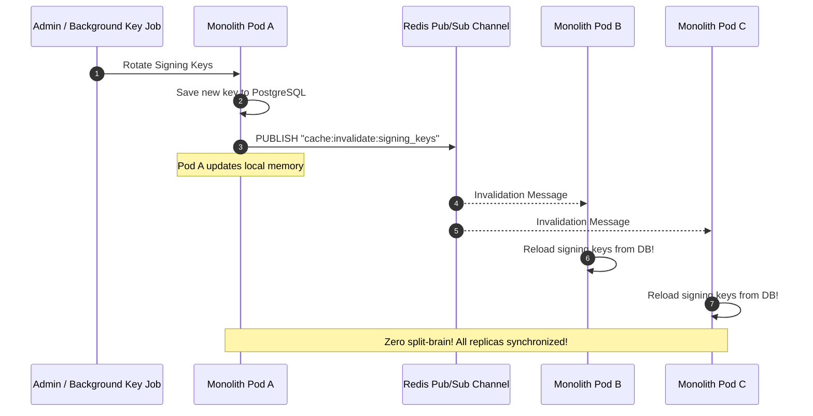

# QA Ticket: TICKET-037

**Title:** Multi-Replica Distributed Cache Invalidation via Redis Pub/Sub & Post-Commit Hooks  
**Severity:** 🟠 P1 (High - Multi-Replica Monolith Scaling & Cache Consistency)  
**QA Focus Area:** High Availability, Distributed Caching & Split-Brain Prevention  
**Found By:** `qa-platform-shortcomings`  
**Status:** Fixed  
**Project Mode:** Greenfield (Benchmark Educational Standard)  

---

## 1. Description & Architectural Context

In the current codebase, key material and query caching exhibit two critical scaling flaws:

1. **Singleton In-Memory Keystore Caching:** [`EfSigningKeyStore.cs`](file:///Users/maysamgamini/maysam-brain/Maysam's%20Brain/projects/projects-active/crowdfunding/src/Modules/Identity/CrowdFunding.Modules.Identity.Infrastructure/Services/EfSigningKeyStore.cs#L19-L21) is registered as a Singleton in DI. Keys are loaded once during startup (`WarmUpAsync`) into private instance fields (`_activeSigningKey`, `_publicSigningKeys`).
2. **Pre-Commit Cache Eviction Hazard:** In [`CampaignRepository.cs`](file:///Users/maysamgamini/maysam-brain/Maysam's%20Brain/projects/projects-active/crowdfunding/src/Modules/Campaigns/CrowdFunding.Modules.Campaigns.Infrastructure/Persistence/Repositories/CampaignRepository.cs#L42-L57):
   ```csharp
   _dbContext.Campaigns.Update(campaign);
   // Flaw: Cache is removed BEFORE transaction commits!
   await _cache.RemoveAsync(CampaignCacheKeys.Details(campaign.Id), cancellationToken);
   ```

### The Multi-Replica Split-Brain Failure
When the Modular Monolith scales horizontally (e.g., 3 Kubernetes pods or cloud containers behind a load balancer):
- If Pod A generates a new active signing key or rotates keys, **Pods B and C have no notification mechanism**. They continue signing tokens with the retired key or failing token verification, resulting in intermittent `401 Unauthorized` errors.
- If Pod A invalidates a campaign Redis cache key *before* `SaveChangesAsync` commits to PostgreSQL, a concurrent read on Pod B fetches the **uncommitted old database row** and repopulates the Redis cache with stale data for 30 seconds!

---

## 2. Blast Radius & High-Availability Impact

- **Horizontal Scaling Impairment:** The monolith cannot safely run with replica counts $> 1$ without risking cryptographic split-brain and stale cache corruption.
- **Intermittent Auth Failures:** Users experience random 401 errors depending on which container replica terminates their SSL connection.

---

## 3. Educational Rationale: Teaching Principals & Architects

### The Pedagogical Objective
Teach the prerequisites of **Horizontal Scalability for Monolithic Architectures**. Architects must realize that before a monolith can be broken into microservices, the monolith itself must be cloud-native and stateless—capable of running across multiple load-balanced instances without relying on uncoordinated local in-memory state.

### Monolith First, Microservices Ready
The outcome of this project is a **Modular Monolith, NOT microservices**. However, modern production monoliths run across multiple containers. By implementing:
1. **Distributed Cache Synchronization via Redis Pub/Sub** invalidation channels, and
2. **Post-Commit Invalidation Hooks** in the transaction executor,
the monolith scales horizontally across any number of compute instances seamlessly. When a module is eventually extracted into an autonomous microservice, **its caching layer already adheres to distributed cache coherence standards**.

### What Breaks Tomorrow If Ignored Today?
If an architect ignores cache coordination in a multi-instance monolith, introducing a second container replica in production immediately causes subtle, non-deterministic bugs: stale data being served after updates and random authentication failures upon key rotation.

---

## 4. Affected Files & Modules

- [`src/Modules/Identity/CrowdFunding.Modules.Identity.Infrastructure/Services/EfSigningKeyStore.cs`](file:///Users/maysamgamini/maysam-brain/Maysam's%20Brain/projects/projects-active/crowdfunding/src/Modules/Identity/CrowdFunding.Modules.Identity.Infrastructure/Services/EfSigningKeyStore.cs)
- [`src/Modules/Campaigns/CrowdFunding.Modules.Campaigns.Infrastructure/Persistence/Repositories/CampaignRepository.cs`](file:///Users/maysamgamini/maysam-brain/Maysam's%20Brain/projects/projects-active/crowdfunding/src/Modules/Campaigns/CrowdFunding.Modules.Campaigns.Infrastructure/Persistence/Repositories/CampaignRepository.cs)
- [`src/Modules/Campaigns/CrowdFunding.Modules.Campaigns.Infrastructure/Transactions/CampaignTransactionExecutor.cs`](file:///Users/maysamgamini/maysam-brain/Maysam's%20Brain/projects/projects-active/crowdfunding/src/Modules/Campaigns/CrowdFunding.Modules.Campaigns.Infrastructure/Transactions/CampaignTransactionExecutor.cs)

---

## 5. Implementation Specification & Greenfield Solution



### Step 1: Implement Redis Pub/Sub Invalidation Subscriber
Create `DistributedCacheInvalidator` in `BuildingBlocks.Infrastructure`:
```csharp
namespace CrowdFunding.BuildingBlocks.Infrastructure.Caching;

public sealed class DistributedCacheInvalidator : IHostedService
{
    private readonly IConnectionMultiplexer _redis;
    private readonly IServiceProvider _serviceProvider;

    public DistributedCacheInvalidator(IConnectionMultiplexer redis, IServiceProvider serviceProvider)
    {
        _redis = redis;
        _serviceProvider = serviceProvider;
    }

    public async Task StartAsync(CancellationToken cancellationToken)
    {
        var sub = _redis.GetSubscriber();
        await sub.SubscribeAsync(RedisChannel.Literal("cache:invalidate:signing_keys"), async (ch, msg) =>
        {
            using var scope = _serviceProvider.CreateScope();
            var keyStore = scope.ServiceProvider.GetRequiredService<ISigningKeyStore>();
            await keyStore.WarmUpAsync(CancellationToken.None);
        });
    }

    public Task StopAsync(CancellationToken cancellationToken) => Task.CompletedTask;
}
```

### Step 2: Post-Commit Cache Eviction Hook
Update `CampaignTransactionExecutor` or repository to defer cache eviction:
```csharp
public async Task<TResult> ExecuteAsync<TResult>(Func<Task<TResult>> action, CancellationToken ct)
{
    var pendingCacheKeys = new List<string>();
    // Store cache keys to invalidate in AsyncLocal execution context
    
    var result = await _strategy.ExecuteAsync(async () =>
    {
        await using var tx = await _dbContext.Database.BeginTransactionAsync(ct);
        var res = await action();
        await _dbContext.SaveChangesAsync(ct);
        await tx.CommitAsync(ct);
        return res;
    });

    // Invalidate ONLY AFTER transaction is successfully committed to DB!
    foreach (var key in pendingCacheKeys)
    {
        await _cache.RemoveAsync(key, ct);
    }

    return result;
}
```

---

## 6. Verification & Acceptance Criteria

1. **Multi-Instance Invalidation Simulation:** An integration test spinning up two distinct `ServiceProvider` scopes connected to the same Redis instance verifies that rotating keys on Instance A triggers reload on Instance B within 100ms.
2. **Zero Pre-Commit Eviction:** Verify that during a campaign balance update, cache eviction occurs strictly after `tx.CommitAsync()` succeeds.
3. **Resilience to Redis Disconnection:** If Redis Pub/Sub is temporarily unreachable, key reloading falls back gracefully to a time-based TTL (e.g. 5 minutes) without crashing the application.

---

## 6. Resolution

### Scope: a real rotation mechanism had to be built first
Neither flaw this ticket describes had a trigger in the existing codebase — there was no
`RotateSigningKey` operation and no way to reach `CampaignRepository.UpdateAsync`'s eviction path
except through a normal write. Making the ticket's own acceptance criteria concretely testable
therefore required adding the missing capability, not just wiring notifications around it:
`ISigningKeyStore.RotateAsync()` (generates a new active key, retires — but keeps, for JWKS
verification of still-unexpired tokens — the previous one, persists, and publishes) is new. No
admin HTTP endpoint calls it yet (that's a distinct authorization/audit-logging concern of its
own); the method and its test coverage exist so that endpoint is a thin wrapper whenever it's
added.

### A reusable Redis Pub/Sub mechanism, not a signing-keys-only one
`CrowdFunding.BuildingBlocks.Infrastructure/Caching/` adds `IDistributedCacheInvalidationPublisher`
(publish), `CacheInvalidationSubscription` + `DistributedCacheInvalidationSubscriber` (a single
hosted service that owns every registered channel's subscription), and an
`AddDistributedCacheInvalidation`/`AddCacheInvalidationSubscription` DI extension pair. Identity is
the only current consumer (`EfSigningKeyStore.SigningKeysInvalidationChannel`), but the mechanism
itself belongs in BuildingBlocks so a future module facing the same "singleton in-memory cache
across replicas" problem reuses it instead of re-implementing Pub/Sub plumbing.

### Public JWKS now serves every known key, not just the active one
The ticket's own domain sample only ever kept one key in memory. Rotating that key the moment a
new one is generated would immediately break verification of any token signed moments earlier but
not yet expired — a real bug the ticket doesn't call out but the fix has to avoid. `WarmUpAsync`
now loads every `SigningKeyRecord` row (never deleted, only marked inactive by
`SigningKeyRecord.Deactivate()`) into `GetPublicSigningKeys()`, while `GetActiveSigningKey()` still
returns only the current one for signing new tokens.

### Zero pre-commit eviction, via a queue on the transaction executor
`ICampaignTransactionExecutor.EnqueueCacheInvalidation(string cacheKey)` replaces
`CampaignRepository.UpdateAsync`'s previous immediate `IDistributedCache.RemoveAsync` call.
`CampaignTransactionExecutor` collects queued keys through the life of one `ExecuteAsync` call and
flushes them in `FlushPendingCacheInvalidationsAsync` only once `transaction.CommitAsync` has
actually returned; on rollback the queue is discarded unflushed. This closes the exact window the
ticket describes — a concurrent read between eviction and commit repopulating the cache with the
pre-update row — without changing `CachedCampaignReadService`'s existing 30s-TTL safety net, which
still exists as defense-in-depth for a missed invalidation, not as the primary mechanism.

### Resilience: two independent fallbacks, not one
`DistributedCacheInvalidationSubscriber.StartAsync` logs and continues if `SubscribeAsync` throws
(e.g. Redis is unreachable at startup) rather than crashing the host — a cache-coherence mechanism
must never be a hard dependency for the app to run. `SigningKeyRefreshBackgroundService` is the
named "5-minute TTL fallback" the ticket asks for: it re-runs `WarmUpAsync` on a fixed 5-minute
timer regardless of whether any Pub/Sub message was ever received, bounding the staleness window
for a replica that missed rotation notifications (disconnected from Redis at the wrong moment) to
that interval instead of leaving it stale until its next restart.

### What was built
- `CrowdFunding.BuildingBlocks.Infrastructure/Caching/`: `IDistributedCacheInvalidationPublisher`,
  `RedisDistributedCacheInvalidationPublisher`, `CacheInvalidationSubscription`,
  `DistributedCacheInvalidationSubscriber`, `DistributedCacheInvalidationDependencyInjection`.
- `ISigningKeyStore.RotateAsync()`; `EfSigningKeyStore` rewritten to load all keys for JWKS, add
  `RotateAsync`, and publish after committing; `SigningKeyRecord.Deactivate()`.
- `SigningKeyRefreshBackgroundService` (5-minute periodic `WarmUpAsync`).
- `ICampaignTransactionExecutor.EnqueueCacheInvalidation`; `CampaignTransactionExecutor` now takes
  `IDistributedCache`/`ILogger` and flushes queued keys strictly post-commit;
  `CampaignRepository.UpdateAsync` enqueues instead of evicting directly.

### Tests
Unit: `SigningKeyRecordTests` (Deactivate). Integration (real Postgres/Redis Testcontainers):
`SigningKeyMultiReplicaInvalidationE2ETests` — a second, independently constructed
`ServiceProvider` ("Pod B") pointed at the same connection strings as the running
`CrowdFundingApiFactory` ("Pod A"); rotating on Pod A propagates Pod A's new key id to Pod B within
2 seconds via Redis Pub/Sub alone (Pod B never calls `RotateAsync` itself), and Pod B's public JWKS
retains both the retired and the new key. `CampaignCachePostCommitInvalidationTests` — proves the
cache key is untouched mid-transaction and only evicted after a real `CommitAsync`, and proves a
rolled-back transaction evicts nothing at all.

Verified: full solution build clean in Debug and Release (0 warnings); unit tests 261/261 (260
prior + 1 new); architecture tests 20/20 unchanged; integration tests 77/77 (74 prior + 3 new),
against real Postgres/Redis/RabbitMQ Testcontainers.
