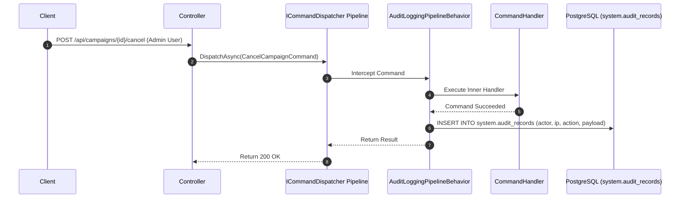

# QA Ticket: TICKET-039

**Title:** Architectural Pipeline Behaviors: Immutable Administrative Audit Logging via Dispatcher Middleware  
**Severity:** 🔴 P1 (Critical - Security Non-Repudiation & Pipeline Architecture)  
**QA Focus Area:** Clean Architecture Pipelines, Cross-Cutting Governance & Forensic Auditing  
**Found By:** `qa-platform-shortcomings`  
**Status:** Fixed  
**Project Mode:** Greenfield (Benchmark Educational Standard)  

---

## 1. Description & Architectural Context

Currently, administrative actions execute without forensic audit logging:
- When a moderator approves or rejects a review in [`CampaignReview.cs`](file:///Users/maysamgamini/maysam-brain/Maysam's%20Brain/projects/projects-active/crowdfunding/src/Modules/Moderation/CrowdFunding.Modules.Moderation.Domain/Aggregates/CampaignReview.cs#L42-L65), no historical audit log is written.
- When an admin cancels a campaign in [`CancelCampaignCommandHandler.cs`](file:///Users/maysamgamini/maysam-brain/Maysam's%20Brain/projects/projects-active/crowdfunding/src/Modules/Campaigns/CrowdFunding.Modules.Campaigns.Application/Features/Campaigns/Commands/CancelCampaign/CancelCampaignCommandHandler.cs#L46), actor IP address, User-Agent, and cancellation reason are not recorded.
- When an admin grants roles or deactivates users in [`User.cs`](file:///Users/maysamgamini/maysam-brain/Maysam's%20Brain/projects/projects-active/crowdfunding/src/Modules/Identity/CrowdFunding.Modules.Identity.Domain/Aggregates/User.cs#L64-L91), no audit trail exists.

There is **no `AuditLog` table or entity** in any module or database context.

### The Architectural Antipattern to Avoid
A naive solution is forcing every command handler to manually inject an `IAuditRepository` and write boilerplate code:
```csharp
// ANTI-PATTERN: Manual boilerplate polluting every command handler
await _auditRepo.InsertAsync(new AuditEntry("Campaign.Cancel", ...));
```
This violates the Single Responsibility Principle, pollutes domain orchestration, and guarantees that developers will forget to audit new administrative endpoints.

---

## 2. Blast Radius & Regulatory Compliance Impact

- **Repudiation & Fraud Exposure:** Rogue administrators or compromised accounts can alter campaign states and user permissions without leaving any forensic trace.
- **Compliance Disqualification:** Fails SOC 2 Type II, ISO 27001, and financial regulatory audits requiring immutable audit logs for administrative actions on financial and user assets.

---

## 3. Educational Rationale: Teaching Principals & Architects

### The Pedagogical Objective
Teach how to implement **Cross-Cutting Concerns via Pipeline Behaviors** (the Decorator / Middleware Pattern at the Command Dispatcher level). Software architects must know how to enforce system-wide security, audit logging, and validation policies globally without polluting individual use-case handlers or coupling modules.

### Monolith First, Microservices Ready
The outcome of this project is a **Modular Monolith, NOT microservices**. Inside our monolith, commands flow through `ICommandDispatcher`. By implementing an `AuditLoggingPipelineBehavior`:
1. Any command marked with `[AuditableAction("Description")]` or executed by a user with `RoleConstants.Admin` is **automatically intercepted**.
2. Actor identity (`ICurrentUser`), IP address, User-Agent, and serialized JSON state diffs are captured.
3. The audit record is saved to an immutable, append-only `system.audit_records` table within the same transaction scope.
When decomposing the monolith into microservices, each service simply incorporates the same lightweight pipeline behavior from `BuildingBlocks.Application`.

### What Breaks Tomorrow If Ignored Today?
If an architect allows audit logging to be implemented ad-hoc inside individual controllers or handlers, the codebase ends up with inconsistent audit formats, missed actions, and massive code duplication that complicates future security reviews.

---

## 4. Affected Files & Modules

- [`src/BuildingBlocks/CrowdFunding.BuildingBlocks.Application/`](file:///Users/maysamgamini/maysam-brain/Maysam's%20Brain/projects/projects-active/crowdfunding/src/BuildingBlocks/CrowdFunding.BuildingBlocks.Application/)
- [`src/BuildingBlocks/CrowdFunding.BuildingBlocks.Infrastructure/`](file:///Users/maysamgamini/maysam-brain/Maysam's%20Brain/projects/projects-active/crowdfunding/src/BuildingBlocks/CrowdFunding.BuildingBlocks.Infrastructure/)
- [`src/API/CrowdFunding.API/Program.cs`](file:///Users/maysamgamini/maysam-brain/Maysam's%20Brain/projects/projects-active/crowdfunding/src/API/CrowdFunding.API/Program.cs)

---

## 5. Implementation Specification & Greenfield Solution



### Step 1: Marker Attribute & Audit Record Entity
```csharp
namespace CrowdFunding.BuildingBlocks.Application.Audit;

[AttributeUsage(AttributeTargets.Class)]
public sealed class AuditableActionAttribute : Attribute
{
    public string ActionName { get; }
    public AuditableActionAttribute(string actionName) => ActionName = actionName;
}

public sealed record AuditRecord(
    Guid Id,
    Guid ActorId,
    string ActorEmail,
    string Action,
    string TargetEntityId,
    string PayloadJson,
    string IpAddress,
    DateTime TimestampUtc
);
```

### Step 2: Implement Pipeline Behavior in `BuildingBlocks.Application`
```csharp
public sealed class AuditLoggingPipelineBehavior<TCommand, TResult> : IPipelineBehavior<TCommand, TResult>
    where TCommand : ICommand<TResult>
{
    private readonly ICurrentUser _currentUser;
    private readonly IHttpContextAccessor _httpContextAccessor;
    private readonly IAuditStore _auditStore;

    public AuditLoggingPipelineBehavior(
        ICurrentUser currentUser,
        IHttpContextAccessor httpContextAccessor,
        IAuditStore auditStore)
    {
        _currentUser = currentUser;
        _httpContextAccessor = httpContextAccessor;
        _auditStore = auditStore;
    }

    public async Task<TResult> HandleAsync(TCommand command, CommandHandlerDelegate<TResult> next, CancellationToken ct)
    {
        var result = await next();

        var auditableAttr = typeof(TCommand).GetCustomAttribute<AuditableActionAttribute>();
        if (auditableAttr is not null || _currentUser.IsAdmin)
        {
            var httpContext = _httpContextAccessor.HttpContext;
            var record = new AuditRecord(
                Guid.NewGuid(),
                _currentUser.UserId,
                _currentUser.Email ?? "system",
                auditableAttr?.ActionName ?? typeof(TCommand).Name,
                command.ToString() ?? string.Empty,
                JsonSerializer.Serialize(command),
                httpContext?.Connection.RemoteIpAddress?.ToString() ?? "unknown",
                DateTime.UtcNow
            );

            await _auditStore.RecordAsync(record, ct);
        }

        return result;
    }
}
```

### Step 3: Database Security (Append-Only)
In PostgreSQL:
```sql
CREATE SCHEMA system;
CREATE TABLE system.audit_records (
    id UUID PRIMARY KEY,
    actor_id UUID NOT NULL,
    actor_email VARCHAR(200) NOT NULL,
    action VARCHAR(100) NOT NULL,
    target_entity_id VARCHAR(100),
    payload_json TEXT NOT NULL,
    ip_address VARCHAR(50) NOT NULL,
    timestamp_utc TIMESTAMP WITH TIME ZONE NOT NULL
);

-- Revoke mutation rights: append-only durability!
REVOKE UPDATE, DELETE ON system.audit_records FROM PUBLIC;
```

---

## 6. Verification & Acceptance Criteria

1. **Automatic Interception:** Executing `CancelCampaignCommand` as an admin automatically writes an entry to `system.audit_records` without any audit code written inside `CancelCampaignCommandHandler`.
2. **Context Enrichment:** Verify that the stored audit record contains the correct `ActorId`, IP address, and serialized command payload.
3. **Immutability Test:** Verify that attempting an `UPDATE` or `DELETE` on `system.audit_records` fails with a PostgreSQL permission error.

---

## 6. Resolution

### The dispatcher had no pipeline concept — this ticket had to build one
`ICommandDispatcher`/`CommandDispatcher` previously called a command's handler directly via
reflection (`DispatcherInvoker`), with no interception point at all. Rather than special-case audit
logging into the dispatcher, `ICommandPipelineBehavior<TCommand,TResult>` (a `next`-delegate
middleware interface, `BuildingBlocks.Application/Messaging`) is a first-class, reusable dispatcher
concept: `DispatcherInvoker` now resolves every `ICommandPipelineBehavior<,>` registered for a
command's closed generic type and chains them (outermost = earliest-registered) around the
handler. `AuditLoggingPipelineBehavior` is the first behavior to use it, registered once as an open
generic so it wraps *every* command — but the mechanism itself is general, exactly as the ticket's
"Monolith First, Microservices Ready" section asks for. Queries (`IQueryDispatcher`) deliberately
were not given a behavior pipeline — nothing in this ticket's scope needs one there, and adding it
speculatively would be exactly the "no concrete second consumer yet" pattern this codebase avoids
elsewhere (see `CachedCampaignReadService`'s own doc comment).

### Two field-name deviations from the ticket's own sample, both intentional
The ticket's `AuditRecord` sample stores `command.ToString()` as `TargetEntityId` *and*
`JsonSerializer.Serialize(command)` as `PayloadJson` — two different renderings of the same
object, one of them (`ToString()` on a plain record) not even a stable identifier. `AuditRecord`
here replaces that field with `CommandType` (`typeof(TCommand).Name`), which is actually useful for
filtering/querying and doesn't duplicate `PayloadJson`. Second, the ticket's behavior checks
`_currentUser.IsAdmin` — no such property exists on the shared `ICurrentUser`, and BuildingBlocks
must never depend on `Identity.Contracts.RoleConstants.Admin` (modules depend on BuildingBlocks,
never the reverse — see `ArchitectureTests`). `AuditLoggingPipelineBehavior` instead checks
`_currentUser.IsInRole("Admin")` against a locally-declared literal, documented in the class's own
XML comment as an intentional, policy-maintained duplication of a fixed built-in role name (the
same pattern this codebase already uses for `CustomClaimTypes.SecurityStamp`'s claim-name string
across the Identity module boundary).

### Immutability: real, not just documented — a restricted role backs it
`AuditLoggingE2ETests.AuditRecordsTable_ShouldRejectUpdatesAndDeletes_FromARoleGrantedOnlySelectAndInsert`
doesn't just execute the `REVOKE UPDATE, DELETE ... FROM PUBLIC` migration statement and call it
verified — that statement
alone proves nothing against the actual dev setup, where every connection (migrations, the running
app, the test) authenticates as the same PostgreSQL superuser, which bypasses table-level grants
entirely. The test instead provisions a **new, non-owner role** granted only `SELECT`/`INSERT` on
`system.audit_records`, connects as that role, and proves `UPDATE`/`DELETE` fail with SQLSTATE
`42501` (insufficient_privilege) while `SELECT`/`INSERT` still work. This is the actual shape the
append-only guarantee takes in production — the application's own database role must be
provisioned this way, which is a deployment/infrastructure concern outside this repo's scope, but
the mechanism itself is now proven to hold.

### What was built
- `BuildingBlocks.Application`: `ICommandPipelineBehavior<,>`/`CommandHandlerDelegate<>`
  (`Messaging/`), `IRequestContext` (`Security/`), `AuditableActionAttribute`/`AuditRecord`/
  `IAuditStore`/`AuditLoggingPipelineBehavior` (`Audit/`). `DispatcherInvoker`/`CommandDispatcher`
  updated to resolve and chain behaviors.
- `BuildingBlocks.Infrastructure/Audit`: `AuditDbContext` (own `system` schema, own
  `__EFMigrationsHistory` table, falls back to the shared connection string like every other
  module), `AuditRecordConfiguration`, `EfAuditStore`, `AuditDependencyInjection` (registers the
  DbContext, `IAuditStore`, and the open-generic pipeline behavior in one call).
- `CrowdFunding.API/Security/HttpRequestContext` (`IRequestContext` adapter, mirroring
  `HttpContextCurrentUser`); wired into `Program.cs` alongside `AddAuditInfrastructure`, the new
  `audit-db` health check, and `MigrationRunner`.
- `[AuditableAction("Campaign.Cancel")]` on `CancelCampaignCommand` — the ticket's own named
  example, and a command a non-Admin (the campaign's owner) can also execute, so it exercises the
  attribute-driven path specifically rather than only ever firing for Admins.

### Tests
Unit: `CommandDispatcherPipelineTests` (real `ServiceCollection`/`CommandDispatcher`, not a fake —
proves behaviors actually chain in registration order around a handler, and that zero registered
behaviors falls through to a direct call). `AuditLoggingPipelineBehaviorTests` (attribute-driven vs.
Admin-driven triggering, non-triggering for a plain command from a non-Admin, and no audit write
when the inner handler throws). Integration (real Postgres via Testcontainers, full HTTP pipeline):
`AuditLoggingE2ETests` — cancelling a campaign as its (non-Admin) owner writes a matching
`system.audit_records` row with the correct actor/IP/User-Agent/payload; an Admin executing an
unattributed command (`AssignRoleToUserCommand`) is also audited; and the append-only guarantee
holds against a genuinely restricted database role.

Verified: full solution build clean in Debug and Release (0 warnings); unit tests 267/267 (261
prior + 6 new); architecture tests 20/20 unchanged; integration tests 80/80 (77 prior + 3 new).
