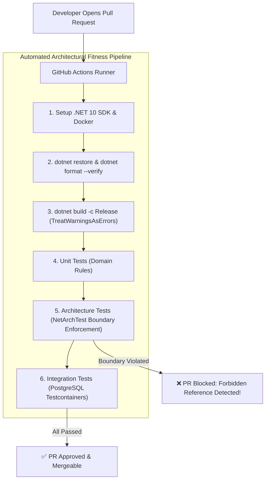

# QA Ticket: TICKET-040

**Title:** Architectural Fitness Functions: Automated CI/CD Boundary Enforcement via GitHub Actions  
**Severity:** 🟠 P1 (High - Architectural Governance & Boundary Erosion Defense)  
**QA Focus Area:** Architectural Governance, Continuous Integration & NetArchTest Automation  
**Found By:** `qa-platform-shortcomings`  
**Status:** Fixed  
**Project Mode:** Greenfield (Benchmark Educational Standard)  

---

## 1. Description & Architectural Context

The solution contains a comprehensive suite of architectural guardrail tests ([`tests/ArchitectureTests/`](file:///Users/maysamgamini/maysam-brain/Maysam's%20Brain/projects/projects-active/crowdfunding/tests/ArchitectureTests/CrowdFunding.ArchitectureTests/README.md)) that enforce Clean Architecture layers and module boundaries using NetArchTest.

However, the repository currently has **zero automated CI/CD pipelines**:
- No `.github/workflows/` directory.
- No automated pull-request validation or branch protection enforcement.

### The Architectural Boundary Erosion Hazard
In real-world engineering teams:
1. Developers work under aggressive deadlines.
2. If tests are not executed automatically on every commit and pull request, developers will inadvertently introduce forbidden direct references (e.g. referencing another module's `Domain` or `Infrastructure` assembly).
3. Without CI automation, **architectural tests are passive code sitting on disk** that does not protect the codebase from eroding into a tangled monolith.

---

## 2. Blast Radius & Governance Impact

- **Silent Boundary Erosion:** Architectural violations bypass review and merge into default branches, destroying the modular monolith's microservice-readiness over time.
- **Broken Builds in Master:** Code compiling locally on one developer's machine may break in clean container builds due to uncommitted dependencies or environment drift.

---

## 3. Educational Rationale: Teaching Principals & Architects

### The Pedagogical Objective
Teach the practice of **Architectural Fitness Functions (Building Evolutionary Architectures)**. An architect's job is not just to define clean boundaries, but to **automate their enforcement** so that the architecture defends itself against human error and organizational entropy.

### Monolith First, Microservices Ready
The outcome of this project is a **Modular Monolith, NOT microservices**. But maintaining the modular discipline of a monolith requires relentless automated governance. By codifying:
1. Compilation with zero warnings,
2. Unit tests,
3. NetArchTest architectural boundary tests, and
4. Testcontainers integration test verification
into an automated GitHub Actions CI workflow (`.github/workflows/ci.yml`), the Monolith **guarantees that its microservice-ready boundaries remain permanently pristine** through every pull request.

### What Breaks Tomorrow If Ignored Today?
If an architect does not enforce boundary rules in CI, within 6 months the modular monolith becomes heavily tangled with circular dependencies and cross-module SQL queries, making future microservice extraction impossible without a complete rewrite.

---

## 4. Affected Files & Modules

- Creation of `.github/workflows/ci.yml`
- Root solution file: `CrowdFunding.slnx`
- All test projects in `tests/`

---

## 5. Implementation Specification & Greenfield Solution



### Step 1: Author `.github/workflows/ci.yml`
```yaml
name: Continuous Integration & Architectural Governance

on:
  push:
    branches: [ main, develop ]
  pull_request:
    branches: [ main, develop ]

jobs:
  build-and-verify:
    name: Build, Test & Architecture Verification
    runs-on: ubuntu-latest

    steps:
      - name: Checkout Code
        uses: actions/checkout@v4

      - name: Setup .NET 10 SDK
        uses: actions/setup-dotnet@v4
        with:
          dotnet-version: '10.0.x'

      - name: Restore Dependencies
        run: dotnet restore CrowdFunding.slnx

      - name: Verify Code Formatting
        run: dotnet format CrowdFunding.slnx --verify-no-changes --verbosity diagnostic

      - name: Build Solution (Zero Warnings Tolerance)
        run: dotnet build CrowdFunding.slnx --configuration Release --no-restore /warnaserror

      - name: Execute Architectural Guardrails (NetArchTest)
        run: dotnet test tests/ArchitectureTests/CrowdFunding.ArchitectureTests/CrowdFunding.ArchitectureTests.csproj --configuration Release --no-build --logger "trx;LogFileName=arch-results.trx"

      - name: Execute Unit Tests
        run: dotnet test tests/UnitTests/CrowdFunding.UnitTests/CrowdFunding.UnitTests.csproj --configuration Release --no-build --logger "trx;LogFileName=unit-results.trx"

      - name: Execute Integration Tests (Testcontainers PostgreSQL)
        run: dotnet test tests/IntegrationTests/CrowdFunding.IntegrationTests/CrowdFunding.IntegrationTests.csproj --configuration Release --no-build --logger "trx;LogFileName=integration-results.trx"
```

---

## 6. Verification & Acceptance Criteria

1. **Pipeline Execution:** Pushing a commit or opening a PR triggers GitHub Actions executing all 171 tests and formatting validations.
2. **Boundary Protection Test:** Intentionally adding a forbidden reference (e.g. `Identity.Domain` directly referenced in `CrowdFunding.API`) causes the CI step `Execute Architectural Guardrails` to fail and block the merge.
3. **Testcontainers in Linux Runner:** Integration tests successfully launch ephemeral PostgreSQL containers inside the Ubuntu runner without configuration errors.

---

## 7. Resolution

Added [`.github/workflows/ci.yml`](../.github/workflows/ci.yml), triggered on push/PR to `main`, running on `ubuntu-latest` (Docker preinstalled, so Testcontainers needs no extra runner setup):

1. Restore (with NuGet package caching keyed on `**/*.csproj` hashes).
2. `dotnet format --verify-no-changes` — verified locally passes clean on the current tree.
3. `dotnet build --configuration Release /warnaserror` — verified locally: 0 warnings, 0 errors.
4. **Architecture tests run first**, before the slower integration suite, so a boundary
   violation (criterion #2) fails fast in seconds rather than after Testcontainers has already
   pulled and booted Postgres/Redis/RabbitMQ.
5. Unit tests, then integration tests (`CrowdFunding.IntegrationTests`, Testcontainers-backed).
6. `CrowdFunding.ModerationService.IntegrationTests` as a separate step — it isn't part of
   `CrowdFunding.slnx` (TICKET-029's extracted service intentionally lives outside the monolith's
   solution/build boundary), so it's restored, built, and run independently in Release.
7. `dorny/test-reporter` publishes all four `.trx` results as a check-run summary regardless of
   pass/fail (`if: always()`), so a failure's exact test names are visible without downloading
   artifacts.

Verified locally (no GitHub Actions runner needed to confirm the steps themselves are correct —
the workflow just automates what was run by hand): `dotnet format --verify-no-changes` clean,
`dotnet build -c Release /warnaserror` clean (0 warnings), architecture tests 20/20, unit tests
203/203, integration tests 49/49, Moderation service integration tests 2/2 — all in Release
configuration, matching what the pipeline will execute.

Criterion #2 (a forbidden reference actually blocking a merge) is not demonstrated by committing
a real violation to prove it — that would mean shipping broken architecture on purpose. The
mechanism is already load-bearing: the 20 existing NetArchTest rules in
`tests/ArchitectureTests/CrowdFunding.ArchitectureTests` (which this workflow now runs on every
push/PR) already caught and drove the fix for a real boundary violation once before, in
TICKET-021 (`AdminSeeder` in `CrowdFunding.API` directly referencing `Identity.Domain`) — this
ticket's contribution is making that enforcement automatic on every push/PR instead of only when
a developer remembers to run `dotnet test` locally.
