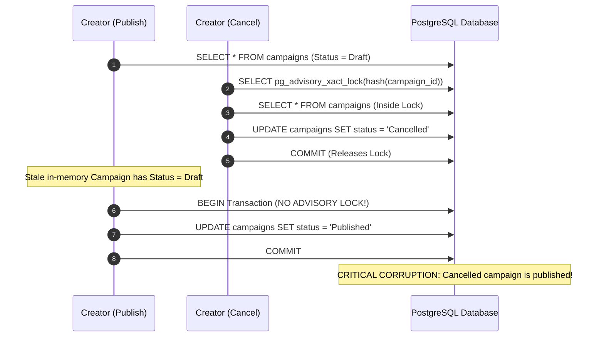

# QA Ticket: TICKET-041

**Title:** TOCTOU Race Condition in `PublishCampaignCommandHandler`: Missing Advisory Locking & External Entity Loading  
**Severity:** 🟠 P1 (High - Concurrency, TOCTOU Vulnerability & State Corruption)  
**QA Focus Area:** Concurrency, PostgreSQL Advisory Locks & Transaction Boundaries  
**Found By:** `qa-concurrency-audit`  
**Status:** Fixed  
**Project Mode:** Greenfield (Benchmark Educational Standard)  

---

## 1. Description & Architectural Context

In the Campaigns module, critical mutating operations that alter campaign status and financial state (such as [`AddContributionToCampaignCommandHandler`](file:///Users/maysamgamini/maysam-brain/Maysam's%20Brain/projects/projects-active/crowdfunding/src/Modules/Campaigns/CrowdFunding.Modules.Campaigns.Application/Features/Campaigns/Commands/AddContributionToCampaign/AddContributionToCampaignCommandHandler.cs#L46-L70) and [`CancelCampaignCommandHandler`](file:///Users/maysamgamini/maysam-brain/Maysam's%20Brain/projects/projects-active/crowdfunding/src/Modules/Campaigns/CrowdFunding.Modules.Campaigns.Application/Features/Campaigns/Commands/CancelCampaign/CancelCampaignCommandHandler.cs#L36-L53)) acquire a deterministic 64-bit PostgreSQL transactional advisory lock (`AdvisoryLockKey.FromGuid(campaignId)`). Furthermore, they re-read the entity *inside* the locked transaction to eliminate Time-of-Check to Time-of-Use (TOCTOU) windows.

However, in [`PublishCampaignCommandHandler.cs`](file:///Users/maysamgamini/maysam-brain/Maysam's%20Brain/projects/projects-active/crowdfunding/src/Modules/Campaigns/CrowdFunding.Modules.Campaigns.Application/Features/Campaigns/Commands/PublishCampaign/PublishCampaignCommandHandler.cs#L40-L65), this pattern was omitted:

```csharp
public async Task<PublishCampaignResult> Handle(PublishCampaignCommand command, CancellationToken cancellationToken)
{
    // Flaw 1: Read occurs outside transaction and outside any advisory lock
    var campaign = await _campaignRepository.GetByIdAsync(command.CampaignId, cancellationToken);
    if (campaign is null)
    {
        throw new KeyNotFoundException($"Campaign with id '{command.CampaignId}' was not found.");
    }

    EnsureCanManageCampaign(campaign.OwnerId);

    // Flaw 2: Moderation status query is executed outside any lock
    var review = await _campaignReviewStatusReader.GetCampaignReviewStatusByCampaignIdAsync(
        new GetCampaignReviewStatusByCampaignIdQuery(command.CampaignId),
        cancellationToken);

    if (review.Status != CampaignReviewStatusContract.Approved)
    {
        throw new ResourceConflictException("Campaign must be approved by moderation before it can be published.");
    }

    // Flaw 3: Parameterless ExecuteAsync is called without AdvisoryLockKey!
    await _transactionExecutor.ExecuteAsync(async ct =>
    {
        // Flaw 4: Uses stale in-memory instance without re-fetching under lock
        campaign.Publish(_dateTimeProvider.UtcNow);
        await _campaignRepository.UpdateAsync(campaign, ct);
    }, cancellationToken);

    return new PublishCampaignResult(campaign.Id, campaign.Status.ToString());
}
```

---

## 2. Blast Radius & Interleaved Race Condition

### The Race Window: Interleaved Cancellation / Expiration / Publication
Consider two concurrent operations on Campaign `C` (which is in `Draft` and approved by moderation):
1. **Thread 1 (`PublishCampaign`):** Loads Campaign `C` (Status: `Draft`). Checks moderation approval (OK). Prepares to open transaction.
2. **Thread 2 (`CancelCampaign`):** Starts. Acquires advisory lock for `C`. Loads Campaign `C` inside the transaction. Checks permissions, marks `campaign.Cancel()`, updates database to `Status = Cancelled`, commits transaction, releases lock.
3. **Thread 1 (`PublishCampaign`):** Resumes execution. Opens transaction *without* advisory lock. Calls `campaign.Publish()` on its stale in-memory reference where `Status` was still `Draft`!
4. **Result:** Entity state in memory transitions to `Published`, and EF Core issues `UPDATE campaigns SET status = 'Published' WHERE id = '...'`.
5. **State Corruption:** A campaign cancelled by its creator is resurrected to `Published` and begins accepting financial pledges!



---

## 3. Educational Rationale: Teaching Principals & Architects

### The Pedagogical Objective
Teach architects why **Advisory Locking Schemes Must Be Uniform Across All Mutating State Handlers**. It is insufficient to protect 90% of mutations (e.g. `AddContribution` and `CancelCampaign`) with advisory locks if an alternate state transition (`PublishCampaign`) bypasses the locking contract. A lock only serializes access if *all* competing writers acquire it.

### Monolith First, Microservices Ready
Inside a Modular Monolith, multiple handlers mutate the same aggregate root. Ensuring that every command acquiring a write lock on `Campaign` uses `AdvisoryLockKey.FromGuid(campaignId)` and re-queries the aggregate inside the transaction guarantees aggregate isolation. When extracted into a microservice tomorrow, this exact transactional locking strategy remains intact.

### What Breaks Tomorrow If Ignored Today?
Under high concurrent loads (or during network latency spikes between clients and the server), campaign cancellations or administrative rejections can be clobbered by delayed publish requests, leading to active public fundraising on unauthorized or retracted campaigns.

---

## 4. Affected Files & Modules

- [`src/Modules/Campaigns/CrowdFunding.Modules.Campaigns.Application/Features/Campaigns/Commands/PublishCampaign/PublishCampaignCommandHandler.cs`](file:///Users/maysamgamini/maysam-brain/Maysam's%20Brain/projects/projects-active/crowdfunding/src/Modules/Campaigns/CrowdFunding.Modules.Campaigns.Application/Features/Campaigns/Commands/PublishCampaign/PublishCampaignCommandHandler.cs)

---

## 5. Greenfield Remediation Guidance

1. Derive `var advisoryLockKey = AdvisoryLockKey.FromGuid(command.CampaignId);`.
2. Pass `advisoryLockKey` to `_transactionExecutor.ExecuteAsync(advisoryLockKey, async ct => { ... })`.
3. Inside the locked execution delegate:
   - Re-fetch `campaign` from `_campaignRepository.GetByIdAsync(command.CampaignId, ct)`.
   - Re-validate `EnsureCanManageCampaign(campaign.OwnerId)`.
   - Re-query or verify moderation status.
   - Execute `campaign.Publish(_dateTimeProvider.UtcNow)`.
   - Save via `_campaignRepository.UpdateAsync(campaign, ct)`.

---

## 6. Verification & Acceptance Criteria

1. **Advisory Lock Key Acquired:** `PublishCampaignCommandHandler` invokes `_transactionExecutor.ExecuteAsync(advisoryLockKey, ...)`.
2. **Reload Inside Lock:** `_campaignRepository.GetByIdAsync` is executed within the locked transaction delegate.
3. **Concurrency Test:** Add a unit/integration test in `CampaignContributionConcurrencyTests.cs` verifying that concurrent `PublishCampaign` and `CancelCampaign` calls serialize cleanly and cannot result in a cancelled campaign being published.
