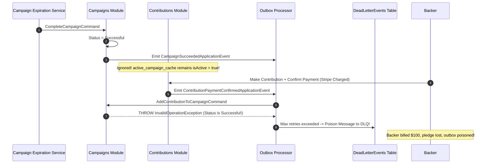

# QA Ticket: TICKET-044

**Title:** Replicated Campaign Read Model Desynchronization in `Contributions` on Campaign Success and Failure Events  
**Severity:** 🔴 P0 (Critical - Financial Consistency, DLQ Poisoning & Unrefundable Charges)  
**QA Focus Area:** Event-Carried State Transfer, Outbox DLQ Resilience & Financial Invariants  
**Found By:** `qa-resilience-outbox`  
**Status:** Open  
**Project Mode:** Greenfield (Benchmark Educational Standard)  

---

## 1. Description & Architectural Context

In TICKET-023, the Contributions module decoupled itself from synchronous in-process queries to Campaigns by introducing an asynchronous replicated read model: [`ActiveCampaignCacheRepository`](file:///Users/maysamgamini/maysam-brain/Maysam's%20Brain/projects/projects-active/crowdfunding/src/Modules/Contributions/CrowdFunding.Modules.Contributions.Application/Abstractions/Persistence/IActiveCampaignCacheRepository.cs). When campaigns change state, [`ReplicatedCampaignEventHandlers`](file:///Users/maysamgamini/maysam-brain/Maysam's%20Brain/projects/projects-active/crowdfunding/src/Modules/Contributions/CrowdFunding.Modules.Contributions.Application/Features/ActiveCampaigns/Events/ReplicatedCampaignEventHandlers.cs) updates `active_campaign_cache`.

### The Critical Event Consumer Gap
Inspecting `ReplicatedCampaignEventHandlers.cs`:
```csharp
public sealed class ReplicatedCampaignEventHandlers :
    IEventHandler<CampaignCreatedApplicationEvent>,
    IEventHandler<CampaignPublishedApplicationEvent>,
    IEventHandler<CampaignCancelledApplicationEvent>
{
    // ...
    public Task Handle(CampaignPublishedApplicationEvent notification, CancellationToken cancellationToken)
        => _transactionExecutor.ExecuteAsync(
            ct => _repository.SetActiveStatusAsync(notification.CampaignId, isActive: true, _dateTimeProvider.UtcNow, ct),
            cancellationToken);

    public Task Handle(CampaignCancelledApplicationEvent notification, CancellationToken cancellationToken)
        => _transactionExecutor.ExecuteAsync(
            ct => _repository.SetActiveStatusAsync(notification.CampaignId, isActive: false, _dateTimeProvider.UtcNow, ct),
            cancellationToken);
}
```

Notice that `ReplicatedCampaignEventHandlers` **only listens to `Created`, `Published`, and `Cancelled`**. It **DOES NOT LISTEN TO**:
- `CampaignSucceededApplicationEvent`
- `CampaignFailedApplicationEvent`

---

## 2. Blast Radius & Dead-Letter Queue (DLQ) Poisoning Sequence

When a campaign reaches its deadline (or hits its funding goal) and [`CampaignExpirationBackgroundService`](file:///Users/maysamgamini/maysam-brain/Maysam's%20Brain/projects/projects-active/crowdfunding/src/Modules/Campaigns/CrowdFunding.Modules.Campaigns.Infrastructure/BackgroundServices/CampaignExpirationBackgroundService.cs#L78) resolves the campaign to `Successful` or `Failed`:
1. `CampaignSucceededApplicationEvent` or `CampaignFailedApplicationEvent` is published to the outbox.
2. The Contributions module ignores the event completely. In Contributions' `active_campaign_cache`, **`is_active` remains `true` forever!**
3. A backer calls `POST /api/campaigns/{id}/contributions`.
4. `MakeContributionCommandHandler` checks `active_campaign_cache`: `campaign.IsActive` is `true`.
5. The contribution is created and payment is confirmed via Stripe webhook (`Contribution.ConfirmPayment()`).
6. The outbox emits `ContributionPaymentConfirmedApplicationEvent`.
7. `AddContributionToCampaignCommandHandler` in Campaigns receives the event and loads the actual Campaign aggregate.
8. [`Campaign.ApplyConfirmedContribution()`](file:///Users/maysamgamini/maysam-brain/Maysam's%20Brain/projects/projects-active/crowdfunding/src/Modules/Campaigns/CrowdFunding.Modules.Campaigns.Domain/Aggregates/Campaign.cs#L174) throws:
   ```csharp
   throw new InvalidOperationException($"Cannot apply contributions to campaign in status '{Status}'. Only Published campaigns can accept funds.");
   ```
9. **Dead-Letter Queue Poisoning:** The outbox worker retries 5 times and moves the event to `DeadLetterEvents`.
10. **Financial Disaster:** The backer's credit card was billed, but the funds are NOT credited to the campaign and NOT refunded to the backer!



---

## 3. Educational Rationale: Teaching Principals & Architects

### The Pedagogical Objective
Teach architects why **Replicated Read Models (Event-Carried State Transfer) Must Cover the Entire Aggregate State Machine**. When caching upstream state asynchronously to avoid temporal coupling, failing to observe terminal state transitions (`Successful`, `Failed`) creates a dangerous split-brain between modules that manifests as downstream transaction poisoning.

### Monolith First, Microservices Ready
This is a benchmark example of eventual consistency hazards in distributed systems. If Contributions was already a separate microservice, this bug would cause cross-service transactional poisoning. Catching and fixing it within the Modular Monolith teaches engineers how to guarantee eventual consistency integrity before network boundaries are introduced.

---

## 4. Affected Files & Modules

- [`src/Modules/Contributions/CrowdFunding.Modules.Contributions.Application/Features/ActiveCampaigns/Events/ReplicatedCampaignEventHandlers.cs`](file:///Users/maysamgamini/maysam-brain/Maysam's%20Brain/projects/projects-active/crowdfunding/src/Modules/Contributions/CrowdFunding.Modules.Contributions.Application/Features/ActiveCampaigns/Events/ReplicatedCampaignEventHandlers.cs)
- [`src/Modules/Contributions/CrowdFunding.Modules.Contributions.Contracts/`](file:///Users/maysamgamini/maysam-brain/Maysam's%20Brain/projects/projects-active/crowdfunding/src/Modules/Contributions/CrowdFunding.Modules.Contributions.Contracts/)
- [`src/Modules/Campaigns/CrowdFunding.Modules.Campaigns.Contracts/Events/CampaignSucceeded/CampaignSucceededApplicationEvent.cs`](file:///Users/maysamgamini/maysam-brain/Maysam's%20Brain/projects/projects-active/crowdfunding/src/Modules/Campaigns/CrowdFunding.Modules.Campaigns.Contracts/Events/CampaignSucceeded/CampaignSucceededApplicationEvent.cs)
- [`src/Modules/Campaigns/CrowdFunding.Modules.Campaigns.Contracts/Events/CampaignFailed/CampaignFailedApplicationEvent.cs`](file:///Users/maysamgamini/maysam-brain/Maysam's%20Brain/projects/projects-active/crowdfunding/src/Modules/Campaigns/CrowdFunding.Modules.Campaigns.Contracts/Events/CampaignFailed/CampaignFailedApplicationEvent.cs)

---

## 5. Greenfield Remediation Guidance

1. Implement `IEventHandler<CampaignSucceededApplicationEvent>` and `IEventHandler<CampaignFailedApplicationEvent>` on `ReplicatedCampaignEventHandlers`.
2. When either event is received:
   ```csharp
   public Task Handle(CampaignSucceededApplicationEvent notification, CancellationToken cancellationToken)
       => _transactionExecutor.ExecuteAsync(
           ct => _repository.SetActiveStatusAsync(notification.CampaignId, isActive: false, _dateTimeProvider.UtcNow, ct),
           cancellationToken);

   public Task Handle(CampaignFailedApplicationEvent notification, CancellationToken cancellationToken)
       => _transactionExecutor.ExecuteAsync(
           ct => _repository.SetActiveStatusAsync(notification.CampaignId, isActive: false, _dateTimeProvider.UtcNow, ct),
           cancellationToken);
   ```
3. Register both event types in `EventTypeRegistry` in `Program.cs`.

---

## 6. Verification & Acceptance Criteria

1. **Active Status Flipped on Resolution:** Processing `CampaignSucceededApplicationEvent` or `CampaignFailedApplicationEvent` updates `is_active = false` in `active_campaign_cache`.
2. **Pledge Rejection on Ended Campaigns:** Subsequent attempts to contribute via `POST /api/campaigns/{id}/contributions` return `400 Bad Request` (`"Campaign cannot accept contributions — it is not active"`), protecting the outbox and payment pipeline.
