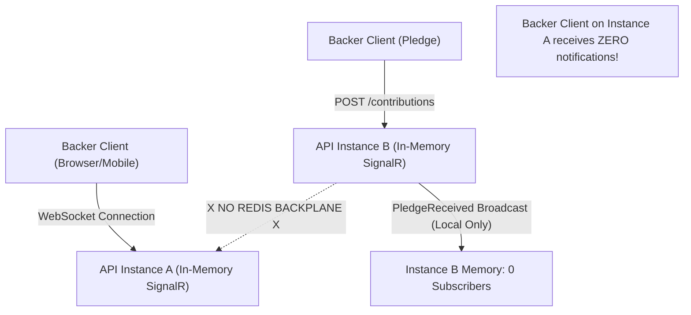

# QA Ticket: TICKET-048

**Title:** SignalR Real-Time Multi-Instance Split-Brain: Missing Distributed Redis Backplane Causes Missed Live Updates  
**Severity:** 🟠 P1 (High - Distributed Systems, High Availability & Multi-Replica Scale)  
**QA Focus Area:** Real-Time Architecture, Multi-Instance Scale & High Availability  
**Found By:** `qa-performance-persistence`  
**Status:** Open  
**Project Mode:** Greenfield (Benchmark Educational Standard)  

---

## 1. Description & Architectural Context

In [`CampaignHub.cs`](file:///Users/maysamgamini/maysam-brain/Maysam's%20Brain/projects/projects-active/crowdfunding/src/API/CrowdFunding.API/RealTime/CampaignHub.cs) and [`Program.cs`](file:///Users/maysamgamini/maysam-brain/Maysam's%20Brain/projects/projects-active/crowdfunding/src/API/CrowdFunding.API/Program.cs#L81), SignalR is configured for real-time WebSocket notifications (`PledgeReceived` and `RewardTierSoldOut`):
```csharp
builder.Services.AddSignalR();
// ...
app.MapHub<CampaignHub>("/hubs/campaigns");
```

SignalR is registered **without a distributed backplane** (`.AddStackExchangeRedis(...)`).

In ASP.NET Core, default SignalR runs strictly in-memory. Each application instance maintains an isolated local connection table mapping `ConnectionId` to hub groups.

---

## 2. Blast Radius & Multi-Replica Split-Brain Failure Mode

When the Modular Monolith is deployed with $\ge 2$ replicas behind a load balancer:
1. **Backer 1** views a campaign and connects via WebSocket to **Instance A**. SignalR records Backer 1 in Instance A's memory group `campaign_123`.
2. **Backer 2** pledges funds via HTTP to **Instance B**.
3. Instance B's outbox worker (or payment webhook) processes the payment and invokes `_realtimeNotifier.NotifyPledgeReceivedAsync(...)`.
4. Instance B broadcasts the event to its **local in-memory group** `campaign_123`.
5. **Missed Notification:** Instance B has zero WebSocket connections for that group! Backer 1 (connected to Instance A) **NEVER receives the pledge update**.
6. The user interface remains stale until a manual page refresh, defeating the purpose of real-time push notifications.



---

## 3. Educational Rationale: Teaching Principals & Architects

### The Pedagogical Objective
Teach architects why **Stateful Real-Time Protocols (WebSockets / SignalR) In A Horizontally Scaled Architecture Require a Distributed Pub/Sub Backplane**. While HTTP is stateless and easily load-balanced across replicas, WebSocket connections are long-lived and pinned to specific physical nodes. To broadcast across nodes, an underlying distributed message bus (Redis Pub/Sub) is mandatory.

### Monolith First, Microservices Ready
Even within a Modular Monolith, scaling beyond a single replica is the baseline for production reliability. Wiring SignalR with Redis backplane ensures the platform scales out seamlessly without requiring application code changes.

---

## 4. Affected Files & Modules

- [`src/API/CrowdFunding.API/Program.cs`](file:///Users/maysamgamini/maysam-brain/Maysam's%20Brain/projects/projects-active/crowdfunding/src/API/CrowdFunding.API/Program.cs)
- [`src/API/CrowdFunding.API/appsettings.json`](file:///Users/maysamgamini/maysam-brain/Maysam's%20Brain/projects/projects-active/crowdfunding/src/API/CrowdFunding.API/appsettings.json)
- [`docs/TRADE_OFFS_AND_LIMITATIONS.md`](file:///Users/maysamgamini/maysam-brain/Maysam's%20Brain/projects/projects-active/crowdfunding/docs/TRADE_OFFS_AND_LIMITATIONS.md#L419-L430)

---

## 5. Greenfield Remediation Guidance

1. Add package `Microsoft.AspNetCore.SignalR.StackExchangeRedis`.
2. In `Program.cs`:
   ```csharp
   var signalR = builder.Services.AddSignalR();
   var redisConnectionString = builder.Configuration.GetConnectionString("Redis");
   if (!string.IsNullOrWhiteSpace(redisConnectionString))
   {
       signalR.AddStackExchangeRedis(redisConnectionString, options =>
       {
           options.Configuration.ChannelPrefix = StackExchange.Redis.RedisChannel.Literal("crowdfunding_signalr");
       });
   }
   ```
3. Update `appsettings.json` and container orchestration manifests to supply the Redis connection string.

---

## 6. Verification & Acceptance Criteria

1. **Redis Backplane Wired:** In environments where Redis is configured, SignalR attaches to Redis Pub/Sub channels.
2. **Cross-Instance Notification Test:** A test spinning up two instances sharing a Redis Testcontainer verifies that broadcasting a pledge from Instance 2 delivers the message to a client connected to Instance 1.
