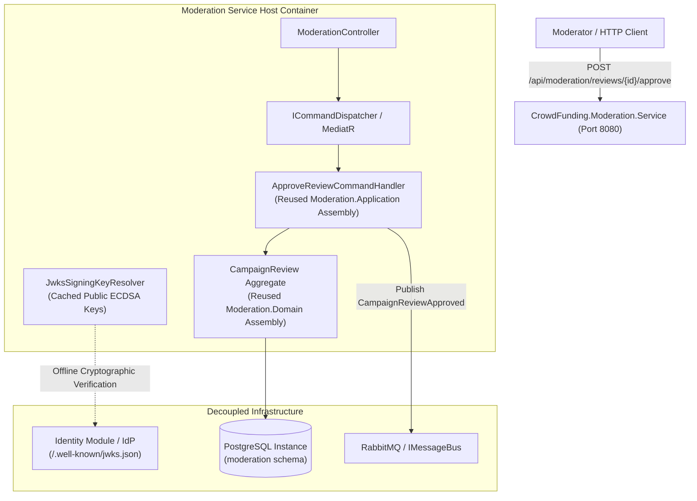

# CrowdFunding.Moderation.Service (Microservice Extraction PoC)

> **Architectural Proof-of-Concept:** Zero-Rewrite Microservice Extraction (Strangler Fig Pattern)  
> **Resolved By:** [`TICKET-029`](file:///Users/maysamgamini/maysam-brain/Maysam's%20Brain/projects/projects-active/crowdfunding/qa-tickets/TICKET-029-MICROSERVICE-EXTRACTION-POC-STANDALONE-SERVICE.md)  
> **Target Framework:** .NET 10.0 (C# 14 / ASP.NET Core)  
> **Container Runtime:** Docker ([`Dockerfile`](file:///Users/maysamgamini/maysam-brain/Maysam's%20Brain/projects/projects-active/crowdfunding/services/CrowdFunding.Moderation.Service/Dockerfile) multi-stage build, port 8080)  

---

## 1. Executive Purpose & Architectural Significance

[`CrowdFunding.Moderation.Service`](file:///Users/maysamgamini/maysam-brain/Maysam's%20Brain/projects/projects-active/crowdfunding/services/CrowdFunding.Moderation.Service) serves as the live, runnable proof that the `CrowdFundingHub` Modular Monolith achieves **100% friction-free microservice extractability**.

When transitioning an in-process module to an autonomous microservice, the Strangler Fig pattern requires that:
1. **Zero Domain Logic Rewrites:** The existing domain aggregate ([`CampaignReview`](file:///Users/maysamgamini/maysam-brain/Maysam's%20Brain/projects/projects-active/crowdfunding/src/Modules/Moderation/CrowdFunding.Modules.Moderation.Domain/Aggregates/CampaignReview.cs)), application command/query handlers, validation rules, and EF Core entity mappings are reused as-is without code modifications.
2. **Autonomous Physical Boundary:** The service boots its own independent Web API host ([`Program.cs`](file:///Users/maysamgamini/maysam-brain/Maysam's%20Brain/projects/projects-active/crowdfunding/services/CrowdFunding.Moderation.Service/Program.cs)), mounts its own PostgreSQL schema (`moderation`), and performs its own migrations (`dotnet run -- migrate`).
3. **Decentralized Cryptographic Security:** The service authenticates incoming requests using public JWKS discovery (`/.well-known/jwks.json`) fetched from the Identity issuer over HTTP, completely independent of the monolith host.
4. **Pluggable Message Bus Integration:** Event communication runs through `IMessageBus` (RabbitMQ in distributed mode or in-memory channel in local mode).



---

## 2. Assembly References & Layer Topology

This service is purely a **Host Packaging Assembly**. Notice its minimal [`CrowdFunding.Moderation.Service.csproj`](file:///Users/maysamgamini/maysam-brain/Maysam's%20Brain/projects/projects-active/crowdfunding/services/CrowdFunding.Moderation.Service/CrowdFunding.Moderation.Service.csproj) dependencies:

```xml
<ItemGroup>
  <!-- Reused untouched modular assemblies -->
  <ProjectReference Include="..\..\src\Modules\Moderation\CrowdFunding.Modules.Moderation.Application\CrowdFunding.Modules.Moderation.Application.csproj" />
  <ProjectReference Include="..\..\src\Modules\Moderation\CrowdFunding.Modules.Moderation.Contracts\CrowdFunding.Modules.Moderation.Contracts.csproj" />
  <ProjectReference Include="..\..\src\Modules\Moderation\CrowdFunding.Modules.Moderation.Domain\CrowdFunding.Modules.Moderation.Domain.csproj" />
  <ProjectReference Include="..\..\src\Modules\Moderation\CrowdFunding.Modules.Moderation.Infrastructure\CrowdFunding.Modules.Moderation.Infrastructure.csproj" />

  <!-- Shared building block abstractions -->
  <ProjectReference Include="..\..\src\BuildingBlocks\CrowdFunding.BuildingBlocks.Application\CrowdFunding.BuildingBlocks.Application.csproj" />
  <ProjectReference Include="..\..\src\BuildingBlocks\CrowdFunding.BuildingBlocks.Infrastructure\CrowdFunding.BuildingBlocks.Infrastructure.csproj" />

  <!-- Only Contract DTOs from upstream modules (zero domain/infra coupling) -->
  <ProjectReference Include="..\..\src\Modules\Campaigns\CrowdFunding.Modules.Campaigns.Contracts\CrowdFunding.Modules.Campaigns.Contracts.csproj" />
  <ProjectReference Include="..\..\src\Modules\Identity\CrowdFunding.Modules.Identity.Contracts\CrowdFunding.Modules.Identity.Contracts.csproj" />
</ItemGroup>
```

---

## 3. Configuration & Startup

### Environment Variables & Settings ([`appsettings.json`](file:///Users/maysamgamini/maysam-brain/Maysam's%20Brain/projects/projects-active/crowdfunding/services/CrowdFunding.Moderation.Service/appsettings.json))
```json
{
  "ConnectionStrings": {
    "ModerationDb": "Host=localhost;Port=5432;Database=crowdfunding_db;Username=postgres;Password=postgres;SearchPath=moderation"
  },
  "Authentication": {
    "Issuer": "CrowdFundingHub.Identity"
  },
  "Jwks": {
    "JwksUri": "http://localhost:5000/.well-known/jwks.json",
    "CacheDurationMinutes": 60
  }
}
```

### Running Database Migrations Independently
```bash
# Execute standalone schema migration
dotnet run --project services/CrowdFunding.Moderation.Service/CrowdFunding.Moderation.Service.csproj -- migrate
```

### Building & Running the Docker Container
```bash
# Build standalone container image from repo root
docker build -f services/CrowdFunding.Moderation.Service/Dockerfile -t crowdfunding-moderation-service:latest .

# Run container
docker run -p 8080:8080 \
  -e ConnectionStrings__ModerationDb="Host=host.docker.internal;Port=5432;Database=crowdfunding_db;Username=postgres;Password=postgres;SearchPath=moderation" \
  crowdfunding-moderation-service:latest
```

---

## 4. Key Takeaways for Principal Architects

1. **Extraction is an Ops/Packaging Activity:** If your monolith requires refactoring business logic, domain aggregates, or rewriting database queries to extract a service, **your monolith was not modular**.
2. **Contracts Are the Only Inter-Service Dependency:** Notice that `Campaigns.Contracts` and `Identity.Contracts` are the only upstream references. No domain models or infrastructure classes cross boundaries.
3. **Decentralized JWKS Auth:** The service verifies JWTs locally in 0.05ms without sending HTTP traffic to the Identity service on every call.
